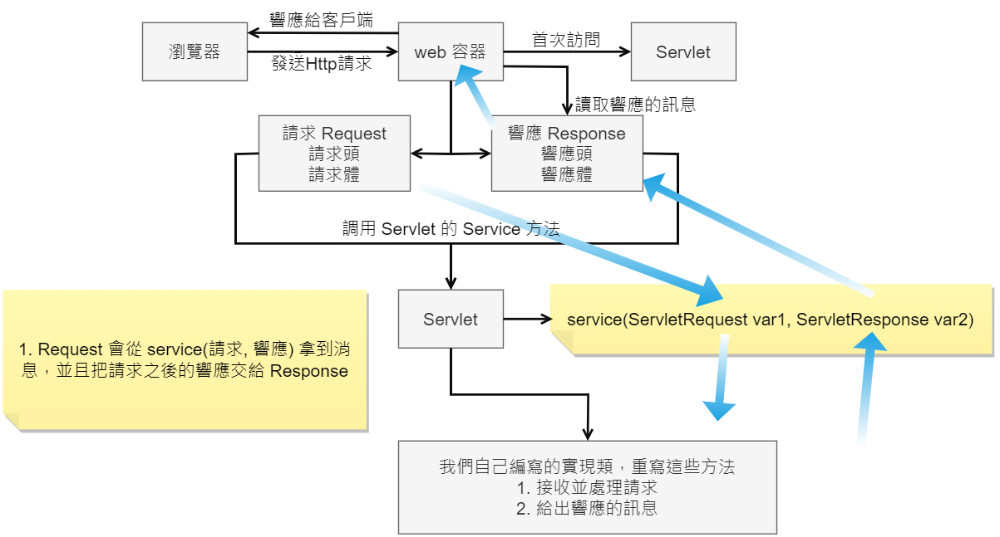
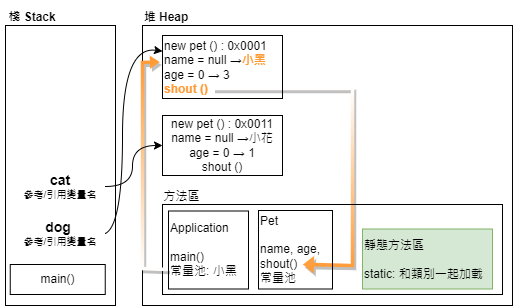

# 2. JavaWeb 入門到實戰 🧩

## javaweb-01. web 基本概念
+ web 開發
    + 靜態 web：提供給所有人看的數據，始終不會發生變化 (HTML、CSS)
    + 動態 web：每個人在不同時間不同地點看到的訊息各不相同
        + 幾乎所有網站都是動態
        + 技術棧：Servlet/JSP, ASP, PHP
+ Java 中，動態 web 資源開發技術統稱為 JavaWeb
+ Web 應用程式
    + 可以提供瀏覽器訪問的程式
        + a.html, b.html 這些 web 資源可以被外界訪問
        + 能訪問的任何一個頁面資源都存在世界上某角落的電腦上
        + URL
        + 統一的 web 資源會被放在同一個文件夾下，web應用程式 => Tomcat Server
        + 一個 web 應用程式由多個部分組成 (靜態 / 動態 web)
            + html, css, js
            + jsp, servlet
            + java 程式
            + jar 包
            + 配置文件 (properties)
+ web 應用程式編寫完畢後，如果想提供給外界訪問，需要一個 Server 統一管理

### 靜態 Web
+ `*.htm` `*.html` 這些都是網頁的後綴，如果服務器上一直存在這些東西，就可以直接進行讀取
+ Cons：
    1. 靜態 web 頁面無法動態更新，所有用戶看到都是同一個頁面
        + 輪播圖、點擊特效：偽動態
        + JavaScript (實際開發中用的最多)
        + VBScript
    2. 無法和數據庫交互 (數據無法持久化，用戶無法交互)

### 動態 Web
+ 頁面會動態展示：「Web 頁面展示的效果因人而異」
+ Cons:
    1. 加入 Server 的動態 web 資源若出現錯誤的話，開發者需要重新編寫**後台程序**並重新發布
        + 停機維護
+ Pros:
    1. Web 頁面**可以**動態更新，所有用戶看到都**不是**同一個頁面
    2. 它可以和數據庫交互 (數據持久化：註冊、商品訊息、用戶訊息...)

## javaweb-02. web Server 服務器講解
+ ASP
    + Microsoft 最早流行
    + 在 HTML 中嵌入 VB 的腳本，ASP + COM
    + ASP 開發中，基本一個頁面都有幾千行代碼，頁面極亂
    + 維護成本高
    + C<sup>#</sup>
    + IIS
+ PHP
    + PHP 開發速度快，功能強大，跨平台，代碼簡單 (70%, WordPress)
    + 無法承載大訪問量的情況 (侷限性)
+ JSP/Servlet
    + SUN 公司主推的 B/S 架構
        + BS 瀏覽器和服務器
        + CS 客戶端和服務器
    + 基於 java 語言的 (所有的大公司，或者一些開源的組件，都是用 java 寫的)
    + 可以乘載三高問題 (高並發高可用高性能) 帶來的影響
    + 語法像 ASP，加強市場強度

### Web Server
+ 用來接收處理 client 請求，以及給用戶一些響應訊息，是一種被動的操作
+ **IIS**：
    + 微軟： ASP...Windows 中自帶伺服器
+ **Tomcat**：
    + Apache Software Foundation
    + 技術先進性能穩定免費，在中小型系統和並發訪問用戶不是很多的場合下被普遍使用
    + 工作 3 - 5 年後可以嘗試手寫 Tomcat Server

## javaweb-03. Tomcat
+ bin: 啟動關閉的腳本文件
+ conf: 配置 
    + server.xml 服務器核心配置文件
+ lib: 依賴的 jar 包
+ logs: 日誌
+ webapps: 放存放網站的
+ 啟動關閉：shutdown.bat | startup.sh

#### 可能遇到的問題：
1. Java 環境變量沒有配置
2. 閃退問題：需要配置兼容性
3. 亂碼問題：配置文件中設置

#### 可以配置啟動的埠號/端口號：
+ tomcat 默認埠號: 8080
+ my sql: 3306
+ http: 80
+ https: 443
    ```xml
    <Connector port="8081" protocol="HTTP/1.1"
               connectionTimeout="20000"
               redirectPort="8443" />
    ```

#### 可以配置主機的名稱：
+ 預設的主機名 — `localhost 127.0.0.1`
+ 預設網站應用存放位置 — `webapps`
    ```xml
    <Host name="" appBase="webapps"
          unpackWARs="true" autoDeploy="true">
    ```
#### 面試難題🎭：網站是如何進行訪問的
1. 輸入一個網域名，enter
2. 檢查本機端 `C:\Windows\System32\drivers\etc\hosts` 配置文件下有沒有這個域名映射
    1. 有：直接返回對應 ip 地址，這地址中有我們需要訪問的 web 程式，可直接訪問
    2. 沒：去 DNS 服務器找，找到的話就返回，找不到就返回找不到
 
 #### 網站應有結構
```
 -- webapps : tomcat server 的 web 目錄
    - ROOT
    - yicelwen : 網站的目錄名
        - WEB-INF
            - classes : java 程式碼
            - lib : web 應用所依賴的 jar 包
            - web.xml : 網站配置文件
        - index.html 預設的首頁
        - static
            - css
                - style.css
            - js
            - img
        - ......
```

## javaweb-04. Http
### 4.1 Http 協議
+ HTTP (超文本傳輸協議) 是個簡單的請求-響應協議，通常運行在 TCP 之上
    + 文本：html、字符串 ...
    + 超文本：圖片、音樂、影片、定位、地圖 ...
    + 預設埠號：80
+ Https：安全的
    + 預設埠號：443

### 4.2 兩個時代
+ http 1.0
    + **HTTP/1.0**：客戶端可以與 web 服務器連接，只能獲得一個 web 資源，斷開連接
+ http 2.0
    + **HTTP/1.1**：客戶端與 web 服務器連接後，可以獲得多個 web 資源

### 4.3 HTTP 請求
+ 客戶端---發請求 (Request)---服務器
    ```
    Request URL: https://www.yicelwen.com/   請求地址
    Request Method:GET                       get/post
    Status Code:200 ok                       
    Remote Address: xx.xxx.xxx
    ```
    ```
    Accept:text/html
    Accept-Encoding:gzip, deflate, br
    Accept-Language:zh-CN,zh;q=0.9      語言
    Cache-Control:max-age=0
    Connection:keep-alive
    ```
    #### 1. 請求行
    + 請求行中的請求方式：GET
    + 請求方式：GET, POST, HEAD, DELETE, PUT, TRACE ...
        + **GET**：請求能夠攜帶的參數比較少，大小有限制，會在瀏覽器的 URL 地址欄顯示數據內容，不安全但高效
        + **POST**：請求能夠攜帶的參數沒有限制，大小沒有限制，不會在瀏覽器的 URL 地址欄顯示數據內容，安全但不高效

    #### 2. 消息頭
    ```
    Accept            告訴瀏覽器它所支持的數據類型
    Accept-Encoding:  告訴瀏覽器支持哪種編碼格式
    Accept-Language:  告訴瀏覽器它的語言環境
    Cache-Control:    緩存控制
    Connection:       告訴瀏覽器, 請求完成是斷開還是保持連接
    HOST:             主機
    ```
     

### 4.4 HTTP 響應
+ 服務器---響應(Response)---客戶端
    ```
    Cache-Control: private   緩存控制
    Connection: keep-Alive   連接(保持連接)
    Content-Encoding: gzip   編碼
    Content-Type: text/html  類型
    ```

    #### 1. 響應體
    ```
    Accept            告訴瀏覽器它所支持的數據類型
    Accept-Encoding:  告訴瀏覽器支持哪種編碼格式
    Accept-Language:  告訴瀏覽器它的語言環境
    Cache-Control:    緩存控制
    Connection:       告訴瀏覽器, 請求完成是斷開還是保持連接
    HOST:             主機
    Refresh:          告訴客戶端多久刷新一次
    Location:         讓網頁重新定位: 
    ```

    #### 2. 響應狀態碼
    |200| 請求響應成功|
    |-|-|
    |3XX|請求重定向 <br/>(你重新到我給你新位置去)|
    |4XX|找不到資源 <br/>(資源不存在) 404|
    |5XX|服務器代碼錯誤 500 <br/> 網關錯誤 502 |

    > **面試難題🎭**：當你的瀏覽器中地址欄輸入地址 enter 一瞬間到頁面能展示回來，經歷了些什麼？

## javaweb-05. Maven 環境搭建
為什麼要學習 Maven？
1. 在 Javaweb 開發中，需要大量的 jar 包，我們手動去導入
2. 如何能夠讓一個東西自動幫忙導入和配置這個 jar 包？Maven 誕生原因

### 5.1 Maven 架構管理工具
+ 用來就是方便導入 jar 包
+ Maven 的核心思想：**約定大於配置**
    + 有約束，不要去違反
+ Maven 會規定好你該如何去編寫 Java 代碼，必須要按照這個規範

## javaweb-09. Servlet 原理
Servlet 是由 Web Server 調用，只有首次訪問會產生一個 servlet



+ HelloServlet.java
    ```java
    public class HelloServlet extends HttpServlet {
        
        // 由於 get 或者 post 只是請求實現的不同方式, 可以相互調用, 業務邏輯都一樣
        @Override
        protected void doGet(HttpServletRequest req, HttpServletResponse resp) throws ServletException, IOException {
            System.out.println("進入doGet方法");
            // ServletOutputStream outputStream = resp.getOutputStream();
            PrintWriter writer = resp.getWriter();  // 響應流
            writer.print("Hello,Servlet");
        }

        @Override
        protected void doPost(HttpServletRequest req, HttpServletResponse resp) throws ServletException, IOException {...
        }
    }
    ```
+ `web.xml`
    ```xml
    <?xml version="1.0" encoding="UTF-8"?>
    <web-app xmlns="http://xmlns.jcp.org/xml/ns/javaee"
             xmlns:xsi="http://www.w3.org/2001/XMLSchema-instance"
             xsi:schemaLocation="http://xmlns.jcp.org/xml/ns/javaee
                          http://xmlns.jcp.org/xml/ns/javaee/web-app_4_0.xsd"
             version="4.0"
             metadata-complete="true">

        <!--註冊 Servlet-->
        <servlet>
            <servlet-name>hello</servlet-name>
            <servlet-class>com.yicelwen.servlet.HelloServlet</servlet-class>
        </servlet>
        <!--Servlet 的請求路徑-->
        <!--localhost:8080/s1/hello/xxxxxjko-->
        <servlet-mapping>
            <servlet-name>hello</servlet-name>
            <url-pattern>/hello/*</url-pattern>
        </servlet-mapping>
    </web-app>
    ```

### Mapping 問題
1. 一個 Servlet 可以指定一個映射路徑
    ```xml
    <servlet-mapping>
        <servlet-name>hello</servlet-name>
        <url-pattern>/hello</url-pattern>
    </servlet-mapping>
    ```
2. 一個 Servlet 可以指定多個映射路徑
    + `localhost:8080/s1/hello1` & `localhost:8080/s1/hello2` 都走得到請求
        ```xml
        <servlet-mapping>
            <servlet-name>hello</servlet-name>
            <url-pattern>/hello1</url-pattern>  
        </servlet-mapping>
        <servlet-mapping>
            <servlet-name>hello</servlet-name>
            <url-pattern>/hello2</url-pattern>
        </servlet-mapping>
        ```
3. 一個 Servlet 可以指定通用映射路徑
    + hello下的各請求都可以被映射 eg. `localhost:8080/hello/asdfgjkl`
        ```xml
        <servlet-mapping>
            <servlet-name>hello</servlet-name>
            <url-pattern>/hello/*</url-pattern>  
        </servlet-mapping>
        ```
4. 默認請求路徑
    + 盡量不要這樣寫，會覆蓋掉 index
        ```xml
        <!--默認請求路徑 會把首頁給幹掉-->
        <servlet-mapping>
            <servlet-name>hello</servlet-name>
            <url-pattern>/*</url-pattern>
        </servlet-mapping>
        ```
5. 指定一些後綴或者前綴等等
    + 注意：*前面不能加項目映射的路徑，`/` 或者 `/hello/` 都不行
        ```xml
        <!--可以自定義後綴實現請求映射-->
        <servlet-mapping>
            <servlet-name>hello</servlet-name>
            <url-pattern>*.do</url-pattern>  
        </servlet-mapping>
        ```
6. 優先級問題
    + 指定了固有的映射路徑優先級最高，如果找不到就會走默認的處理請求
    + 404 error servlet
        ```xml
        <!--404-->
        <servlet>
            <servlet-name>error</servlet-name>
            <servlet-class>com.yicelwen.servlet.ErrorServlet</servlet-class>
        </servlet>
        <servlet-mapping>
            <servlet-name>error</servlet-name>
            <url-pattern>/*</url-pattern>  
        </servlet-mapping>
        ```
        ```java
        public class ErrorServlet extends HttpServlet {
            @Override
            protected void doGet(HttpServletRequest req, HttpServletResponse resp) throws ServletException, IOException {
                resp.setContentType("text/html");
                resp.setCharacterEncoding("utf-8"); 

                PrintWriter writer = resp.getWriter();
                writer.print("<h1>404</h1>");
            }

            @Override
            protected void doPost(HttpServletRequest req, HttpServletResponse resp) throws ServletException, IOException {
                doGet(req, resp);
            }
        }
        ```

## javaweb-14. Response 重定向
```JSP
<% page contentType="text/html; charset=utf-8" language="java" %>
<html>
<head>
    <title>登錄</title>
</head>
<body>
<h1>登錄</h1>
<div style="text-align: center">
    <!--這裡表單用意：以 post 方式提交表單，提交到我們的 login 請求-->
    <form action="${pageContext.request.contextPath}/login" method="post">
        用戶名：<input type="text" name="username"> <br>
        密碼：<input type="password" name="password"> <br>
        愛好：
        <input type="checkbox" name="hobbys" value="water"> water
        <input type="checkbox" name="hobbys" value="code"> code
        <input type="checkbox" name="hobbys" value="songs"> songs
        <input type="checkbox" name="hobbys" value="movies"> movies
        <br>
        <input type="submit">
    </form>
</div>
</body>
</html>
```

```Java
import javax.servlet.http.HttpServletResponse;
import java.io.IOException;
import java.util.Arrays;

public class LoginServlet entends HttpServlet {
    @Override
    protected void doGet(HttpServletRequest req, HttpServletResponse resp) throws ServletException, IOException {
        // 後台接收中文亂碼問題
        req.setCharacterEncoding("UTF-8");
        resp.setCharacterEncoding("UTF-8");

        String username = req.getParameter("username");
        String password = req.getParameter("password");
        String[] hobbys = req.getParameterValues("hobbys");  // 獲取多選框 
        Sysstem.out.println("======================");
        System.out.println(username);
        System.out.println(password);
        System.out.println(Arrays.toString(hobbys));
        System.out.println("======================");

        System.out.println(req.getContextPath());
        // 通過請求轉發, 到 success.jsp
        // 這裡的 / 代表當前的 web 應用
        req.getRequestDispatcher("/success.jsp").forward(req,resp);
    }

    @Override
    protected void doPost(HttpServletRequest req, HttpServletResponse resp) throws ServletException, IOException {
        doGet(req, resp);
    }
}
```

+ **面試難題🎭：請說明重新定向和轉發的區別？**

||重新定向 (頁面重導)|請求轉發 (調派請求)|
|-|-|-|
|相同|頁面實現跳轉|頁面實現跳轉|
|不同|重定向時，URL地址欄會發生變化<br/>(status: 302)|請求轉發時，URL不會產生變化 <br/>(status: 307)|
||response.**sendRedirect**(String path)|request.**getRequestDispatcher**(String path).**forward**(request, response);|

## javaweb-16、17. Cookie  Session 
#### 會話
+ **會話**：用戶打開一個瀏覽器，點擊很多超連結，訪問多個 web 資源，關閉瀏覽器
+ **有狀態會話**：一個 client 再次訪問時，可知道此人曾經來過
    + 怎麼證明你是這棟樓的房客？
        |你|大廈管理員|
        |-|-|
        |1.合約|管理員給你一式兩份租賃合約|
        |2.房門鑰匙|管理員給你鑰匙|

    + 一個網站，怎麼證明你來過？
        |Client|Server|
        |-|-|
        |Cookie|server 給 client 發了個 cookie，client 下次訪問時帶著即可|
        |Session|server 登記 client 來過，下次client再訪問時，server來匹配client|

#### 保存會話的兩種技術
+ ##### Cookie
    + 客戶端技術（響應、請求）


    ```java
    public class CookieDemo01 extends HttpServlet {

        @Override
        protected void doGet(HttpServletRequest req, HttpServletResponse resp) throws ServletException, IOException {
            // Server 告訴你來的時間，把它封裝成一個信件，下次帶來，我就知道你來了

            // 解決中文亂碼
            req.setCharacterEncoding("utf-8");
            resp.setCharacterEncoding("utf-8");

            
            PrintWriter out = resp.getWriter();

            //Cookie，服務器端從客戶端獲取
            Cookie[] cookies = req.getCookies(); // 這裡返回陣列，說明Cookie可能存在多個

            // 判斷 Cookie 是否存在
            if (cookies!=null) {
                // 如果存在，則遍歷此陣列
                out.write("你上一次訪問的時間是:");

                for (int i = 0; i < cookies.length; i++) {
                    Cookie cookie = cookies[i];
                    // 獲取 cookie 的名字
                    if (cookie.getName().equals("lastLoginTime")) {
                        // 獲取 cookie 中的值
                        long lastLoginTime = Long.parseLong(cookie.getValue());
                        Date date = new Date(lastLoginTime);
                        out.write(date.toLocaleString());
                    }
                }
            } else {
                out.write("這是您第一次訪問本網站");
            }

            // 服務器給客戶端響應一個 cookie
            // cons: cookie 只能存字串、不能存物件
            Cookie cookie = new Cookie("lastLoginTime", System.currentTimeMillis()+"");

            // 設置 cookie 有效期為一天
            cookie.setMaxAge(24*60*60);

            resp.addCookie(cookie);
        }

        @Override
        protected void doPost(HttpServletRequest req, HttpServletResponse resp) throws ServletException, IOException {
            super.doGet(req, resp);
        }
    }
    ```
+ `web.xml`
    ```xml
    <servlet>
        <servlet-name>CookieDemo01</servlet-name>
        <servlet-class>com.yicelwen.servlet.CookieDemo01</servlet-class>
    </servlet-name>
    <servlet-mapping>
        <servlet-name>CookieDemo01</servlet-name>
        <url-pattern>/c1<url-pattern>
    </servlet-mapping>
    ```

+ `Cookie.java`
    ```Java
    ...
    private String comment;
    private String domain;   // 有效域
    private int maxAge = -1; // 有效期間
    private String path;
    private boolean secure;
    private int version = 0;

    /**
     * @param expiry   an integer specifying the maximum age
     * of the cookie in seconds; if negative, means the cookie
     * is not stored; if zero, delets the cookie
     */
    public void setMaxAge(int expiry) {
        maxAge = expiry;
    }
    ```

#### Cookie
1. 從請求中拿到 cookie 訊息
2. Server 響應給客戶端 cookie
    ```java
    Cookie[] cookies = req.getCookies();  // 獲得 Cookie
    cookie.getName();    // 獲得 Cookie 中的 key
    cookie.getValue();   // 獲得 Cookie 中的 value
    new Cookie("lastLoginTime", System.currentTimeMillis()+"");   // 新建一個 cookie
    cookie.setMaxAge(24*60*60);   // 設置 cookie 的有效期
    resp.addCookie(cookie);       // 響應給客戶端一個 cookie
    ```

+ **cookie: 一般會保存在本地的用戶目錄下 appdata**
+ 一個網站 cookie 是否存在上限？ **細節問題**
    + 一個 Cookie 只能保存一個訊息
    + 一個 web 站點可以給瀏覽器發送多個 cookie，最多存放 20 個 cookie
    + Cookie 的大小有限制 4kb () \[4096個字節]
    + 瀏覽器的 cookie 上限 300 個 

+ **刪除 Cookie 方法**：
    + 不設置有效期，關閉瀏覽器，自動失效
    + 設置有效期時間為 0

+ 寫一個刪除 Cookie 的 servlet demo: 
    ```Java
    public class CookieDemo02 extends HttpServlet {

        @Override
        protected void doGet(HttpServletRequest req, HttpServletResponse resp) throws ServletException, IOException {
            // 創建一個 cookie，名字必須要和刪除的名字一致
            Cookie cookie = new Cookie("lastLoginTime", System.currentTimeMillis()+"");

            // 將 cookie 有效期設置為 0，立刻馬上過期
            cookie.setMaxAge(0);

            resp.addCookie(cookie);
        }

        @Override
        protected void doPost(HttpServletRequest req, HttpServletResponse resp) throws ServletException, IOException {
            doGet(req, resp);
        }
    }
    ```
+ 寫完記得要去 `web.xml` 註冊此 servlet
    ```xml
    <?xml version="1.0" encoding="UTF-8"?>
    <web-app xmlns="http://xmlns.jcp.org/xml/ns/javaee"
             xmlns:xsi="http://www.w3.org/2001/XMLSchema-instance"
             xsi:schemaLocation="http://xmlns.jcp.org/xml/ns/javaee
            http://xmlns.jcp.org/xml/ns/javaee/web-app_4_0.xsd"
             version="4.0"
             metadata-complete="true">

        <servlet>
            <servlet-name>CookieDemo02</servlet-name>
            <servlet-class>com.yicelwen.servlet.CookieDemo02</servlet-class>
        </servlet>
        <servlet-mapping>
            <servlet-name>CookieDemo02</servlet-name>
            <url-pattern>/c2</url-pattern>
        </servlet-mapping>
    ```

+ 寫一個傳遞中文參數 servlet demo: 
    ```Java
    public class CookieDemo03 extends HttpServlet {

        @Override
        protected void doGet(HttpServletRequest req, HttpServletResponse resp) throws ServletException, IOException {
            req.setCharacterEncoding("utf-8");
            resp.setCharacterEncoding("utf-8");

            // Cookie 服務器端從客戶端獲取
            Cookie[] cookies = req.getCookies();  // 這裡返回陣列，說明 Cookie 可能存在多個
            PrintWriter out = resp.getWriter();

            // 判斷 Cookie 是否存在
            if (cookies != null) {
                // 如果存在怎麼辦
                out.write("你上一次訪問的時間是：");
                for (int i = 0; i < cookies.length; i++) {
                    Cookie cookie = cookie [i];
                    // 獲取 cookie 的名字
                    if (cookie.getName().equals("")){
                        // 解碼✨
                        out.write(URLDecoder.decode(cookie.getValue(), "UTF-8"));
                    }
                }
            } else {
                out.write("這是您第一次訪問本站");
            }

            // 編碼✨
            Cookie cookie = new Cookie("name", URLEncoder.encode("麩質膚質、全麥泉脈", "utf-8"));
            resp.addCookie(cookie);
        }

        @Override
        protected void doPost(HttpServletRequest req, HttpServletResponse resp) throws ServletException, IOException {
            doGet(req, resp);
        }
    }
    ```
+ 去 `web.xml` 註冊此 servlet
    ```xml
        <servlet>
            <servlet-name>CookieDemo03</servlet-name>
            <servlet-class>com.yicelwen.servlet.CookieDemo03</servlet-class>
        </servlet>
        <servlet-mapping>
            <servlet-name>CookieDemo03</servlet-name>
            <url-pattern>/c3</url-pattern>
        </servlet-mapping>
    ```

+ ##### Session 【✨重點✨】
    + 服務器技術，利用此技術可保存用戶的會話訊息？開發者可以把訊息或數據保存在 session 中

        > 常見：登錄網站後，只要不換瀏覽器/電腦，下次不用再登錄了

+ 何謂 Session
    + 服務器會給每一個用戶（瀏覽器）創建一個 Session 物件
    + 一個 Session 獨佔一個瀏覽器，只要瀏覽器沒有關閉，這個 Session 就存在
    + 用戶登錄之後，整個網站它都可以訪問 
        + 保存用戶訊息、保存購物車訊息......

+ 使用 Session
    ```Java
    public class SessionDemo01 extends HttpServlet {
        @Override
        protected void doGet(HttpServletRequest req, HttpServletResponse resp) throws ServletException, IOException {
            // 解決亂碼
            req.setCharacterEncoding("UTF-8");
            resp.setCharacterEncoding("UTF-8");
            // 設置瀏覽器響應的格式
            resp.setContentType("text/html;charset=UTF-8");  

            // 得到 Session
            HttpSession session = req.getSession();

            // 給 Session 中存東西
            session.setAttribute("name", "yicelwen");

            // 獲取 Session 的 ID
            String sessionId = session.getId();

            // 判斷是不是新創建的 Session
            if(session.isNew()){
                resp.getWriter().write("session創建成功,ID:"+sessionId);
            } else {
                resp.getWriter().write("session已經在服務器中存在了,ID:"+sessionId);
            }
            // Session 創建的時候做了什麼事情
            // Cookie cookie = new Cookie("JSESSIONID", sessionId);
            // resp.addCookie(cookie);
        }

        @Override
        protected void doPost(HttpServletRequest req, HttpServletResponse resp) throws ServletException, IOException {
            doGet(req, resp);
        }
    }
    ```
+ 手動註銷 Session 的寫法：
    + removeAttribute()、invalidate()
        ```Java
        public class SessionDemo03 extends HttpServlet {
            @Override
            protected void doGet(HttpServletRequest req, HttpServletResponse resp) throws ServletException, IOException {
                HttpSession session = req.getSession();
                session.removeAttribute("name");
            
                // 手動註銷 Session
                session.invalidate();
            }

            @Override
            protected void doPost(HttpServletRequest req, HttpServletResponse resp) throws ServletException, IOException {
                doGet(req, resp);
            }
        }
        ```
    + web.xml 設置預設的失效時間
        ```xml
        <!--設置 Session 默認的失效時間-->
        <session-config>
            <!--15 分鐘後 Session 自動失效，以分鐘為單位-->
            <session-timeout>15</session-timeout>
        </session-config>
        ```

+ Session 和 Cookie 區別：
    1. Cookie 是把用戶的數據寫給用戶的瀏覽器，瀏覽器保存
        + 可以保存多個
    2. Session 把用戶的數據寫到用戶獨佔 Session，Server 端保存
        + 保存重要的訊息，減少服務器資源的浪費
    3. Session 物件由 Server 端建立 

+ 使用場景：
    + 保存一個登錄用戶的訊息
    + 購物車訊息
    + 在整個網站中經常會使用的數據，我們將它保存在 Session 中


---
+ 延伸閱讀：
    + [HttpSession 攻擊與防護](https://devco.re/blog/2014/06/03/http-session-protection/)


## javaweb-18. JSP 原理剖析
+ 什麼是 JSP
    + Java Server Pages: java Server 端頁面
+ 瀏覽器向 Server 發送請求，不管訪問什麼資源，其實都是在訪問 Servlet
+ JSP 最終也會被轉換成為一個 Java 類別
+ **JSP 本質上就是一個 Servlet**
    ```java
    // 初始化   
    public void _jspInit() {
    }
    // 銷毀
    public void _jspDestroy() {
    }
    // JSPService
    public void _jspService(.HttpServletRequest request.HttpServletResponse response) {
    }
    ```
1. 判斷請求

2. 內置一些對象
    ```java
    final javax.servlet.jsp.PageContext pageContext; // 頁面上下文
    javax.servlet.http.HttpSession session = null;   // session
    final javax.servlet.ServletContext application;  // applicationContext
    final javax.servlet.ServletConfig config;        // config
    javax.servlet.jsp.JspWriter out = null;          // out
    final java.lang.Object page = this;              // page: 當前
    HttpServletRequest request                       // 請求
    HttpServletResponse response                     // 響應
    ```
3. 輸出頁面前增加的代碼
    ```java
    response.setContentType("text/html");   // 設置響應的頁面類型
    pageContext = _jspxFactory.getPageContext(this, request, response, 
                                              null, true, 8192, true);
    _jspx_page_context = pageContext;
    application = pageContext.getServletContext();
    config = pageContext.getServletConfig();
    session = pageContext.getSession();
    out = pageContext.getOut();
    _jspx_out = out;
    ```
4. 以上的這些物件我們可以在 JSP 頁面中直接使用

5. 在 JSP 頁面中，只要是 JAVA code 就會被原封不動輸出，如果是 HTML 就會被轉換為`out.write`
    ```Java
    out.write("<html>\r\n");
    ```

## javaweb-19. JSP 基礎語法和指令
### 
+ web.xml 導入 dependencies
    ```xml
    <dependencies>
        <!--Servlet 依賴-->
        <dependency>
            <groupId>javax.servlet</groupId>
            <artifactId>servlet-api</artifactId>
            <version>2.5</version>
        </dependency>
        <!--JSP 依賴-->
        <dependency>
            <groupId>javax.servlet.jsp</groupId>
            <artifactId>javax.servlet.jsp-api</artifactId>
            <version>2.3.3</version>
        </dependency>
        <!-- 導入 JSTL 表達式的依賴  -->
        <dependency>
            <groupId>javax.servlet.jsp.jstl</groupId>
            <artifactId>jstl-api</artifactId>
            <version>1.2</version>
        </dependency>
        <!-- 導入 mvnrepository.com/artifact/taglibs/standard -->
        <dependency>
            <groupId>taglibs</groupId>
            <artifactId>standard</artifactId>
            <version>1.1.2</version>
        </dependency>
    </dependencies>
    ```
+ JSP 作為 java 技術的應用，擁有自己擴充的語法 — **JSP 表達式** `<% %>`
    ```JSP
    <%@ page contentType="text/html;charset=utf-8" language"java" %>
    <html>
        <head>
            <title>$Title$</title>
        </head>
        <body>
        <!--JSP 表達式
        作用：用來將程序的輸出，輸出到客戶端
            <%= 變數或者表達式%>
        -->
        <%= new java.util.Date() %>

        <hr>

        <!-- JSP 腳本片段 -->
        <%
          int sum = 0;
          for (int i = 0; i <= 100; i++) {
            sum += i;
          }
          out.println("<h1>Sum="+sum+"</h1>");
        %>

        <%
          int x = 10;
          out.println(x);
        %>
        <p>這是一個 JSP 文件</p>
        <%
          int y = 2;
          out.println(x);
        %>
        <hr>

        <!-- 在程式碼中嵌入 HTML 元素-->
        <%
          for (int i = 0; i < 5; i++) {
        %>
          <h1> Hello, World! <%=i%> </h1>
        <%
          }
        %>

        <hr>

        <!--  -->
        <%!
          static {
            System.out.println("Loading Servlet!");
          } 
          
          private int globalVar = 0;

          public void yicelwen() {
            System.out.println("進入了方法yokohama! ");
          }
        %>
        </body>
    </html>
    ```
+ JSP 聲明會被編譯到 JSP 生成的 Java 類別中，其他的就會被生成到`_jspService` 方法中

+ EL 表達式
    ```jsp
    <!-- EL 表達式 -->
    <%  for (int i = 0; i < 5; i++) { %>
        <h1> Hello, World ${i} </h1>
    <% } %>
    ```
+ JSP 的注釋，不會在客戶端顯示
    |注釋|敘述|
    |-|-|
    |<% ... %>|jsp 腳本片段<br/>放 java code - within the main `service()` method of the JSP |
    |<%= ... %> |變數或者表達式|
    |<%! ... %> |放 java code - **OUTSIDE** the main `service()` method |
    |<%-- ... --%>|JSP 的注釋|

+ 錯誤頁面
    ```xml
    <error-page>
        <error-code>404</error-code>
        <location>/error/404.jsp</location>
    </error-page>
    <error-page>
        <error-code>500</error-code>
        <location>/error/500.jsp</location>
    </error-page>
    ```

+ JSP 指令
    ```jsp
    <%@ page contentType="text/html;charset=utf-8" language"java" %>
    <html>
    <head>
        <title>Title</title>
    </head>

    <body>
        <!-- @include 將兩個頁面合二為一 -->
        <%@include file="common/header.jsp"%>
        <h1>網頁主體</h1>
        <%@include file="common/footer.jsp"%>
        <hr>

        <!-- JSP 標籤 
        jsp:include 拼接頁面，本質還是三個 
        -->
        <jsp:include page="/common/header.jsp"/>
        <h1>網頁主體</h1>
        <jsp:include page="/common/footer.jsp"/>

    </body>
    </html>
    ```

## javaweb-20. JSP 內置對象及作用域
## javaweb-21. JSP、JSTL 標籤
## javaweb-22. JavaBean 與作業
## javaweb-23. MVC 三層架構

## javaweb-24. 過濾器 filter
## javaweb-25. 監聽器
## javaweb-26. 監聽器 GUI 中理解
## javaweb-27. Filter 實現權限攔截
## javaweb-28. JDBC 複習
## javaweb-29. JDBC 事務
## javaweb-30. smbms 項目搭建
## javaweb-31. smbms 登錄流程實現
## javaweb-32. smbms 註銷以及權限過濾
## javaweb-33. smbms 密碼修改實現
## javaweb-34. Ajax 驗證舊密碼實現
## javaweb-35. smbms 用戶管理底層實現
## javaweb-36. smbms 用戶管理分頁 OK
## javaweb-37. smbms 架構分析及方法學習
## javaweb-38. 文件傳輸原理及介紹
## javaweb-39. 文件上傳級拓展雞湯 (?WTF)
## javaweb-40. 郵件發送原理及實現
## javaweb-41. 網站註冊發送郵件實現
## javaweb-42. 之後要怎麼持續學習 (sea of knowledge)


 <br/>


# 1. Java 
+ SSM : Git, Mybatis, Spring, Spring MVC

+ Linux: 大型物聯網服務 - Nginx, Docker, Redis

+ SpringBoot✨: 基礎、持久層、SpringWeb開發
    + SpringBoot、Dubbo + Zookeeper 分布式開發

+ Spring Cloud✨: 
    + 微服務以及微服務架構 | Eureka 服務註冊與發現 | Feign, Ribbon 負載均衡
    + Hystrix 熔斷機制 | Zuul 路由網關 | SpringCloud Config 配置中心

+ Hadoop✨: 
    + 大數據時代 | Hadoop 簡介 | Hadoop 環境搭建 | HDFS 
    + MapReduce | Yarn | Hive | Hbase

+ **多寫**（代碼 | 筆記 | 文章）、**多練**（交流 | 思維 | 技能）
---
+ 高效學習
    + 多分享（知識）、多提問（如何解決bug）、多思考（為什麼用這個方法）、***堅持***✨

        > 每個 `NB` 人物背後都有段 `苦B` 的歲月，只要像 `SB` 一樣的堅持，終將NB
---
+ 常用 DOS 命令
    + 查看當前目錄下的所有文件  `dir`
    + 切換目錄   `cd change directory`
---
+ Java 
    + 語法有點像 `C`
        + 沒有指針
        + 沒有內存管理
    + 編寫一次，到處運行
    + 面向對象
    + 類型安全
    + 高質量的類庫
    + Java 三大版本
        
        + Java 標準版 (SE) 佔領桌面   
        + Java移動版 (ME) 佔領手機
        + 企業版 (EE) 佔領服務器 `Server`

            |JavaSE|JavaME|JavaEE|
            |------|------|------|
            |標準版<br/>(桌面程序、控制台開發...)|嵌入式開發 (手機、小家電) <br/> **(XX 鮮少使用)**| E 企業級開發 (web 端、服務器開發) <br/> **(最廣泛)**|

    + 發展
        + 構建工具：ANT, Maven, Jenkins
        + 應用服務器：Tomcat, Jetty, Jboss, Websphere, weblogic
        + Web 開發：Struts, Spring, Hibernate, myBatis
        + 開發工具：Eclipse, Netbean, Intellij idea, Jbuilder
            > Ruby 結合 PHP + Java 適合快速開發 、不適合大型外部系統開發 
        + 2006: Hadoop (大數據領域)
        + 2008: Android (手機端)
    + 特性
        + 簡單：C++ 純淨版 沒指針運算，不用分配內存，語法基於 C
        + 面向對象：模擬人的思維寫程式 `物件皆對象`
        + 可移植性：跨平台 `Write once, run anywhere.` (透過 JVM 實現此特性)
        + 高性能：即時編譯
        + 分布式：適合網路分布式環境 (URL)，支援遠程方法調用
        + 動態性：通過**反射機制**達成動態性
        + 多線程：multi-thread
        + 安全性：可構建防病毒防竄改功能
        + 健狀性：每次運行時都會內存進行檢查，異常處理/捕獲異常
    + JDK
        + JDK (Java Development Kit):
            + javadoc 生成文檔、jar、java、javac etc.
        + JRE (Java Runtime Library):
        + JVM (Java virtual machine):
            + 解釋型 | 編譯型
            + 實現`一次編譯到處運行`的核心

        
    + 卸載 `JDK`
        1. 找到/刪除 JDK 安裝的目錄 
        2. 刪除 JAVA_HOME
        3. 刪除 path 下關於 java 的目錄
        4. 打開 dos CMD，輸入 `java -version`
    + 安裝 `JDK`
        1. JDK-11 記住安裝的路徑
        2. 配置環境變量 
        3. 配置 path 變量
    + HelloWorld
        1. 建個文件夾放 `Hello.java`
        2. 打開此文件，編寫
            ```java
            public class Hello {
                public static void main(String[] args){
                    System.out.print("Hello World!");
                }
            }
            ```
        3. 編譯 `javac` java 文件，會生成 class
            ```cmd
            C:\users\yiwen\document\DummyCode> javac Hello.java
            ```
            > 編譯成一個同名 `Hello.class`字節碼
        4. 運行 class 文件， `java` class文件
            ```cmd
            C:\users\yiwen\document\DummyCode> java Hello
            ```
    + 程式運行機制：
        + 編譯型 compile -- 執行速度比較快
        + 解釋型 -- 寫一行編一行

## b1. 註釋： 寫注釋是非常重要的習慣  
```java
// test1  single line remark

/*
test2 multiple-line remarks
test2-1
*/

/**
* remarks for java 
* @Params
* @Author
**/
```
## b2. 標識符：
|👩🏻‍💻|👩🏻‍🎓|👩🏻‍🎤|🕵🏻‍♀️|👩🏻‍🎨|
|-|-|-|-|-|
|abstract|assert|boolean|break|byte|
|case|catch|char|class|const|
|continue|default|do|double|else|
|enum|extends|-|finally|float|
|for|goto|if|implements|import|
|instanceof|int|interface|long|native|
|new|package|private|protected|public|
|return|strictfp|short|static|super|
|switch|synchronized|this|throw|throws|
|transient|try|void|volatile|while|
+ 所有標識符都應該以字母 (A-Z, a-z)、美元符號($)、或者底線/下劃線(_)開始
+ 首字符之後可以是字母 (A-Z, a-z)、美元符號($)、或者底線/下劃線(_)、或**數字**的任何字符組合
+ **不能用關鍵字作為變量名或方法名**
+ 標識符是**大小寫敏感**的
+ 合法標識符舉例：age、$salary、_value、_1_value
+ 非法標識福舉例：123abc, -salary, #abc
+ 可以使用中文/拼音命名，但是一般不建議這樣使用

## b3. 數據類型講解
+ 強型別語言：要求變數(變量)的使用要嚴格符合規定，所有變數都要先定義後才能使用
+ 弱型別語言
+ Java 兩大類數據類型
    + 基本資料型別 primitive data type (基本類型)
        + 布林 boolean：占一位，其值只有 true 和 false 兩個
        + 數值 
            + 整數類型 
                + byte 占一個字節範圍：-128 ~ 127
                + short 占兩個字節範圍：-32768 ~ 32767
                + int 占四個字節範圍：-2147483648 ~ 2147483647
                + long 占八個字節範圍：-9223372036854775808 ~ 9223372036854775807 
            + 浮點類型
                + float 占用四個字節
                + double 占八個字節
            + 字符類型：char 占八個字節
    + 參考資料型別 reference data type (引用類型)
        + 類 Class
        + 接口 Interface
        + 數組
+ 字節是什麼：
    + 位 (bit)：是計算機內部數據儲存的最小單位，11001100 是一個八位二進制數
    + 字節 (byte)：是計算機中數據處理的基本單位，習慣上用大寫B來表示
    + 字符：是指計算機中使用的字母、數字、字和符號
    + 1B (byte, 字節)
        + `1 bit` 表示一位
        + `1 Byte` 表示**一個字節** 1B = 8b
        + `1024B` = `1KB`
        + `1024KB` = `1M`
        + `1024M` = `1G`

## b4. 數據類型擴展以及面試題講解

```java
public class Demo03 {
    public static void main(String[] args) {
        // 整數拓展：  進制     二進制0b    十進制   八進制0    十六進制0x

        int i = 10;
        int i2 = 010;   // 八進制 0
        int i3 = 0x10;  // 十六進制 0x  0~9  A~F 16

        System.out.println(i);
        System.out.println(i2);
        System.out.println(i3); 

        // 浮點數拓展？  銀行業務怎麼表示？ 錢
        // BigDecimal  大數類型  數學工具類
        //=============================================================
        // float  是有限且離散的，存在「捨入誤差」，大約/只是接近但不等於
        // double
        // 最好完全!避免!使用浮點數進行比較
        // 最好完全!避免!使用浮點數進行比較
        // 最好完全!避免!使用浮點數進行比較

        float f = 0.1f;  // 0.1
        double d = 1.0/10;  // 0.1
        System.out.println(f==d); 
        // 判斷兩者是否相同, 回傳 false  (#1 bizarre)

        float d1 = 231231231231231231f;
        float d2 = d1 + 1;  
        System.out.println(d1 == d2);  // 回傳 true (#2 bizarre)

        //=============================================================
        // 字符拓展?
        //=============================================================
        System.out.println("================================");
        char c1 = 'a';
        char c3 = '中';

        System.out.println(c1);
        System.out.println((int)c1);  // 強制把字符串轉換為 int 類型

        System.out.println(c2);
        System.out.println((int)c2);  // 強制把字符串轉換為 int 類型

        // 所有的字符本質還是數字
        // 編碼 Unicode 占兩個字節  0 ~ 65536 (U0000 ~ UFFFF) 

        char c3 = '\u0061';
        System.out.println(c3);  // 輸出 a

        // 轉義字符
        // \t     相當於制表符 (table)
        // \n     換行
        // .....  
        System.out.println("Hello\tWorld"); 

        System.out.println("================================");
        String sa = new String("hello world");  
        String sb = new String("hello world");
        System.out.println(sa==sb);

        String sc = "hello world";
        String sd = "hello world";
        System.out.println(sc==sd);
        // 對象  從內存分析

        // 布林值擴展
        boolean flag = true;
        if (flag == true) {}  // 新手
        if (flag){}   // 這個意思相當於 if(flag=true) {}
                      // 老手使用 `Less is More` 代碼要精簡易讀
    }
}
```


## b5. 類型轉換
+ 由於 Java 是強類型語言，所以要進行有些運算的時候，需要用到類型轉換
    ```java
    低 -----------------------------------------→ 高
    byte, short, char → int → long → float → double
    ```
+ 運算中，不同類型的數據先轉化為同一類型，然後進行運算
    + 強制類型轉換
    + 自動類型轉換
    ```java
    public class SwitchDTType {
        public static void main(String[] args) {
            int i = 128;
            byte b = (byte)i;  // 內存溢出

            // 強制轉換 (類型)變量名   高到低需要強制轉換
            // 自動轉換               低到高不用轉換

            System.out.println(i);
            System.out.println(b);

            /*
            注意點：
            1. 不能對布林/布爾值進行轉換
            2. 不能把對象類型轉換為不相干的類型
                不能把人轉成豬、但是可以把男人轉成女人
            3. 在把高容量轉換到低容量的時候，強制轉換
            4. 轉換的時候可能存在內存溢出，或者精度問題
            */
            System.out.println("===================");
            System.out.println((int)23.7);     // 23 存在精度問題
            System.out.println((int)-45.89f);  // -45

            System.out.println("===================");
            char c = 'a';
            int d = c+1;   // 自動低轉高，char 變成 int 類型
            System.out.println(d);       // 印出 98，相當於 b 的 unicode
            System.out.println((char)d); // 在把它高轉低/強制轉成 char 類型
        }
    }
    ```
    ```java
    public class Chocolate {
        public static void main(String[] args) {
            // 操作比較大的數的時候，注意溢出 overflow 問題
            // JDK7 開始，數字之間可以用底線/下劃線 (_) 分割
            int money = 10_0000_0000;
            int years = 20;
            int total = money*years;    // -1474836480  計算的時候溢出了
            long total2 = money*years;  // 默認是 int，轉換之前已經存在問題了

            long total3 = money*((long)years);  // 正確方法: 用 long 類型進行運算
            System.out.println(total3);
            // 大寫的 L 小寫的 l : long 盡量都用大寫來表示
        }
    }
    ```

## b6. 變數(變量)、常數、作用域 
+ 變量定義：可以變化的量
+ Java 強類型語言，每個變量都必須聲明其類型
+ Java 變量是程序中最基本的存儲單元，其要素包括變量名，變量類型和**作用域 SCOPE**
    + 變量作用域
        + 類變量
        + 實例變量
        + 局部變量

        ```Java
        public class WhatsCalledScope {
            static int allClicks = 0;     // 類變量
            String str = "hellow world";  // 實例變量

            public void method() {
                int i = 0;  // 局部變量
            }
        }
        ```

    ```java
    type varName [=value][{,varName[=value]}];
    // 數據類型  變量名=值;  可以使用逗號隔開來聲明多個同類型變量
    ```
+ 注意事項：
    + 每個變量都有類型，類型可以是基本類型，也可以是參考類型
    + 變量名稱必須是合法的標識符
    + 變量聲明是一條完整的語句，因此每一個聲明都必須以分號結束

        ```java
        public class Variable {
            public static void main(String[] args) {
                // int a, b, c;
                // int a=1, b=2, c=3; (雖然不會報錯，但是可讀性差，盡量寫成三行)
                int a=1;
                int b=2;
                int c=3;
                String name = "yicelwen";
                char x = 'X';
                double pi = 3.14;

            }
        }
        ```
        ```Java
        public class DemoAnother { 

            // 類變量(靜態)
            static double salary = 2500;

            // 屬性: 變量

            /* 全域變數(實例變量)：從屬於對象
                    如果不自行初始化，會有 int 默認值 0
                                      浮點數默認值 0.0
                                       char 默認值 000 (u0000)
                                    String 默認值 null (參考資料型別的默認值都是 null)
                                boolean 默認值是 false
            */
            String name;
            int age;

            // main 方法
            public static void main(String[] args) {
                
                /* 
                區域變數 (局部變量): 1. 必須聲明和初始化值 
                                    2. 生命週期只在 main 方法下的大括號內
                */
                int i = 10;
                System.out.println(i);

                // 變量類型 變量名字 = new DemoAnother();
                DemoAnother demoanother = new DemoAnother();
                System.out.print(demoanother.age);
                System.out.print(demoanother.name);

                // 類變量 static
                System.out.println(salary);
            }

            // 其它方法
            public void add() {

            }
        }
        ```
+ 常量 (Constant)：
    + 初始化 (initialize) 後不能再改變的值，是不會變動的值
    + 所謂常量是可以理解成一種特殊的變量，它的值被設定後，在程序運行過程中不允許被改變

        ```Java
        final constantName = content;
        final double PI = 3.14;
        ```
    + 常量名一般使用**大寫**字符
        ```Java
        public class ConstantDemo {

            // 修飾符，不存在先後順序
            static final double PI = 3.14;
            
            public static void main(String[] args) {
                System.out.println(PI);
            }
        }
        ```
    + 變量命名規範：
        + 所有變量、方法、類名：**見名知意**

            |名稱|命名原則|範例|
            |-|-|-|
            |類別下的變數|首字母小寫、駝峰原則| monthSalary |
            |區域變數|首字母小寫、駝峰原則| lastName |
            |全域變數|全大寫、底線| MAX_VALUE |
            |類別名稱|首字母大寫、駝峰原則| Man, GoodMan |
            |方法名稱|首字母小寫| run(), runRun() |

## b7. 基本運算子

+ Java 語言支持如下運算子/運算符：
    + **算數運算子**：`+` `-` `*` `/` `%` `++` `--` 
    + **賦值運算子**：`=` 
    + **關係運算子**：`>` `<` `>=` `<=` `==` `!=` `instanceof`
    + **邏輯運算子**：`&&` `||` `!`
    + 位元運算子：`&` `|` `^` `~` `>>` `<<` `>>>`
    + 條件運算子：`__ ? __ : __`
    + 擴展賦值運算子： `+=` `-=` `*=` `/=`
      ```Java
      public class CalOperator {
          public static void maind(String[] args) {
              public static void maind(String... args) {
                  // Intellij IDEA 複製當前行到下一行 Ctrl + D
                  int a = 10;
                  int b = 20;
                  int c = 25;
                  int d = 30;

                  System.out.println(a+b);
                  System.out.println(a-b);
                  System.out.println(a*b);  
                  System.out.println(a/(double)b);  // 除法記得強制轉型
               }
            }
        }
      ```
      ```Java
      public class CalOperator2 {
        public static void main(String[] args) {
            long a = 123123123123123L;
            int b = 123;
            short c = 10;
            byte d = 8;

            System.out.println(a+b+c+d);  // 只要有一個類型是 long 就為 long
            System.out.println(b+c+d);   // Int 
            System.out.println(c+d);    // 預設是 Int，即便 是 short + byte
            System.out.println((String)(c+d)); // cannot cast "int" to "java.lang.String"
        }
      }
      ```
      ```Java
      public class RelOperator3 {
        public static void main(String[] args) {
            // 關係運算子返回的結果：正確、錯誤  布林值 true | false (boolean)
            // 廣泛應用於 if 判斷
            int a = 10;
            int b = 20;
            int c = 21;

            System.out.println(c%a);  // 21/10 = 2 ... **1** 模除 求餘數

            System.out.println(a>b);  // false
            System.out.println(a<b);  // true
            System.out.println(a==b); // false
            System.out.println(a!=b); // true
      }
      ```
---
## b8. 自增自減運算符號、認識 Math 類

```Java
public class HotPot {
    public static void main(String[] args) {
        // ++ --      自增、自減    又稱為一元運算子
        int a = 3;

        int b = a++;  // 🎇執行完這行代碼之後，先賦值給 b 再自增
        int c = ++a;  // 🎇執行完這行代碼前，先自增，再賦值給 b
        
        System.out.println(a);
        System.out.println(b);
        System.out.println(c);

        // 冪運算 2^3  2*2*2 = 8  很多運算，我們會使用一些工具類來操作
        double pow = Math.pow(3, 2);
        System.out.println(pow);
    }
}
```

## b9. 邏輯運算子、位元運算子

```Java
public class LogOperator {
    // 邏輯運算子
    public static void main(String[] args) {
        // 與(and) 或(or) 非(取反)
        boolean a = true;
        boolean b = false;

        System.out.println("a && b"+(a&&b));  // 邏輯與運算: 兩個變量都為真，結果才為真
        System.out.println("a || b"+(a||b));  // 邏輯或運算：兩個變量有其中一個為真，結果就為真
        System.out.println("!(a && b):" + !(a&&b));  // 如果為真，則變為假；如果是假則變為真
        }

        // 短路運算
        int c = 5;
        boolean d = (c<4)&&(c++<4);
        System.out.println(d);
        System.out.println(c);
}
```
+ 位元運算子

```Java
public class BinaryOperator {
    public static void main(String[] args) {
        /*
        A = 0011 1100
        B = 0000 1101
        ---------------------- 
        A&B = 0000 1100  // 兩值相同時才為一，不然都是零
        A|B = 0011 1101  // 只要其中一值為一就是一
        A^B = 0011 0001  
        ~B = 1111 0010

        2*8 = 16   2*2*2*2 
        <<        相當於乘以2
        >>        相當於除以二
        */
        }
}
```

## b10. 三元運算子
```Java
public class TrioOperator {
    public static void main(String[] args) {
    int a = 10;
    int b = 20;

    a+=b; // a = a+b
    a-=b; // a = a-b

    System.out.println(a);

    // 字符串聯接符  +  ,  String
    System.out.println(""+a+b);  // 在後面的話，進行拼接   1020
    System.out.println(a+b+"");  // 在前面的話，進行相加   30
    }
}
```
```Java
public class TripleOpe {
    public static void main(String[] args) {
        // x  ?  y  :  z
        // 如果 x==true，則結果為 y ，否則結果為 z

        int score = 80;
        String type = score < 60 ? "不及格" : "及格"; // 必須掌握
        // 相當於 if 判斷
        System.out.println(type);
    }
}
```

## b11. 套件 package (包機制)
+ 為了更好的組織類，Java 提供了套件/包機制，用於區別類別名稱的命名空間
+ 套件/包語句的語法格式為：
    ```Java
    package pkg1[. pkg2[. pkg3...]];
    ```
+ **一般利用公司域名倒置作為套件名稱/包名**

    ```
    tw.com.yicelwen.www
    ```
+ 為了能夠使用某一個套件/包的成員，我們需要在 Java 程序中明確導入該套件，使用 `import` 語句可以完成此功能
    ```Java
    import package1[.package2...].(classname|*);
    ```

## b12. JavaDoc 生成文檔案
+ javadoc 命令是用來生成自己 API 文檔的
+ 參數信息
    + `@author`   作者名
    + `@version`  版本號
    + `@since`    指名需要最早使用的 jdk 版本
    + `@param`    參數名稱
    + `@return`   返回值情況
    + `@throws`   異常拋出情況

    ```Java
    /** 
     * @author Yicelwen
     * @version 1.0
     * @since 11
     */
    public class JavaDoc {
        // 屬性
        String name;

        // 方法
        /**
         * @author Yicelwen
         * @param name
         * @return
         * @throws Exception
         */
        public String test(String name) throws Exception {
            return name;
        }
    }
    ```

## process-ctrl-01. 用戶交互 Scanner
+ 實現程式和人的交互，透過 `java.util.Scanner` (Java5開始) 可以獲取用戶的輸入
+ Syntax:
    ```Java
    Scanner s = new Scanner(System.in);
    ```
+ 通過 Scanner 類別的 `next()` 與 `nextLine()` 方法獲取輸入的字串，讀取前要用 `hasNext()` 與 `hasNextLine()` 判斷是否還有輸入的數據
    ```Java
    import java.util.Scanner;

    public class ScannerDemo1 {
        public static void main(String[] args) {
            // 創建一個掃描器物件/對象，用於接收鍵盤數據
            Scanner scanner = new Scanner(System.in);

            System.out.println("使用 next 方式接收: ");

            // 判斷使用者有沒有輸入字串
            if (scanner.hasNext()) {          // ==true 省略
                String str = scanner.next();  // 使用 next() 方法接收
                System.out.println("您輸入的內容為：" +str);
            }

            scanner.close();
            // 凡是 IO 流的東西，如果不關閉它，就會一直占用資源
            // 水接完了，水龍頭務必要關
            // IO: input / output 輸入輸出流
        }
    }
    ```
    ```Java
    import java.util.Scanner;

    public class ScannerDemo2 {
        public static void main(String[] args) {

            Scanner scanner = new Scanner(System.in);
            
            System.out.println("使用 nextLine 方式接收: ");

            if (scanner.hasNextLine()) {    
                String str = scanner.nextLine();
                System.out.println("您輸入的內容為：" +str);
            }

            scanner.close();
            // 凡是 IO 流的東西，如果不關閉它，就會一直占用資源
            // 水接完了，水龍頭務必要關
            // IO: input / output 輸入輸出流
        }
    }
    ```
|next()|nextLine()|
|-|-|
|1. 一定要讀取到有效字符之後才可以結束輸入 <br/> 2. 對輸入有效字符之前遇到的空白，`next()`方法會自動將其去掉 <br/> 3. 輸入有效字之後的空白會被當作分隔/結束符 (i.e. Hello` `World 只會讀到 Hello) <br/> 4. **`next()` 不能得到帶有空格的字符串**|1. 以`Enter`為結束符，即`nextLine()`方法返回的是打上`Enter 鍵/回車鍵`之前的所有字<br/> 2. 可以獲得空白|

## process-ctrl-02. Scanner 進階使用
+ 
```Java
public class ScannerAdvanced {
    public static void main(String[] args) {

        Scanner scanner = new Scanner(System.in);

        // 從鍵盤接收數據
        int i = 0;
        float f = 0.0f;

        System.out.println("請輸入整數：");

        // 如果... 
        if(scanner.hasNextInt()) {    // hasNextInt()
            i = scanner.nextInt();    // nextInt()
            System.out.println("整數數據" + i);
        } else {
            System.out.println("輸入的不是整數數據");
        }

        System.out.println("請輸入浮點數：");

        if (scanner.hasNextFloat()) {   // hasNextFloat()
            f = scanner.nextFloat();    // nextFloat()
            System.out.println("浮點數數據：" + i);
        } else {
            System.out.println("輸入的不是浮點數數據");
        }

        scanner.close();
    }    
}
```
```Java
public class ScannerAdvancedDemo2 {
    public static void main(String[] args) {
        // 輸入多個數字，求總和與平均數，每輸入一個數字用enter確認
        // 通過輸入非數字來結束輸入並且輸出執行結果
        Scanner scanner = new Scanner(System.in);

        // 和
        double sum = 0;
        // 計算輸入了多少個數字
        int m = 0;

        // 通過循環語句判斷是否還有輸入，並且在裡面對每一次進行求和以及統計
        while (scanner.hasNextDouble()) {   // 如果輸入的不是數字也會跳出loop
            double x = scanner.nextDouble();
            m = m + 1; // m++
            sum = sum + x;
            System.out.println("你輸入了第"+m+"個數據，然後當前結果sum="+sum);
        }

        System.out.println(m + "個數的和為" + sum);
        System.out.println(m + "個數的平均值是" + (sum / m));

        scanner.close();
    }
}
```

## process-ctrl-03. 順序結構
+ Java 的基本結構就是順序結構，除非特別指明，否則就依順序一句一句執行
+ 順序結構是最簡單的算法結構
+ 語句和語句之間，框與框之間是按從上到下的順序進行的
    + 由若干個依次執行的處理步驟組成
    + **任何一個算法都離不開的一種基本算法結構**

## process-ctrl-04. if 選擇結構 ✨
+ if 單選擇結構
    + 需要先判斷一個東西的可行與否，才去執行之，如果`false`就跳過不執行
    + Syntax
        ```java
        if (boolean_exp){
            // 如果布林表達式為true的話，將執行的語句
        }
        ```
    + Example
        ```java
        public class IfDemo {
            public static void main(String[] args) {
                Scanner scanner = new Scanner(System.in);
                System.out.println("請輸入內容: ");
                String s = scanner.nextLine();

                // esquals  判斷 String 字串內容是否相同
        ]
                if (s.equals("Hello")) {
                    System.out.println(s);
                }
                System.out.println("End");
                scanner.close();
        }
        ```

        ```
+ if 雙選擇結構
    + true: 語句一 | false: 語句二
    + Example
        ```java
        public class IfDemo2 {
            public static void main(String[] args) {
                Scanner scanner = new Scanner(System.in);
                System.out.println("請輸入成績: ");
                int score = scanner.nextInt();

                if (score>60) {
                    System.out.println("及格");
                } else {
                    System.out.println("不及格");
                }
                scanner.close();
        }
+ if 多選擇結構
    + 有 A/B/C/D 多重選擇
    + Syntax:
        ```Java
        if (boolean-exp1){
            // 如果 boolean-exp1 的值為 true，則執行此段程式語句
        } else if (boolean-exp2) {
            // 如果 boolean-exp2 的值為 true，則執行此段
        } else if (boolean-exp3) {
            // 如果 boolean-exp3 的值為 true，則執行此段
        } else {
            // 如果以上 boolean-exps 都不為 true，則執行此段代碼
        }
        ```
    + Example:
        ```java
        public class IfDemo3 {
            public static void main(String[] args) {
                Scanner scanner = new Scanner(System.in);
                
                /*
                if 語句最多可以有一個 else，else 語句接在所有 else if 之後
                if 語句可以有若干個 else if，else if 語句必須在 else 語句之前
                一旦其中一個 else if 語句檢測為true，其他的 else if 以及 else 下的語句都會被跳過不執行
                */
                System.out.println("請輸入成績: ");
                int score = scanner.nextInt();

                if (score==100) {
                    System.out.println("恭喜滿分");
                } else if (score<100 && score>=90) {
                    System.out.println("A級");
                } else if (score<90 && score>=80) {
                    System.out.println("B級");
                } else if (score<80 && score>=70) {
                    System.out.println("C級");
                } else if (score<70 && score>=60) {
                    System.out.println("D級");
                } else if (score<60 && score>=0) {  // 要多思考. 邏輯要夠嚴謹以免後續面臨bug修復的問題
                    System.out.println("不及格");
                } else {
                    System.out.println("成績不合法");  // 避免輸入 120 分的情況
                }
                scanner.close();
        }
+ 嵌套的 if 結構
    + 可以在一個 if 或者 else if 結構下，使用另一個 if 或者 else if 語句
    + Syntax:
        ```java
        if(boolean-exp1) {
            /// 如果 boolean-exp1 值為 true, 執行此段程式
            if (boolean-exp2){
                /// 如果 boolean-exp2 值為 true, 執行此段程式
            }
        }
        ```
    + 在 1~100 之間找一個數

## process-ctrl-05. Switch 選擇結構
+ switch 多選擇結構
    + `switch case` 語句判斷一個變數與一系列值中某值是否相等，每個值稱為一個分支
    + `switch` 語句中的value/變數類型可以是：
        + `byte`, `short`, `int`, `char`
        + **從 Java SE 7 開始，也支援 `String` 類型**
            + 必須是字符串常量('A''B''C') 或字面量
    + Syntax:
        ```Java
        switch (expression) {
            case value :
                // 語句
                break; // 可選
            case value :
                // 語句
                break; // 可選
            // 可以有任意數量的 case block
            default : // 可選
                // 語句
        }
        ```
    + Example:
        ```Java
        public class SwitchDemo1 {
            public static void main(String[] args) {
                char grade = 'C';
                // case 穿透現象: 指的是某幾個 case 段落沒有寫 break; 都被印出來了
                // switch 匹配一個具體的值，都找不到就執行 default
                switch (grade) {
                    case 'A' :
                        System.out.println("Outstanding");
                        break; 
                    case 'B' :
                        System.out.println("Exceeds Expectations");
                        break;
                    case 'C' :
                        System.out.println("Acceptable");
                        break;
                    case 'D' :
                        System.out.println("Poor");
                        break;
                    case 'E' :
                        System.out.println("Dreadful");    
                        break;
                    default:   
                        System.out.println("Troll");  // 未知等級：找不到
                }   
            }    
        }
        ```
        ```Java
        public class SwitchDemo2 {
            public static void main(String[] args) {
                String name = "世地";
                // JDK 7 開始，表達式結果可以是 String
                // 字符的本質還是數字
                /* 每個String都有自己對應的哈希值  例: 以下 switch 反編譯之後的程式
                    name => name.hashCode()
                    case "世地" => case XXXXXX(一串數字):
                */
                /* 反編譯： java --- class(字節碼文件)
                    反編譯 (透過IDEA Source code recreated from a .class file by Intellij IDEA 
                            powered by Fernflower decompiler)
                */
                switch (name) {
                    case "世地" :
                        System.out.println("世地");
                        break; 
                    case "翠克" :
                        System.out.println("翠克");
                        break;
                    default:   
                        System.out.println("What do you mean?");  
                }   
            }    
        }
        ```
## process-ctrl-06. While 迴圈/循環結構
+ 最基本的迴圈，結構如下
    ```Java
        while( boolean-exp1 ) {
            // Loop content
        }
    ```
+ 只要 boolean == true，就會一直執行
+ **多數情況下，都需要一個讓表達式失效的方式來結束循環**
+ 少數情況下需要無限迴圈，例如服務器請求響應監聽等 
    ```Java
    while(true){
        // 等待客戶端連接 
        // 定時檢查
    }
    ```
+ 盡量避免死循環，會影響程式性能，造成崩潰或卡死
+ Example:
    ```Java
    public class WhileDemo1 {
        public static void main(String[] args) {
            int i = 0;
            while (i < 100) {
                i++;
                System.out.println(i);
            }
        }
    }
    ```
+ 計算 1+2+3+...+100
    ```Java
    public class WhileDemo2 {
        public static void main(String[] args) {
            // 計算 1+2+3+...+100=?
            // 高斯: 首尾相加除以二
            int i = 0;
            int sum = 0;

            while (i <= 100) {
                sum = sum + i;
                i++;
            }
            System.out.println(sum);
        }
    }
    ```

## process-ctrl-07. DoWhile 循環
+ 即使不滿足條件，也至少執行一次
+ Syntax:
    ```Java
    do {
        // 程式語句
    }while(boolean-exp);
    ```
|While|do-While|
|-|-|
|先判斷後執行|先執行後判斷|
|不滿足條件就不進入迴圈|保證迴圈至少執行一次|
+ Example:
    ```Java
    public class DoWhileDemo {
        public static void main(String[] args) {
            int a = 0;
            while (a<0) {
                System.out.println(a);
                a++;
            }
            System.out.println("================");
            do {
                System.out.println(a);
                a++;
            }while (a<0>);
        }    
    }
    ```
## process-ctrl-08. For 迴圈✨循環詳解
+ 雖然所有迴圈都可以用`while`或者`do...while`，但是`for`迴圈可以使一些迴圈結構變更簡單
+ for 迴圈支援迭代，**最靈活有效的迴圈結構**
+ Syntax：執行的次數在執之前就已經確定
    ```Java
    for (初始化值; boolean表達式; 更新) {
        // your code
    }
    ```
+ Example:
    ```Java
    public class ForDemo1 {
        public static void main(String[] args) {
            int a = 1;                 // 初始化條件
            while (a<=100) {           // 條件判斷
                System.out.println(a); // 迴圈體
                a += 2;   // 迭代: 每次循環都會刷新a的數值，最終中止迴圈
            }
            System.out.println("End of the while loop above");

                //初始化 //條件判斷 //迭代
            for (int i=0; i<=100; i++) {
                System.out.println(i);
            }
            System.out.println("End of the for loop above");

            /* for loop 說明：
               最先執行初始化步驟，可聲明一種類型，但可初始化一個/多個循環控制變數，也可以是空語句
               然後，檢測布林表達式的值，如果為 true，則執行此迴圈，
               如果為 false 則終止迴圈，開始執行迴圈後面的語句，
               執行一次迴圈之後，更新迴圈控制變數 (迭代因子控制迴圈便量的增加或減少)
               再次檢查布林表達，並重複執行上述過程
            */
            // 無限迴圈/死循環
            for (; ; ) { 
            }
        }
    }
    ```
+ Practice:
    1. 計算 0 ~ 100 之間的奇數以及偶數的和
        ```Java
        public class OddEvenSum {
            public static void main(String[] args) {
                
                int oddSum = 0;
                int evenSum = 0;

                // 100.for  IDEA 快捷鍵
                for (int i = 0; i <= 100; i++) {
                    if (i%2!=0) {    // 奇數
                        oddSum +=i;  // oddSum = oddSum + i
                    }else {          // 偶數
                        evenSum +=i;
                    }
                }
                System.out.println("奇數的和: "+oddSum);
                System.out.println("偶數的和: "+evenSum);
            }
        }
        ```
    2. 用 while 或 for 輸出 1 ~ 1000 之間能被 5 整除的數，每行輸出三個
        ```java
        public class DivideByFiveOutputThreeIntsPerRow {
            public static void main(String[] args) {
                // 1000.for
                for (int i = 0; i <= 1000; i++) {
                    if (i%5==0) {
                        System.out.print(i+"\t");
                    }
                    if (i%(5*3)==0) {  // 相當於印到第三個數字時換行
                        // System.out.println();
                        System.out.print("\n");
                    }
                }
                // println   輸出完會換行
                // print   輸出完不會換行
            }
        }
        ```

## process-ctrl-09. 印出九九乘法表
3. 印出九九乘法表 
    ```Java
    public class NineByNine {
        public static void main(String[] args) {
            /* 9.for 快捷鍵
               初始化值改成 j = 1
               判斷式 < 改成 <=
            */
            for (int j = 1; j <= 9; j++) {
                for (int i = 1; i <= j; i++) { // i<= 9 改成 i <= j 去掉重複項
                    System.out.print(j+"*"+i+"="+(j*i)+"\t");
                }
                System.out.println();
            }

            /*  1. 先印第一列 (1*1 ~ 1*9)
                2. 再把固定的1 用一個循環包起來
                3. 去掉重複算式 i<=j>
                4. 調整樣式 (print ... \t, 加換行)
            */
        }
    }
    ```
## process-ctrl-10. 增強 for 循環
+ Java5 開始引入增強 for 循環，主要用於數組或集合
+ Syntax:
    ```Java
    for ( 聲明語句 : 表達式) {
        // 語句
    }
    ```
+ 聲明語句：聲明新的局部變數
    + 變數類型必須與數組元素類型相同/相匹配
    + 其作用域限定在迴圈內，其值與此時數組元素的值相等
+ 表達式：要訪問的數組名稱，或者是返回值為數組的方法
+ Example:
    ```Java
    public class EnhancedForLoop {
        public static void main(String[] args) {
            int[] numbers = {10, 20, 30, 40, 50};  // 定義了一個數組

            for (int i = 0; i<5; i++) {
                System.out.println(number[i]);
            }
            System.out.println("===== Das ist ein break line. =====");

            // 遍歷數組的元素，將每一項的值賦給 int x
            for (int x : numbers) {
                System.out.println(x);
            }
        }
    }
    ```
## process-ctrl-11. break, continue, goto
+ `break` 在任何迴圈語句的主體部分，均可使用`break`控制迴圈的流程，`break`用於**強行退出迴圈**，不執行迴圈中剩餘的語句。(`break`語句也在 switch語句中使用)
+ `continue`語句用在迴圈語句中，用於**終止某次迴圈過程**
    + i.e. 跳過迴圈中還沒執行的語句，直接進行下一個迴圈是否執行的判斷
```JAVA
public class BreakDemo {
    public static void main(String[] args) {
        int in = 0;
        while (i<100) {
            i++;
            System.out.println(i);
            if (i==30) {
                break;   // 印到 30 就停止了
            }
        }
    }
}
```
```Java
public class ContinueDemo {
    public static void main(String[] args) {
        int i = 0;
        while (i<100) {
            i++;
            if (i%10==0){
                System.out.println();
                continue;   // 執行到10的倍數時，沒有印出 i 值，直接到下個迴圈
            }
            System.out.print(i);
        }
    }    
}
```
|break;|continue;|
|-|-|
|在任何迴圈語句的主體部分，均可用`break`控制迴圈流程。<br/> `break`用於強行退出迴圈，不執行迴圈中剩餘的語句。<br/>(也用於 switch 判斷)|用在迴圈語句中，終止某次迴圈過程。<br/>即跳過迴圈中還沒執行的語句，做下個迴圈是否還要執行的判斷。|

+ 關於`goto`關鍵字
    + 儘管`goto`關鍵字仍是 Java 的保留字，但沒有正式使用 -- Java 沒有`goto`用法
        + 然而`goto`就像是帶有標籤的`break`和`continue`
    + 「標籤」是指後面跟著一個冒號的標識符，e.g. `label:` *(跳轉標記)*
    + Java中，唯一用到標籤的地方是在迴圈語句之前，在迴圈之前設置標籤的唯一理由是：
        + 開發者希望在其中嵌入另外一個迴圈
        + 如果`break`和`continue`隨同標籤使用，就會中斷到標籤存在的地方

    ```Java
    public class LabelDemo { 
        public static void main(String[] args) {
            // 印出101 ~ 150之間所有的質數
            // 質數指大於一的自然數中，除了一和它本身以外不再有其他因數的自然數
            int count = 0;
            
            // 不建議使用
            outer:for (int i=101; i<150;i++) {
                for (int j = 2; j<i/2;j++){
                    if (i % j == 0) {
                        continue outer;
                    }
                }
                System.out.print(i+" ");
            }
    }
    ```

## process-ctrl-12. 印出三角形, debug
```Java
public class Triangle {
    public static void main(String[] args) {
        for (int i = 1; i <= 5; i++) {
            for (int j = 5; j >= i; j--) {  // 印出左半三角形旁邊的空格
                System.out.print(" ");
            }
            for (int j = 1; j <= i; j++) {  // 印出三角形左半邊
                System.out.print("*");
            } 
            for (int j = 1; j < i ; j++) {  // 印出右半邊
                System.out.print("*");       
            }
            System.out.println();
        }
    }    
    /*
         *
        ** *
       *** **
      **** ***
     ***** ****
      (中間的空格只是區分第三個inner for迴圈用)
     voila! a triangle is born!
    */
}
```
---
## Java
```Java
public class Triangle {
	public static void main(String[] args) {
		int rows = 8;
        for (int i = 1; i <= rows; i++) {
            for (int j = rows; j >= i; j--) {  // 印出左半三角形旁邊的空格
                System.out.print(" ");
            }
            for (int j = 1; j <= i; j++) {  // 印出三角形左半邊
                System.out.print("*");
            } 
            for (int j = 1; j < i ; j++) {  // 印出右半邊
                System.out.print("*");       
            }
            System.out.println();
        }
	}
}

```
---
## Diamond
```Java
public class Diamond {
	public static void main(String[] args) {
 
		
		int rows = 3;
		// upper diamond
		for (int i = 1; i < rows; i++) {
			for (int j = 0; j <= rows-i; j++) {
				System.out.print(" ");
			}
			for (int k = 1; k <= 2*i-1; k++) {
				System.out.print("*");
			}
			System.out.println();
		}
		// lower diamond
		for (int i = rows; i > 0; i--) {
			for (int j=0; j <= rows-i; j++) {
				System.out.print(" ");
			}
			for (int k = 1; k <= 2*i-1; k++) {
				System.out.print("*");
			}
			System.out.println();
		}
	}

}
```
---

## method-01. 何謂方法
+ `System.out.println()` 
    + 調用 `System` 類別中 `out` 物件 中的 `println` 方法
+ Java 方法：語句的集合
    + 方法是解決一類問題的步驟的有序組合
    + 方法包含於類別或物件中
    + 在程式中建立方法，在其他地方調用方法
+ 設計方法原則：方法即是實現某功能的程式語句的即合
    + 設計方法時最好保持方法的**原子性**
    + 原子性：**一個方法只完成一個功能，以利後期的擴展**

## method-02. 方法的定義和調用
+ Java 方法是一段用來完成特定功能的程式碼片段
+ 一個方法的所有部分：
    + 方法頭：
        + **修飾符**：告訴編譯器如何調用該方法，定義了該方法的訪問類型 (可省略的)
        + **返回值類型**：
            + 方法可能會回傳/返回值，returnValueType 是方法回傳的資料型別
            + 有些方法執行所需操作但沒有返回值，此情況下 returnValueType 是 `void` 
        + **方法名**：方法實際名稱，方法名和參數表共同構成方法簽名
        + **參數類型**：像是個占位符號。方法被調用時，傳遞值給參數。這個值被稱為實參或變量。參數列表是指方法的參數類型、順序和參數個數。參數是可省略的，方法可以不包含任何參數
            + 形式參數（形參）：方法被調用時用於接收外界輸入的數據
            + 實際參數（實參）：調用方法時實際傳給方法的數據

            ```Java
            public class MethodDemo {
                public static void main(String[] args){
                    
                    int sum = add(1, 2); // 實際參數
                    System.out.println(sum);

                    test();
                }

                // 加法           // 形式參數，用來定義作用的
                public static int add(int a, int b){
                    return a+b;
                }
            }
            ```
    + **方法體**：包含具體的語句，定義該方法的功能
        ```Java
        修飾符 返回值類型 方法名(參數類型 參數名稱) {
           ...
           方法體
           ... 
           return 返回值;
        }
        ```
+ 方法調用：
    + 調用方法：`物件名稱.方法名稱(實際參數的列表)`
    + Java 支援兩種調用方法的方式，根據方法是否返回值來選擇
    + 當方法回傳一個值的時候，方法調用常被當作一個值
        ```Java
        int larger = max(30, 40);
        ```
    + 如果方法回傳值是`void`，方法調用一定是一條語句
        ```Java
        System.out.println("Hello yicelwen.");
        ```
    + **值傳遞 (Java)**和引用傳遞 (pass-by-value v.s. pass-by-reference)

## method-03. 方法的重載
+ 在一個類別中，有相同方法名稱，但是形式參數不同的方法
+ 方法重載規則：
    + 方法名稱必須相同
    + 參數類型列表必須不同（個數不同、類型不同、參數排列順序不同）
    + 方法回傳類型可以相同也可以不相同
    + 如果只是回傳類型不同，不足以構成方法重載
+ 實現理論：
    + 方法名稱相同時，編譯器會根據調用方法的參數個數/參數類型去一個個搭配，以選擇對應的方法，如果匹配失敗，則編譯器會報錯

## method-04. 命令行傳遞參數
```Java
public ArgsCommand {
    public static void main(String[] args) {
        // args.length  數組長度
        for (int i = 0; i < args.length; i++) {
            System.out.println("args[" + i+ "]: " + args[i]);
        }
    }
}
```
## method-05. 可變參數
+ JDK 1.5 開始，Java 支援傳遞同類型的可變參數給一個方法
+ 在方法聲明中，在指定參數類型後加上一個省略號(...)
+ 一個方法中只能指定一個可變參數，它必須是方法的最後一個參數。任何普通參數必須在它之前聲明
    ```Java
    public static void printMax( double... numbers) {
        if (numbers.length == 0) {
            System.out.println("No argument passed.");
            return;
        }
        double result = numbers[0];

        // 排序:
        for (int i = 1; i < numbers.length; i++) {
            if (numbers[i] > result) {
                result = numbers[i];
            }
        }
        System.out.println("The max value is " + result);
    }
    ```

## method-06. 遞歸（遞迴?）講解
+ 遞歸：A 方法調用 A 方法，即自己調用自己
+ 利用遞歸可以用簡單的程式解決複雜的問題。他通常把一個大型複雜問題層層轉化為一個與與原本問題相似，但規模較小的問題來求解
+ 遞歸策略只需少量程式就可描述出解題過程所需要的多次重複計算，大大地減少了程式代碼量
+ 遞歸能力在於用有限的語句來定義對象的無限集合
+ **遞歸結構**包括兩個部分
    1. **遞歸頭：什麼時候不調用自身方法，如果沒有頭，將陷入死循環**
    2. **遞歸體：什麼時候需要調用自身方法**
    ```Java
    public class RecursionDemo {
 
        public static void main(String[] args) {
            System.out.println(f(5));
            // 遞歸深度越大(e.g. f(100) f(1000))，會占越多內存
            // 每調用一個方法，就會壓一個棧內存
            // 能不用遞歸就別用(不適合大計算)
        }
        // 5!   5*4*3*2*1
        public static int f(int n){
            if (n == 1){
                return 1;
            }else {
                return n*f(n-1);  // 在f方法調用自己
            }
        }
    }
    ```
    + 寫個計算機
        
## array-01. 何謂陣列/數組
+ 陣列是相同類型數據的有序集合
+ 陣列描述的是相同類型的若干個數據，按照一定的先後次序排列組合而成
+ 其中，每一個數據稱作一個陣列元素，每個陣列元素可以通過一個索引(下標) 來訪問他們 

## array-02. 陣列聲明和創建
+ 首先必須聲明陣列變量，才能在程式中使用陣列，下面是聲明陣列變量的語法
    ```Java
    dataType[] arrayRefVar;  // 宣告陣列最好的方法

    dataType arrayRefVar[];  // 效果同上，較不建議 (C,C++ 風格)
    ```
+ Java 使用 new 關鍵字來建立陣列
    ```Java
    dataType[] arrayRefVar = new dataType[arraySize];
    ```
+ 陣列的元素是通過索引訪問的，陣列從零開始
+ 獲取陣列長度 `arrays.length`

## array-03. 三種初始化及內存分析
+ Java 內存
    + 堆 Heap：
        + 存放 new 的物件和陣列
        + 可以被所有的執行緒共享，不會存放別的物件引用
    + 棧 Stack：
        + 存放基本變量類型（會包含這個基本類型的具體數值）
        + 引用對象的變量（會存放這個引用在堆疊區裡面的具體地址）
    + 方法區：
        + 可以被所有的執行緒共享
        + 包含了所有的 class 和 static 變量

        

+ 陣列的三種初始化
    + **靜態初始化**
        ```Java
        int[] a = {1, 2, 3};
        Man[] mans = {new Man(1,1), new Man(2,2)};
        ```
    + **動態初始化**
        ```Java
        int[] a = new int[2];
        a[0] = 1;
        a[1] = 2;
        ```
    + 數組的**默認初始化**
        + 陣列是引用類型(參考資料型別??)，他的元素相當於類別的實例變量，因此陣列一經分配空間，其中的每個元素也被按照實例變量相同的方式被隱式初始化
        
        ```Java
        public class ArrayDemo {
            // 在 Intellij 輸入 PSVM 快捷鍵
            public static void main(String[] args) {
                // 靜態初始化：同時創建 + 賦值
                int[] a = {1, 2, 3, 4, 5, 6, 7, 8}; //一旦定義了，空間數就這麼多
                Man[] men = {new Man(), new Man()}; // 參考資料型別的陣列
                System.out.println(a[0]);  // 1

                // 動態初始化：
                int[] b = new int[10];  // 宣告   創建空間
                b[0] = 10;

                System.out.println(b[0]);  // 10
                System.out.println(b[1]);  // 預設值是零 (參考資料預設值是null)
                // 動態初始化範疇下的默認初始化
            }
        }
        ```
## array-04. 下標越界及小結
+ 陣列四個基本特點：
    + 陣列長度是確定的，一旦被創建，它的大小就是不可以被改變的
    + 元素必須是相同類型，不允許出現混合類型
    + 陣列中元素可以是任何資料型別，包括基本資料型別和參考資料型別
    + 陣列變量屬於參考資料型別
        + 陣列也可以看作物件，陣列中每個元素相當於該物件的成員變量
        + 陣列本身就是物件，Java 中物件是在堆 (Heap) 中的，因此陣列無論保存原始類型或者其他對象類型，**陣列物件本身是在堆(Heap)中**
            > 有 new 的物件都在 Heap 堆區
+ 陣列邊界：
    + 索引的合法區間：[0, length-1]，如果越界則會報錯
        ```Java
        public static void main(String[] args) {
            int[] a = new int[2];
            System.out.println(a[2]);
        }
        ```
    + `ArrayIndexOutofBoundsException`：陣列索引越界異常
    + 小結：
        + 陣列是相同數據類型（數據類型可以為任意類型）的有序集合
        + 陣列也是物件，陣列元素相當於物件的成員變量
        + 陣列長度確定，不可變，如果越界會報錯 `ArrayIndexOutofBounds`

## array-05. 陣列/數組的使用✨
+ For-Each 迴圈
    ```java
    public class ArrayAppAnother {
        public static void main(String[] args) {
            // for (int array : arrays) {
            // System.out.println(array);
            // }

            // printArray(arrays);

            int[] reverse = reverse(arrays);
            printArray(reverse);
        }
        // 反轉陣列
        public static int[] reverse(int[] arrays) {
            int[] result = new int[arrays.length];

            // 反轉的操作
            for (int i = 0, j = result.length-1; i < arrays.length; i++, j--) {
                // result[] = arrays[i];
                result[j] = arrays[i];
            }
            return result;
        }
        // 印出陣列元素
        public static void printArray(int[] arrays) {
            for (int i = 0; i < arrays.length; i++) {
                System.out.println(arrays[i]+" ");
            }
        }

    }
    ```
+ 普通的 For 迴圈
    ```Java
    public class ArrayApplica {
        public static void main(String[] args) {
            int[] arrays = {1, 2, 3, 4, 5};
            // 印出全部陣列元素
            for(int i = 0; i < array.length; i++) {
                System.out.println(arrays[i]);
            }
            System.out.println("=================");
            // 計算所有元素的和
            int sum = 0;
            for(int i = 0; i < array.length; i++) {
                sum += arrays[i];
            }
            System.out.println("sum="+sum);
            System.out.println("===========");
            // 查找最大元素
            int max = arrays[0];
            for (int i = 1; i < arrays.length; i++) {
                if (arrays[i] > max) {
                    max = arrays[i];
                }
            }
            System.out.println("max="+max);
        }
    }
    ```

## array-06. 二維陣列
+ 多維陣列可以看成是陣列的陣列，比如二維陣列就是一個特殊的一維陣列，其每個元素都是一個一維陣列
+ 二維陣列 
    ```Java
    int a[][] = new int[2][5];
    ```
+ 以上二維陣列 a 可以看成一個兩行五列的陣列

    ```Java
    public class TwoDArray {
        public static void main() {
            // [4][2] - 四行兩列
            /*
              1,2   array[0]
              3,4   array[1]
              5,6   array[2]
              7,8   array[3]
            */
            int[][] array = {{1,2},{3,4},{5,6},{7,8}};
            System.out.println(array[0][0]);  // 1
            System.out.println(array[0][1]);  // 2
            System.out.println(array[1][0]);  // 3
            System.out.println(array[1][1]);  // 4

            // 印出二維陣列
            for (int i = 0; i < array.length; i++) {
                for (int j = 0; j < array[i].length; j++) {
                    System.out.println(array[i][j]);
                }
            }
        }
    }    
    ```
## array-07. Arrays類 詳解
+ 陣列的工具類別 `java.util.Arrays`
+ 由於陣列物件本身命沒有什麼方法可供調用，但 API 中提供了個 Arrays 可供使用，從而可對數據物件進行一些基本操作
+ [點我查看 **JDK 幫助文檔**](https://docs.oracle.com/javase/8/docs/api/java/util/Arrays.html)
+ Arrays 類別中的方法都是 static 修飾的靜態方法，使用的時候可以直接用類別名稱進行調用，**不用**使用物件來調用（是不用，不是不能）
+ 具有以下常用功能：
    + 給陣列賦值：透過 `fill` 方法
    + 對陣列排序：透過 `sort` 方法，按升序
    + 比較陣列：透過 `equals` 方法比較陣列中的元素值是否相等
    + 查找陣列元素：透過 `binarySearch` 方法能對排序好的陣列進行二元搜尋法操作

## array-08. 冒泡排序
+ 八大排序中，冒泡排序法是最出名的算法之一
+ 兩層迴圈，外層冒泡輪數，裡層依次比較
+ 嵌套迴圈，此算法時間複雜度 **O(n<sup>2</sup>)**

```Java
public class BubbleSort {
    public static void main(String[] args) {
        /* 冒泡排序
        1. 比較陣列中兩個相鄰的元素，如果第一個數比第二個大，則交換他們的位置
        2. 每一次比較，都會產生出一個最大或者最小的數字
        3. 下一輪則可以少一次排序
        4. 依次循環直到結束
        */
        int[] a = {2, 5, 6, 7, 1, 9, 4};
        int[] sort = sort(a);  // 調用完我們自己寫的排序方法以後，回傳一個排序後的陣列

        System.out.println(Arrays.toString(sort));
    }

    public static int[] sort(String[] args) { ✨
        // 臨時變量
        int temp = 0;

        // 外層循環，判斷這個陣列要走多少次
        for (int i = 0; i < args.length-1; i++) {

            boolean flag = false; // 透過 flag 標識位減少沒有意義的比較

            // 內層循環：比價判斷兩個數，如果第一個數比第二個數大，則交換位置
            for (int j = 0; j < array.length-1-i; j++) {
                if (array[j+1]>array[j]){
                    temp = array[j];   // 實現兩值交換
                    array[j] = array[j+1];
                    array[j+1] = temp;
                    flag = true; // 只要排過序就變更為 true
                }
            }

            if (flag==false) {  // i.e. 沒有走裡面的判斷，說明此輪沒有進行比較
                break;  
            }
        }
        return array;
    }    
}
```

## array-09. 稀疏陣列 (sparse array)
+ 發想背景
    + 需求：編寫五子棋遊戲中，有存盤退出和接續上排的功能
    + 分析問題：因為該二維陣列的很多值是默認值 0，因此記錄了很多沒意義的數據
    + 解決：稀疏陣列
+ 當一個數組中**大部分元素為 0**，或者為同一值的陣列時，可以使用稀疏
+ 稀疏陣列處理方式是：
    + 紀錄陣列一共有幾行幾列，有多少個不同的值
    + 把具有不同值的`元素`和`行列`與`值`紀錄在一個小規模陣列中，從而縮小程式的規模
+ 如下範例  
    > 6 行高、7 列寬、有效數字 8 個。<br/>值"**22**"位於第零行第三列、值"**15**"位於第零行第六列，依此類推。

    |原始陣列|稀疏陣列|
    |-|-|
    |||

    ```Java
    public class SparseArrayDemo {
        public static void main(String[] args) {
            // 1. 建一個二維陣列 11*11   0: 沒有棋  1: 黑棋   2: 白棋
            int[][] array1 = new int[11][11];
            array1[1][2] = 1;
            array1[2][3] = 1;
            // 輸出原始陣列
            System.out.println("輸出原始陣列");
            
            for (int[] ints : array1) {
                for (int anInt : ints) {
                    System.out.print(anInt+"\t");
                }
                System.out.println();
            }
            System.out.println("===================");
            // 轉換為稀疏陣列來保存
            // 獲取有效值的個數
            int sum = 0;
            for (int i = 0; i < 11; i++) {
                for (int j = 0; j < 11; j++) {
                    if (array1[i][j]!=0){
                        sum++;
                    }
                }
            }
            System.out.println("有效值的個數: "+sum);

            // 2. 建立一個稀疏陣列的陣列
            int[][] array2 = new int[sum+1][3];

            array2[0][0] = 11;
            array2[0][1] = 11;
            array2[0][2] = sum;
            
            // 遍歷二維陣列，將非零的值，存放到稀疏陣列中
            int count = 0;
            for (int i = 0; i < array1.length; i++) {
                for (int j = 0; j < array1[i].length; j++) { 
                    if (array1[i][j]!=0){
                        count++;
                        array2[count][0] = i;  // 從第幾行的第一個位置存放橫座標
                        array2[count][1] = j;  // 第二個位置存放縱座標
                        array2[count][2] = array2[i][j];
                    }
                }
            }

            // 輸出稀疏陣列
            System.out.println("稀疏陣列");

            for (int i = 0; i < array2.length; i++) {
                System.out.println(array2[i][0]+"\t"
                                  +array2[i][1]+"\t"
                                  +array2[i][2]+"\t");
            }
            System.out.println("===================");
            System.out.println("還原");
            // 1. 讀取稀疏陣列的值
            int[][] array3 = new int[array2[0][0]][array2[0][1]];

            // 2. 給其中的元素還原它的值 (注意 i=1, 非 i=0)
            for (int i = 1; i < array2.length ; i++) {
                array3[array2[i][0]][array2[i][1]] = array2[i][2];
            }

            // 3. 印出來
            System.out.println("輸出還原的陣列");
            for (int[] ints : array3) {
                for (int anInt : ints) {
                    System.out.print(anInt+"\t");
                }
                System.out.println();
            }
        }
    }
    ```

## OOP-01. 何謂物件導向/面向對象/OOP
+ 程序導向/面向過程 (Procedure Oriented)
    + 步驟清晰簡單，第一步做什麼，第二步做什麼
    + 程序導向適合處理一些較為簡單的問題

+ 物件導向/面向對象 (Object Oriented)
    + 物以類聚，**分類**思維模式，思考問題
        1. 首先會解決問題需要哪些分類
        2. 然後對這些分類進行單獨思考
        3. 最後才對某分類下的細節進行物件導向思索
    + 適合處理複雜問題，適合需要多人協作的問題
+ **對於描述複雜的事務，為了從宏觀上把握，從整體上合理分析，開發者需要使用物件導向的思路來分析整個系統。但是，具體到微觀操作，仍然需要程序導向的思路去處理。**

+ OOP Object Oriented Programming
    + 本質：以**類別的方式組織程式，以物件的形式封裝數據**
    + 抽象
    + 三大特性：
        + **封裝** (把數據給包裝起來，限制可以訪問的外部程式)
        + **繼承** (父子類別，子類別擁有父類別的特性)
        + **多態** (兩者都執行學習方法，但學出來成果不同)
    + 從認識論角度考慮是先有物件後有類別。
        + 物件 - 具體的事物 
        + 類別 - 對物件的抽象
    + 從程式運行角度考慮是先有類別後有物件，類別是物件的模板。

## OOP-02. 回顧方法的定義

```Java
public class MethodDefinition {
    public static void main(String[] args) {

    }

    /*
    *修飾子 回傳值類型 方法名 (...) {
        // 方法體
        retrun 回傳值;
    }
    */
    public String sayHello(){
        return "Hello, world";
    }

    public int max (int a, int b){
        return a>b ? a : b;  // 如果 a>b 回傳 a，a<b 則回傳 b
    }
}
```
|方法定義|方法調用|
|-|-|
|修飾符、回傳型別/返回類型<br/> b**reak: 跳出switch，結束迴圈和return的區別**<br/>方法名：注意規範 見名知意<br/>參數列表 (參數類型 參數名) ...可變長參數 <br/>異常拋出 (*方法(型參) throws XXException{}*)|靜態方法、非靜態方法<br/>型參和實參<br/>值傳遞和參考引用傳遞<br/>**this**關鍵字|

## OOP-03. 回顧方法的調用
```Java
public class Method {
    public static void main(String[] args) {
        // 靜態方法 static
        Student.speak();
        // 非靜態方法: 需要實例化該方法的類別 new
        // 物件類型 物件名 = 物件值;
        Student stu = new Student();
        stu.play();
        // new Student().play();
    }
    // 靜態方法: 和類別創建時一同加載 (類別存在時就存在了)
    public static void a(){
        b();   // a/b 都不是靜態方法: a 可以調用 b
               // a/b 都是靜態方法: a 仍然可調用 b
               // a靜態/b不是靜態: a 方法無法調用 b 方法
    }
    // 非靜態方法: 類別實例化(new) 之後才存在
    public void b(){
    }
}
```
```Java
public class Student {
    // 靜態方法
    public static void speak() {
        System.out.println("學生說話了");
    }
    // 
    public void play() {
        System.out.println("學生遊玩");
    }
}
```
+ 形式參數、實際參數
+ 值傳遞 (pass-by-value) vs 引用傳遞/參考傳遞
    ```Java
    // 值傳遞
    public class PassByValue {
        public static void main (String[] args) {
            int a = 1;
            System.out.println(a);  // 1

            PassByValue.change(a);
            System.out.println(a);  // 1
        }
        // 返回值為空
        public static void change(int a){
            a = 10;
        }
    }
    ```
    ```Java
    // 引用傳遞: 物件，本質還是值傳遞
    public class PassByValue {
        public static void main (String[] args) {
            Person person = new Persion();

            System.out.println(person.name); // null

            PassByValue.change(person);

            System.out.println(person.name); // Yicelwen
        }
        public static void change(Person person) {
            // person 物件，指向實例化之後具體的人，可變屬性
            person.name = "Yicelwen";
        }
    }

    // 定義了個 Person 類別，有個屬性 name
    class Person {
        String name;  // null
    }
    ```
+ this 關鍵字 (繼承時詳解)

## OOP-04. 類別與物件的創建
+ 類別是種抽象數據類型，它是**對某一類事物的整體描述**/定義，但並不能代表某一個**具體**的事物
    + 動物、植物、手機、電腦 ...
    + Person class, Pet class, Car class 這些都是用來描述/定義某類具體的事物應該具備的特點和行為

+ **物件是抽象概念的具體實例**
    + Yicelwen 就是人的一個具體實例，Yicelwen 家裡的 LittleBlack 就是電腦的一個具體實例
    + 能夠體現特點、展現功能的是具體實例，而不是個抽象概念

+ **使用 `new` 關鍵字建立物件**
+ 建立物件的時候，除了分配內存空間之外，還會給建立好的物件進行默認的初始化 以及對類別中構造器的調用

    ```java
    // 一個專案應該只存在一個 main 方法
    public class Application {
        public static void main(String[] args){
            // 類別：抽象的，需要實例化
            // 類別實例化之後，會回傳一個自己的物件
            // ada 物件就是個 Student 類別的具體實例
            Student ada = new Student();
            Student ben = new Student();

            ada.name = "艾妲";
            ada.age = 25;
            System.out.println(ada.name+"年齡"+ada.age+"歲");
            ben.name = "本吉";
            ben.age = 22;
        }
    }

    // 學生類別
    public class Student {
        // 屬性：字段
        String name;  // null
        int age;   // 0

        // 方法
        public void study() {
            System.out.println(this.name+"在學習");
        }
    }
    ```

## OOP-05. 建構子/構造器 詳解
+ 類別中的建構子也成為構造器/構造方法，在建立物件的時候必須要調用，且建構子有以下特點
    1. 必須和類別名字相同
    2. 必須沒有回傳類型，也不能寫 void
+ **建構子必須掌握**

    ```Java
    public class Person {
        //  一個類別即使什麼都沒有寫， .class 檔反編譯也會有一個預設的無參數建構子
        String name;

        // 1. 使用 new 關鍵字，本質是在調用建構子
        // 2. 用來初始化值
        public Person() {
            this.name = "yicelwen";
        }

        // 有參建構子: 一旦定義了有參數建構子，無參數建構子也需要顯示定義 
        public Person(String name) {
            this.name = name;
        }
    }
    ```
+ 建構子特點：
    1. 方法名和類別名相同
    2. 沒有回傳值
+ 建構子作用：
    1. new 本質在調用建構子方法
    2. 初始化物件的值
+ 注意點：
    + 定義了有參數建構子後，如果想使用無參數建構子，需要顯示/寫上無參數建構子方法
    + `ALT + INSERT` 快捷鍵 Generate Constructor
    + `this`.(當前類的屬性) = 參數傳入值;

## OOP-06. 創建對象與內存分析

```Java
public class Application {
    public static void main(String[] args) {
        Pet dog = new Pet();
        dog.name = "小黑";
        dog.age = 3;
        dog.shout();
        System.out.println(dog.name);
        System.out.println(dog.age);

        Pet cat = new Pet();
        cat.name = "小花";
        cat.age = 1;
        cat.shout();
    }    
}
```
```Java
public class Pet {
    public String name;
    public int age;
    // 無參數建構子
    public void shout() {
        System.out.println("Woof / Meow...");
    }
}
```



## OOP-07. 簡單小結類別與對象
1. 類別是一個模板/藍圖；物件是具體的實例
2. 方法定義與調用

3. 對應的引用
    + 基本類型(8種) 以外的都是參考資料型別 / 引用類型
    + 物件是透過引用來操作的：棧 → 堆

4. 屬性：字段 Field 成員變量
    + 默認初始化
        + 數字: 0  |  0.0
        + char: u0000
        + boolean: false
        + 參考型別/引用: null
    + 修飾符 屬性類型 屬性名 = 屬性值

5. 物件建立和使用：
    + 使用`new` 關鍵字建立、以及類別內的建構子
    + 物件的屬性  person.name
    + 物件的方法  person.study()

6. 類別：
    + 靜態屬性  (屬性)
    + 動態行為  (方法)

## OOP-08. 封裝詳解
+ 該露的露，該藏的藏
    + 程式設計追求**高內聚，低耦合**
        + 高內聚：類別的內部數據操作細節自己完成，不允許外不干涉
        + 低耦合：僅公開少量的方法給外部使用

+ 封裝 (數據的隱藏)
    + 通常，應該禁止直接訪問一個物件中數據的實際表示，而應透過操作介面來訪問，稱為訊息隱藏

+ **屬性私有，getter / setter**
```Java
public class Student {
    /* 
    屬性私有、get/set
        1. 提高程式安全性，保護數據 
        2. 隱藏程式碼的實現細節
        3. 統一介面
        4. 系統可維護性增加了 
    */
    private String name;
    private int id;
    private char sex;
    private int age;

    // get 獲得
    public String getName() { 
        return this.name; 
    }
    // set 設置
    public void setName(String name) {
        this.name = name;
    }

    public int getAge(){
        return this.age;
    }
    public void setAge(int age) {
        if (age > 120 || age < 0) {  // 不合法年齡條件判斷
            age = 3;
        }else{
            this.age = age;
        }
    }   
} 
```

## OOP-09. 何謂繼承
+ 對某一批類型的抽象，從而實現對現實世界更好的建模
+ **extends** 擴展，子類是父類的擴爭
    ```Java
    public class Student extends Person {}
    public class Teacher extends Persoon{}
    ```
+ Java 中類別只有單繼承，沒有多繼承
    + *一個兒子只能有一個爸爸，但一爸爸可以有多個兒子*

+ 繼承是類別和類別之間的一種關係，此外，類別之間關係還有`依賴`、`組合`、`聚合`等
+ 繼承關係的兩個類別，一個為子類(派生類)，一個為父類(基類)，子類繼承父類，使用`extends`來表示
+ 子類別和父類別之間，意義上而言具有 "is a" 的關係

+ `Object` class: 所有類別都默認繼承此類別 /*extends Object*/

## OOP-10. Super 詳解
+ `super` 注意
    1. `super` 調用父類別的建構子方法，必須在建構子方法的第一個
    2. `super` 只能出現在子類別的方法或者建構子方法中
    3. super 和 this 不能同時在建構子方法中被調用

        ||this|super|
        |-|-|-|
        |代表對象|本身調用自己這個物件|代表父類對象的應用|
        |前提|沒有繼承也可以使用|只能在繼承條件才能使用|
        |建構子方法|this() 調用本類構造|super() 調用父類的構造|

     ```Java
    public class Student extends Person {
        private String name = "yicelwen";

        public Student(){
            // 隱藏程式碼: 默認的調用了父類的無參建構子
            // super();  必須放在子類建構子的第一行
            // this(); 也必須要在第一行(和super()只能擇一)
            System.out.println("Student無參建構子執行");
        }

        public void test (String name) {
            System.out.println(name);  // main方法調用時,傳入參數的值
            System.out.println(this.name); // 此類別參數的值
            System.out.println(super.name); // 父類別參數的值
        }
        public void print(){
            System.out.println("Student");
        }
        public void test1(String name){
            print();        // 印出 Student 的方法
            this.print();   // 印出 Student 的方法
            super.print();  // 印出 Person 的方法
        }
    }
    ```
    ```Java
    public class Person /*extends Object*/ {
        protected String name = "ariaStark";

        public Person() {
            System.out.println("Person無參建構子執行");
        }
        public void print(){
            System.out.println("Person");
        }
        
        private void belongtoOnesOwn(){
            // 私有的屬性/方法無法被繼承
        }
    }
    ```

## OOP-11. 方法重寫
+ 方法重寫
    1. 需要有繼承關係，子類別重寫父類別方法，沒有屬性重寫
    2. `方法名稱` 與 `參數列表` 必須相同
    3. 子類別的修飾符範圍可以擴大，但不能縮小
        + 例如：父類別 public 的話，子類不能把它變成 private
        + `public`>`protected` > `default` > `private`
    4. 拋出的異常範圍可以被縮小，但不能擴大


```java
// 重寫都是方法的重寫，和屬性無關
public class A extends B {
    /*
    public static void test() {
        System.out.println("A=>test()");
    }*/
    @Override  // 有功能的註解 @重寫
    public void test() {
        // super.test(); 默認調用父類別的test()方法
        System.out.println("A=>test");
    }
}
```
```java
public class B {
    /*
    public static void test() {
        System.out.println("B=>test()");
    }*/
    public void test() {
        System.out.println("B=>test()");
    }
}
```
```java
public class Application {
    public static void main(String[] args) {

        // 方法的調用只和等號左邊定義的數據類型有關係
        A a = new A();
        a.test();      // A=>test()

        // 父類別的引用指向了子類別
        B b = new A();
        b.test();   // B=>test() ... 當父類/子類別的 test() 都是靜態方法
                    // A=>test() ... 方法重寫(只限非靜態方法)
    }
}
```

## OOP-12. 何謂多態
+ 動態編譯：透過多態讓可擴展性變更強
+ 同一方法可以根據發送物件不同，採用多種不同的行為方式
+ 一個物件的實際類型是確定的，但可以指向物件的引用類型有很多 

+ 多態存在的條件
    + 有繼承關係
    + 子類重寫父類方法
    + 父類引用指向子類對象
+ 注意：多態是方法多態，屬性沒有多態性

+ `instanceof` 類型轉換
```Java
public class Application {
    public static void main(String[] args) {

        // 一個物件的實際類型是確定的
        // new Student();
        // new Person();
        
        // 可以指向的參考資料型別/引用類型就不確定了：父類的引用指向子類

        // Student 能調用的方法都是自己的或者繼承父類別的
        Student s1 = new Student();
        // Person 父類型，可以指向子類型，但是不能調用子類獨有的方法
        Person s2 = new Student();  
        Object s3 = new Student();  // Person 跟 Object 都是 student 的父類型

        s1.run();
        s2.run();

        // 對象能執行哪些方法，主要看對象左邊的類型，和右邊關係不大
        ((Student) s2).eat();  // 子類重寫了父類別的方法，執行子類別的方法
        s1.eat();
    }
}
```
```Java
public class Person {
    public void run(){
        System.out.println("run");
    }
}
/*
多態注意事項：
1. 多態是方法的多態，屬性沒有多態
2. 父類和子類，有聯繫/類型轉換異常 ClassCastException
3. 存在條件：繼承關係，方法需要重寫，父類引用指向子類對象  Father f1 = new Son();

    1. static 方法，屬於類別、不屬於實例
    2. final 常量：
    3. private 方法：
*/
```

## OOP-13. instanceof 和類型 轉換
+ `instanceof` (類型轉換) 參考資料型別，判斷一個對象是什麼類型
```Java
    // Object > String
    // Object > Person > Teacher
    // Object > Person > Student
    Object object = new Student();
    /* 
    測試 object 是否為某類別 (class) 或其子類別 (subclass) 實例 (instance),
    或是 object 是不是某個介面 (interface) 的實作 
    */
    // System.out.println(X instanceof Y); // 能不能編譯通過

    System.out.println(object instanceof Student); //true
    System.out.println(object instanceof Person);  //true
    System.out.println(object instanceof Object);  //true
    System.out.println(object instanceof Teacher);  //False
    System.out.println(object instanceof String);   //False
    System.out.println("============================");
    Person person = new Student();  
    System.out.println(person instanceof Student); //true
    System.out.println(person instanceof Person);  //true
    System.out.println(person instanceof Object);  //true
    System.out.println(person instanceof Teacher);  //False
    // System.out.println(person instanceof String);   //編譯報錯(半點關係皆無)
    System.out.println("============================");
    Student student = new Student();  
    System.out.println(student instanceof Student); //true
    System.out.println(student instanceof Person);  //true
    System.out.println(student instanceof Object);  //true
    // System.out.println(student instanceof Teacher);   //編譯報錯(半點關係皆無)
    // System.out.println(student instanceof String);   //編譯報錯(半點關係皆無)
```
```Java
public class Person {
    public void run() { 
        System.out.println("run"); 
    }
}

public class Student extends Person {
    public void go(){
        System.out.println("go");
    }
}

public class Teacher extends Person {
}
```
```Java
public class Application {

    public static void main(String[] args) {
        // 類型之間的轉化： 基本類型轉換  高低(64 32 16 8) (父高子低)

        // 高                   低
        Person obj = new Student();
        
        // 將 person 類型轉換為 student 類型，就可以使用 student.go() 方法了
        // Student student = (Student) obj;
        // student.go();
        ((Student) obj).go();
        
        // 如果要把一個子類轉換成父類，有可能會丟失一些方法 
        // (person 無法調用 Student 的 go 方法)
        Student student = new Student();
        student.go();
        Person person = student;
    }    
}
/*
1. 父類引用指向子類的對象
2. 把子類轉換為父類，向上轉型
3. 把父類轉換為子類，向下轉型： 強制轉換
4. 利於方法調用，減少重複的程式碼

封裝、繼承、多型
抽象類、介面類
*/
```
> 持續學習，茂塞頓開，多實踐測試大腦中的想法，實踐出真知 (針織?)

## OOP-14. static 關鍵字詳解
```Java
// static
public class Student {

    private static int age;  //靜態變量
    private double score;    //非靜態變量

    public void run() {
    }

    public static void go() {

    }

    public static void main(String[] args) {
        // 非靜態方法可以直接調用同類別中靜態方法內的所有東西
        Student.go();
        // 靜態方法可以直接調用靜態方法
        go();

        // 靜態方法**不能**調用非靜態方法
        Student s1 = new Student();
        s1.run();  // 或者 new Student().run();

        
        System.out.println(Student.age);
        //System.out.println(Student.score); //報錯: no static field
        System.out.println(s1.age);
        System.out.println(s1.score);
    }
}
```
+ 匿名代碼塊
    + 程式執行時並不能主動調用這些模塊
+ 靜態代碼塊
    + 可以加載一些初始化的數據 (類別一加載就執行，永久只執行一次)

```Java
public class Person {
    // #2: 常用於賦與初始值
    {
        System.out.println("匿名代碼塊");
    }

    // 最早執行 #1: 但是只執行一次
    static {
        System.out.println("靜態代碼塊");
    }

    // #3
    public Person() {
        System.out.println("建構子方法");
    }

    public static void main(String[] args) {
        Person person1 = new Person();
        System.out.println("===============");
        Person person2 = new Person();  // person2 就不會執行靜態代碼塊
    }
}
```
```Java
// 靜態導入包
import static java.lang.Math.random;
import static java.lang.Math.PI;

public class Random {
    public static void main(String[] args) {
        System.out.println(random());  // 使用靜態導入包導方法 就不用 Math.random() 了
        System.out.println(PI);  // 靜態導入 Math 類別內的 PI 方法
    }
}
```
+ 通過 `final` 修飾的類別就不能被其他類別繼承了

    ```Java
    public final class Person {
        ...
    }
    public class Student extends Person {
        ...           // cannot inherit from final "xxx.Person"
    }
    ```

## OOP-15. 抽象 (Abstract) 類
+ `abstract`修飾子可以用來修飾方法也可以修飾類
    + 如果修飾方法，那麼該方法就是抽象方法
    + 如果修飾類別，那麼該類別就是抽象類
+ 抽象類別中可以沒有抽象方法，但是有抽象方法的類別一定要宣告為抽象類
+ 抽象類不能使用 new 關鍵字來建立對象，它是用來讓子類別繼承的
+ 抽象方法，只有方法宣告，沒有方法的實現，是用來讓子類別實現的
+ 子類繼承抽象類，必須要實現抽象類沒有實現的抽象方法，否則該子類也要聲明為抽象類

```Java
// abstract 抽象類:   extends 也是單繼承   (c.f.介面可以多繼承)
public abstract class AbstractDemo {

    // 【約束】--有人幫我們實現
    // abstract--抽象方法，只有方法名字，沒有方法實現
    public abstract void doSomething();

    // 1. 不能 new 這個抽象類，只能靠子類別去實現它 【約束】

    // 2. 抽象類也可以寫一些正常/普通的方法
    public void hello(){
        ...
    }; 
    // 3. 抽象方法必須在抽象類別中
    // 抽象的抽象：【約束】

    // Abstract 不能 new，那有建構子嗎？
    // Abstract 存在的意義為何？
}

// 抽象類的所有方法，繼承了它的子類，都必須要實現它的方法...除非
public class A extends AbstractDemo {
    @Override
    public void doSomething() {
    }
}

public class Application {
    public static void main(String[] args) {
        new AbstractDemo();  // '' is abstract; cannot be instantiated
    }
}
```

## OOP-16. 介面/接口 (Interface) 的定義與實現
+ 普通類：只有具體實現
+ 抽象類：具體實現和規範（抽象方法）都有
+ 介面：只有規範，自己無法寫方法
    + 專業的約束，約束和實現分離：面向切面 AOP
    + 比抽象還要抽象

+ 介面就是規範，定義的是一組規則，體現了現實世界中「如果你是...則必須能...」的思想，如果你是天使，則必須能飛，如果你是汽車，則必須能跑，如果你好人，則必須幹掉壞人；如果你是壞人，則必須欺負好人
+ **介面的本質是契約**，就像人間法律一樣，制定好後大家都遵守
+ 物件導向的精隨，是對物件的抽象，最能體現這一點的就是介面。為什麼討論設計模式都只針對具備了抽象能力的語言(C++、Java、C#)，就是因為設計模式所研究的，實際上就是如何合理的去抽象
> 聲明類別的關鍵字 - CLASS | 聲明介面的關鍵字 - INTERFACE

```Java
// 抽象的思維 (系統架構師)

// interface 定義的關鍵字，介面都需要有實現類
public interface UserService {

    // 在介面中定義的屬性預設都是常量(constant)  public static final 
    int AGE = 99;

    // 介面中的所有定義其實都是抽象的  public abstract
    void add(String name);
    void delete(String name);
    void update(String name);
    void query(String name);

}
```
```Java
// 抽象類：extends ~
// 類別可以實作介面  xxx implements 介面
// 實作介面的類別必須要重寫介面中的所有方法

// 可以透過介面實現 偽.多繼承
public class UserServiceImpl implements UserService, TimeService {
    @Override
    public void add(String name) {
    }

    @Override
    public void delete(String name) {
    }

    @Override
    public void update(String name) {
    }

    @Override
    public void query(String name) {
    }

    @Override
    public void timer() {
    }
}
```
```Java
public interface TimeService {
    void timer();
}
```
+ 介面的作用:
    1. 約束
    2. 定義一些方法，讓不同的人實現 `10 ---> 1`
    3. `public abstract` (介面中默認的方法)
    4. `public static final` (介面中默認的屬性)
    5. 介面不能被實例化，介面中沒有建構子方法
    6. `implements` 關鍵字可以實現多個介面
    7. 必須要重寫介面中的方法
    8. 只有一個方法的介面稱為函數式介面，可以使用 `lambda` 表達式簡化


## OOP-17. N 種內部類別
+ 內部類就是在一個類別的內部再定義一個類別
    + 例. A 類中定義一個 B 類，那麼 B 類相對於 A 類而言就稱為內部類
        + 而 A 類相對於 B 類來說就是外部類了

1. 成員內部類
2. 靜態內部類

```Java
public class Outer {

    private int id=10;
    public void out() {
        System.out.println("這是外部類的方法");
    }

    /* 一旦在內部類加上 static, getID() 就拿不到 id 值了
       原因：inner類先被實例化了，當時 id=10 還沒出生..
       解決： id 也改成靜態屬性 */
    public class Inner {
        public void in() {
            System.out.println("這是內部類的方法");
        }
        // 內部類可以直接訪問外部類的一些東西
        // 獲得外部類的私有屬性
        public void getID() {
            System.out.println(id);
        }
        

    }
}
```
```Java
public class Application {
    public static void main(String[] args) {
        // new
        final Outer outer = new Outer();
        
        // 通過外部類來實例化內部類
        Outer.Inner inner = outer.new Inner();
        inner.in();

    }
}
```

3. 局部內部類

```Java
public class Outer {

    // 局部內部類
    public void method() {

        class Inner {
            public void in() {
                
            }
        }
    } 
}
// 一個 Java 類中可以有多個 class 類，但是只能有一個 public class
```

4. 匿名內部類
```Java
 public class InnerDemoAnother {
    public static void main(String[] args) {
        // 匿名內部類：沒有名字初始化類別，不用將實例物件保存到變量中
        new Apple().eat();
        
        UserService userService = new UserService(){
            @Override
            public void hello() {

            }
        };
    }
 }

 class Apple {
    public void eat() {
        System.out.println("1");
    }
 }

 interface UserService {
    void hello();
 }
```
 
## Exception-01. Error 和 Exception
+ 程式碼運行過程中，非常可能遇到各種異常/例外`Exception`
    + 用戶輸入不符合要求
    + 程式要打開文件，但文件不存在/文件格式不對
    + 資料庫讀取，數據是空的
    + 程式內存或記憶體滿了 etc...
+ 異常 — 程式運行中出現的非預期狀況，影響了正常程式執行流程
    + 例：文件找不到、網路連接失敗、非法參數
+ 三種類型異常：
    + 檢查性異常：最具代表性的異常 — 用戶錯誤或問題引起的異常，程式設計師無法預見此，在編譯時無法忽略此類型異常
        + 例如：打開一個不存在的文件，發生 FileNotFoundException 異常

    + 運行時異常：最可能被程式設計師避免的異常
    + 錯誤**Error**：脫離程式設計師控制的問題，錯誤在程式碼中通常被忽略
        + 例如：Stack 棧溢出發生一個錯誤，此錯誤無法在編譯時檢查到

+ 異常物件結構 — 所有異常的 superclass`java.lang.Throwable`
    + **Error**
        + VirtualMachineError
            + StackOverFlowError
            + OutOfMemoryError
        + AWTError (GUI 圖形化介面相關的錯誤)
    + **Exception**
        + IOException
            + EOFException
            + FileNotFoundException
        + RuntimeException
            + ArrithmeticException
            + MissingResourceException
            + ClassNotFoundException
            + NullPointerException
            + IllegarArgumentException
            + ArrayIndexOutofBoundsException
            + UnknownTypeException

+ Error
    + 由 JVM 生成拋出，大多與開發者的編寫操作無關
    + `VirtualMachineError`，當 JVM 沒有繼續執行操作所需的內存時，將出現 `OutOfMemoryError`。通常發生時，JVM 會選擇終止執行緒
    + 類定義錯誤 `NoClassDefFoundError`、鏈接錯誤`LinkageError`
        + 發生在 JVM 試圖執行應用程式時
        + 在應用程式的控制處理能力之外，大多數是程式運行是不允許出現的狀況

+ Exception
    + `RuntimeException`(運行時異常) — Exception 分支下重要的子類別<br/>
       這些異常是`不檢查異常，可以選擇捕獲處理，也可以不處理
        + `ArrayIndexOutofBoundsException` (陣列索引超出)
        + `NullPointerException` (空指針異常)
        + `ArithmeticsException` (算數異常)
        + `MissingResourceException` (丟失資源)
        + `ClassNotFoundException` (找不到類別)
    + 非運行時異常

> Error vs Exception

||Error|Exception|
|-|-|-|
|區別|災難性致命的錯誤<br/>程式無法控制和處理|程式邏輯錯誤<br/>應從邏輯角度盡量避免|
|因應|JVM 終止執行緒|通常可以被程式處理|

## Exception-02. 異常處理機制
+ 拋出異常  |   捕獲異常
+ Keywords: `try` `catch` `finally` `throw` `throws`

    ```Java
    public class HandleException {
        public static void main(String[] args) {
        
        int a = 1;
        int b = 0;

        // 假設要補獲多個異常，從小到大

        try {  // 代碼塊: try 監控區域
            System.out.println(a/b);
        } catch (ArithmeticException e) {  // catch 捕獲異常
            System.out.println("程式出現異常，變數 b 不能為零")
        } catch (Error e) {   
 
        } catch (Exception e) {  

        } catch (Throwable e) {  

        } finally {  // 處理善後工作
            // finally 可省略。通常放IO流等資源關閉的程式碼
            System.out.println ("finally");
        }

        public void a(){
            b();
        }
        public void b(){
            a();
        }
    }
    ```
    ```java
    public class SurroundDemo {
        public static void main(String[] args) {

            // CTRL + ALT + T : 跳出選單選擇 Surround with...
            try {

                new SurroundDemo().test2(1,0);
 
            } catch (ArithmeticException e) {
                e.printStackTrace();  
            }
        }

        public void test (int a, int b) {
            if (b==0) {
                throw new ArithmeticException(); // 主動拋出異常，一般在方法中使用
            }
        }

        // 假設方法中處理不了這個異常，則從方法上拋出異常
        public void test2 (int a, int b) throws ArithmeticException {
            if (b==0) {
                throw new ArithmeticException();
            }
        }
    }
    ```
## Exception-03. 自定義異常 經驗小結
+ 除了 Java 內置的異常，用戶還可以自定義異常，只需繼承 Exception 類即可
+ 在程式中使用自定義異常
    1. 建立自定義異常
    2. 在方法中透過 `throw` 關鍵字拋出異常對象
    3. 如果在當前拋出異常的方法中處理異常，可以使用 `try-catch` 捕獲處理
        + 否則在方法宣告外通過 `throws` 關鍵字指名要拋出給方法調用者的異常，繼續下一步操作
    4. 在出現異常方法的調用者中捕獲並處理異常

    ```Java
    // 自定義異常類別
    public class YicelException extends Exception {

        // 傳遞數字>10 拋出異常
        public int detail;

        // 空參        
        public YicelException(){}

        public YicelException(int a){
            this.detail = a;
        }

        //toString (異常  印出訊息)
        @Override
        public String toString() {
            return "YicelException{" + 
                    "detail=" + detail +
                    '}';
        }
    }
    ```
    ```Java
    public class YicelExceptionTest {

        //可能會存在異常的方法

        static void test (int a) throws YicelException {
            
            System.out.println("傳遞的參數為:" +a);

            if (a>10) {
                throw new YicelException(a); 
                // 方法1: 在方法內 try-catch  // 方法2: 在方法頭 throws 
            }
            System.out.println("OK");
        }
        public static void main(String[] args) {
            try {
                test(11);
            } catch (YicelException e) {
                /*  增加一些處理異常的程式碼，盡量去處理異常
                    if(){}   */
                System.out.println("YicelException →"+e);
            }
        }
    }
    ```
+ 實際應用經驗總結
    + 處理運行時異常時，採用邏輯合理規避，同時輔助`try-catch`處理
    + 在多重 catch 代碼區塊內，可以加個 `catch(Exception)` 處理可能會被遺漏的異常
    + 對於不確定的代碼，也可以加上`try-catch`，處理潛在異常
    + 盡量去處理異常，切忌只是簡單地調用`printStackTrace()`印出
    + 具體如何處理異常，要根據不同業務需求和異常類型決定
    + 盡量添加`finally`代碼塊，釋放占用的資源

## Java SE
### 常用類別:
+ Object class

    |hashCode()|toString()|clone()|getClass()|
    |-|-|-|-|
    |**notify()**|**wait()**|**equals()**||
+ Math class
    + 常見數學運算
+ Random class
    + 生成隨機數
    + UUID
+ File class
    + 建立 / 查看 / 修改 / 刪除文件
+ 包裝類 Wrapper class
    + 自動裝箱和拆箱 (基本資料 to 參考資料)
+ Date class
    + Date  (不建議, 有些方法 deprecated)
    + SimpleDateFormat (yyyy-MM-dd HH:mm:ss)
    + Calendar  (建議使用)
+ **String class**
    + 不可變性 `public final class String`
    + 操作量較少
+ **StringBuffer** ✨
    + 可變長 `append()` 方法
    + 多線程、數據量較大 (效率相對低，線程安全)
+ **StringBuilder** ✨
    + 可變長 
    + 單線程、數據量較大 (效率相對高，線程不安全)
        ```Java
        String str1 = "a" + 1 + 2  // a12
        String str2 = 'a' + 1 + 2  // 9712
        String str3 = 1 + 2 + "a"  // 3a
        ```

### 集合框架
+ **Collection**  <sub>建議使用迭代器 `Iterator` 遍歷</sub>
    + **List** `有序可以重複`
        + **ArrayList** (陣列 | 數組) <sub>常用✨</sub>
            + add() 
            + remove()
            + contains()
            + size()
        + **LinkedList** (鏈結串列 | 鏈表) <sub>常用✨</sub>
            + getFirst() | getLast()
            + removeFirst() | addFirst()
            + push() | pull()
        + Vector
        + Stack
    + **Set** `無序不可重複`
        + **HashSet**  
        + TreeSet
    + **Iterator** 迭代器
+ **Map** 
    + ***HashMap*** <sub> 極常用🎇✨</sub>
        + JDK 1.7: 陣列 + 鏈結串列
        + JDK 1.8: 陣列 + 鏈結串列 + **紅黑樹** (左旋/右旋:自動矯正功能)
            - 為什麼要在鏈結串列長度大於等於 8 的時候變成紅黑樹？
                > 如果鏈表長度沒有達到這長度的話，因為紅黑樹自身維護，插入維護的開銷也是非常大的。因為每次一去插入一個元素的時候很有可能會破壞掉他的平衡，也就是說 hashmap 的 put 方法操作非常多的時候，極有可能會影響插入的性能，因為插入一個元素的話，極有可能會打破它原有的平衡，那麼每時每刻它都有需要再恢復平衡（再平衡：需要左旋右旋，重新著色），非常影響性能
    + TreeMap
+ Collection 工具類 
    |方法|功能描述|
    |-|-|
    |`boolean addAll(Collection<?> c)`|將所有指定元素加到指定集合c中|
    |`void reverse(List list)`|反轉指定List集合中元素的順序|
    |`void shuffle(List list)`|對List集合中的元素進行隨機排序|
    |`void sort(List list)`|根據元素的自然順序，對List集合中的元素進行排序|
    |`void swap(List list, int i, int j)`|將指定List集合中角標i處元素和j處元素進行交換|
    ---
    |方法|功能描述|
    |-|-|
    |`int binarySearch(List list, Object key)`|使用二分法搜尋指定物件在List集合中的索引，查找的List集合中元素必須是有序的|
    |`Object max(Collection col)`|根據元素自然順序，傳回給定集合中最大的元素|
    |`Object min(Collection col)`|根據元素自然順序，傳回給定集合中最小的元素|
    |`boolean replaceAll(List list, Object oldVal, Object newVal)`|用一個新值 newVal 替換 List 集合中所有的舊值 oldVal|
+ Generics 泛型 `<>` 避免類型轉換之間的問題

### IO 流：
+ 字節流
    + 輸出：**OutputStream**
    + 輸入：**InputStream**
+ 字符流
    + **Reader**
    + **Writer**
+ 節點流
    + CharArrayReader, CharArrayWriter, CharArrayInputStream, CharArrayOutputStream
    + StringReader, StringWriter
    + PipeInputStream, PipeOutputStream (管道流)
    + File (...)
+ 處理流   
    + buffer
        + BufferInputStream
        + BufferOutputStream
        + BufferReader
        + bufferWriter
    + 序列化 | 反序列化 `Serializable` `transient`(設置為透明的就不會被序列化)
    + data
        + DataInputStream
        + DataOutputStream  
    + object 流
    + 轉換流
        + InputStreamReader
        + OutputStreamWriter
    + Filter 過濾流
        + FilterInputStream
        + FilterOutputStream
        + FilterReader
        + FilterWriter
    + print
        + PrintWriter
        + PrintStream

### 多線程/多執行緒
+ 進程和線程
+ run(), start()
+ 線程創建的方式
    + Thread:  
        + `start0()` 本地方法：java 無權調用，交給 C 處理
    + Runnable:
        + 函數式介面 lambda 
    + Callable:
        + 可以有回傳值
+ 靜態代理
    + new Thread(Runnable).start();
+ Lambda 表達式
    + 函數式編程: 避免內部類別定義過多
        ```Java
        new Thread(() -> {
            System.out.println();
        }).start();
        ```
+ 線程的狀態
    |新建狀態|就緒|運行|阻塞|死亡|
    |-|-|-|-|-|
+ 常用的方法
    + sleep
    + join
    + yield
    + isLive
    + start
    + setPriority | getPriority
    + interrupt() 中斷線程
+ 線程同步  
    + 多個對象操作同一個資源 `並發` 
    + 隊列 + 鎖
    + Synchronized
        + 同步方法  (弊端：鎖太多了)
        + **同步代碼塊**  (比同步方法更為常用)
            + 第一個線程進來拿到鎖，後面就要排隊了，直到這個人釋放鎖，後面拿到鎖才能進去
        + 死鎖：兩個人都抱著對方的鎖
        + **死鎖的四個條件✨** 
            1. **互斥** - 不能被兩個進程同時使用
            2. **請求與保持** - 一個進程不能對資源抱著不放
            3. **不剝奪條件** 
            4. **循環等待條件** 
    + Lock (優先級高)
        + ReentrantLock
            + lock
            + trylock
            + unlock
+ 線程通信
    + 緩衝區：消息隊列
    + 標誌位：紅綠燈
    + wait();  等待🔴
    + notifyAll();  喚醒🟢
+ 線程池 (Pool)
    + 池化技術
    + 池的大小 
    + 最大連接數
    + 連接時間
    + 保持時間
        ```Java
        ThreadPoolExecutor
        ```
### 網路編程
+ IP
+ 端口
+ Socket 編程
    + 由 IP 和端口組成
    + TCP (三次握手 | 四次揮手 | 面向連接)
    + UDP (無連接 | Packet)
    + URL
    + Tomcat
    + 聊天通信
    + 文件上傳

### GUI (Optional)
+ AWT 
    + Frame
    + 監聽事件：滑鼠, 鍵盤, 視窗, 動作事件
+ Swing
    + 文本框, 標籤, 按鈕, 文本域, 面板, 布局方式, 關閉窗口, 列表
+ 貪食蛇
    + Timer, 鍵盤監聽, 遊戲jhen

### 註解和反射
+ 註解: 元註解, 內置註解, 自定義註解, 反射讀取註解
+ 反射: 
    + Class  `newInstance();`
    + 類加載機制
    + Method `invoke(user3, "yicelwen3");`
        + 存在重載，也需要寫參數的類型
    + Field  `set(user4, "yiwelcen4");`
    + Construct 
        + `newInstance();`
        + 獲取的時候需要傳遞參數的 class 類型
    + 破壞私有關鍵字 `setAccessible(true);`
    + 性能分析：正常 > 檢測關閉的反射 > 默認的反射
    + 反射獲得註解, 泛型...
+ 單例模式的探究
+ Stream
+ ForkJoin: 效率對比

> IO 流 | Synchronized vs Asynchronized


