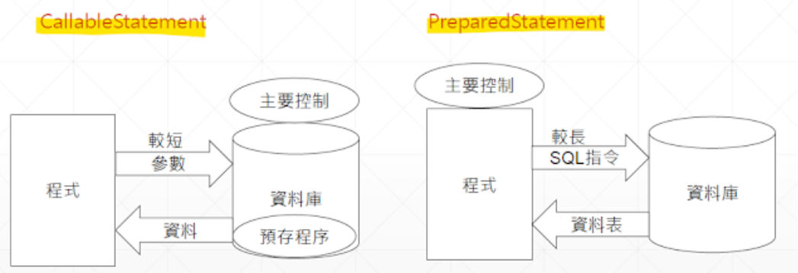
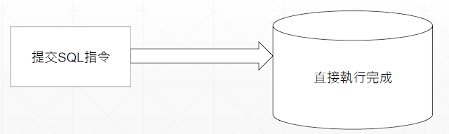
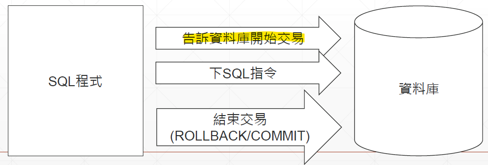
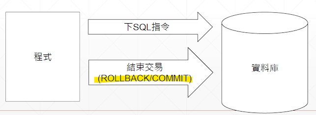

## 寫JDBC 的步驟：
### 1. 引入 / 導入 JDBC 的 Driver

從 Microsoft MS SQL 下載 jdbc driver for sql server (9.4.1 ver) 

Build Path → Add External Archives / External JARs 

Driver Manager - 處理 Java 與 JDBC Driver 之間的連接。

一個 Driver Manager 可以讓多個 Driver 給註冊。

<br/>

### 2. 註冊 JDBC Driver

必須註冊才能使用驅動程式套件。註冊/載入方式有三種：
1. Class.forName:
    forName 方法是 Class 下的靜態方法，此方法尋找、載入你的 JDBC Driver 到程式中。
    
    如果找不到此類別，則會產生 ClassNotFoundException（需確認例外）。
    ```
    Class.forName("com.microsoft.sqlserver.jdbc.SQLServerDriver");
    ```

2. System.setProperty:

    將字串儲存到 "jdbc.drivers" 為鍵（key）的鍵值儲存對中的值。

    準備連接時，DriverManager 會去尋找鍵為 jdbc.drivers 的值，並註冊到驅動管理列表中。

    此列表是 DriverManager 內建的 list，用來儲存驅動程式。

    **優點**：一次註冊多個驅動，中間冒號（:）分隔。   
        
    **缺點**：比較複雜。
    ```JAVA
    System.setProperty("jdbc.drivers","com.microsoft.sqlserver.jdbc.SQLServerDriver:com.mysql.cj.jdbc.Driver"); 
    // 同時註冊了 MsSQL 以及 My SQL
    ```

3. DriverManager.registerDriver:
        
    在老舊的專案中比較容易看到。這種方式已逐漸被淘汰。

    ```JAVA
    DriverManager.registerDriver(new.com.microsoft.sqlserver.jdbc.SQLServerDriver());
    ```

4. 新式載入方式：自動載入

    Java SE 1.6 之後的新式載入方式，無須顯載入、註冊 JDBC Driver
    
    META-INF / service 路徑下的 java.sql.Driver 檔案

<br/>

### 3. 建立一個連線

#### [事前準備]

+ 將連線時所需要的資訊寫成一個連線字串

```java
jdbc:sqlserver://localhost:1433;databaseName=Hakka
(協定)(子協定資料庫管理系統名稱) :// (主機位置) : (埠號);(databaseName=___)
                                // MSSQL (;)   MySQL (/)   Oracle (:)
```
+ 埠號: 0 ~ 1023  著名服務 ( 1024 ~ 上限 65535)
    + MS SQL 1433 
    + MySQL 3306

```Java
jdbc:mysql://localhost:3306/Hakka

jdbc:mysql://localhost:3306/Hakka?useSSL=false&serverTimezone=UTC&characterEncoding=UTF-8

較新的MySQL版本需要指定是否為 SSL連線、時區、文字編碼方式，中間&分隔
```

<br/>

#### [建立連線]

DriverManager.getConnection("上述連線字串URL",sa,12345);

回傳一個連線物件 Connection，傳遞 SQL 語句給資料庫執行

<br/>

#### [資源釋放]

使用 Connection 物件的 `close()` 方法，歸還連線資源，通常寫在 finally 區。

確認連線是否成功的方式：確認 connection 是否為 null、使用 isClosed 方法檢查
```
try{
    連線物件
} catch (SQLException e) {
    e.printStackTrace();
}finally{
    try {
        if(連線物件!=null){
            if(!連線物件.isClosed()) conn.close();
    }
}
```
#### [自動釋放資源]

try-with-resource 語法可以代替執行 close 方法釋放資源，簡短程式碼長度。

使用時需要注意，寫在 try() 中需要繼承 AutoCloseable 的介面才能進行自動關閉。
```Java
try(
    Connection conn=DriverManager.getConnection("url string","sa","12345") 
){
    System.out.println("Connection succeeded");
}catch (SQLException e){
    e.printStackTrace();
    System.outprintln("Connection failed");
}
```

### 4. 執行查詢或其他 SQL 指令

#### [Statement 介面 - 靜態 SQL 指令]

將 SQL 陳述句交給 Statement 物件，該物件可訪問資料庫，取得回傳結果。

靜態 SQL 陳述句 - 傳遞後無法改變，只能執行或取消。
可以用串接字串方式傳遞參數，但有風險。('' + '' + '' + ...)

1. 連線物件產生 Statement 物件

    `Statement stmt = conn.createStatement();`

2. 編寫 SQL 指令字串

    `String sql = "CREATE TABLE HakkaAdvent";`

3. 提供給 Statement 的 executeQuery 方法，取得結果集 ResultSet

    #### [executeQuery]

    + 只能使用在查詢時，不能更動資料表內容

    + 會回傳一個結果集 ResultSet，包含查詢結果、欄位 (就是一個表格)

    `ResultSet rs = stmt.executeQuery(sql);`

    #### [executeUpdate]
    + 用在刪除（D）、新增（C）、修改（U）或DDL（建立刪除表格類）
    + CUD - 回傳一個整數值 int，代表成功刪除、新增、修改的筆數
    + DDL - 回傳 0（成功）或 -1（失敗）
    ```Java
    int row = stmt.executeUpdate(sql);
    System.out.println("成功變更"+row=+"筆資料");
    ```

    #### [execute]
    + 可以執行 executeQuery 與 executeUpdate 能執行的 SQL 語句

    + 回傳 boolean 值：true 有結果集 |  false 沒有結果集
    ```Java
    boolean b = stmt.execute(sql);
    int row = stmt.getUpdateCount();         // 取得更新筆數
    ResultSet rs = stmt.getResultSet();       // 取得結果集 
    ```

4. 取出結果集資料
5. 釋放資源

#### 5. 從「結果集」中得到資料
#### 6. 清理環境 / 關閉物件

<br/>

### ResultSet 介面
使用步驟：
1. 從 Statement 取得查詢後的結果集 ResultSet

    ResultSet - Statement 回傳的結果集，為一個已經打包好的物件。

    要透過 ResultSet 的一些方法取出結果集中每一個欄位的資料。

    取出資料時要注意資料指標 cursor 的位置。

    產生方式：
    ```Java
    ResultSet rs = stmt.executeQuery(sql);

    stmt.execute(sql);
    ResultSet rs = stmt.getResultSet();
    ```

2. 控制游標、選擇要讀取的項目

    #### [cursor 的控制方法]
    在 ResultSet 中要取得想要的資料，要先控制 cursor 的位置。

    cursor 控制的是選擇第 n 筆資料列。

    一般而言，資料庫預設只能向後讀取，
    但可以在取得 Statement 物件前先告知資料庫要使用什麼樣子的讀取方式。
    |Method Name| Description |
    |-|-|
    |next() |下一筆|
    |previous() |前一筆|
    |first()  |第一筆|
    |last()   |最後一筆|
    |beforeFirst() |到第一筆之前|
    |afterLast() |最後一筆之後  |  

3. 讀取欄位資料

    #### [欄位讀取]
    + cursor 一開始位置在第一筆資料之前，所以要執行.next 方法，指到第一筆資料

    + ResultSet 用 cursor 選到資料後，用 get(資料型別) 取得資料

    + get方法可以傳入兩種參數：欄位名稱、欄位索引 (索引值從1開始)

    + get(基本資料型別, 不含 char) :
            `getByte | getShort | getInt | getLong 
            getBoolean | getDouble | getFloat`

    + 其它常用的 get 方法：
            `getString | getDate | getTime | getTimestamp |  getBinaryStream`

    + 可以取得所有資料型別資料的方法：
            `getString | getObject`

```Java
ResultSet rs = stmt.executeQuery(sql);
while(rs.next()) {
System.outprintln(rs.getString(1)+rs.getString(2)+rs.getString(3)+rs.getString(4));
```

4. 釋放資源


### PreparedStatement 介面 - 動態 SQL 指令

#### [定義]
+ 繼承於 Statement interface，可處理靜態 / 動態 SQL 語句。
+ 利用 Connection 物件取得 PreparedStatement 時，要先輸入 SQL 語句，會回傳一個儲存好預先編譯的 PreparedStatement 物件，利用此物件做到動態處理 SQL 指令。
+ 優點：事先編譯 / 快取，避免資料庫重複編譯同句 SQL 指令，提升效能。

#### [動態 SQL 指令介紹]
+ 動態 SQL 指令字串：在需要填入的位置設一個 ? 佔位符號。
+ ? 的部分使用 set 方法設置
    ```SQL
    select * from HakkaAdvent where date=*
    ```
+ set 方法設置變數：
    etBoolean(第幾個?,傳入值) | setShort(第幾個?,傳入值) | setInt(第幾個?,傳入值) | 
    setLong(第幾個?,傳入值) | 
    setDate(第幾個?,傳入值) | setTime(第幾個?,傳入值) | setTimestamp(第幾個?,傳入值) | 
    setBinaryStream(第幾個?,傳入值) | setAsciiStream(第幾個?,傳入值) | 
    setObject(第幾個?,傳入值) | 
    setBlob(第幾個?,傳入值) | setClob(第幾個?,傳入值) | 
    setString(第幾個?,傳入值) 


#### [PreparedStatement 執行 SQL 指令]
+ `executeQuery()`  - 回傳 ResultSet 物件，查詢資料庫回傳一個結果集
+ `executeUpdate()`  - 回傳一個整數 int，更新資料庫並回傳變更的資料列數目


### 動態 SQL 指令的運用
```JAVA
PreparedStatement pstmt = conn.prepareStatement(          // Read
"SELECT [Customerid],[CusName],[CusAddress],[CusTel]"
            + "FROM [JDBCDemo],[dbo].[sampletable]"
            + "WHERE Customerid=?");
pstmt.setInt(1,Integer.valueOf(Customerid);
ResultSet rs = pstmt.executeQuery();
```
```JAVA
PreparedStatement pstmt = conn.prepareStatement("INSERT INTO [dbo].[sampletable]"    // Create
            + "([CusName],[CusAddress],[CusTel]) VALUES (?,?,?)");
pstmt.setString(1, name);
pstmt.setString(1, name);
pstmt.setString(1, name);
pstmt.executeUpdate();
System.out.println("新增成功");
pstmt.close();
```
```JAVA
PreparedStatement pstmt = conn.prepareStatement("UPDATE [dbo].[sampletable]"      // Update
                    + "SET[CusName] = ?,[CusAddress] = ?,[CusTel] = ?"
                    + "WHERE [Customerid]=?");
pstmt.setString(2, address);
pstmt.setString(1, name);
pstmt.setString(3, tel);
pstmt.setInt(4, id);
pstmt.executeUpdate();
System.out.println("更新成功");
pstmt.close();
```
```JAVA
PreparedStatement pstmt = conn.prepareStatement("DELETE FROM [dbo].[sampletable]"   // Delete
                    + "WHERE [Customerid]=? AND [CusName] = ?");
pstmt.setInt(1, id);
pstmt.setString(2, name);
pstmt.executeUpdate();
System.out.println("刪除成功");
pstmt.close();
```

### CallableStatement 介面 - 呼叫資料庫的預存程序
+ 將寫好的商業邏輯以事先編譯的方式存在資料庫中，

    呼叫該預存程序並提供參數，讓預存程序完成該商業邏輯。
+ Pros： 編輯時就能除錯  |  傳遞物件小，已在資料庫編譯（效率++）   金融業適用
+ Cons：預存程序建在資料庫上，所以切換不同資料庫時，因為語法不同需要重寫

    且效能調整受限於資料庫系統

#### [比較預存程序 (CallableStatement) 與動態 SQL 指令 (PreparedStatement)]



#### [預存程序的執行步驟]
+ 前提：資料庫須有預存程序 <br/>
    ➀ 從連線物件 Connection 取得 CallableStatement <br/>
    ➁ 取得連線時要傳入呼叫預存程序的指令 <br/>
    ➂ 設置參數與註冊資料型別 <br/>
    ➃ 執行 execute() <br/>
    ➄ 取出回傳值 / 結果集 ResultSet <br/>
    ➅ 釋放資源 <br/>

#### [示範 & 呼叫方式]
```SQL
CREATE PROCEDURE dbo.selectId
    @Id int,
    @Name nvarchar(50) out,
    @Address nvarchar(100) out
AS
    SELECT @Name=CusName, @Address=CusAddress FROM
    dbo.sampletable WHERE Customerid = @Id
GO
```

+ 在 JDBC 呼叫 MS SQL 預存程序使用的字串是：

    ```JAVA
    CallableStatement pcall = conn.prepareCall("{call 預存程序名稱 (參數, 參數 ...)}");
    ```
+ 參數使用 ? 以動態的方式，作為參數輸入輸出
    + 輸入方式：同動態SQL指令 PreparedStatement，使用 set() 方法
    + 輸出方式：使用 registerOutParameter 作為輸出設置，順序要依照參數設置 
        + 資料庫將預存程序結果傳回時，會比對資料型別是否符合
        + 資料型別可在 `java.sql.Types` 選擇。

#### [注意事項]
+ 呼叫預存程序依照不同關聯式資料庫系統不同，有不同格式。
    ```
    MS SQL    {call 預存程序名稱(param1,param2, ...)}
    MySQL      call 預存程序名稱(param1,param2, ...)
    ```

+ 執行完預存程序後，可用 get(DataType) 方法加上回傳值名稱或索引值，以取得回傳的資料。
    ```Java
    CallableStatement cstmt = conn.prepareCall("{call selectId(?,?,?)}");

    cstmt.setInt(1,1);
    cstmt.registerOutParameter(2, Types.NVARCHAR);
    cstmt.registerOutParameter(3, Types.NVARCHAR);
    cstmt.exectue();
    System.out.println("Name="+cstmt.getString(2)+", Address="+cstmt.getString(3));
    cstmt.close();
    ```

### Blob & Clob 介紹
+ 目的： 為了將大型檔案寫進資料庫中使用。

|BLOB | CLOB |
|-----|------|
|binary large object | character large object |
|二進位大型物件| 字元大型物件|
|儲存圖片、影像、音樂等檔案類型的物件|儲存大篇幅文章、文件或是很長的文字（專欄、留言板）|


#### [對應資料庫的格式]

+ BLOB 與 CLOB 在各版本資料庫中有許多不同資料型別來儲存這種類型。
+ 儲存文字、小型檔案 - 資料庫原本就有提供 char、varcher、binary、varbinary 此類型格式，但是這些**原先都是設計給少量、一次性讀取完畢的資料**。
+ 故產生了 BLOB、CLOB 的格式，常使用串流方式（stream）傳送，因為串流並非一次讀取完畢，更適合傳遞大型檔案以降低網路負載。
+ MS SQL: 
    + BLOB - 用 varbinary(max), image 儲存
    + CLOB - 用 text, varchar(max)儲存（text 快被淘汰）

#### [寫進資料庫的方法]

+ 雖然 JDBC 2.0 開始支援 BLOB、CLOB 介面，但並不建議用此種資料型態寫入， 因為這兩種資料型態並非最有銷率的方式。
+ 雖然 PreparedStatement 有 setBlob() 與 setClob() 方法，寫入/讀取資料還是建議使用資料流（Stream）方式進行。
+ 資料流方式 
    + 可提供資料流InputStream 或 Reader `setCharacterStream()` 傳送資料進入資料庫：
        1. PreparedStatement - 
            + `setBinaryStream()` 
            + // 處理 BLOB
        2. PreparedStatement - 
            + `setAsciiStream()`、`setCharacterStream()`  
            + // 處理 CLOB


#### [讀取資料庫的 BLOB、CLOB]

+ ResultSet 有以下三個方法讀取資料庫中的大型物件（LOB）
+ 要注意物件的參考資料型別，進行轉換編碼時才不會報錯

    | 方法名稱 | 得到物件 |
    |----------|---------|
    |getBinaryStream <br/>(int 欄位索引/String 欄位名稱) | InputStream|
    |getAsciiStream <br/>(int 欄位索引/String 欄位名稱) | InputStream|
    |getCharacterStream <br/>(int 欄位索引/String 欄位名稱) | Reader|

+ 圖形資料庫處理

#### [圖形資料處理 - 寫入]

+ 處理圖形資料 / 檔案，步驟如下

    ➀ 開啟圖片的檔案串流（Stream）

    ➁ 用 setBinaryStream()，將開啟的圖片串流物件交給 Statement 物件

    ➂ 執行 （execute）方法
    ```JAVA
    FileInputStream fis = new FileInputStream("fileFolder/a01.jpg");
    PreparedStatement pstmt = conn.prepareStatement("INSERT INTO [dbo].[MyFile_Table]([FileName],[File] VALUES (?,?)");
    pstmt.setString(1,"a01");
    pstmt.setBinaryStream(2,fis);
    pstmt.execute();
    ```

#### [圖形資料處理 - 讀取輸出]

 ↠ 讀取時是資料庫到程式中，所以用的是 InputStream 的物件，步驟如下

       ➀ 執行查詢指令，取得結果集
       ➁ 取得結果集，從結果集得到串流（InputStream）
       ➂ 將串流輸入的資料輸出成檔案
       ➃ 取得下一個結果集，重複輸出直到結束
       ➄ 釋放資源

```Java
PreparedStatement pstmt2 = conn.prepareStatement("SELECT [File]"
                        + "FROM [JDBODemo].[dbo].[MyFile_Table]");
ResultSet rs = pstmt2.executeQuery();
while(rs.next()) {
    InputStream is = rs.getBinaryStream(1);
    byte[] b = is.readAllBytes();
    FileOutputStream fout = new FileOutputStream("OutFolder/a02.jpg");
    fout.write(b);
    fout.flush();             // flush method on StackOverFlow
    fout.close();             // close包含flush功能，但是flush具備重新整理完
}                             // 還可以繼續寫操作，close執行完了就流關閉
                              // 不能再寫入，所以，不能用close來代替flush

PreparedStatement pstmt2 = conn.prepareStatement("SELECT [FileName],[File]"
                                    + "FROM [JDBCDemo].[dbo].[MyFile_Table]");
ResultSet rs = pstmt2.executeQuery();
while(rs.next()){
    String s = rs.getString(1);
    Blob fiBlob = rs.getBlob(2);

    byte[] b2 = fiBlob.getBytes(1,(int)fiBlob.length());    
    // getByte(開始位置,要取得的資料長度), 開始位置從 1 開始
    FileOutputStream fout2 = new FileOutputStream("OutFolder/a03.jpg");    
    fout2.write(b2);
    fout2.flush();
    fout2.close();
``` 

### MetaData
+ MetaData | 元資料 | 中介資料  -- 用來描述資料用的資料。
+ 舉例：

    投影片本身的內容是資料。
    
    投影片的 MetaData 是屬性相關的資料。

    (例如：大小 789 KB, 標題, 標籤, 類別, 上次修改日期, 建立時間) 

+ JDBC 之 MetaData 目的是要**透過 Java 程式取得資料庫的系統資訊**。
+ JDBC 提供兩種 MetaData：
    + DatabaseMetaData （）- 資料庫
    + ResulSetMetaData （） - 資料表、結果集

+ 以下是DatabaseMetaData 常用的方法及得到的資料，**回傳值皆為 String** 型態：
    |Methd|Return|
    |-|-|
    |getDatabaseProductName() |資料庫名稱|
    |getDatabaseProductVersion()|資料庫版本|
    |getDriverName()|驅動程式名稱|
    |getDriverVersion() |驅動版本|
    |getURL() |DBMS 的 URL|
    |getUserName() |使用者名稱|
                    
    ```Java
    Database MetaData dbmd = conn.getMetaData();
    StringBuilder sb = new StringBuilder();
    sb.append("資料庫名稱：" + dbmd.getDatabaseProductName());
    sb.append("\n資料庫版本：" + dbmd.getDatabaseProductVersion());
    sb.append("\n驅動程式名稱：" + dbmd.getDriverName());
    sb.append("\n驅動版本：" + dbmd.getDriverVersion());
    sb.append("\nDBMS的URL：" + dbmd.getURL());
    sb.append("\n使用者名稱：" + dbmd.getUserName());
    System.out.println(sb.toString());
    ```

### ResultSetMetaData
```Java
ResultSet rs = pstmt.executeQuery();
ResultSetMetaData rsmd = rs.getMetaData();
System.out.println("getColumnCount:" + rsmd.getColumnCount());
for (int i = 1; i <= rsmd.getColumnCount(); i++){
    System.out.println("getColumnName:" + rsmd.getColumnName(i));
    System.out.println("getColumnLabel:" + rsmd.getColumnLabel(i));
    System.out.println("getColumnType:" + rsmd.getColumnTypeName(i));
    System.out.println("getColumnDisplaySize:" +rsmd.getColumnDisplaySize(i));
    System.out.println("isNullable:" + rsmd.isNullable(i));
}
```
1. `getColumnCount()`            **欄位總數 - int**
    + 回傳查詢當下的結果集中所具有欄位數量
    + 傳回的是查詢結果（ResultSet）的欄位數量，非表格欄位數量
    ↠ 只要知道有多少表格欄位，即可用迴圈方式處理結果集，簡潔化程式

2. `getColumnName(int 欄位索引)`   **欄位名稱 - String**
3. `getColumnLabel(int 欄位索引)`  **欄位別名 - String**
    + 此兩方法需要提供一個欄位索引位置，以回傳欄位名稱
    + `getColumnName` - 
        + MS SQL - 回傳**別名**（此方法因使用者的資料庫不同，傳回不同欄位名稱）
        + Mysql  - 回傳**欄位的名稱**
    + `getColumnLabel` - 回傳欄位別名（無別名則傳回欄位名稱）
    + 與 getColumnCount 方法聯用，可以使用迴圈取得該欄位名稱

4. `getColumnTypeName(int 欄位索引)`    **欄位資料型別 - String**
    + 此方法需要提供一個欄位索引位置，會回傳該欄使用的 SQL 資料型別。
    + 回傳型別是 SQL 資料型別，並非 Java 資料型別

5. `getColumnDisplaySize(int 欄位索引)`   **欄位有效長度 - int**
    + 此方法需要提供一個欄位索引位置，會回傳**該欄位可儲存的最大尺寸**
    + 例：查詢一個設定 varchar(50) 的欄位，方法回傳 50 至程序中
    + 可以利用此方法告知使用者可輸入多少文字，或在進入資料庫前先限制長度，以免無用的傳遞資訊

6. `isNullable (int 欄位索引)`        **欄位是否允許空值**
    + 此方法需要提供一個欄位索引位置，確認欄位是否允許為空值
    + 傳回 int 值
        + 0 不允許空值
        + 1 允許空值
        + 2 不確定 / 無法判斷
    + 可以應用在事先取的資料表的是否允許空值，取得後用來判斷使用者輸入是否正確，避免將錯誤格式的資料提供給資料庫，進行錯誤處理


### 異常處理
```Java
catch (SQLException e) {
    this.closeConn();
    System.out.println("SQL查詢失敗");
    System.out.println("Message: "+e.getErrorCode());
    System.out.println("ErrorCode: "+e.getErrorCode());
    e.printStackTrace();
}
```
+ 主要處理的例外是 SQL Exception。異常處理要做的事：
    + 回饋給使用者錯誤的輸入情形
    + 防止異常造成程式的崩潰
    + 了解程式發生的錯誤

#### [SQLException]
+ SQLException 是使用 JDBC 時常常見到的一種例外 Exception。
+ SQLException 類別可提供一些有用的報錯資訊，取出例外的方法有以下兩種
    1. `String getMessage()`
        + 可取得錯誤、例外訊息，是由資料庫方（Mssql 或 My SQL）提供的訊息
    2. `int getErrorCode()`
        + 回傳一整數值，是資料庫提供的錯誤代碼

### 批次更新 - Batch Updates

```Java
PreparedStatement pstmtBatch = conn.prepareStatement("INSERT INTO [dbo].[sampletable]"
                    + "([CusName],[CusAddress],[CusTel]) VALUES (?,?,?)");
for (CustomerBean customerBean : Customers) {
    pstmtBatch.setString(1, customerBean.getCusName());
    pstmtBatch.setString(2, customerBean.getCusAddress());
    pstmtBatch.setString(3, customerBean.getCusTel());
    pstmtBatch.addBatch();
}
pstmtBatch.executeBatch();
pstmtBatch.close();
```
+ 批次處理作業：在電腦上不須操作者干預，執行一系列的程式
+ 批次處理的目的：
    1. 把作業處理轉移到電腦資源較不繁忙的時段
    2. 避免計算資源閒置，保持一定使用率，減低平均開銷

+ 現實中利用批次處理的工作像是銀行利息處理、特定時間間隔的統計報表生成
+ 適合用於 重複性高、不需要人力進行輸入、大量資料處理 的工作

### [addBatch()]
+ 可用 Statement 或 PreparedStatement 此兩介面物件中的 addBatch 方法，將 SQL 語法添加進批次處理中
+ 此方法會將 SQL 指令存進一個隱含的 List
+ 批次處理中沒有使用者接收回饋，所以 addBatch 只適用於 INSERT、UPDATE、DELETE
+ Statement 使用 addBatch() 方法時，**需要在 addBatch() 方法中直接添加 sql 指令**
+ reparedStatement 使用 addBatch() 方法時，可用 setXX 方法先設置再用 addBatch() 添加

### [executeBatch()]
+ 會將**新增進入批次的資料**進行執行，會回傳一個整數陣列
+ 此陣列代表每一筆 SQL 語法進行新增、修改所更動的筆數
+ 有多少筆 SQL 指令，就會有多少個整數
+ 執行完後，會將放進 List 物件的 SQL 指令清空

<br/>

## 交易 - Transaction
```Java
conn.setAutoCommit(false);          // 關閉自動交易
PreparedStatement pstmt = conn.prepareStatement("UPDATE [dbo].[sampletable]"
            + "SET [CusTel] = ?" + "WHERE [Customerid] = ?");
pstmt.setString(1,telId1); 
pstmt.setInt(2,id2);               //  更新第一筆
pstmt.execute();
pstmt.setString(1,telId2);
pstmt.setInt(2, id1);              // 更新第二筆
pstmt.execute();
conn.commit();
conn.setAutoCommit(true);
```
#### [定義]
+ 交易：一連串不可分開執行的資料庫指令（例：銀行轉帳）
+ 如果修改其中一方的過程中發生事故問題時，沒有透過一些方法處理，有可能造成帳目錯誤等嚴重問題，因此需要對交易控制、管理。

#### 1. 自動認可交易 - 執行一次 SQL 指令就變更一次資料庫中的資料
+ 默認交易模式。SQL 單一語句都會被視為一筆交易，成功時會自動確認，失敗時會 Rollback 復原資料
+ 此模式下只需要單句 SQL 指令就能完整交易
+ 適合處理只需要單句 Java SQL 指令就能完整敘述的交易，如更新個人資料


#### 2. 外顯交易 - 明確宣告交易開始、提交、回滾
+ 需要明確宣告交易的開始。 e.g. BEGIN TRANSACTION 
+ 結束時以 COMMIT 或者 RALLBACK  明確結束
+ 此種情況需要所有 SQL 指令成功才會寫進資料庫，否則rowback() 後會全部復原


#### 3. 隱含交易 - 不明確宣告交易開始，但須執行提交來完成資料庫資料變更或是回滾不變更
+ 關閉自動認可交易模式後，交易會變為隱含交易
+ 此模式下，不需要明示交易啟動句，但還是需要 commit 或 rollback 明確結束交易的完成
+ 上一筆交易完成後，會隱含的自動開啟一筆新的交易。


#### [使用 JDBC 完成交易]
+ JDBC 預設交易模式為自動認可交易，要變更之前需要切換成隱含交易模式
+ 透過 Connection 連線物件設置 / 變更交易模式
+ 用 `setAutoCommit()` 方法將預設交易模式設置為 false、使用 `commit()` 確認交易
+ 若發生異常，可執行 `rollback()` 回滾，復原成原本狀態
+ **重要** 完成後使用 `setAutoCommit()` 將其設置為 true，重開啟自動認可交易

