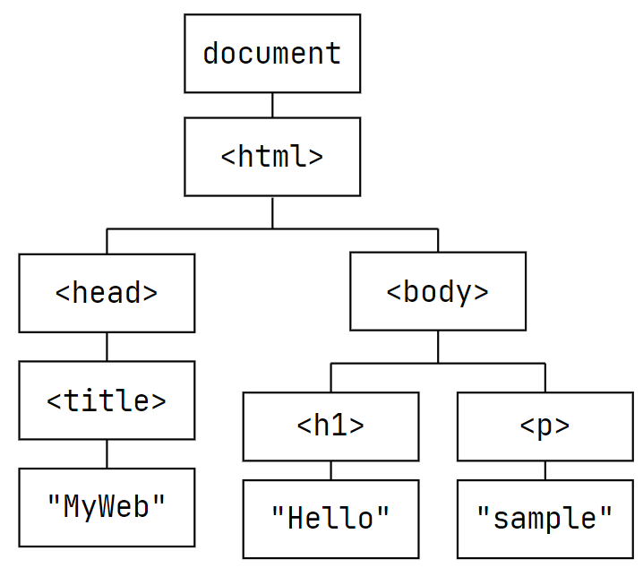

# Javascript ... 一些概念
JavaScript 是一個能在客戶端（client-side Browser）執行的應用程式，目的是為了彌補 HTML 互動性不足的問題。

可内嵌於網頁内，JavaScript 可以是 HTML 的一部分。 

JavaScript 是 client-side language，由 Browser 來解譯和執行，不須要網路也可以執行。 

可以在支援 JavaScript 的瀏覽器上執行。 

HTML / CSS / JavaScript 線上編輯工具：
   + codepen.io/pen
   + jsbin.com
   + jsfiddle.net

## JavaScript 的優勢
1. 互動式網頁
2. 在 client (browser) 執行即可
3. 使用者資料驗證，減少 server 端負擔，減少網路壅塞
4. 何時使用?
   + 增加網頁的可看性與互動性
   + 動態的資料呈現 
   + 偵測 user 在網頁上的行為
   + 要求 user 輸入資料並驗證（例. 加入會員）
   + 記錄使用者的選擇（例. 購物車）

HTML5 的 Javascript APIs 

## 撰寫格式
+ 放在 HTML 的 < body > 中:
   1. 將 JS 當 HTML 的 element 來使用 
      ```HTML
      <body>
         ...
      </body>
      ```
   2. 透過事件驅動來執行 JS 
      ```HTML
      <body>
         <script>...</script>
      </body>
      ```
+ 寫成外部檔案 (xx.js)
   ```html
   <head>
      <script src="xx.js">...</script>
   </head>
   ```
   ```html
   <head>
      <script>...</script>
   </head>
   ```


## Syntax Basic 基本語法
任何程式的原則:
   + 易於維護
   + 具可攜性
   + 最好程式碼本身就能代表其意義
   + 適時加入註解，增加程式可讀性
      + 單行註解 `// ...`
      + 多行註解 `/* ...(多行)... */`
   + 常見錯誤:
      + 大小寫、拼錯字、漏寫"" 或''

### 1. 變數
+ 意義：代表記憶體空間，可存放任何數值或物件
   + 其所代表的值可以任意改變
+ 命名原則：
   + 由字母大小寫、數字、錢字號以及底線組成
   + 數字不能在開頭
   + 不能與關鍵字 (以及未來保留字) 相同
      |保留字|未來保留字|
      |-|-|
      |break delete function return typeof case do if switch var catch else in this void continue finally instanceof throw while default for new try with|abstract double implements private throws boolean enum import protected transient byte export int public volatile char extends interface short class final long static const float native super debugger goto package synchronized|

+ 宣告時可使用關鍵字 var、let、const
+ 敘述 (statement) 結束，請以`;`結尾

### 2. 常見且重要的資料型態
|數字 Number|陣列 Array| 字串 String|布林 Boolean|
|-|-|-|-|
|**日期時間 Date**|**數學 Math**|**正規表示式 RegExp**|**物件 Object**|

也是資料型態
+ `null` 空值  (**沒有結果**)
+ `undefined` 未定義
   + 宣告一個變數但沒立刻給值 (**沒有處理**)
   + 使用一個物件但未聲明屬性
   + 定義了函數的參數，但未傳值給該函數

+ 宣告變數時，無須宣告資料型態，JS 會在執行時自動轉換

+ 與變數有關的運算子: typeof
   + 顯示此物件是何種資料型態
   + 若 typeof 某函數 會顯示 function，函數實際上就是物件
   + 若結果為 null，常常是表示物件不存在，所以 null 會被當成物件

+ 資料型態轉換
   + parser 會視程式的前後文決定資料型態的轉換，或使用強制轉型的語法：
      ```javascript
      Number(object)
      parseInt(object)
      object.toString()
      ```

### 在字串和數字之間安全地轉換
JavaScript 提供一些令人混淆的方法陣列，它們都有一些不同取捨。

+ 字串轉數字：
   1. `Number(str)`
      + 如果字串str，在移除前面和後面的空白字元後，正好可以表示一個數字，那麼Number(str)會傳回一個它所表示的數字資料。如果遇到任一字元無法轉換時，就會傳回NaN。可以轉換的包括"123"、" 123 "，"1.0"、以及"1.e3"。
      + 不能轉換的像是 "123a" 以及 "1-2"。空字串或是一個由全空白的字元所組成的字串，以及null都會被轉換成0。布林值的true和false分別被轉換成 1 和 0。
   2. `parseFloat(str)`
      + 這是一個全域函式，不是一個物件的成員函式。在移除前面的空白字元之後，它把字串轉換成一個相等的數值，一直到遇到任一個不能轉換的字元為止，然後就會傳回到目前為止轉換的內容。如果沒有任何轉換發生，則會傳回NaN。也就是，"123a"會轉換成123。布林值、空字串、以及null都會被轉換成NaN。
   3. `+str`
      + 單元前置運算子「」有和Number()函式相同的行為。在數學表示式中，它比任何其他的運算子都還要早計算：3 * "2" 會計算出6。另外單元前置運算子「-」和單元前置運算子「+」一樣，但是它還改變了傳回數值結果的符號。
      + 留意Number()面對特殊值(例如空字串、null、布林值) 是較為寬容的，而parseFloat()則是在對待後面的不可轉換字元較為寬容。所有這三個方法都會把undefined轉為NaN。

+ 數字轉成字串：
   1. String(num)
      + 傳回引數的字串表示法。留意它沒辦法設定字串的格式—例如，它無法限制小數點之後的位數。
      + 如果值是null、true以及false，它們會被分別轉換成"null"、"true"以及"false"。
   2. "" + num 或 '' + num
      + 相當於 String(num) 的簡寫。
   3. num.toString()
      + 如果num是一個變數，而它的值不是null也不是undefined，那麼toString()成員函式將會傳回一個這個值的字串表示方式。嘗試在一個數字面值上呼叫 toString() (例如1.toString()) 將會產生一個語法錯誤，而如果試著在null或undefined上呼叫toString則會產生一個執行期的錯誤。
      + 一個NaN的接收者值是允許的，它會變成"NaN"。
      + JavaScript並不包含格式化輸出的值(和來自於其他程式語言的 printf() 函式家族比較)，但是 D3 提供了可以替代的功能。

#### 兩個關於其他可用機制的警示，目前還沒提到：
1. **不要把`Number()`或`String()`函式和 new 關鍵字一起使用**
   + 如果這麼做，將不會建立原始的型態 (數字或字串)，而是一個具有不同行為的包裝物件。
2. parseInt(str, radix) 函式使用指定的radix(必須介於2~36之間)，**把字串轉換成以radix為底的整數**。當遇到無法轉換的字元時此函數就會停止，因此如果字串是以指數符號給定，則可能會產生不正確的結果(因為指數表示法中的那個e字元)。

#### 最後，關於把物件轉換成原始型態(字串或數字)的建議如下：
1. **valueOf()**
   + 此方法是從所有的物件繼承而來的，他把接收到的物件轉換成原始的值。如果物件表示的是數字，則 valueOf() 傳回一個相對應值的數值型態；否則，它會傳回物件本身(使用一個在算術表示式中的值將會產生一個這個表示式的NaN值)，valueOf() 函式通常並不會藉由程式碼明確地呼叫。
2. **toString()**
   + 可以用在所有物件上；它被呼叫(通常是隱含的)以取得一個物件的字串表示法。然而，他的預設實作並不會傳回一個描述性的字串以唯一地識別出這個物件，但是取而代之的，傳回一個一般性常數 (然而這是不可能直接使用這個物件作為在雜湊表中的key)。
3. 取得一個任意物件的格式化字串表示法是去使用 `JSON.stringify()`


#### 變數的關鍵字 var |  let  |  const
+ 宣告變數時候, 不一定要加上這些關鍵字
+ 宣告變數時, 盡可能立刻給初值, 否則是 undefined
+ 每個變數都有其 scope 和 life cycle
+ 其 scope 可大概分成區域和全域
+ 較好的程式, 盡可能使用全域變數
   ```JavaScript
   // scope = where a variable is accessible
   // let = declare variables with a block scoped {}
   // var = declare variables with a function scoped ()
   ```


+ #### 區域變數：
   + 在函數中使用變數關鍵字
   + 定義函數時的參數
      ```JavaScript
      function doFirst(){
      let meg = 'error';
      alert(meg);
      }

      doFirst('error');
      function doFirst(meg){
      alert(meg);
      }
      ```
+ #### 全域變數：
   + 在函數中**不要**使用變數關鍵字
   + 寫在函數之外
      ```JavaScript
      function doFirst(){
      meg = 'error';
      alert(meg);
      }

      let meg = 'error';
      function doFirst(){
         alert(meg);
      }
      ```
 
### 3. 輸出 / 輸入
+ 輸出到畫面 (越來越少用, 每個老師都嫌棄)    
   ```javascript
   document.write('Hello World!');
   ```

+ 跳出視窗     
   + alert 視窗   |    confirm 視窗    |    prompt 視窗

+ Javascript  console 
```
console.log('Hello World!');  
```

### 4. 運算子、運算式與敘述
|Priority  |Operators|Description|
|-|-|-|
||`()`、`[]`             ||
||`++`、`--`、`+`、`-`、`! `  |一元運算子|
||`*`、`/`、`%`        |算數運算子|
||`+`、`-`                 |算數運算子|
||`>`、`>=`、`<`、`<=`     |關係運算子|
||`==`、`!=`、`===`、`!==` |關係運算子--等於、不等於、絕對等於、絕對不等於|
||`&&`、`\|\|`  |邏輯運算子|
||`?:`                 |條件運算子|
||`=`、`+=`、`-=`、`*=`、<br/>`/=`、`%=`| 指定運算子|
||`+`                 |字串運算子|


### 5. 迴圈敘述
+ 結構化的程式設計有三種結構:
   + 循序式: 即逐行執行
   + 迴圈式: 反覆執行到不想執行為止
   + 選擇式: 多重選項，擇一而行

+ 常見的迴圈形式:

   | 迴圈 | 執行次數 | 使用時機| 
   |-|-|-|
   |while(`條件判斷`){`敘述`;} |0 ~ N|不固定的執行次數與狀態|
   |for(`初值`;`條件判斷`;`計次`) {`敘述`;} <br/> for(...in `陣列或物件`) {`敘述`;}|0 ~ N |固定的執行狀態|
   |do{`敘述`;}while(`條件判斷`);| 1 ~ N |執行起碼一次|                

+ 迴圈的好幫手 break 和 continue
   + break    敘述除了在迴圈有作用以外，還可使用在switch
   + continue 敘述只在迴圈有作用


### 6. 選擇性敘述
|選擇性敘述|說明|執行|
|-|-|-|
|if(條件){...}       | 執行0或1次         | 符合條件就執行|
|if(條件){<br/>(1)<br/>}else{<br/>(2)<br/>}|條件大多是在一個數值範圍內；且可以放浮點數的比較|符合條件就執行 (1)，不符合就執行 (2)|
|switch(比對條件){<br/>case XX:<br/>... <br/>break;<br/>case OO:<br/>...<br/>break;<br/>...<br/>default:<br/>...} | 比對條件控制在整數型態或者字元型態<br/>不適合使用條件在一個範圍內，例如1 ~ 1000 之間| 多重選擇|              


### 7. 方法（函數）
+ 內建方法(函數)：直接使用即可，不需要宣告
   |內建函數|說明|
   |-|-|
   |`parseInt(value,base)`|傳回string轉成 10 進制後的整數; base 不一定要寫，default 是 10 進制|                        
   |`parseFloat(value)`|傳回 string 轉成浮點數後的數目|
   |`isNaN(testValue)` |檢查 testValue 是否為非數字型態 (is Not a Number)|
   |`escape(string)` |傳回 string 的 16 進制編碼得出來的字串|
   |`unescape(string)`|傳回以 16 進制編碼字串的原本字串|
   |`eval(string) `|把 string 當作 JavaScript 的敘述來執行|
   |`Number(object)`|把物件轉換成數值，遇到不合法傳回 NaN|

#### 自訂函數：宣告、定義、呼叫
+ JavaScript 不用明顯的宣告，直接會寫『定義』，實際上也有『宣告』的意味
   ```JavaScript
   // 定義
   function functionName1(){
      // 函數敘述
   }

   // 呼叫
   functionName();

   // #2 帶有參數的函數：
   // 定義
   function functionName2(arg1,arg2,...){
      // 函數敘述
   }

   // 呼叫
   functionName2(value1,value2,...);

   // #3 有傳回值的函數：
   // 定義
   function functionName3(){
      // 函數敘述
      return value;
   }

   // 呼叫
   variable = functionName3();
   ```

## Object-Oriented
### 1. 物件的屬性與方法
+ 所有能敘述的東西都是由物件組成
   + 大的物件裡面可以包含小物件
   + 許多的小物件可以組成大物件
+ 每一個物件都有其特性與其使用方法
   + 物件的特性即為屬性(attributes)  -- 名詞 & 形容詞
   + 物件的使用方法即為方法(methods)  -- 動詞
+ 物件有層級
+ **事件 (events)** 的發生可以啟動`物件`的方法或屬性

### 2. 事件（events）處理--1/4
Javascript 是 event-driven language
+ #### 事件
   + 系統會將每個發生的動作轉成事件，然後送到程式處理
   + 我們就根據不同的事件來設計不同的工作，負責處理事件的就叫做事件處理程序 (Event Handler)
   + JavaScript 的事件通常與物件有關，所以不同的物件就支援不同的事件處理

1. 建立事件聆聽功能
   + 包括一個**物件**、一個**事件**、一個**處理函數**
      + **#1** 嵌入式事件處理(.html)
         ```html
         <body onload="doFirst()">
         ```

      + **#2** 過去的事件處理方法(.js)
         ```Javascript
         window.onload = doFirst;
         // Alternative: window.onload = function(){...} 
         ```

      + **#3** `window.addEventListener('load',doFirst);`

2. 事件分類
   + 輸入裝置: 
      + click、mousedown、mouseup、dblclick、mouseover、mouseout (支援冒泡事件)、mouseenter、mouseleave (沒有支援)、mousemove、contextmenu (勾選不得使用JS)
   + 鍵盤: 
      + keypress、keydown、keyup (最常用-倒數可以打幾個字)

   + Browser: 
      + resize、scroll、load、unload (離開網站)、beforeload(重新整理之前儲存資料)、copy、cut、paste

   + Form: 
      + submit、reset、focus、blur、change (填寫完按別的位置時偵測)、input(填寫當下即偵測)、select

3. 事件物件的屬性和方法
   + 屬性:
   + 方法: preventDefault()、stopPropagation()

4. 引用事件物件

<br/>

### 3. 視窗（window）物件 -- 屬性
+ navigator、location、history、document、\[event]
+ 物件的\[屬性和事件]本身也可以是事件

### 4. 視窗（window）物件 -- 方法
|alert() 警告|confirm() 確認|prompt() 提示|
|-|-|-|
| **setTimeout() 設定計時器** | **clearTimeout() 取消計時器** ||
| **setInterval() 設定計時器** | **clearInterval() 取消計時器** ||

### 5. 視窗物件 -- window.navigator
提供瀏覽器的訊息
|屬性|Result|
|-|-|
|appCodeName|Mozilla|
|appName|Netscape|
|appVersion|5.0(Windows NT 6.1) etc...|
|cookieEnabled|true|
|language|zh-tw|
|onLine|true|
|userAgent|Win32|
|geolocation|GeoLocation API|
|**方法**|           
|javaEnabled()|判斷是否支援 Java|

### 6. 視窗物件 -- window.history
儲存該網頁曾到訪過的 URL 資料
|**屬性**|||
|-|-|-|
|`length`|到訪過URL的個數|history.`length`|

|**方法**|||
|-|-|-|
|`go()`|載入指定的URL|history.`go(number\|URL)`|
|`back()` |載入上一個URL |history.`back()`|
|`forward()`<br/>`pushState()`<br/>`replaceState()`  |載入下一個URL|history.`forward()`|

<br/>

### 7. 視窗物件 -- window.location
提供了很多讀取所在網址的相關資訊

+ **屬性：**
   + hash (取得 anchor)、host、hostname、href、origin、pathname、port、protocol (通訊協定，包括冒號)、search (頁面跳轉)

+ **方法：** 
   + assign()、reload()、replace() (載入新的URL)

<br/>

### 8. 視窗物件 -- window.document
+ 屬性：
   + head、scripts、title、body、cookie、forms、images、links、files

+ 方法 (JS 與 HTML 的 elements 產生關聯)：
   + getElementById()
   + getElementByName()
   + getElementsByTagName()
   + getElementsByClassName()
   + querySelector()
   + querySelectorAll()

+ 修改 HTML 的 elements 的屬性與方法：
   ```
   element.innerHTML | element.innerText
   element.setAttribute(attr.value)
   傳回值(屬性值) = element.getAttribute(attr)
   element.style.property =
   ```

+ 方法(新增或刪除HTML的elements)：
   ```
   createElement()
   removeChild()
   appendChild()
   replaceChild()
   ```

+ 增加事件處理：
   ```
   document.getElementById(id).onclick = function(){}
   document.getElementById(id).addEventListener(事件,處理函數)
   ```

<br/>

### 9. 文件物件模型（DOM）
+ 何為DOM?
   + DOM == Document Object Model
   + 此為 W3C 制定的標準
   + 基本上，DOM 屬於 JavaScript 的介面標準，各家瀏覽器依此標準建置實際的物件，使 JavaScript 可以直接使用

+ 基本概念
   + 節點 node：文件中任何一樣東西都是一個節點
   + document node：整篇文件
   + 層次：節點彼此之間存在著層次的關係
      ```HTML
      <p>sample</p>
      <!-- <p>標籤為一個元素節點(element node)，
           並且包含文字節點(text node)sample
           <p>節點則為sample節點的parent node -->
      ```

+ 說明：
   + 以下為 HTML 文件的部分
   + 十個框框都是節點
   + 三個文字節點(text node)都沒有後續節點，稱為 leaf
   + 六個標籤皆為 element node
   + document 為此 family tree 的根節點
   + `<head>`和`<body>`有同個父節點 (parent node)，所以他們彼此之間為兄弟節點 (sibling node)
      

+ DOM 的屬性
   + 描述節點本身的訊息
      + `nodeName` 
         + element node 就是標籤名稱，一定要大寫，nodeName=='BODY'
         + 屬性節點的 nodeName 就是屬性名稱
      + `nodeValue`   
      + `nodeType`
         + 代表節點類型，用數字來表示
         + element(1)、attribute(2)、text(3)、comment(8)、document(9)
   + 描述彼此之間的關係
      + parentNode | childNotes | firstChild | lastChild | previousSibling | nextSibling
   + 描述文字節點
      + innerHTML | innerText | textContext

+ DOM 的方法
   + 新增：
      + createElement('標籤')
      + appendChild()
      + insertBefore()
      + replaceChild()
      + cloneNode()
   + 刪除：
      + removeChild()
   + 判斷：
      + hasChildNotes()    判斷是否有子節點
      + hasAttributes()    判斷是否有該屬性


### 10. document.cookie
+ 目前常用的是 web storage (HTML5)
+ HTTP 是一種無狀態的協定，所以 web server 不會記住任何東西
   + 假設是FB的server，有些資訊應該記住，例如會員是否已登入? 是否投過票? 是否玩過 Bubble Witch Saga? 就需要引入 cookie
+ cookie 是儲存在 user 端的文字檔，它會與 server 端的目錄相關聯，當 user 發出 request 的時候，cookie 會隨著 HTTP 的 request 傳送出去，而 server 端會決定如何處理 cookie 傳來的資訊
+ 何處使用 Cookie：
   + 月曆記事簿
   + 登入 sticky form
   + 個人化網站
+ 設定 cookie
   ```javascript
   document.cookie ='cookie=yes; expires=Tue, 16 Oct 2012
   08:30:20 UTC; path=/; domain=iii.org';
   document.cookie ='testcookie=maybe; expires=Mon, 22 Oct
   2012 16:30:20 UTC; path=/;domain=iii.org';
   ```
   |參數|說明|
   |-|-|
   |name=value|name 是 Cookie 的名稱，value 是該Cookie的值，這個字串會以 16 進制編碼。必須要有的參數。|
   |expires=date|指定Cookie的有效日期，當過了有效日期後，此Cookie就不會再儲存在瀏覽器；date是GMT的格式。如果未指定這個參數，此Cookie的有效日期就是使用者退出瀏覽器時。|
   |path=path|指定可以存取該Cookie的路徑。如果不指定這個參數，path就為設定該Cookie的網頁所在的路徑。|
   |domain=domain|指定可以存取該Cookie的網域。如果不指定這個參數，domain就指定為設定該 Cookie 的網頁所在的網域。|
   |secure|指定Cookie只可以傳送給HTTPS伺服器。|

+ **讀取 cookie**
   + 讀取先前設定的 cookie，可用 for 迴圈將前述的字串，用『；』來當成分隔的符號，可將 cookie 的 4 或 5 個參數一一讀取出來
+ **刪除 cookie**
   + 新增一個有效期間為過去時間的同名 cookie，用來刪除 cookie
+ 可用屬性 `navigator.cookieEnabled` 來看看瀏覽器是否支援 cookie
   ```javascript
   if(navigator.cookieEnabled){
       //瀏覽器有支援，可以設定或讀取cookie了
   }
   ```

### 11. 內建物件
+ JavaScript 的內建物件 (資料型態|類別):
   1. **內建物件 - Boolean**
      ```
      方法：
      toString()  以字串表示布林值
      valueOf()   取得物件原來的布林值
                  var bool = true;
                  var bool = new Boolean();
                  var bool = nwe Boolean(true);
                  var bool = new Boolean(5 > 3);
      ```
   2. **內建物件 - Number**
      + 方法：
         ```JavaScript
         toExponential(x)
         toFixed(x)
         toPrecision(x)
         toString()        以字串表示布林值
         valueOf()         取得物件原來的布林值
         ```
      + 屬性：
         ```JavaScript
         MAX_VALUE
         MIN_VALUE
         POSITIVE_INFINITY
         NEGATIVE_INVINITY
         NaN
         ```

   3. **內建物件 - String**
      + 方法：
         ```JavaScript
         charAt()
         indexOf()  |  lastIndexOf()
         slice(index x, index y)
         split()
         substr(index x, int count)
         toLowerCase() | toUpperCase()
         concat()
         replace()
         toString()
         trim()
         ```
      + 屬性：`length`

   4. **內建物件 - Array**
      + 方法：
         ```JavaScript
         indexOf()  |  lastIndexOf()
         pop() |  push(item)
         shift() | unshift(item)
         splice()
         concat()
         join()
         reverse()
         sort()
         ```
      + 屬性：`length`

   5. **內建物件 - Math**
      + 目的：提供複雜或特殊的數學運算
         + ***不可以使用 new 來給初值***
      + 屬性：
         + 所有數學屬性皆不可修改
            |Math.PI     |  Math.E       |  Math.LN       |  Math.LN1|
            |-|-|-|-|
            |**Math.LOG2E** | **Math.LOG10E** | **Math.SQRT1_2** | **Math.SQRT2**|
      + 方法：
         |Math.abs(x)   |   Math.max(...)   |   Math.acos(x)|
         |-|-|-|
         |**Math.min(...)** |   **Math.asin(x)**    |   **Math.pow(x,y)**|
         |**Math.ceil(x)** |   **Math.random()**   |   **Math.cos(x)**|
         |**Math.round(x)** |   **Math.exp(x)**     |   **Math.sqrt(x)**|
         |**Math.floor(x)** |   **Math.log(x)**||
         
   6. **內建物件 - Date**
            方法           │  說明
──────────────────────┴─────────────────────────────
Wed Feb 24 2022 11:49:18 GMT+0800 (台北標準時間)
──────────────────────┬─────────────────────────────
getDate() | getUTCDate()  │ 24
──────────────────────┼─────────────────────────────
getDay() | getUTCDay()    │ 3 (一星期的第幾天，週日為 0)
──────────────────────┼─────────────────────────────
getFullYear()             │ 2022
──────────────────────┼─────────────────────────────
getHours()                │ 11 (0 ~ 23)
──────────────────────┼─────────────────────────────
getMilliseconds()         │ 
──────────────────────┼─────────────────────────────
getMinutes()              │ 49
──────────────────────┼─────────────────────────────
getMonth()                │ 1 (0 代表 1 月)
──────────────────────┼─────────────────────────────
getSeconds()              │ 18
──────────────────────┼─────────────────────────────
getTime()                 │ 從 UNIX 時間戳記至日前的總毫秒數


方法
────────────────────────────────────────────────────
Wed Feb 24 2022 11:54:59 GMT +0800 (台北標準時間)
──────────────────────┬─────────────────────────────
toDateString()            │ Wed Feb 24 2022
──────────────────────┼─────────────────────────────
toISOString()             │ 2022-2-24T03:54:59.889Z
──────────────────────┼─────────────────────────────
toJSON()                  │ 2022-2-24T03:54:59.889Z
──────────────────────┼─────────────────────────────
toLocaleDateString()      │ 2022/2/24
──────────────────────┼─────────────────────────────
toLocalString()           │ 2022/2/24 上午11:54:59
──────────────────────┼─────────────────────────────
toLocaleTimeString()      │ 上午 11:54:59
──────────────────────┼─────────────────────────────
toString() | toUTCString  │ Wed Feb 24 2022 11:54:59 GMT+0800
──────────────────────┼─────────────────────────────
toTimeString()            │ 11:54:59 GMT+0800
 

(7) 內建物件 - RegExp
更改時間的方法
  setDate()
  setFullYear()
  setHours()
  setMilliseconds()
  setMinutes()
  setMonth()   *0 代表 1 月*
  setSeconds()

方法
compile()  |  exec()  |  test()

屬性
global  |  ignoreCase  |  lastIndex  |  multiline  |  source

(8) 自訂物件 - Object 
目的：產生與定義自訂物件
建立物件：
let obj = new Object();
let obj = {};

let obj = new Object(name:'Anan',age:10);
let obj = {name:'Anan',age:10};

[ex]
let obj = {
    name:'Anan',
    age:10,
    favoriteColors:{'blue','green','gray'},
    gender:'M',
    student:true,
    today:new Date(),
};

## 簡介 ES6
### 1. var | let | const
ES5 => var(variable) 宣告的變數可以改變
ES6 => let    宣告的變數可以改變
       const  宣告的變數不可以改變(不能被reassigned)

var 和 let 的差別在 #作用域(scope)
for(let j=0; j < 5; j++){
   console.log(j);
}
console.log(j);
------------------
#hosting(提升)
JS可以補宣告

### 2. object shorthand 物件縮寫
(1).屬性縮寫
(2).函數縮寫

### 3. destructing assignment 解構賦值
目的：便利的取出元素。
(1).陣列解構
(2).物件解構
(3).方法(函數)參數的解構
    陣列解構
    let numArray = [1,3,5,7,9];
    let first = numArray[0];
    let second = numArray[1];
    let third = numArray[2];

### 4. string template 字串模板
(1).字串串接
(2).插入表達式
(3).多行字串

### 5. arrow function 箭頭函數
(1).宣告方式
    函數傳遞一個參數，不用加小括號
    函數不傳參數或傳遞不只一個參數，一定要加小括號
    傳回值的敘述只有一行，可以省略大括號，也可以省略 return

Arrow 函式 (或是 fat arrow 符號) 是最近被加到 JavaScript 的 (在2015年釋出的 ES6 首度出現)。它們簡化了簡短匿名函式的定義，以下摘要了這個語法中最重要的部分：

  ① 把參數放在小括號中，然後函式的主體放在大括號裡面：
      (a, b, c) => {statements}
  ② 如果只有一個參數，那就不一定需要小括號：
      a => {statements}
  ③ 如果沒有參數，請使用一個空的小括號：
      () => {statements}
  ④ 如果函式的主體是只有一條敘述，則大括號和分號都是可選用的，
     而且計算之後的值將會成為此函式的傳回值：
      (a, b, c) => expression;

Arrow 函式並沒有 this 或是 arguments 變數：取而代之的，this 和 arguments 的值會被保留自封閉的範圍。因此，arrow 函式不能被使用在你需要 this 的情況；如果你需要 this，就需要使用 function 關鍵字去定義函式或 callback。


(2).語法簡短
(3).自動綁定
    一般的JS context(情境)：this 代表執行當下的外層物件
    所以 this 在執行當下才有意義
(4).this