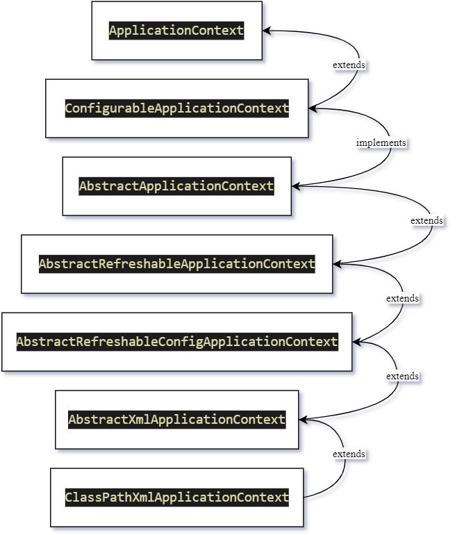
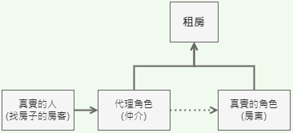
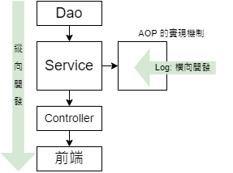
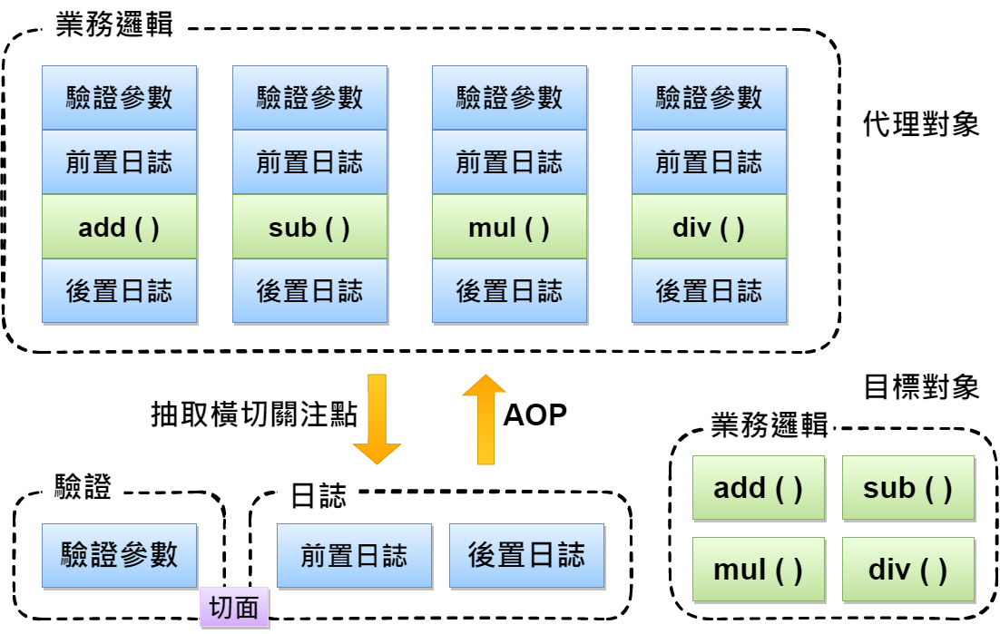

# 3. Spring 5 latest tutorial

## 01. Spring 簡介
+ 2002  interface21 框架
+ 2004  1.0 正式版發布
+ **Rod Johnson** Spring Framework 創始人
+ 理念：使現有的技術更容易使用，整合現有技術框架
    + Servlet API, Web Socket API, 并發實用程序, JSON綁定API, Bean 驗證, JPA, JMS, JTA/JCA 設置
+ SSH: Struct2 + Spring + Hibernate
+ SSM: SpringMVC + Spring + Mybatis 
+ Pros:
    + 開源、免費的框架（容器）
    + 輕量級、非入侵式框架
    + **控制反轉**（IOC）、**切面導向程式設計**/面向切面編程（AOP）
    + 支援事務處理、框架整合
> Spring: a lightweight framework, prominent for Inversion of Control and Aspect Oriented Programming

## 02. Spring 組成及拓展
+ Spring 七大組成


+ Spring: the source for modern Java
    + Spring Boot - build anything
        + 快速開發單個微服務
        + 約定大於配置
    + Spring Cloud - coordinate anything
    + Spring Cloud Data Flow - Connect everything

## 03. IOC 理論推導
1. UserDao 介面 → UserDaoImpl 實現類別 → UserService 業務介面 → UserServiceImpl 業務實現類別
    + Maven pom.xml 導入 spring-core dependency
 ```Java
 public interface UserDao {
    void getUser();
 }
 ```
 ```Java
 public class UserDaoImpl implements UserDao {
    public void getUser() {
        System.out.println("默認獲取用戶的數據");
    }
 }
 ```
 ```Java
 public interface UserService {
    void getUser();
 }
 ```
 ```Java
 public class UserServiceImpl implements UserService {

    //#1 private UserDao userDao = new UserDaoImpl();
    // 如果客戶端要改用 Oracle，因為客戶每次需求，開發者要再重新修改原始碼
    //#2 private UserDao userDao = new UserDaoMysqlImpl();
    
    private UserDao userDao;

    //#3 利用 set 進行動態實現值的注入
    public void setUserDao(UserDao userDao) {
        this.userDao = userDao;
    }

    public void getUser() {
        userDao.getUser();
    }
 }
 ```
 ```Java
 public class MyTest {
     public static void main(String[] args) {

        //用戶實際調用的是業務層，dao層它們不需要接觸
        UserService userService = new UserServiceImpl();

        ((UserServiceImpl) userService).setUserDao(new UserDaoMysqlImpl());
        userService.getUser();
     }
 }
 ```
 ```Java
 public class UserDaoMysqlImpl implements UserDao {
     public void getUser() {
        System.out.println("Mysql獲取用戶數據");
     }
 }
 ```
 + 引入Spring前，用戶需求可能會影響開發原本的代碼，開發需要根據用戶需求修改原始碼，如果程式碼很龐大，修改一次的成本代價十分昂貴
 + 之前，程式碼是主動創建物件，控制權在開發者手上
 + 通過 set 注入，程式不再具有主動性，而是變成了被動的接收物件
 + 程式設計師不用再去管理物件的創建。系統的耦合性大大降低，可以更加專注在業務的實現上。這是 IOC 控制反轉的原型。

 

## 04. IOC 本質
+ 控制反轉 Inversion of Control 是一種設計思想
+ **DI (依賴注入) 是實現 IoC 的一種方法**
+ 沒有 IoC 的程式中，我們使用切面倒向程式設計，物件的創建與物件之間的依賴關係完全硬編碼在程式碼中，物件的創建由程式碼自己控制，控制反轉後將物件的創建轉移給第三方，即獲得依賴物件的方式反轉了

    

+ **IoC 是 Spring 框架的核心內容**，使用多種方式完美的實現了 IoC，可以使用 xml 配置，也可以使用註解，新版本的 Spring 也可以零配置實現 IoC
+ Spring 容器在初始化時先讀取配置文件，根據配置文件或 metadata(元數據) 創建與組織對象存入容器中，程式使用時再從 IoC 容器中取出需要的物件
(`newClassPathXmlApplicationContext.java`)

    

+ 採用 `XML` 方式配置 Bean 的時候，Bean 的**定義訊息**是和**實現**分離的，採用註解的方式可以融和兩者，Bean 的定義訊息直接以註解的形式定義在實現中，從而達到零配置的目的
　
    > **控制反轉是一種通過描述（XML或註釋）並通過第三方去生產或獲取特定對象的方式。在 Spring 中實現控制反轉的是 IoC 容器，實現方法是依賴注入（Dependency Injection, DI）。**


## 05. HelloSpring
+ 主要是透過 `setStr()` 方法進行注入

```Java
public class Hello {
    private String str;
    
    public String getStr() {
        return str;
    }

    public void setStr(String str) {
        this.str = str;
    }

    @Override
    public String toString() {
        return "Hello{" +
               "str='" + str + '\'' +
               '}';
    }
}
```
1. Spring2 `XML` 
    ```xml
    <!-- beans.xml 
    使用 Spring 來創建物件，在 Spring 這些都稱為 Bean 
    bean = 物件   Hello hello = new Hello();
    🎇 id = 變數物件名稱 
    🎇 class = bean 物件所對應的全限定名稱 套件名 + 類別名
    🎇 name = 也是別名，且 name 可以同時取多個別名
    -->
    <!--實例化物件 | 給 Spring 託管-->
    <bean id="hello" class="com.yicelwen.pojo.Hello">
        <property name="str" value="Spring"/>   
        <!--類別的屬性"str" | 新建的物件名稱 Spring -->
    </bean>
    ```
    ```java
    public class MyTest {
        public static void main(String[] args) {
            // 獲取 Spring 的上下文物件  beans.xml → 設定檔的檔名
            ApplicationContext context = new ClassPathXmlApplicationContext("beans.xml");

            // 物件現在都在 Spring 中管理了，要使用的話直接去裡面取出來即可
            Hello hello = (Hello) context.getBean("hello");  // bean id=hello, Object 強制轉型為 Hello 
            System.out.println(hello.toString());
        }
    }
    ```
    ```xml
    <bean id="mysqlImpl" class="com.yicelwen.dao.UserDaoMysqlImpl"/>
    <bean id="oracleImpl" class="com.yicelwen.dao.UserDaoOracleImpl"/>
    
    <bean id="UserServiceImpl" class="com.yicelwen.service.UserServiceImpl">
        <property name="userDao" ref="mysqlImpl"/> <!--用戶變更資料庫,只需要修改 ref 的值-->
    </bean>
        <!--
            ref 標籤: 引用 Spring 容器中已經創建好的物件
            value 標籤: 具體的值，基本資料型別
        -->
    ```


+ 現在要實現不同操作，只需要在 xml 配置文件中進行修改。物件由 Spring 來創建、管理、裝配

    ```java
    public class MyTest {
        public static void main(String[] args) {
            // 獲取 ApplicationContext: 通過 beans.xml 拿到 Spring 容器
            ApplicationContext context = new ClassPathXmlApplicationContext("beans.xml");
            
            // 容器在手，天下我有，需要什麼，就直接 get 什麼
            UserServiceImpl userServiceImpl = (UserServiceImpl) context.getBean("UserServiceImpl");

            userServiceImpl.getUser();
    }
    ```

## 06. IOC 創建對象方式

1. 建一個 POJO (plain old java object)
    + 預設的方法：使用無參數建構子創建對象
    + 有參數建構子
```Java
public class User {
    private String name;

    public void User(){
        System.out.println("User 的無參數建構子")
    }
    public void User(String name){
        this.name = name;
    }
    public String getName(){
        return name;
    }
    public void setName(String name) {
        this.name = name;
    }
    public void show() {
        System.out.println("name=" + name);
    }
}
```
2. 把 User 類別放到 `beans.xml` 配置文件
```xml
<?xml version="1.0" encoding="UTF-8"?>
<beans xmlns="http://www.springframework.org/schema/beans"
       xmlns:xsi="http://www.w3.org/2001/XMLSchema-instance"
       xsi:schemaLocation="http://www.springframework.org/schema/beans
        https://www.springframework.org/schema/beans/spring-beans.xsd">

    <bean id="user" class="com.yicelwen.pojo.User">
        <!--無參建構子: 預設注入方法
            <property name="name" value="arrietty"/>
        -->
        <!--有參建構子#1: 索引賦值
            <constructor-arg index="0" value="Benjamin"/> 
        -->
        <!--有參建構子#2: 通過資料型別類型創建
            <constructor-arg type="java.lang.String" value="radioactive"/>
        -->
        <!--有參建構子#3: 直接通過參數名稱來設置-->
        <constructor-arg name="name" value="xxx"/>
    </bean>


</beans>
```
3. 在 main 方法取得 spring container
```Java
public class MyTest {
    public static void main(String[] args) {
        ApplicationContext context = new ClassPathXmlApplicationContext("beans.xml");
        
        User user = (User) context.getBean("user");
        user.show();  // name=arrietty | Benjamin | raioactive | xxx 
    }
}
```
> **小結**：在配置文件加載的時候，容器中管理的物件就已經初始化了


## 07. Spring 配置說明
+ 別名 `<alias>`
    ```XML
    <!--別名，如果加了別名，我們也可以使用別名獲取到這個物件-->
    <alias name="user" alias="userSansa"/>
    ```
+ Bean 的配置
    ```xml
    <!--
        id: bean 的唯一標識符，相當於物件名稱
        class: bean 物件對應的全限定名 (package + class name)
        name: 也是別名，可以用, | ; 區分多個別名
    -->
    <bean id="userTwo" class="com.yicelwen.pojo.UserTwo" name="user1,u2,u3;u4">
        <property name="name" value="HippyHooray"/>
    </bean>
    ```
+ `import`
    + 一般用於團隊開發使用，可以將多個配置文件，導入合併為同一個
    + 假設目前項目有多個成員開發，mem1~mem3要複製不同的類開發，不同類別需要註冊在不同的 bean 中，可以用 import 將所有人的 bean.xml 合併為一個總配置
        + Angela, Benji, Carlos 各自的 xml
        + `applicationContext.xml`
            使用的時候直接用總配置就可以了
            ```xml
            <beans ......>
                <import resource="angelabean.xml"/>
                <import resource="benjibean.xml"/>
                <import resource="carlosbean.xml"/>
            </beans>
            ```

## 08. DI 依賴注入環境
+ 建構子注入
+ 拓展方式注入 (引入其它約束)

## 09. 依賴注入 - Set 注入
+ `set`方式注入 (本節重點)
    + 依賴注入本質是 set 注入
        + 依賴：bean 物件的創建依賴於容器
        + 注入：bean 物件中的所有屬性由容器來注入
    + 【環境搭建】
        1. 複雜類型
            ```Java
            @Getter
            @Setter
            public class Address {
                private String address;

                @Override
                public String toString() {
                    return "Address{" +
                            "address='" + address + '\'' +
                            '}';
                }
            }
            ```
        2. 真實測試物件
            ```Java
            @Getter 
            @Setter
            public class Student {
                private String name;     //value
                private Address address; //ref 賦值
                private String[] books;        
                private List<Student> hobby;     // list
                private Map<String,String> card; // map
                private Set<String> games;       // set
                private String friend;           // null
                private Properties info;         // props

                @Override
                public String toString() {
                    return "Student{" +
                           "name='" + name + '\'' +
                           ", address=" + address.toString() +
                           ", books=" + Arrays.toString(books) +
                           ", hobbys=" + hobbys +
                           ", card=" + card +
                           ", games=" + games +
                           ", friend='" + friend + '\'' +
                           ", info=" + info +
                           '}';
                }
            }
            ```
        3. 注入值到 Student @ `beans.xml`
            ```xml
            <bean id="student" class="com.yicelwen.pojo.Student">
                <!-- 第一種: 普通值注入，直接使用 value -->
                <property name="name" value="arrietty"/>
                <!-- 第二種: bean 注入，使用 ref -->
                <property name="card" ref="address">
                <!--Array 陣列注入: ref-->
                <property name="books">
                    <array>
                        <value>A song of ice and fire</value>
                        <value>A clash of kings</value>
                        <value>A storm of swords</value>
                    </array>
                </property>

                <!-- List -->
                <property name="hobbies">
                    <list>
                        <value>read</value>
                        <value>code</value>
                        <value>swim</value>
                    </list>
                </property>

                <!-- Map -->
                <property name="card">
                    <map>
                        <entry key="學生證" value="12345"/>
                        <entry key="健保卡" value="1234"/>
                        <entry key="借書證" value="123"/>
                    </map>
                </property>

                <!-- Set -->
                <property name="games">
                    <set>
                        <value>The Gift</value>
                        <value>Minecraft</value>
                        <value>Magic Awakened</value>
                    </set>
                </property>

                <!--  空值注入: 字符串的寫法
                      <property name = "name" value=""/>
                      相當於 Student.setName("");  -->

                <!-- NUL 注入 -->
                <property name="friend">
                    <null/>
                </property>

                <!--Properties-->
                <property name="info">
                    <props>
                        <prop key="driver">oracledb</prop>
                        <prop key="url">oracledburl</prop>
                        <prop key="username">thermos</prop>
                        <prop key="password">12345</prop>
                    </props>
                </property>
            </bean>
            ```

        4. 測試類別
            ```Java
            public class MyTest {
                public static void main(String[] args) {
                    // new CPX (IDEA 快捷鍵)
                    ApplicationContext context = new ClassPathXmlApplicationContext("beans.xml");
                    Student student = (Student) context.getBean("student");
                    System.out.println(student.toString());
                }
            }
            ```

## 10. 拓展方式注入：c命名和 p命名空間注入
+ [XML shortcut with the p-namespace](https://docs.spring.io/spring-framework/docs/current/reference/html/core.html#beans-p-namespace)
    1. 導入表頭文件約束
        ```xml
        <beans ...
        xmlns:p="http://www.springframework.org/schema/p">
        ```
    2. p 命名空件注入，可以直接注入屬性的值：property
        ```xml
        <bean id="user" class="com.yicelwen.pojo.User" p:name="yicelwen" p:age="18"/>
        ```

+ [XML shortcut with the c-namespace](https://docs.spring.io/spring-framework/docs/current/reference/html/core.html#beans-c-namespace)
    1. 導入表頭文件約束
        ```xml
        <beans ...
        xmlns:c="http://www.springframework.org/schema/c">
        ```
    2. 需要有`有參數`+`無參數建構子`才能使用 c-namespace 注入
        ```xml
        <bean id="user2" class="com.yicelwen.pojo.User" c:age="17" c:name="arrietty"/>
        ```
    > 注意：p命名空間和c命名空間都要先導入約束才能使用

## 11. Bean 的作用域
[Bean factory scope](https://docs.spring.io/spring-framework/docs/current/reference/html/core.html#beans-factory-scopes)
|Scope|Description|
|-|-|
|**singleton**✨|(Default) Scopes a single bean definition to a single object instance for each Spring IoC container.|
|**prototype**✨|Scopes a single bean definition to any number of object instances.|
|**request**🎇|	Scopes a single bean definition to the lifecycle of a single HTTP request. That is, each HTTP request has its own instance of a bean created off the back of a single bean definition. Only valid in the context of a web-aware Spring `ApplicationContext`.|
|**session**🎇|	Scopes a single bean definition to the lifecycle of an HTTP `Session`. Only valid in the context of a web-aware Spring `ApplicationContext`.|
|**application**|	Scopes a single bean definition to the lifecycle of a `ServletContext`. Only valid in the context of a web-aware Spring `ApplicationContext`.|
|**websocket**|Scopes a single bean definition to the lifecycle of a `WebSocket`. Only valid in the context of a web-aware Spring `ApplicationContext`.|

+ **Singleton 單例設計模式** 
    + 無論用幾個 DAO 去拿，只有一個 Entity
        ```Java
        System.out.println(user1==user2); //true
        ```
        > Only one instance is ever created... and this same shared instance is injected into each collaborating object.
    + 單例工廠模式是預設/默認的機制
        ```xml
        <bean id="user2" class="com.yicelwen.pojo.User" c:age="18" c:name="yicelwen" scope="singleton">
        ```
+ **Prototype 原型設計模式**
    + 每次從容器中 get 的時候都會產生一個新物件
        ```Java
        System.out.println(user1.hashCode());  //999609945
        System.out.println(user2.hashCode());  //615634843
        System.out.println(user1==user2);      //false
        ```
        > A brand new bean instance is created ... each and every time the prototype is referenced by collaborating beans.
        ```xml
        <bean id="accountService" class="com.yicelwen.pojo.AccountService" scope="prototype">
        ```
    + 其餘的 request, session, application 只有在 web 開發中使用到

        > 紙筆考單例設計模式實作

## 12. 自動裝配 Bean
+ 自動裝配是 Spring 滿足 bean 依賴的一種方式
+ Spring 會在上下文中自動尋找，並自動給 bean 裝配屬性
+ 三種裝配方式
    1. 在 xml 中顯示的配置
    2. 在 java 中顯示配置
    3. 隱式的自動裝配 bean ✨

+ 測試
    ```Java
    public class Cat {
        public void makeSound(){
            System.out.println("meow");
        }
    }
    ```
    ```Java
    public class Dog {
        public void makeSound(){
            System.out.println("woof");
        }
    }
    ```
    ```Java
    public class Person {
        private Cat cat;
        private Dog dog;
        private String name;
        // getter // setter // toString
    }
    ```
    ```xml
    <bean id="cat" class="com.yicelwen.pojo.Cat"/>
    <bean id="dog" class="com.yicelwen.pojo.Dog"/>
    <bean id="people" class="com.yicelwen.pojo.People">
        <property name="name" value="Arrietty"/>
        <property name="dog" ref="dog"/>
        <property name="cat" ref="cat"/>
    </bean>
    ```
    ```Java
    public class MyTest {
        @Test
        public void test1() {
            ApplicationContext context = new ClassPathXmlApplicationContext("beans.xml");

            People people = context.getBean("people", People.class);
            people.getDog().makeSound();
            people.getCat().makeSound();
        }
    }
    ```
+ ByName 自動裝配
    + 會自動在容器上下文 (beans.xml) 中查找和自己物件 set 方法後面的值對應的 bean id
    ```XML
    <bean id="people" class="com.yicelwen.pojo.People" autowire="byName">
        <property name="name" value="Arrietty"/>
    </bean>
    ```
+ ByType 自動裝配
    + Spring 容器上下文中，自動查找和自己**物件屬性類型**相同的 bean

+ Conclusion
    + ByName: 需要確保所有 bean 的 **id 唯一**，且這個 bean 需要和自動注入的屬性的 set 方法的值一致
    + ByType: 需要確保所有 bean 的 **class 唯一**，且這個 bean 需要和自動注入的屬性的類型一致

## 13. 註解實現自動裝配
+ jdk 1.5 支援註解、spring 2.5 支援註解
    > The introduction of annotation-based configuration raised the question of whether this application is "better" than XML. The short answer is "it depends." The long answer is that each approach has its pros and cons, and usually it's up to the developer to decide which strategy suits them better. Due to te way they are defined, annotation provide a lot of context in their declaration, leading to shorter and more concise configuration. However, XML excels at wiring up components without touching their source code or recompiling them. Some developers prefer having the wiring close to the source while others argue that annotated classes are no longer POJOs and, furthermore, that the configuration becomes decentralized and harder to control.

+ 要使用註解須知：
    1. 導入約束: context 約束
    2. **配置註解的支持: `context:annotation-config/`✨**

        ```xml
        <?xml version="1.0" encoding="UTF-8"?>
        <beans xmlns="http://www.springframework.org/schema/beans"
            xmlns:xsi="http://www.w3.org/2001/XMLSchema-instance"
            xmlns:context="http://www.springframework.org/schema/context"
            xsi:schemaLocation="http://www.springframework.org/schema/beans
                https://www.springframework.org/schema/beans/spring-beans.xsd
                http://www.springframework.org/schema/context 
                https://www.springframework.org/schema/context/spring-context.xsd
                http://www.springframework.org/schema/aop
                https://www.springframework.org/schema/aop/spring-aop.xsd">
            
            <!--開啟註解支援-->
            <context:annotation-config/>

            <bean id="cat" class="com.yicelwen.pojo.Cat"/>
            <bean id="dog" class="com.yicelwen.pojo.Dog"/>
            <bean id="people" class="com.yicelwen.pojo.People"/>

        </beans>
        ```
        ```Java
        public class People {
            @Autowired
            private Cat cat;
            @Autowired
            private Dog dog;
        }
        ```
+ `@Autowired`註解
    + 直接在屬性上使用即可，也可以在 set 方法上使用
    + 使用 Autowired 可以以不用再寫 set 方法了，但前提是此自動裝配的屬性存在於 IOC 容器中，且符合名字 **byName**
    + Default true 喜蝦密
        ```Java
        public @interface Autowired {
            boolean required() default true;
        }
        ```
        ```Java
        public class People {
            // 如果顯示定義了 Autowired 的 required 屬性為 false，就說明了這個物件可以為 null
            @Autowired(required = false)
            private Cat cat;

            @Autowired
            @Qualifier(value="dog222") // 指定實現特定一個 bean id
            private Dog dog;
        }
        ```
+ `@Qualifier(value="")`註解
    + 如果`@Autowired`自動裝配的環境比較複雜，自動裝配無法通過一個註解`@Autowired`完成的時候，我們可以使用`@Qualifier(value="xxx")`+`@Autowired`，指定一個唯一的 bean 物件注入

        ```xml
        <bean id="dog222" class="com.yicelwen.pojo.Dog">
        ```
+ `@Resource`註解
    + 通過名字去找，再通過類型去找
    + 也可以用 `name=""` 指定單一 bean id
        ```Java
        public class People {
            @Resource(name = "cat2")
            private Cat cat;

            @Resource
            private Dog dog;
        }
        ```
+ `@Nullable`註解
    + 說明這個字段可以為 null
        ```Java       
        public People(@Nullable String name) {
            this.name = name;
        }
        ```

||@Resource|@Autowired|
|-|-|-|
|相同之處|自動裝配、放在屬性字段上|自動裝配、放在屬性字段上|
|實現方式|**默認通過 byName 實現，如果找不到名字，則通過 byType 實現，都找不到的話報錯**|**通過 byName 的方式實現**，而且必須要求該物件存在|
|執行順序|@Resource 預設透過 byName 方式實現|@Autowired 透過 byType 方式實現|


## 14. Spring 使用註解開發
Spring 4 之後，如果要用註解開發，必須先確認 AOP dependencies 是否已經導入
1. bean
2. 屬性如何注入
+ 使用註解需要導入 context 約束，增加註解支持
    1. 在 src/main/resources 建立一個 `ApplicationContext.xml`，貼上自動裝配需要的約束 (beans網址)
        ```xml
        <?xml version="1.0" encoding="UTF-8"?>
        <beans xmlns="http://www.springframework.org/schema/beans"
               xmlns:xsi="http://www.w3.org/2001/XMLSchema-instance"
               xmlns:context="http://www.springframework.org/schema/context"
               xsi:schemaLocation="http://www.springframework.org/schema/beans
                https://www.springframework.org/schema/beans/spring-beans.xsd
                http://www.springframework.org/schema/context 
                https://www.springframework.org/schema/context/spring-context.xsd
                http://www.springframework.org/schema/aop
                https://www.springframework.org/schema/aop/spring-aop.xsd">
            
            <!-- 指定要掃描的套件, 這個套件下的註解就會生效 -->
            <context:component-scan base-package="com.yicelwen"/>
            <context:annotation-config/>
        </beans>
        ```
        ```Java
        // @Component 組件
        // 相當於 <bean id="user" class="com.yicelwen.pojo.User">
        @Component 
        public class User {

            private String name; 

            // 相當於 bean 標籤中的 <property name="name" value="arrietty"/>
            @Value("arrietty")
            public void setName(String name) {
                this.name = name;
            }
        }
        ```
3. 衍生的註解
+ `@Component` 註解
    + 組件，放在類別上面，說明這個類別被 Spring 管理了，就是 bean
    + 有幾個衍生註解，web 開發中會按照 mvc 三層架構分層
        + DAO 資料存取層 `@Repository`
        + Service 業務層 `@Service`
        + Controller  `@Controller`
        > 加入註解就代表該物件被 Spring 託管了。Component, Repository, Service, Controller 這四個註解都代表將某個類別註冊到 Spring 容器中裝配。

+ `@Value` 註解
    + 如果要注入的值比較複雜，還是建議用配置文件


4. 自動裝配置：`@Autowired`、`@Qualifier`、`@Nullable`、`@Resource`

5. 作用域
    ```Java
    @Component
    @Scope("singleton")  // @Scope("prototype")
    public class User {

        public String name;

        // 相當於 <property name="name" value="yicelwen">
        @Value("yicelwen")
        public void setName(String name) {
            this.name = name;
        }
    }
    ```
6. 小結

|XML|Annotation|
|-|-|
|更加萬能，適用於任何場合，維護簡單方便|不是自己類別的話使用不了，維護相對複雜|
|用來管理所有的bean|負責完成屬性的注入|
> 應注意的問題：<br/>必須讓註解生效，就需要開啟註解支持 <br/>(1) context:annotation-config <br/>(2) 掃描指定套件 context:component-scan

## 15. 使用 JavaConfig 實現配置
+ 本節完全不用 Spring xml 配置了，全權交給 Java 來做
+ JavaConfig 是 Spring 的一個子項目，在 Spring 4 之後，變成了一個核心功能
    + #### 配置類別
        ```Java
        // @Configuration 也會被 Spring 容器託管，因為 Configuration 本來就是一個 @Component
        // @Configuration 代表配置類，與`beans.xml`等價
        @Configuration
        @ComponentScan("com.yicelwen.pojo")
        public class YicelConfig {
            /*
            註冊一個 bean，相當於 bean 標籤
            此方法的名字，相當於 bean 標籤的 id 屬性
            此方法的回傳值，相當於 bean 標籤中的 class 屬性
            */
            @Bean
            public User getUser(){
                return new User();  // 回傳要注入到 bean 的物件
            }
        }
        ```
    + 一個POJO + 註解說明這個類別被 Spring 接管(i.e. 註冊到了容器中)
    + #### 實體類別
        ```Java
        @Component
        public class User {
            private String name;

            public String getName(){
                return name;
            }
            @Value("Benjamin")
            public void setName(String name) {
                this.name = name;
            }
            @Override
            public String toString() {
                return "User{" +
                       "name='" + name + '\'' +
                       '}';
            }
        }
        ```
    + #### 測試類別
        ```Java
        public class MyTest {
            public static void main(String[] args) {
                // 如果完全用配置類方式，我們就只能通過 AnnotationConfig 上下文去獲取容器，通過配置類的 class 物件加載
                ApplicationContext context = new AnnotationConfigApplicationContext(YicelConfig.class);
                User getUser = (User) context.getBean("getUser");
                System.out.println(getUser.getName());
            }
        }
        ```
    + 將第二個配置類整合為一個類別
        + 寫另一個 config.java
            ```Java
            @Configuration
            public class YicelConfig2{
                ...
            }
            ```
        + 在配置類#1 類別上加一個 `@Import`
            ```Java
            @Configuration
            @ComponentScan("com.yicelwen.pojo")
            @Import(YicelConfig2.class)
            public class YicelConfig {
                ...
            }
            ```
            > 純 Java 的配置方式在 Spring Boot 中隨處可見

<br/>

## 17. 靜態代理模式
為什麼要學代理模式？ 因為這就是 Spring AOP 的底層

+ 代理模式的分類
    + 靜態代理
        
    + 動態代理

### 靜態代理
+ 角色分析：
    + *抽象角色*：一般會使用`介面`或者`抽象`類別來解決
    + *真實角色*：被代理的角色
    + *代理角色*：代理真實角色
        + 代理真實角色後，一般會做一些附屬操作
    + *客戶*：訪問代理對象的人

1. 介面
    ```java
    // 租房
    public interface Rent {
        public void rent();
    }   
    ```
2. 真實角色
    ```java
    // 房東
    public class LandLady implements Rent {
        // 方法重寫
        public void rent() {
            System.out.println("房東要出租房子");
        }
    }
    ```
3. 代理角色
    ```Java
    public class Proxy {

        private LandLady landl; // 多用組合少用繼承(extends) 

        public Proxy(){}

        public Proxy(LandLady landl) {
            this.landl = landl;
        }

        public void rent() {
            seeHouse();
            landl.rent();
            signContract();
            chargeFare();
        }

        // 看房
        public void seeHouse() {
            System.out.println("仲介帶你看房");
        }

        // 收仲介費
        public void chargeFare() {
            System.out.println("收仲介費");
        }

        // 簽合約
        public void signContract() {
            System.out.println("簽租賃合約");
        }
    }
    ```
4. 客戶訪問代理角色
    ```Java
    public class Client {
        public static void main(String[] args) {
            LandLady landl = new LandLady();
            // landl.rent();  // 房東要出租房子

            /* 代理：仲介幫房東租房子
               But 代理角色一般會有一些附屬操作  */
            Proxy proxy = new Proxy(landl);

            // 客戶直接找仲介租房子即可
            proxy.rent();   
        }
    }
    ```

+ 代理模式的好處
    + 可以使真實角色的操作更加純粹，不用去關注一些公共業務
    + 公共業務就交給了代理角色，實現了業務的分工
    + 公共業務發生擴展的時候，方便集中管理
+ 缺點
    + 一個角色就會產生一個代理角色，代碼量會翻一倍，開發效率變低
        > 動態代理可以解決

## 18. 靜態代理 加深理解
```Java
public interface UserService {
    public void add();
    public void delete();
    public void update();
    public void query();
}
```
```Java
public class UserServiceImpl implements UserService {
    public void add(){
        System.out.println("增加了一個用戶");
    }

    public void delete(){
        System.out.println("刪除了一個用戶");
    }

    public void update(){
        System.out.println("修改了一個用戶");
    }   

    public void query(){
        System.out.println("查詢了一個用戶");
    }
}
```
```Java
public class Client {
    public static void main(String[] args) {
        UserServiceImpl userService = new UserServiceImpl();

        UserServiceProxy proxy = new UserServiceProxy();
        proxy.setUserService(userService);

        proxy.add();

    }
}
```
+ 在不改變原有業務下增加功能，此時代理就非常好用
    > 改動原有的代碼在公司中是大忌🚨

    ```Java
    public class UserServiceProxy implements UserService {
    
        private UserServiceImpl userService;

        public void setUserService(UserServiceImpl userService) {
            this.userService = userService;
        }

        public void add(){
            log("add");
            userService.add();
        }

        public void delete(){
            log("delete");
            userService.delete();
        }

        public void update(){
            log("update");
            userService.update();
        }   

        public void query(){
            log("query");
            userService.query();
        }

        // 日志方法
        public void log(String msg){
            System.out.println("[Debug] 使用了"+msg+"方法");
        }
    }
    ```
    

## 19. 動態代理
+ 動態代理和靜態代理角色一樣
+ 動態代理的代理類是動態生成的，不是直接寫好的

+ 動態代理兩大類：
    1. 基於介面的動態代理 - `JDK` (本節重點)
    2. 基於類別的動態代理 - `cglib`
    3. java 字節碼實現 - `JAVAssist` (JBOSS用, 非tomcat)

+ 需要了解兩個類別：Proxy 代理、Invocationhandler 調用處理程序
    + `java.lang.reflect.Invocationhandler`
        + 是由代理實例的 *調用處理程序* 實現的介面
        + 每個代理實例都有一個關聯的調用處理程序，當在代理實例上調用方法時，方法調用將被編碼並分派到其調用處理程序的 invoke 方法 (透過反射的方式執行一個方法)

            ```java
            Object invoke (Object proxy,
                            方法 method,
                            Object[] args)
                   throws Throwable
            ```
    + `java.lang.reflect.Proxy`
        + Proxy 提供了創建動態代理類和實例的靜態方法

            |Proxy|Invocationhandler|
            |-|-|
            |用來生成動態代理這個實例的|用來調用處理程序並返回一個結果的|
+ 動態代理的好處：
    + 靜態代理的好處都有
        + 可以使真實角色的操作更加純粹，不用去關注一些公共業務
        + 公共業務就交給了代理角色，實現了業務的分工
        + 公共業務發生擴展的時候，方便集中管理
    ---
    + 一個動態代理的是一個介面，一般就是對應的一類業務
    + 一個動態代理類可以代理多個類，只要是實現了同一個介面即可

```java
// 等會要用此類別自動生成代理類
public class ProxyInvocationHandler implements InvocationHandler {

    // #1 被代理的介面            [代理誰]
    // private Rent rent;
    private Object target;

    public void setTarget(Object target) {
        this.target = target;
    }

    public void setRent (Rent rent) {
        this.rent = rent;
    }

    // #2 生成得到代理類別         [生成代理類]
    // xx.newProxyInstance(自己類別的getClassLoader, 被代理的介面，invocationHandler);
    // 這串代碼是固定的，只需要改 rent 部分
    public Object getProxy(){
        Proxy.newProxyInstance(this.getClass().getClassLoader(),
                    target.getClass().getInterfaces(), this);  
                    // target - formerly rent
    }

    // #3 處理代理實例，並回傳結果  [調用代理程序的執行方法]
    public Object invoke(Object proxy, Method method, Object[] args) throws Throwable {
        // 動態代理的本質就是使用反射機制來實現
        // seeHouse();
        log(method.getName()); ✨
        Object result = method.invoke(target, args); 
        // chargeFare();
        return result;
    }

    public void log(String msg){
        System.out.println("執行了" +msg+ "方法");
    }

    // public void seeHouse(){
    //     System.out.println("動態仲介帶你看房子");
    // }

    // public void chargeFare(){
    //     System.out.println("動態仲介抽傭金收仲介費了");
    // }
}
```
```java
public class Client {
    public static void main(String[] args) {
        // 真實角色
        LandLady landl = new LandLady();
        
        // 代理角色: null
        ProxyInvocationHandler pih = new ProxyInvocationHandler();
        // 透過調用程序處理角色來處理我們要調用的介面物件
        pih.setRent(landl);
        Rent proxy = (Rent) pih.getProxy();  // 這裡的 proxy 是動態生成的, 我們並沒有寫
        proxy.rent();
    }
}
```
```Java
public class Client2 {
    public static void main(String[] args) {
        // 真實角色
        UserServiceImpl userService = new UserServiceImpl();

        // 代理角色，不存在
        ProxyInvocationHandler pih = new ProxyInvocationHandler();

        pih.setTarget(userService);  // 設置要代理的對象

        // 動態生成代理類
        UserService proxy = (UserService) pih.getProxy();

        proxy.delete();
    }
}
```
<br/>

## 20. AOP 實現方式一
+ AOP (Aspect Oriented Programming) 面向導向程式設計：
    + 通過預編譯方式和運行期動態代理實現程式功能統一維護的一種技術
    + AOP 是 OOP 的延續，是軟體開發的一個熱點，是 Spring 框架中的一個重要內容，是函數式程式設計的一種衍生范型
    + 利用 AOP 可以對業務邏輯的各個部分進行隔離，從而使業務邏輯各部分之間的耦合度降低，提高程式的可重用性，同時提高開發效率
        

+ 提供聲明式事務：允許用戶自定義切面
    + 橫切關注點
        + 跨越應用程序多個模塊的方法或功能，即是與我們業務邏輯無關的，但是我們需要關注的部分，就是橫切關注點
            + e.g. 日誌、安全、緩存、事務 ...
    + 切面（Aspect）
        + 橫切關注點被模塊化的特殊對象，i.e. 它是一個類別
    + 通知（Advice）
        + 切面必須要完成的工作，i.e. 它是類別中的一個方法
    + 目標（Target）
        + 被通知的物件
    + 代理（Proxy）
        + 向目標物件應用通知之後創建的物件
    + 切入點（PointCut）
        + 切面通知執行的 **地點** 的定義
    + 連接點（JointPoint）
        + 與切入點匹配的執行點

+ Spring AOP 中，透過 Advice 定義橫切邏輯，Spring 中支持五種類型的 Advice
    |通知類型|連接點|實現介面|
    |-|-|-|
    |前置通知|方法方法前|`org.springframework.aop.MethodBeforeAdvice`|
    |後置通知|方法後|`org.springframework.aop.AfterReturningAdvice`|
    |環繞通知|方法前後|`org.aopalliance.intercept.MethodInterceptor`|
    |異常跳出通知|方法拋出異常|`org.springframework.aop.ThrowsAdvice`|
    |引介通知|類別中增加新的方法屬性|`org.springframework.aop.IntroductionInterceptor`|
    > 即 AOP 在不改變原有代碼的情況下，去增加新的功能

+ 使用 Spring 實現 AOP
    + 使用 AOP 織入，需要導入一個依賴包
        ```xml
        <!-- https://mvnrepository.com/artifact/org.aspectj/aspectjweaver -->
        <dependency>
            <groupId>org.aspectj</groupId>
            <artifactId>aspectjweaver</artifactId>
            <version>1.9.4</version>
        </dependency>
        ```
    + 方式一：使用 Spring 的介面
        + 前置日誌增強類
            ```Java
            public class Log implements MethodBeforeAdvice {
                // method: 要執行的目標對象的方法
                // object: 參數
                // target: 目標對象
                public void before(Method method, Object[] args, Object target) throws Throwable {
                    System.out.println(target.getClass().getName()+"的"+method.getName()+"被執行了");
                }
            }
            ```
            ```Java
            public interface MethodBeforeAdvice extends BeforeAdvice {
                void before(Method var1, Object[] var2, @Nullable Object var3) throws Throwable;
            }
            ```
        + 後置日誌增強類
            ```Java
            import org.springframework.aop.AfterReturningAdvice;
            import java.lang.reflect.Method;

            public class AfterLog implements AfterReturningAdvice {

                // returnValue 返回值
                public void afterReturning(Object returnValue, Method method, Object[] args) throws Throwable {
                    System.out.println("執行了"+method.getName()+"方法，返回結果為"+returnValue);

                }
            }
            ```
        + `applicationContext.xml` 

            ```xml
            <?xml version="1.0" encoding="UTF-8"?>
            <beans xmlns="http://www.springframework.org/schema/beans"
                xmlns:xsi="http://www.w3.org/2001/XMLSchema-instance"
                xsi:schemaLocation="http://www.springframework.org/schema/beans
                 https://www.springframework.org/schema/beans/spring-beans.xsd">

                <!--註冊 bean-->
                <bean id="userService" class="com.">
            </beans>
            ```

    
## 21. AOP 實現方式二

## 22. 註解實現 AOP

## 26. 事務回顧

## 27. Spring 聲明式事務

## 28. Conclusion


# 4. Spring MVC latest tutorial 🧩
## 01. 學習方法說明

## 02. 回顧 MVC 架構

## 03. 回顧 Servlet

## 04. 初識 SpringMVC

## 05. SpringMVC 執行原理

## 06. 深入 SpringMVC 學習

## 07. 使用註解開發 SpringMVC

## 08. Controller 配置總結

## 09. RequestMapping 說明

## 10. RestFul 風格講解

## 11. 重定向和轉發

## 12. 接收請求參數以及數據回顯

## 13. 亂碼問題解決

## 14. 什麼 JSON

## 15. Jackson 使用

## 16. Fastjson 使用

## 17. ssm 整合：Mybatis 層

## 18. ssm 整合：Spring 層

## 19. ssm 整合：SpringMVC 層

## 20. ssm 整合：查詢書籍功能

## 21. ssm 整合：添加書籍功能

## 22. ssm 整合：修改刪除功能

## 23. ssm 整合：新增搜索功能

## 24. Ajax 1<sup>st</sup> 體驗

## 25. Ajax 異步加載數據

## 26. Ajax 驗證用戶名體驗

## 27. 攔截器是什麼

## 28. 登錄判斷驗證

## 29. 文件上傳和下載回顧

## 30. Conclusion


<br/>

# 5. Spring Boot 🧩

## 

<br/>