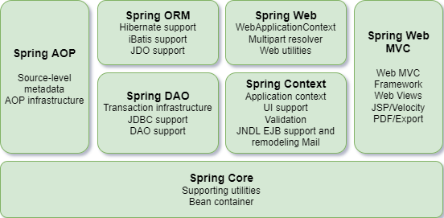
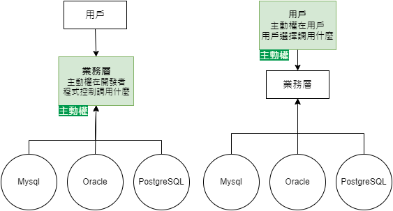

# 3. Spring 5 latest tutorial

## 01. Spring 簡介
+ 2002  interface21 框架
+ 2004  1.0 正式版發布
+ **Rod Johnson** Spring Framework 創始人
+ 理念：使現有的技術更容易使用，整合現有技術框架
    + Servlet API, Web Socket API, 并發實用程序, JSON綁定API, Bean 驗證, JPA, JMS, JTA/JCA 設置
+ SSH: Struct2 + Spring + Hibernate
+ SSM: SpringMVC + Spring + Mybatis 
+ Pros:
    + 開源、免費的框架（容器）
    + 輕量級、非入侵式框架
    + **控制反轉**（IOC）、**切面導向程式設計**/面向切面編程（AOP）
    + 支援事務處理、框架整合
> Spring: a lightweight framework, prominent for Inversion of Control and Aspect Oriented Programming

## 02. Spring 組成及拓展
+ Spring 七大組成


+ Spring: the source for modern Java
    + Spring Boot - build anything
        + 快速開發單個微服務
        + 約定大於配置
    + Spring Cloud - coordinate anything
    + Spring Cloud Data Flow - Connect everything

## 03. IOC 理論推導
1. UserDao 介面 → UserDaoImpl 實現類別 → UserService 業務介面 → UserServiceImpl 業務實現類別
    + Maven pom.xml 導入 spring-core dependency
 ```Java
 public interface UserDao {
    void getUser();
 }
 ```
 ```Java
 public class UserDaoImpl implements UserDao {
    public void getUser() {
        System.out.println("默認獲取用戶的數據");
    }
 }
 ```
 ```Java
 public interface UserService {
    void getUser();
 }
 ```
 ```Java
 public class UserServiceImpl implements UserService {

    //#1 private UserDao userDao = new UserDaoImpl();
    // 如果客戶端要改用 Oracle，因為客戶每次需求，開發者要再重新修改原始碼
    //#2 private UserDao userDao = new UserDaoMysqlImpl();
    
    private UserDao userDao;

    //#3 利用 set 進行動態實現值的注入
    public void setUserDao(UserDao userDao) {
        this.userDao = userDao;
    }

    public void getUser() {
        userDao.getUser();
    }
 }
 ```
 ```Java
 public class MyTest {
     public static void main(String[] args) {

        //用戶實際調用的是業務層，dao層它們不需要接觸
        UserService userService = new UserServiceImpl();

        ((UserServiceImpl) userService).setUserDao(new UserDaoMysqlImpl());
        userService.getUser();
     }
 }
 ```
 ```Java
 public class UserDaoMysqlImpl implements UserDao {
     public void getUser() {
        System.out.println("Mysql獲取用戶數據");
     }
 }
 ```
 + 引入Spring前，用戶需求可能會影響開發原本的代碼，開發需要根據用戶需求修改原始碼，如果程式碼很龐大，修改一次的成本代價十分昂貴
 + 之前，程式碼是主動創建物件，控制權在開發者手上
 + 通過 set 注入，程式不再具有主動性，而是變成了被動的接收物件
 + 程式設計師不用再去管理物件的創建。系統的耦合性大大降低，可以更加專注在業務的實現上。這是 IOC 控制反轉的原型。

 

## 04. IOC 本質
+ 控制反轉 Inversion of Control 是一種設計思想
+ **DI (依賴注入) 是實現 IoC 的一種方法**
+ 沒有 IoC 的程式中，我們使用切面倒向程式設計，物件的創建與物件之間的依賴關係完全硬編碼在程式碼中，物件的創建由程式碼自己控制，控制反轉後將物件的創建轉移給第三方，即獲得依賴物件的方式反轉了

    

+ **IoC 是 Spring 框架的核心內容**，使用多種方式完美的實現了 IoC，可以使用 xml 配置，也可以使用註解，新版本的 Spring 也可以零配置實現 IoC
+ Spring 容器在初始化時先讀取配置文件，根據配置文件或 metadata(元數據) 創建與組織對象存入容器中，程式使用時再從 IoC 容器中取出需要的物件
(`newClassPathXmlApplicationContext.java`)

    

+ 採用 `XML` 方式配置 Bean 的時候，Bean 的**定義訊息**是和**實現**分離的，採用註解的方式可以融和兩者，Bean 的定義訊息直接以註解的形式定義在實現中，從而達到零配置的目的
　
    > **控制反轉是一種通過描述（XML或註釋）並通過第三方去生產或獲取特定對象的方式。在 Spring 中實現控制反轉的是 IoC 容器，實現方法是依賴注入（Dependency Injection, DI）。**


## 05. HelloSpring
+ 主要是透過 `setStr()` 方法進行注入

```Java
public class Hello {
    private String str;
    
    public String getStr() {
        return str;
    }

    public void setStr(String str) {
        this.str = str;
    }

    @Override
    public String toString() {
        return "Hello{" +
               "str='" + str + '\'' +
               '}';
    }
}
```
1. Spring2 `XML` 
    ```xml
    <!-- beans.xml 
    使用 Spring 來創建物件，在 Spring 這些都稱為 Bean 
    bean = 物件   Hello hello = new Hello();
    🎇 id = 變數物件名稱 
    🎇 class = bean 物件所對應的全限定名稱 套件名 + 類別名
    🎇 name = 也是別名，且 name 可以同時取多個別名
    -->
    <!--實例化物件 | 給 Spring 託管-->
    <bean id="hello" class="com.yicelwen.pojo.Hello">
        <property name="str" value="Spring"/>   
        <!--類別的屬性"str" | 新建的物件名稱 Spring -->
    </bean>
    ```
    ```java
    public class MyTest {
        public static void main(String[] args) {
            // 獲取 Spring 的上下文物件  beans.xml → 設定檔的檔名
            ApplicationContext context = new ClassPathXmlApplicationContext("beans.xml");

            // 物件現在都在 Spring 中管理了，要使用的話直接去裡面取出來即可
            Hello hello = (Hello) context.getBean("hello");  // bean id=hello, Object 強制轉型為 Hello 
            System.out.println(hello.toString());
        }
    }
    ```
    ```xml
    <bean id="mysqlImpl" class="com.yicelwen.dao.UserDaoMysqlImpl"/>
    <bean id="oracleImpl" class="com.yicelwen.dao.UserDaoOracleImpl"/>
    
    <bean id="UserServiceImpl" class="com.yicelwen.service.UserServiceImpl">
        <property name="userDao" ref="mysqlImpl"/> <!--用戶變更資料庫,只需要修改 ref 的值-->
    </bean>
        <!--
            ref 標籤: 引用 Spring 容器中已經創建好的物件
            value 標籤: 具體的值，基本資料型別
        -->
    ```


+ 現在要實現不同操作，只需要在 xml 配置文件中進行修改。物件由 Spring 來創建、管理、裝配

    ```java
    public class MyTest {
        public static void main(String[] args) {
            // 獲取 ApplicationContext: 通過 beans.xml 拿到 Spring 容器
            ApplicationContext context = new ClassPathXmlApplicationContext("beans.xml");
            
            // 容器在手，天下我有，需要什麼，就直接 get 什麼
            UserServiceImpl userServiceImpl = (UserServiceImpl) context.getBean("UserServiceImpl");

            userServiceImpl.getUser();
    }
    ```

## 06. IOC 創建對象方式

1. 建一個 POJO (plain old java object)
    + 預設的方法：使用無參數建構子創建對象
    + 有參數建構子
```Java
public class User {
    private String name;

    public void User(){
        System.out.println("User 的無參數建構子")
    }
    public void User(String name){
        this.name = name;
    }
    public String getName(){
        return name;
    }
    public void setName(String name) {
        this.name = name;
    }
    public void show() {
        System.out.println("name=" + name);
    }
}
```
2. 把 User 類別放到 `beans.xml` 配置文件
```xml
<?xml version="1.0" encoding="UTF-8"?>
<beans xmlns="http://www.springframework.org/schema/beans"
       xmlns:xsi="http://www.w3.org/2001/XMLSchema-instance"
       xsi:schemaLocation="http://www.springframework.org/schema/beans
        https://www.springframework.org/schema/beans/spring-beans.xsd">

    <bean id="user" class="com.yicelwen.pojo.User">
        <!--無參建構子: 預設注入方法
            <property name="name" value="arrietty"/>
        -->
        <!--有參建構子#1: 索引賦值
            <constructor-arg index="0" value="Benjamin"/> 
        -->
        <!--有參建構子#2: 通過資料型別類型創建
            <constructor-arg type="java.lang.String" value="radioactive"/>
        -->
        <!--有參建構子#3: 直接通過參數名稱來設置-->
        <constructor-arg name="name" value="xxx"/>
    </bean>


</beans>
```
3. 在 main 方法取得 spring container
```Java
public class MyTest {
    public static void main(String[] args) {
        ApplicationContext context = new ClassPathXmlApplicationContext("beans.xml");
        
        User user = (User) context.getBean("user");
        user.show();  // name=arrietty | Benjamin | raioactive | xxx 
    }
}
```
> **小結**：在配置文件加載的時候，容器中管理的物件就已經初始化了


## 07. Spring 配置說明
+ 別名 `<alias>`
    ```XML
    <!--別名，如果加了別名，我們也可以使用別名獲取到這個物件-->
    <alias name="user" alias="userSansa"/>
    ```
+ Bean 的配置
    ```xml
    <!--
        id: bean 的唯一標識符，相當於物件名稱
        class: bean 物件對應的全限定名 (package + class name)
        name: 也是別名，可以用, | ; 區分多個別名
    -->
    <bean id="userTwo" class="com.yicelwen.pojo.UserTwo" name="user1,u2,u3;u4">
        <property name="name" value="HippyHooray"/>
    </bean>
    ```
+ `import`
    + 一般用於團隊開發使用，可以將多個配置文件，導入合併為同一個
    + 假設目前項目有多個成員開發，mem1~mem3要複製不同的類開發，不同類別需要註冊在不同的 bean 中，可以用 import 將所有人的 bean.xml 合併為一個總配置
        + Angela, Benji, Carlos 各自的 xml
        + `applicationContext.xml`
            使用的時候直接用總配置就可以了
            ```xml
            <beans ......>
                <import resource="angelabean.xml"/>
                <import resource="benjibean.xml"/>
                <import resource="carlosbean.xml"/>
            </beans>
            ```

## 08. DI 依賴注入環境
+ 建構子注入
+ 拓展方式注入 (引入其它約束)

## 09. 依賴注入 - Set 注入
+ `set`方式注入 (本節重點)
    + 依賴注入本質是 set 注入
        + 依賴：bean 物件的創建依賴於容器
        + 注入：bean 物件中的所有屬性由容器來注入
    + 【環境搭建】
        1. 複雜類型
            ```Java
            @Getter
            @Setter
            public class Address {
                private String address;

                @Override
                public String toString() {
                    return "Address{" +
                            "address='" + address + '\'' +
                            '}';
                }
            }
                
             
            ```
        2. 真實測試物件
            ```Java
            @Getter 
            @Setter
            public class Student {
                private String name;     //value
                private Address address; //ref 賦值
                private String[] books;        
                private List<Student> hobby;     // list
                private Map<String,String> card; // map
                private Set<String> games;       // set
                private String friend;           // null
                private Properties info;         // props

                @Override
                public String toString() {
                    return "Student{" +
                           "name='" + name + '\'' +
                           ", address=" + address.toString() +
                           ", books=" + Arrays.toString(books) +
                           ", hobbys=" + hobbys +
                           ", card=" + card +
                           ", games=" + games +
                           ", friend='" + friend + '\'' +
                           ", info=" + info +
                           '}';
                }
            }
            ```
        3. 注入值到 Student @ `beans.xml`
            ```xml
            <bean id="student" class="com.yicelwen.pojo.Student">
                <!-- 第一種: 普通值注入，直接使用 value -->
                <property name="name" value="arrietty"/>
                <!-- 第二種: bean 注入，使用 ref -->
                <property name="card" ref="address">
                <!--Array 陣列注入: ref-->
                <property name="books">
                    <array>
                        <value>A song of ice and fire</value>
                        <value>A clash of kings</value>
                        <value>A storm of swords</value>
                    </array>
                </property>

                <!-- List -->
                <property name="hobbies">
                    <list>
                        <value>read</value>
                        <value>code</value>
                        <value>swim</value>
                    </list>
                </property>

                <!-- Map -->
                <property name="card">
                    <map>
                        <entry key="學生證" value="12345"/>
                        <entry key="健保卡" value="1234"/>
                        <entry key="借書證" value="123"/>
                    </map>
                </property>

                <!-- Set -->
                <property name="games">
                    <set>
                        <value>The Gift</value>
                        <value>Minecraft</value>
                        <value>Magic Awakened</value>
                    </set>
                </property>

                <!--  空值注入: 字符串的寫法
                      <property name = "name" value=""/>
                      相當於 Student.setName("");  -->

                <!-- NUL 值注入 -->
                <property name="friend">
                    <null/>
                </property>

                <!--Properties-->
                <property name="info">
                    <props>
                        <prop key="driver">20220630</prop>
                        <prop key="url">男</prop>
                        <prop key="username">小明</prop>
                        <prop key="password">123</prop>
                    </props>
                </property>
            </bean>
            ```

        4. 測試類別
            ```Java
            public class MyTest {
                public static void main(String[] args) {
                    ApplicationContext context = new ClassPathXmlApplicationContext("beans.xml");
                    Student student = (Student) context.getBean("student");
                    System.out.println(student.toString());
                }
            }
            ```

## 09. RequestMapping 說明

## 10. c命名和 p命名空間注入

## 11. Bean 的作用域

## 12. 自動裝配 Bean

## 13. 註解實現自動裝配

## 14. Spring 註解開發

## 15. 使用 JavaConfig 實現配置

## 16. Throwback

## 17. 靜態代理模式

## 18. 靜態代理 再理解

## 19. 動態代理

## 20. AOP 實現方式一

## 21. AOP 實現方式二

## 22. 註解實現 AOP

## 23. 回顧 Mybatis

## 24. 整合 Mybatis 方式一

## 25. 整合 Mybatis 方式二

## 26. 事務回顧

## 27. Spring 聲明式事務

## 28. Conclusion


# 4. Spring MVC latest tutorial 🧩
## 01. 學習方法說明

## 02. 回顧 MVC 架構

## 03. 回顧 Servlet

## 04. 初識 SpringMVC

## 05. SpringMVC 執行原理

## 06. 深入 SpringMVC 學習

## 07. 使用註解開發 SpringMVC

## 08. Controller 配置總結

## 09. RequestMapping 說明

## 10. RestFul 風格講解

## 11. 重定向和轉發

## 12. 接收請求參數以及數據回顯

## 13. 亂碼問題解決

## 14. 什麼 JSON

## 15. Jackson 使用

## 16. Fastjson 使用

## 17. ssm 整合：Mybatis 層

## 18. ssm 整合：Spring 層

## 19. ssm 整合：SpringMVC 層

## 20. ssm 整合：查詢書籍功能

## 21. ssm 整合：添加書籍功能

## 22. ssm 整合：修改刪除功能

## 23. ssm 整合：新增搜索功能

## 24. Ajax 1<sup>st</sup> 體驗

## 25. Ajax 異步加載數據

## 26. Ajax 驗證用戶名體驗

## 27. 攔截器是什麼

## 28. 登錄判斷驗證

## 29. 文件上傳和下載回顧

## 30. Conclusion


<br/>

# 5. Spring Boot 🧩

## 

<br/>