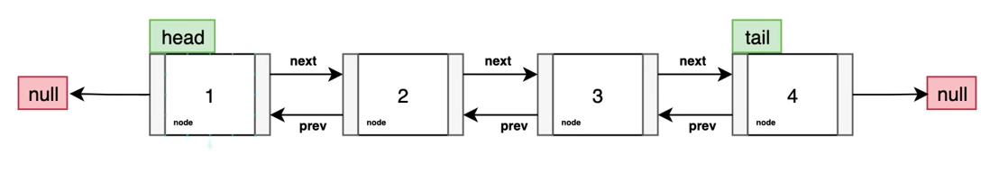
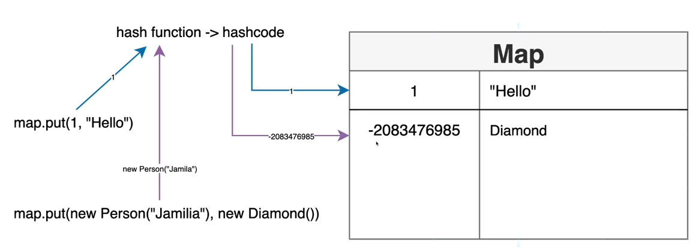

# Java Data Structures (part 1)
###### Array, List, Stack, Queue, Set, Map `included`
###### Binary tree, heaps, etc. `not included`
### Array - a list of bucket where you define the size
+  Fixed in size
+  Fast for data retreivals
+  Compact memory usage is size is known
+  Deleting operation is very hard
   need to shuffle others forward
+  2D arrays
```JAVA
class WithArrays {
    public static void main (String[] args){
	String[] color = new String[5];
	colors[0] = "purple";
	colors[1] = "blue";

	System.out.println(Arrays.toString(colors));
	System.out.println(colors[0]);
	System.out.println(colors[1]);
	System.out.println(colors[2]);
	for [int i = 0; i < colors.length; i++) {
    	System.out.println(colors[i]);
}

	for (int i = colors.length -1; i >= 0; i--) {
			System.out.println(colors[i]);
}

	for (String color : colors) {
		System.out.println(color);
	}
	}
}
```
Tic-Tac-Toe <br>
0,0	|	0,1	|	0,2 <br>
1,0	|	1,1	|	1,2 <br>
2,0	|	2,1	|	2,2
```JAVA
class WithArrays2 {
    public static void main (String[] args){
	char[][] board = new char[3][3];
	for(int i=0; i<3; i++){
		for (int j=0; j<3; j++{
		board[i][j] = '-';
		}
}
	//使用 nested loop 以外的方式填入 '-' 符號
	char[][] boardTwo = new char[] {
		new char[] {'-','-','-'},
		new char[] {'-','-','-'},
		new char[] {'-','-','-'}
		};
	}
}
```
[[-,-,-],[-,-,-],[-,-,-]]

### List
+ An ordered collection aka sequence.
+ Allow duplicates
+ Not fixed in size like arrays
+ Fast for data retrivals
+ Various implementation
	+ ArrayList
	+ Stack
	+ Vector
	+ Others
```JAVA
class WithList {
	public static void main(String[] args) {
		List<String> colors = new ArrayList<>();
		colors.add("blue");
		colors.add("purple");
		System.out.println(colors.size());
		System.out.println(colors.contains("blue"));  // true
		System.out.println(colors.contains("pink"));  // false
		// colors.add(1);
		// colors.add(new Object());

		for (String color : colors) {
			System.out.println(color);
		}

		colors.forEach(System.out::println);

		for (int i = 0; i < colors.size(); i++) {
			System.out.println(color);
		}
	}
}
```
1. 使用 for : loop
2. 使用 forEach<br>
colors.forEach(System.out::println);
3. 使用傳統 for i loop

List<E>  Generics<br>
ArrayList : one of the implementations of List interface<br>
預設有 10 個空位

List<E> = new ArrayList<E>();<br>
前面通常寫list inferace  =  後面寫實作的類別 (eg. LinkedList, ArrayList,etc)<br>
90% 都是用 ArrayList

```JAVA
class WithList2 {
	public static void main(String[] args) {
		List<String> colorsUn = List.of(
			"hola",
			"hallo",
			"konichiwa");
		}
}
// 這是不能增加修改的 list (immutable)
```

### Stack
+ The stack class represent a LAST-IN-FIRST-OUT(LIFO) stack of objects.
+ It extends class *Vector* with five operations that allow a vector to be treated as a stack.
+ The usual *push* and *pop* operations are provided,
	as well as a method to *peek* at the top item on the stack,<br>
	a method to test for whether the stack is *empty*, and a method<br>
	to *search* the stack for an item and and discover how far it is from the top.
```JAVA
class WithStack {
	public static void main(String[] args) {
		Stack<Integer> stack = new Stack<>();
		stack.push(1);
		stack.push(2);
		stack.push(3);
		System.out.println(stack.peek());    // give you an element on the top of the stack (3)
		System.out.println(stack.size());    // 3
		System.out.println(stack.pop());    // not only gives you .peek element, but also removes it
		System.out.println(stack.empty());    // return boolean value 
		System.out.println(stack.search(3));
	}
}
// List 的 add 方法相當於 Stack 的 push 方法
```

### Queue
FIRST-IN-FIRST-OUT (FIFO)
+ A collection designed for holding elements prior to processing.<br>
	tail <===> head
```Java
class WithQueue{
	public static void main(String[] args){
		Queue<Person> supermarket = new LinkedList<Person>();
        supermarket.add(new Person("Alex, 21));
		supermarket.add(new Person("Mariam, 40));
		supermarket.add(new Person("Ali, 33));
	
		supermarket.size());	// 3
		supermarket.peek());  //Alex
		supermarket.poll());  //Alex (poll==peek+remove; 如果無值則回傳null
		supermarket.size());	// 2
		supermarket.peek());  //Mariam
	}
	static record Person(String name, int age){}
}
```
**LinkedList**



```Java
class WithLinkedList {
	public static void main(String[] args) {
		LinkedList<Person> linkedList = new LinkedList<>();
		linkedList.add(new Person("Alex", 21));
		linkedList.add(new Person("Benji", 29));
		linkedList.
				ListIterator<Person> personListIterator = linkedList.listIterator();
		while (personListIterator.hasNext()) {
			System.out.println(personListIterator.next());
		}    // loop 

		while (personListIterator.hasPrevious()) {
			System.out.println(personListIterator.previous());
		}    // reverse loop

	}

	static record Person(String name, int age) {
	}
}
```

### Set
+ A collection that contains no duplicate elements. (不可重複)
+ More formally, sets contain no pair of elements e1 and e2 such that e1.equals(e2), and at most one null element.
+ As implied by its name, this interface models the mathematical set abstraction.
	+ HashSet
	+ TreeSet
	+ EnumSet
	+ et cetera....

```Java
class WithSet {
	public static void main(String[] args) {
		Set<Ball> balls = new HashSet<>();
		balls.add(new Ball("blue"));
		balls.add(new Ball("blue"));       //
		balls.add(new Ball("yellow"));
		balls.add(new Ball("red"));
		balls.remove(new Ball("red"));
		balls.forEach(System.out::println);
		// print out not-quaranteed order
		System.out.println(balls.size());  // 3. as duplicate blues not approved
	}

	record Ball(String color) {
	}
}
```

### Map
+ HashTable: Null not allowed, synchronized
+ HashMap: Null allowed
    + LinkedHashMap: Null Allowed, doubly linked-listed based impl, slow
+ SortedMap
    + NavigableMap
    + TreeMap: Sorted, null not allowed
1. A map cannot contain duplicate keys.
2. Each key can map to at most one value. 
   1. Hash function: mapping an object to its integer value.



```JAVA
public class WorkingWithMaps {
	public static void main(String[] args) {
        Map<Person, Diamond> map = new HashMap<>();
        map.out(new Person("Jamila"), new Diamond("African Diamond"));

		System.out.println(new Person("Jamila").hashCode()); // -2083476985
        System.out.println(new Person("Jamila").hashCode()); // -2083476985
        System.out.println(map.get(new Person("Jamila")));
	}
    private static void maps() {
        Map<Integer, Person> map = new HashMap<>();
        map.put(1, new Person("Alex"));
        map.put(2, new Person("Alexa"));
        map.put(3, new Person("Mariam"));
        System.out.println(map);
        System.out.println(map.size());  // 3
		System.out.println(map.get(1));  // Person[name=Alex]
		System.out.println(map.containsKey(4)); //False
		System.out.println(map.keySet());
        System.out.println(map.entrySet());
        map.remove(3);
        map.entrySet()
				.forEach(x -> System.out.println(x.getKey() + " " + x.getValue()));
        map.forEach((key, person) -> {System.out.println(key + "-" + person);});
		map.computIfAbsent();
        System.out.println(map.getOrDefault(3, new Person("default")));
        System.out.println(map.values());
    }
    
	class Person {
        String name;
        public Persion(String name){
            this.name = name;
		}
        
        public String toString() {
            return "Person{" +
					"name='" + name + '\'' + '}';
		}
        
		@Override
        public boolean equal(Object o){
            if (this == 0) return true;
            if (o == null || getClass() != o.getClass()) return false;
            Person person = (Person) o;
            return Objects.equals(name, person.name);
            
		}
		
		// 如果沒有寫這一行的話, 同一個值不同次會回傳不同 hashcode 
		@Override
        public int hashCode(){
            return Objects.has(name);
		}
	}
	record Diamond(String name) {}
}
```


