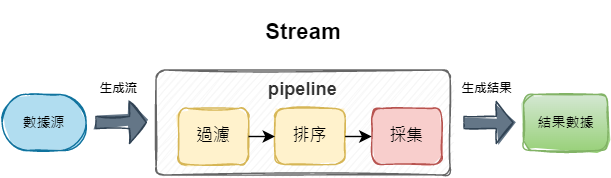

## 0. H2 DB

## 1. Restful API

## 2. Cache
+ cache last time 60 seconds
+ 如果有 cache 則回傳 cache, 沒cache的話, 重新查詢後更新 cache 並回傳
+ edit 方法完成更新 cache
+ remove/delete方法完成時清除 cache

### `@CacheConfig`
+ `@CacheConfig` 是類級別的註解，統一該類的所有緩存可以前綴
```Java
@CacheConfig(cacheNames = {"user"})
public class UserService {
    private static final Logger LOGGER = LoggerFactory.getLogger(UserService.class);

    @Autowired
    private UserMapper userMapper;

    @Cacheable(key="#id")
    public User findUserById(Integer id) {
        return this.userMapper.selectByPrimaryKey(id);
    }
}
```
+ 以上代碼，代表了該類別所有緩存可以都是"user::"為前綴

### `@Cacheable`
+ `@Cacheable`是方法級別的註解，用於將方法的結果緩存起來

## 3. Transactional propagation
+ update two tables at a time, rollback in case of any exception
+ update two tables at a time , any exception wouldn't effect the operation done earlier

## 4. AOP
+ LoggerAspect `@Before`
+ LoggerAspect `@After`
+ LoggerAspect `@Around`
+ Logger.info start-finish time to complete each method in controller

## 5. Security
+ Need to enter key(Authentication) + value(Crypted_password) to access
+ `String` to Base64
+ `byte[]` to Base64
+ Decrypt Base64 and print out lengh of the byte[]
+ Commonly used encrypt/decrypt methods in business application and the Algorithms covered

## 6. Scheduler 
+ To calculate how many books stored in Book table and printed result on the console.

## 7. Request Validator
+ All params are mandatory/required to fill in, except for the Updating method.
+ `@Validator` and RegexExConst
    + [a-zA-Z0-9]{0,100}
    + [a-zA-Z]{0,50}
    + yyyyMMdd versus yyyy-MM-dd PATTERN

## 8.  sortByOrder
+ To sort by ORDER of book length, author AtoZ, date newToOld

## 9. Lambda 
+ concept, how to use
+ pros/benefits
+ under what conditions one can use the Lambda 
+ some sample code for comparision 
---
+ Lambda 簡介：
    + Lambda 表達式，又稱為閉包，是 Java 8 最重要的新特性
    + Lambda 允許把函數作為一個方法的參數（函數作為參數傳遞到其它方法中）
    + Lambda 表達式可以使代碼更加簡潔緊湊
    + 在 JS 非常常見
        ```javascript
        function myFunction(){
            console.log("halo welt")
        }
        myFunction2(myFunction);

        function myFunction2(fun){
            fun.apply();  // 調用 myFunction code
        }
        ```
    + 比較一般寫法 vs Lambda，以執行緒為例
        ```Java
        public static void main(String[] args) {
            // 執行緒
            new Thread(new Runnable(){
                @Override
                public void run() {
                    System.out.println("Hello yicelwen.");
                }
            });

            /* ALT + ENTER - IDEA 自動建議改成 lambda 匿名內部類寫法
               順序: 先執行 Thread，再執行sout函數 */
            new Thread(() -> System.out.println("Hello yicelwen."));
        }
        ```
    + 函數式介面 `@FunctionalInterface`

        ```Java
        public class SimpleLambda {
            public static void main(String[] args) {
                start(() -> System.out.println("hello"));
            }

            public static void start(myRun2 run2){
                new Thread(run2).start();
            }

            /* lambda expr 表達式對應的介面只能有一個方法
                因為 Runnable 本身有一個 run方法 + 此介面的 run2
                所以呼叫時不能用 lambda expr 調用 myRun2

                函數式介面
                1. 只有一個方法的介面
                2. 介面上標註 @FunctionalInterface 有檢查功能
                3. 默認方法除外 (有 default 修飾的方法)
                4. Object下面的方法 (例如 toString & equals) 也除外
            */
            @FunctionalInterface
            public interface myRun2 extends Runnable {
                // public void run2();
                public default void run2() {
                }
                String toString();
                boolean equals(Object obj);
            }
        }
        ```
    + Lambda 語法
        ```Java
        public class SimpleLambda {
            // 1. 前置條件: 必須是函數式介面
            // 2. 參數的傳遞
            // 3. 代碼的編寫方式
            // 4. 方法引用
            public static void main(String[] args) {
                // 2-1 傳遞參數可以忽略資料型別
                run(((name, age) -> String.format("name:%s age:%s", name,age)));
                // 2-2 只有一個參數的話可以省略括號
                hashiru(name -> String.format("name:%s", name));
                /* Coding Features:
                   3-1 單行表達式 - 省略掉 return
                   3-2 代碼塊 - 可以多行，需要 return
                 */
                hashiru((name -> "name:"+name));
                hashiru((name -> {
                    String name1 = name;
                    return "name:" + name1;
                }));
                hashiru(SimpleLambda::doFormat1);        // 4-1 靜態方法引用
                hashiru(new SimpleLambda()::doFormat2);  // 4-2 普通方法引用
            }

            public static String doFormat1(String param2){
                return "name" + param2;
            }
            public String doFormat2(String param2){
                return "name" + param2;
            }

            public static void run(Format1 format1){
                format1.run1("yicelwen", 18);
            }
            public interface Format1 {
                String run1(String name, int age);
            }
            public static void hashiru(Format2 format2){
                format2.run2("yicelwen");
            }
            public interface Format2 {
                String run2(String name);
            }
        }
        ```

## 10. Stream
+ from Collection to Stream
---
+ stream 實現對集合迭代器的增強（過濾、排序、統計分組）或者大批量的數據操作
+ 提高可讀性以及效率: 與 Lambda 一起使用

```java
import org.junit.Test;
import src.main.java.com.stream.demo.po.Apple;

import java.util.ArrayList;
import java.util.HashMap;
import java.util.List;
import java.util.Map;
import java.util.function.Predicate;
import java.util.stream.Collectors;

public class AppleServer {
    private static List<Apple> appleStore = new ArrayList<Apple>();

    static {
        appleStore.add(new Apple(1, "red", 500, "Fuji"));
        appleStore.add(new Apple(2, "red", 400, "Fuji"));       
        appleStore.add(new Apple(3, "green", 300, "Aomori"));
        appleStore.add(new Apple(4, "green", 200, "Washington"));
        appleStore.add(new Apple(5, "green", 100, "NewYork"));
    }
    

    // find red apple
    public void filterForLoop(){
        List<Apple> redApple = new ArrayList<Apple>();
        for (Apple apple : appleStore) {
            if (apple.getColor().equals("red")){
                redApple.add(apple);
            }
            // if - determine weight
            // if - determine origin
        }
    }

    // find red apple using stream and lambda
    public void filterLambda(){
        List<Apple> redApple = appleStore.stream()
                .filter(a -> a.getColor().equals("red"))
                .filter(a -> a.getWeight()>300)
                .filter(a -> a.getOrigin().equals("Aomori"))
                .collect(Collectors.toList());
    }

    // use predicate as parameter for filtering
    public void filterLambda(Predicate<? super Apple> pr){
        List<Apple> list = appleStore.stream()
                .filter(pr)
                .collect(Collectors.toList());
    }

    // find average weight of each color
    @Test
    public void test1() {
        // #1 group by color
        Map<String, List<Apple>> maps = new HashMap<>();
        for (Apple apple : appleStore) {
            List<Apple> apples = maps.computeIfAbsent(apple.getColor(),
                    key -> new ArrayList<>());
            // 如果該顏色對應的 key 不存在,就創建一個
            // IDEA 一段code.var - 相當於 Eclipse shift + alt + L 指派變數名
            // IDEA 一個變數.for - 快速生成一個 for 迭代迴圈
            apples.add(apple);
        }
        // #2 get average weight of each color
        for (Map.Entry<String, List<Apple>> entry : maps.entrySet()) {
            int weights = 0;
            for (Apple apple : entry.getValue()) {
                weights += apple.getWeight();
            }
            System.out.println(String.format("顏色%s 平均重量%s", weights / entry.getValue().size()));
            // IDEA 一段code.sout - syso + ALT + / 不過 IDEA 先寫要印出的內容
            // "(一段String)".format - 生成String.format(expr)
        }
    }

    // find average weight of each color USE STREAM API
    @Test
    public void test2() {
        // Map<String, List<Apple>> maps = appleStore.stream().collect(Collectors.groupingBy(a -> a.getColor()));
        appleStore.stream()
                .collect(Collectors.groupingBy(a -> a.getColor(),       // 基於顏色統計分組
                         Collectors.averagingInt(a -> a.getWeight())))  // 根據統計分組求出重量平均值
                .forEach((k,v)-> System.out.println(k+":"+v));          // 印出來
    }

    public static void main(String[] args) {
        new AppleServer().filterLambda(a->a.getColor().equals("red")&&a.getWeight()>300);
        // a-> 的 a 即為lambda，只是個代號，可用 b,c,d...代替
    }
}
```
```java
import lombok.AllArgsConstructor;
import lombok.Data;
import lombok.NoArgsConstructor;

@Data
@AllArgsConstructor
@NoArgsConstructor
public class Apple {
    private int id;
    private String color;
    private int weight;
    private String origin;
}
```

### stream 產生背景
+ `獲取所有紅色蘋果總重量`，用 SQL 非常好實現，怎麼不直接在DB實現?
    ```SQL
    -- 獲取所有紅色蘋果的總重量
    SELECT SUM(a.weight) FROM APPLE AS a WHERE a.color='red'
    -- 基於顏色分組統計重量
    SELECT a.color,SUM(a.weight) FROM APPLE AS a GROUP BY color;
    ```
    + 跨庫 join 的問題
        + 在傳統單一個DB中，order table 與 member table 可透過 join 關聯實現
        + 但在分布場景中，order table 存在 Transaction DB，而 member 存在 Member DB，不能用 join，只能在 Server 端利用 Stream API 實現以下流程
            1. 查詢訂單表數據
            2. 找出訂單中所有會員的 ID
            3. 根據會員 ID 查詢會員資料
            4. 合併訂單數據與會員數據
        ```java
        // 獲取所有會員 ID 並去重
        List<Integer> ids = orders.stream().map(o -> o.getMemberId()).distinct().collect(Collectors.toList());

        // 合併會員訊息到訂單訊息
        orders.stream().forEach(0 -> {
            Member member = members.stream().filter(m -> m.getId() == o.getMemberId()).findAny().get();
            o.setMemberName(member.getName());
            });
        ```
### Stream 執行機制


### Stream 流操作特性
1. stream 不存儲數據
2. stream 不改變源數據 
3. stream 不可重複使用 
    + 用完後就直接消失了
        + 以上圖為例, filter後產生的流 (**作廢**) 
            + filter().排序() 產生的流 (**也作廢**)
                + 最後生成 filter().排序().collect() 
```java
public class AppleServer {
    private static List<Apple> appleStore = new ArrayList<Apple>();
    static {
        appleStore.add(new Apple(1, "red", 500, "Fuji"));
        appleStore.add(new Apple(2, "red", 400, "Fuji"));
        appleStore.add(new Apple(3, "green", 300, "Aomori"));
        appleStore.add(new Apple(4, "green", 200, "Washington"));
        appleStore.add(new Apple(5, "green", 100, "NewYork"));
    }
        // 1. Stream 生成 與不可重複使用
    public static void main(String[] args) {
        // 生成stream方式#1  appleStore.stream();
        // 生成stream方式#2  Arrays.stream(new int[]{1,2,3});
        // 生成stream方式#3  Stream.of(1,2,3,4);

        /* 這樣寫是 illegalStateException - stream has already been operated upon or closed.
            Stream<Apple> stream1 = appleStore.stream();
            Stream<Apple> stream2 = stream1.filter(apple -> apple.getColor().equals("red"));
            Stream<Apple> stream3 = stream1.filter(apple -> apple.getWeight() > 100);
         */

        // 顏色 重量 * 5
        appleStore.stream().peek(a-> System.out.println(a.getColor()))
                .peek(a-> System.out.println(a.getWeight()))
                .toArray();
        /* .stream() & .filter() - 中間節點 aka. 懶節點
         *      + 中間節點可以有多個
         *      + 懶節點: 加進去之後並不會立刻執行
         * .toArray - 終值節點, 只能有一個, 只能放最後面 */

        // 上個節點,可以影響下一個節點
        // 影響方式#1. 過濾 filter
        appleStore.stream()
                .filter(a->a.getColor().equals("red"))
                .peek(a-> System.out.println(a.getColor()+":"+a.getWeight()))
                .toArray();

        // 影響方式#2. 轉換 map (apple類型轉成color)
        appleStore.stream()
                .filter(a->a.getColor().equals("red"))
                .map(a->a.getColor())
                .peek(color-> System.out.println(color))
                .toArray();

        // 影響方式#3. 去除重複 distinct
        // IDEA: to set a breakpoint for debugger Ctrl + Fn(筆電) + F8
        appleStore.stream()
                .filter(a->a.getColor().equals("red")||a.getColor().equals("green"))
                .map(a->a.getColor())
                .distinct()  
                .peek(color-> System.out.println(color))
                .toArray();
        
    }
}
```
+ 區分中間節點跟終值節點 可以去 Stream<T> interface 看
    + 中間節點: 返回值為新的 `Stream<T>` 
    + 終值節點: 返回 Object[], Model<T>, Optional<T>, long 等等

## 11. GitLab
+ To understand how the reasons to use `rebase`
+ `cherry pick`
+ To use `no fast-forward merge` to merge git_Sample into my own branch and then solve merging conflicts
+ To compare fast-forward merge and no fast-forward merge

