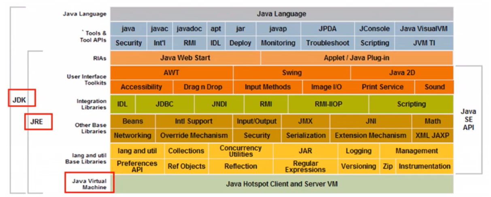
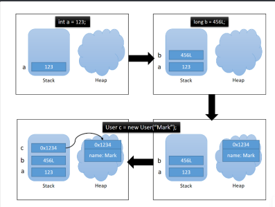
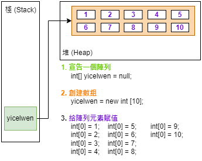

# 4. Spring 5 latest tutorial
## 01. Spring 簡介
## 02. Spring 組成及拓展
## 03. IOC 理論推導
## 04. IOC 本質
## 05. HelloSpring
## 06. IOC 創建對象方式
## 07. Spring 配置說明
## 08. DI 依賴注入環境
## 09. RequestMapping 說明
## 10. RestFul 風格講解
## 11. 重定向和轉發
## 12. 接收請求參數以及數據回顯
## 13. 亂碼問題解決
## 14. 什麼 JSON
## 15. Jackson 使用
## 16. Fastjson 使用
## 17. ssm 整合：Mybatis 層
## 18. ssm 整合：Spring 層
## 19. ssm 整合：SpringMVC 層
## 20. AOP 實現方式一
## 21. AOP 實現方式二
## 22. 註解實現 AOP
## 23. 回顧 Mybatis
## 24. 整合 Mybatis 方式一
## 25. 整合 Mybatis 方式二
## 26. 事務回顧
## 27. Spring 聲明式事務
## 28. Conclusion


# 3. Spring MVC latest tutorial
## 01. 學習方法說明
## 02. 回顧 MVC 架構
## 03. 回顧 Servlet
## 04. 初識 SpringMVC
## 05. SpringMVC 執行原理
## 06. 深入 SpringMVC 學習
## 07. 使用註解開發 SpringMVC
## 08. Controller 配置總結
## 09. RequestMapping 說明
## 10. RestFul 風格講解
## 11. 重定向和轉發
## 12. 接收請求參數以及數據回顯
## 13. 亂碼問題解決
## 14. 什麼 JSON
## 15. Jackson 使用
## 16. Fastjson 使用
## 17. ssm 整合：Mybatis 層
## 18. ssm 整合：Spring 層
## 19. ssm 整合：SpringMVC 層
## 20. ssm 整合：查詢書籍功能
## 21. ssm 整合：添加書籍功能
## 22. ssm 整合：修改刪除功能
## 23. ssm 整合：新增搜索功能
## 24. Ajax 1<sup>st</sup> 體驗
## 25. Ajax 異步加載數據
## 26. Ajax 驗證用戶名體驗
## 27. 攔截器是什麼
## 28. 登錄判斷驗證
## 29. 文件上傳和下載回顧
## 30. Conclusion

<br/>

# 2. JavaWeb 入門到實戰
## javaweb-01. web 基本概念
## javaweb-02. web Server 服務器講解
## javaweb-03. Tomcat
## javaweb-04. Http
## javaweb-05. Maven 環境搭建
## javaweb-06. IDEA 中 Maven 操作
## javaweb-07. 疑難雜症解決
## javaweb-08. HelloServlet
## javaweb-09. Servlet 原理
## javaweb-10. ServletContext 對象
## javaweb-11. ServletContext 應用
## javaweb-12. Response 下載文件
## javaweb-13. Response 驗證碼實現
## javaweb-14. Response 重定向
## javaweb-15. Request 應用
## javaweb-16. Cookie 講解
## javaweb-17. Session 講解
## javaweb-18. JSP 原理剖析
## javaweb-19. JSP 基礎與法和指令
## javaweb-20. JSP 內置對象及作用域
## javaweb-21. JSP、JSTL 標籤
## javaweb-22. JavaBean 與作業
## javaweb-23. MVC 三層架構
## javaweb-24. 過濾器 filter
## javaweb-25. 監聽器
## javaweb-26. 監聽器 GUI 中理解
## javaweb-27. Filter 實現權限攔截
## javaweb-28. JDBC 複習
## javaweb-29. JDBC 事務
## javaweb-30. smbms 項目搭建
## javaweb-31. smbms 登錄流程實現
## javaweb-32. smbms 註銷以及權限過濾
## javaweb-33. smbms 密碼修改實現
## javaweb-34. Ajax 驗證舊密碼實現
## javaweb-35. smbms 用戶管理底層實現
## javaweb-36. smbms 用戶管理分頁 OK
## javaweb-37. smbms 架構分析及方法學習
## javaweb-38. 文件傳輸原理及介紹
## javaweb-39. 文件上傳級拓展雞湯 (?WTF)
## javaweb-40. 郵件發送原理及實現
## javaweb-41. 網站註冊發送郵件實現
## javaweb-42. 之後要怎麼持續學習 (sea of knowledge)
 

 <br/>

# 1. Java 零基礎學習
+ SSM : Git, Mybatis, Spring, Spring MVC

+ Linux: 大型物聯網服務 - Nginx, Docker, Redis

+ SpringBoot✨: 基礎、持久層、SpringWeb開發
    + SpringBoot、Dubbo + Zookeeper 分布式開發

+ Spring Cloud✨: 
    + 微服務以及微服務架構 | Eureka 服務註冊與發現 | Feign, Ribbon 負載均衡
    + Hystrix 熔斷機制 | Zuul 路由網關 | SpringCloud Config 配置中心

+ Hadoop✨: 
    + 大數據時代 | Hadoop 簡介 | Hadoop 環境搭建 | HDFS 
    + MapReduce | Yarn | Hive | Hbase

+ **多寫**（代碼 | 筆記 | 文章）、**多練**（交流 | 思維 | 技能）
---
+ 高效學習
    + 多分享（知識）、多提問（如何解決bug）、多思考（為什麼用這個方法）、***堅持***✨

        > 每個 `NB` 人物背後都有段 `苦B` 的歲月，只要像 `SB` 一樣的堅持，終將NB
---
+ 常用 DOS 命令
    + 查看當前目錄下的所有文件  `dir`
    + 切換目錄   `cd change directory`
---
+ Java 
    + 語法有點像 `C`
        + 沒有指針
        + 沒有內存管理
    + 編寫一次，到處運行
    + 面向對象
    + 類型安全
    + 高質量的類庫
    + Java 三大版本
        
        + Java 標準版 (SE) 佔領桌面   
        + Java移動版 (ME) 佔領手機
        + 企業版 (EE) 佔領服務器 `Server`

            |JavaSE|JavaME|JavaEE|
            |------|------|------|
            |標準版<br/>(桌面程序、控制台開發...)|嵌入式開發 (手機、小家電) <br/> **(XX 鮮少使用)**| E 企業級開發 (web 端、服務器開發) <br/> **(最廣泛)**|

    + 發展
        + 構建工具：ANT, Maven, Jenkins
        + 應用服務器：Tomcat, Jetty, Jboss, Websphere, weblogic
        + Web 開發：Struts, Spring, Hibernate, myBatis
        + 開發工具：Eclipse, Netbean, Intellij idea, Jbuilder
            > Ruby 結合 PHP + Java 適合快速開發 、不適合大型外部系統開發 
        + 2006: Hadoop (大數據領域)
        + 2008: Android (手機端)
    + 特性
        + 簡單：C++ 純淨版 沒指針運算，不用分配內存，語法基於 C
        + 面向對象：模擬人的思維寫程式 `物件皆對象`
        + 可移植性：跨平台 `Write once, run anywhere.` (透過 JVM 實現此特性)
        + 高性能：即時編譯
        + 分布式：適合網路分布式環境 (URL)，支援遠程方法調用
        + 動態性：通過**反射機制**達成動態性
        + 多線程：multi-thread
        + 安全性：可構建防病毒防竄改功能
        + 健狀性：每次運行時都會內存進行檢查，異常處理/捕獲異常
    + JDK
        + JDK (Java Development Kit):
            + javadoc 生成文檔、jar、java、javac etc.
        + JRE (Java Runtime Library):
        + JVM (Java virtual machine):
            + 解釋型 | 編譯型
            + 實現`一次編譯到處運行`的核心

        
    + 卸載 `JDK`
        1. 找到/刪除 JDK 安裝的目錄 
        2. 刪除 JAVA_HOME
        3. 刪除 path 下關於 java 的目錄
        4. 打開 dos CMD，輸入 `java -version`
    + 安裝 `JDK`
        1. JDK-11 記住安裝的路徑
        2. 配置環境變量 
        3. 配置 path 變量
    + HelloWorld
        1. 建個文件夾放 `Hello.java`
        2. 打開此文件，編寫
            ```java
            public class Hello {
                public static void main(String[] args){
                    System.out.print("Hello World!");
                }
            }
            ```
        3. 編譯 `javac` java 文件，會生成 class
            ```cmd
            C:\users\yiwen\document\DummyCode> javac Hello.java
            ```
            > 編譯成一個同名 `Hello.class`字節碼
        4. 運行 class 文件， `java` class文件
            ```cmd
            C:\users\yiwen\document\DummyCode> java Hello
            ```
    + 程式運行機制：
        + 編譯型 compile -- 執行速度比較快
        + 解釋型 -- 寫一行編一行

## b1. 註釋： 寫注釋是非常重要的習慣  
```java
// test1  single line remark

/*
test2 multiple-line remarks
test2-1
*/

/**
* remarks for java 
* @Params
* @Author
**/
```
## b2. 標識符：
|👩🏻‍💻|👩🏻‍🎓|👩🏻‍🎤|🕵🏻‍♀️|👩🏻‍🎨|
|-|-|-|-|-|
|abstract|assert|boolean|break|byte|
|case|catch|char|class|const|
|continue|default|do|double|else|
|enum|extends|-|finally|float|
|for|goto|if|implements|import|
|instanceof|int|interface|long|native|
|new|package|private|protected|public|
|return|strictfp|short|static|super|
|switch|synchronized|this|throw|throws|
|transient|try|void|volatile|while|
+ 所有標識符都應該以字母 (A-Z, a-z)、美元符號($)、或者底線/下劃線(_)開始
+ 首字符之後可以是字母 (A-Z, a-z)、美元符號($)、或者底線/下劃線(_)、或**數字**的任何字符組合
+ **不能用關鍵字作為變量名或方法名**
+ 標識符是**大小寫敏感**的
+ 合法標識符舉例：age、$salary、_value、_1_value
+ 非法標識福舉例：123abc, -salary, #abc
+ 可以使用中文/拼音命名，但是一般不建議這樣使用

## b3. 數據類型講解
+ 強型別語言：要求變數(變量)的使用要嚴格符合規定，所有變數都要先定義後才能使用
+ 弱型別語言
+ Java 兩大類數據類型
    + 基本資料型別 primitive data type (基本類型)
        + 布林 boolean：占一位，其值只有 true 和 false 兩個
        + 數值 
            + 整數類型 
                + byte 占一個字節範圍：-128 ~ 127
                + short 占兩個字節範圍：-32768 ~ 32767
                + int 占四個字節範圍：-2147483648 ~ 2147483647
                + long 占八個字節範圍：-9223372036854775808 ~ 9223372036854775807 
            + 浮點類型
                + float 占用四個字節
                + double 占八個字節
            + 字符類型：char 占八個字節
    + 參考資料型別 reference data type (引用類型)
        + 類 Class
        + 接口 Interface
        + 數組
+ 字節是什麼：
    + 位 (bit)：是計算機內部數據儲存的最小單位，11001100 是一個八位二進制數
    + 字節 (byte)：是計算機中數據處理的基本單位，習慣上用大寫B來表示
    + 字符：是指計算機中使用的字母、數字、字和符號
    + 1B (byte, 字節)
        + `1 bit` 表示一位
        + `1 Byte` 表示**一個字節** 1B = 8b
        + `1024B` = `1KB`
        + `1024KB` = `1M`
        + `1024M` = `1G`

## b4. 數據類型擴展以及面試題講解

```java
public class Demo03 {
    public static void main(String[] args) {
        // 整數拓展：  進制     二進制0b    十進制   八進制0    十六進制0x

        int i = 10;
        int i2 = 010;   // 八進制 0
        int i3 = 0x10;  // 十六進制 0x  0~9  A~F 16

        System.out.println(i);
        System.out.println(i2);
        System.out.println(i3); 

        // 浮點數拓展？  銀行業務怎麼表示？ 錢
        // BigDecimal  大數類型  數學工具類
        //=============================================================
        // float  是有限且離散的，存在「捨入誤差」，大約/只是接近但不等於
        // double
        // 最好完全!避免!使用浮點數進行比較
        // 最好完全!避免!使用浮點數進行比較
        // 最好完全!避免!使用浮點數進行比較

        float f = 0.1f;  // 0.1
        double d = 1.0/10;  // 0.1
        System.out.println(f==d); 
        // 判斷兩者是否相同, 回傳 false  (#1 bizarre)

        float d1 = 231231231231231231f;
        float d2 = d1 + 1;  
        System.out.println(d1 == d2);  // 回傳 true (#2 bizarre)

        //=============================================================
        // 字符拓展?
        //=============================================================
        System.out.println("================================");
        char c1 = 'a';
        char c3 = '中';

        System.out.println(c1);
        System.out.println((int)c1);  // 強制把字符串轉換為 int 類型

        System.out.println(c2);
        System.out.println((int)c2);  // 強制把字符串轉換為 int 類型

        // 所有的字符本質還是數字
        // 編碼 Unicode 占兩個字節  0 ~ 65536 (U0000 ~ UFFFF) 

        char c3 = '\u0061';
        System.out.println(c3);  // 輸出 a

        // 轉義字符
        // \t     相當於制表符 (table)
        // \n     換行
        // .....  
        System.out.println("Hello\tWorld"); 

        System.out.println("================================");
        String sa = new String("hello world");  
        String sb = new String("hello world");
        System.out.println(sa==sb);

        String sc = "hello world";
        String sd = "hello world";
        System.out.println(sc==sd);
        // 對象  從內存分析

        // 布林值擴展
        boolean flag = true;
        if (flag == true) {}  // 新手
        if (flag){}   // 這個意思相當於 if(flag=true) {}
                      // 老手使用 `Less is More` 代碼要精簡易讀
    }
}
```


## b5. 類型轉換
+ 由於 Java 是強類型語言，所以要進行有些運算的時候，需要用到類型轉換
    ```java
    低 -----------------------------------------→ 高
    byte, short, char → int → long → float → double
    ```
+ 運算中，不同類型的數據先轉化為同一類型，然後進行運算
    + 強制類型轉換
    + 自動類型轉換
    ```java
    public class SwitchDTType {
        public static void main(String[] args) {
            int i = 128;
            byte b = (byte)i;  // 內存溢出

            // 強制轉換 (類型)變量名   高到低需要強制轉換
            // 自動轉換               低到高不用轉換

            System.out.println(i);
            System.out.println(b);

            /*
            注意點：
            1. 不能對布林/布爾值進行轉換
            2. 不能把對象類型轉換為不相干的類型
                不能把人轉成豬、但是可以把男人轉成女人
            3. 在把高容量轉換到低容量的時候，強制轉換
            4. 轉換的時候可能存在內存溢出，或者精度問題
            */
            System.out.println("===================");
            System.out.println((int)23.7);     // 23 存在精度問題
            System.out.println((int)-45.89f);  // -45

            System.out.println("===================");
            char c = 'a';
            int d = c+1;   // 自動低轉高，char 變成 int 類型
            System.out.println(d);       // 印出 98，相當於 b 的 unicode
            System.out.println((char)d); // 在把它高轉低/強制轉成 char 類型
        }
    }
    ```
    ```java
    public class Chocolate {
        public static void main(String[] args) {
            // 操作比較大的數的時候，注意溢出 overflow 問題
            // JDK7 開始，數字之間可以用底線/下劃線 (_) 分割
            int money = 10_0000_0000;
            int years = 20;
            int total = money*years;    // -1474836480  計算的時候溢出了
            long total2 = money*years;  // 默認是 int，轉換之前已經存在問題了

            long total3 = money*((long)years);  // 正確方法: 用 long 類型進行運算
            System.out.println(total3);
            // 大寫的 L 小寫的 l : long 盡量都用大寫來表示
        }
    }
    ```

## b6. 變數(變量)、常數、作用域 
+ 變量定義：可以變化的量
+ Java 強類型語言，每個變量都必須聲明其類型
+ Java 變量是程序中最基本的存儲單元，其要素包括變量名，變量類型和**作用域 SCOPE**
    + 變量作用域
        + 類變量
        + 實例變量
        + 局部變量

        ```Java
        public class WhatsCalledScope {
            static int allClicks = 0;     // 類變量
            String str = "hellow world";  // 實例變量

            public void method() {
                int i = 0;  // 局部變量
            }
        }
        ```

    ```java
    type varName [=value][{,varName[=value]}];
    // 數據類型  變量名=值;  可以使用逗號隔開來聲明多個同類型變量
    ```
+ 注意事項：
    + 每個變量都有類型，類型可以是基本類型，也可以是參考類型
    + 變量名稱必須是合法的標識符
    + 變量聲明是一條完整的語句，因此每一個聲明都必須以分號結束

        ```java
        public class Variable {
            public static void main(String[] args) {
                // int a, b, c;
                // int a=1, b=2, c=3; (雖然不會報錯，但是可讀性差，盡量寫成三行)
                int a=1;
                int b=2;
                int c=3;
                String name = "yicelwen";
                char x = 'X';
                double pi = 3.14;

            }
        }
        ```
        ```Java
        public class DemoAnother { 

            // 類變量(靜態)
            static double salary = 2500;

            // 屬性: 變量

            /* 全域變數(實例變量)：從屬於對象
                    如果不自行初始化，會有 int 默認值 0
                                      浮點數默認值 0.0
                                       char 默認值 000 (u0000)
                                    String 默認值 null (參考資料型別的默認值都是 null)
                                boolean 默認值是 false
            */
            String name;
            int age;

            // main 方法
            public static void main(String[] args) {
                
                /* 
                區域變數 (局部變量): 1. 必須聲明和初始化值 
                                    2. 生命週期只在 main 方法下的大括號內
                */
                int i = 10;
                System.out.println(i);

                // 變量類型 變量名字 = new DemoAnother();
                DemoAnother demoanother = new DemoAnother();
                System.out.print(demoanother.age);
                System.out.print(demoanother.name);

                // 類變量 static
                System.out.println(salary);
            }

            // 其它方法
            public void add() {

            }
        }
        ```
+ 常量 (Constant)：
    + 初始化 (initialize) 後不能再改變的值，是不會變動的值
    + 所謂常量是可以理解成一種特殊的變量，它的值被設定後，在程序運行過程中不允許被改變

        ```Java
        final constantName = content;
        final double PI = 3.14;
        ```
    + 常量名一般使用**大寫**字符
        ```Java
        public class ConstantDemo {

            // 修飾符，不存在先後順序
            static final double PI = 3.14;
            
            public static void main(String[] args) {
                System.out.println(PI);
            }
        }
        ```
    + 變量命名規範：
        + 所有變量、方法、類名：**見名知意**

            |名稱|命名原則|範例|
            |-|-|-|
            |類別下的變數|首字母小寫、駝峰原則| monthSalary |
            |區域變數|首字母小寫、駝峰原則| lastName |
            |全域變數|全大寫、底線| MAX_VALUE |
            |類別名稱|首字母大寫、駝峰原則| Man, GoodMan |
            |方法名稱|首字母小寫| run(), runRun() |

## b7. 基本運算子

+ Java 語言支持如下運算子/運算符：
    + **算數運算子**：`+` `-` `*` `/` `%` `++` `--` 
    + **賦值運算子**：`=` 
    + **關係運算子**：`>` `<` `>=` `<=` `==` `!=` `instanceof`
    + **邏輯運算子**：`&&` `||` `!`
    + 位元運算子：`&` `|` `^` `~` `>>` `<<` `>>>`
    + 條件運算子：`__ ? __ : __`
    + 擴展賦值運算子： `+=` `-=` `*=` `/=`
      ```Java
      public class CalOperator {
          public static void maind(String[] args) {
              public static void maind(String... args) {
                  // Intellij IDEA 複製當前行到下一行 Ctrl + D
                  int a = 10;
                  int b = 20;
                  int c = 25;
                  int d = 30;

                  System.out.println(a+b);
                  System.out.println(a-b);
                  System.out.println(a*b);  
                  System.out.println(a/(double)b);  // 除法記得強制轉型
               }
            }
        }
      ```
      ```Java
      public class CalOperator2 {
        public static void main(String[] args) {
            long a = 123123123123123L;
            int b = 123;
            short c = 10;
            byte d = 8;

            System.out.println(a+b+c+d);  // 只要有一個類型是 long 就為 long
            System.out.println(b+c+d);   // Int 
            System.out.println(c+d);    // 預設是 Int，即便 是 short + byte
            System.out.println((String)(c+d)); // cannot cast "int" to "java.lang.String"
        }
      }
      ```
      ```Java
      public class RelOperator3 {
        public static void main(String[] args) {
            // 關係運算子返回的結果：正確、錯誤  布林值 true | false (boolean)
            // 廣泛應用於 if 判斷
            int a = 10;
            int b = 20;
            int c = 21;

            System.out.println(c%a);  // 21/10 = 2 ... **1** 模除 求餘數

            System.out.println(a>b);  // false
            System.out.println(a<b);  // true
            System.out.println(a==b); // false
            System.out.println(a!=b); // true
      }
      ```
---
## b8. 自增自減運算符號、認識 Math 類

```Java
public class HotPot {
    public static void main(String[] args) {
        // ++ --      自增、自減    又稱為一元運算子
        int a = 3;

        int b = a++;  // 🎇執行完這行代碼之後，先賦值給 b 再自增
        int c = ++a;  // 🎇執行完這行代碼前，先自增，再賦值給 b
        
        System.out.println(a);
        System.out.println(b);
        System.out.println(c);

        // 冪運算 2^3  2*2*2 = 8  很多運算，我們會使用一些工具類來操作
        double pow = Math.pow(3, 2);
        System.out.println(pow);
    }
}
```

## b9. 邏輯運算子、位元運算子

```Java
public class LogOperator {
    // 邏輯運算子
    public static void main(String[] args) {
        // 與(and) 或(or) 非(取反)
        boolean a = true;
        boolean b = false;

        System.out.println("a && b"+(a&&b));  // 邏輯與運算: 兩個變量都為真，結果才為真
        System.out.println("a || b"+(a||b));  // 邏輯或運算：兩個變量有其中一個為真，結果就為真
        System.out.println("!(a && b):" + !(a&&b));  // 如果為真，則變為假；如果是假則變為真
        }

        // 短路運算
        int c = 5;
        boolean d = (c<4)&&(c++<4);
        System.out.println(d);
        System.out.println(c);
}
```
+ 位元運算子

```Java
public class BinaryOperator {
    public static void main(String[] args) {
        /*
        A = 0011 1100
        B = 0000 1101
        ---------------------- 
        A&B = 0000 1100  // 兩值相同時才為一，不然都是零
        A|B = 0011 1101  // 只要其中一值為一就是一
        A^B = 0011 0001  
        ~B = 1111 0010

        2*8 = 16   2*2*2*2 
        <<        相當於乘以2
        >>        相當於除以二
        */
        }
}
```

## b10. 三元運算子
```Java
public class TrioOperator {
    public static void main(String[] args) {
    int a = 10;
    int b = 20;

    a+=b; // a = a+b
    a-=b; // a = a-b

    System.out.println(a);

    // 字符串聯接符  +  ,  String
    System.out.println(""+a+b);  // 在後面的話，進行拼接   1020
    System.out.println(a+b+"");  // 在前面的話，進行相加   30
    }
}
```
```Java
public class TripleOpe {
    public static void main(String[] args) {
        // x  ?  y  :  z
        // 如果 x==true，則結果為 y ，否則結果為 z

        int score = 80;
        String type = score < 60 ? "不及格" : "及格"; // 必須掌握
        // 相當於 if 判斷
        System.out.println(type);
    }
}
```

## b11. 套件 package (包機制)
+ 為了更好的組織類，Java 提供了套件/包機制，用於區別類別名稱的命名空間
+ 套件/包語句的語法格式為：
    ```Java
    package pkg1[. pkg2[. pkg3...]];
    ```
+ **一般利用公司域名倒置作為套件名稱/包名**

    ```
    tw.com.yicelwen.www
    ```
+ 為了能夠使用某一個套件/包的成員，我們需要在 Java 程序中明確導入該套件，使用 `import` 語句可以完成此功能
    ```Java
    import package1[.package2...].(classname|*);
    ```

## b12. JavaDoc 生成文檔案
+ javadoc 命令是用來生成自己 API 文檔的
+ 參數信息
    + `@author`   作者名
    + `@version`  版本號
    + `@since`    指名需要最早使用的 jdk 版本
    + `@param`    參數名稱
    + `@return`   返回值情況
    + `@throws`   異常拋出情況

    ```Java
    /** 
     * @author Yicelwen
     * @version 1.0
     * @since 11
     */
    public class JavaDoc {
        // 屬性
        String name;

        // 方法
        /**
         * @author Yicelwen
         * @param name
         * @return
         * @throws Exception
         */
        public String test(String name) throws Exception {
            return name;
        }
    }
    ```

## process-ctrl-01. 用戶交互 Scanner
+ 實現程式和人的交互，透過 `java.util.Scanner` (Java5開始) 可以獲取用戶的輸入
+ Syntax:
    ```Java
    Scanner s = new Scanner(System.in);
    ```
+ 通過 Scanner 類別的 `next()` 與 `nextLine()` 方法獲取輸入的字串，讀取前要用 `hasNext()` 與 `hasNextLine()` 判斷是否還有輸入的數據
    ```Java
    import java.util.Scanner;

    public class ScannerDemo1 {
        public static void main(String[] args) {
            // 創建一個掃描器物件/對象，用於接收鍵盤數據
            Scanner scanner = new Scanner(System.in);

            System.out.println("使用 next 方式接收: ");

            // 判斷使用者有沒有輸入字串
            if (scanner.hasNext()) {          // ==true 省略
                String str = scanner.next();  // 使用 next() 方法接收
                System.out.println("您輸入的內容為：" +str);
            }

            scanner.close();
            // 凡是 IO 流的東西，如果不關閉它，就會一直占用資源
            // 水接完了，水龍頭務必要關
            // IO: input / output 輸入輸出流
        }
    }
    ```
        ```Java
    import java.util.Scanner;

    public class ScannerDemo2 {
        public static void main(String[] args) {

            Scanner scanner = new Scanner(System.in);
            
            System.out.println("使用 nextLine 方式接收: ");

            if (scanner.hasNextLine()) {    
                String str = scanner.nextLine();
                System.out.println("您輸入的內容為：" +str);
            }

            scanner.close();
            // 凡是 IO 流的東西，如果不關閉它，就會一直占用資源
            // 水接完了，水龍頭務必要關
            // IO: input / output 輸入輸出流
        }
    }
    ```
|next()|nextLine()|
|-|-|
|1. 一定要讀取到有效字符之後才可以結束輸入 <br/> 2. 對輸入有效字符之前遇到的空白，`next()`方法會自動將其去掉 <br/> 3. 輸入有效字之後的空白會被當作分隔/結束符 (i.e. Hello` `World 只會讀到 Hello) <br/> 4. **`next()` 不能得到帶有空格的字符串**|1. 以`Enter`為結束符，即`nextLine()`方法返回的是打上`Enter 鍵/回車鍵`之前的所有字<br/> 2. 可以獲得空白|

## process-ctrl-02. Scanner 進階使用
+ 
```Java
public class ScannerAdvanced {
    public static void main(String[] args) {

        Scanner scanner = new Scanner(System.in);

        // 從鍵盤接收數據
        int i = 0;
        float f = 0.0f;

        System.out.println("請輸入整數：");

        // 如果... 
        if(scanner.hasNextInt()) {    // hasNextInt()
            i = scanner.nextInt();    // nextInt()
            System.out.println("整數數據" + i);
        } else {
            System.out.println("輸入的不是整數數據");
        }

        System.out.println("請輸入浮點數：");

        if (scanner.hasNextFloat()) {   // hasNextFloat()
            f = scanner.nextFloat();    // nextFloat()
            System.out.println("浮點數數據：" + i);
        } else {
            System.out.println("輸入的不是浮點數數據");
        }

        scanner.close();
    }    
}
```
```Java
public class ScannerAdvancedDemo2 {
    public static void main(String[] args) {
        // 輸入多個數字，求總和與平均數，每輸入一個數字用enter確認
        // 通過輸入非數字來結束輸入並且輸出執行結果
        Scanner scanner = new Scanner(System.in);

        // 和
        double sum = 0;
        // 計算輸入了多少個數字
        int m = 0;

        // 通過循環語句判斷是否還有輸入，並且在裡面對每一次進行求和以及統計
        while (scanner.hasNextDouble()) {   // 如果輸入的不是數字也會跳出loop
            double x = scanner.nextDouble();
            m = m + 1; // m++
            sum = sum + x;
            System.out.println("你輸入了第"+m+"個數據，然後當前結果sum="+sum);
        }

        System.out.println(m + "個數的和為" + sum);
        System.out.println(m + "個數的平均值是" + (sum / m));

        scanner.close();
    }
}
```

## process-ctrl-03. 順序結構
+ Java 的基本結構就是順序結構，除非特別指明，否則就依順序一句一句執行
+ 順序結構是最簡單的算法結構
+ 語句和語句之間，框與框之間是按從上到下的順序進行的
    + 由若干個依次執行的處理步驟組成
    + **任何一個算法都離不開的一種基本算法結構**

## process-ctrl-04. if 選擇結構 ✨
+ if 單選擇結構
    + 需要先判斷一個東西的可行與否，才去執行之，如果`false`就跳過不執行
    + Syntax
        ```java
        if (boolean_exp){
            // 如果布林表達式為true的話，將執行的語句
        }
        ```
    + Example
        ```java
        public class IfDemo {
            public static void main(String[] args) {
                Scanner scanner = new Scanner(System.in);
                System.out.println("請輸入內容: ");
                String s = scanner.nextLine();

                // esquals  判斷 String 字串內容是否相同
        ]
                if (s.equals("Hello")) {
                    System.out.println(s);
                }
                System.out.println("End");
                scanner.close();
        }
        ```

        ```
+ if 雙選擇結構
    + true: 語句一 | false: 語句二
    + Example
        ```java
        public class IfDemo2 {
            public static void main(String[] args) {
                Scanner scanner = new Scanner(System.in);
                System.out.println("請輸入成績: ");
                int score = scanner.nextInt();

                if (score>60) {
                    System.out.println("及格");
                } else {
                    System.out.println("不及格");
                }
                scanner.close();
        }
+ if 多選擇結構
    + 有 A/B/C/D 多重選擇
    + Syntax:
        ```Java
        if (boolean-exp1){
            // 如果 boolean-exp1 的值為 true，則執行此段程式語句
        } else if (boolean-exp2) {
            // 如果 boolean-exp2 的值為 true，則執行此段
        } else if (boolean-exp3) {
            // 如果 boolean-exp3 的值為 true，則執行此段
        } else {
            // 如果以上 boolean-exps 都不為 true，則執行此段代碼
        }
        ```
    + Example:
        ```java
        public class IfDemo3 {
            public static void main(String[] args) {
                Scanner scanner = new Scanner(System.in);
                
                /*
                if 語句最多可以有一個 else，else 語句接在所有 else if 之後
                if 語句可以有若干個 else if，else if 語句必須在 else 語句之前
                一旦其中一個 else if 語句檢測為true，其他的 else if 以及 else 下的語句都會被跳過不執行
                */
                System.out.println("請輸入成績: ");
                int score = scanner.nextInt();

                if (score==100) {
                    System.out.println("恭喜滿分");
                } else if (score<100 && score>=90) {
                    System.out.println("A級");
                } else if (score<90 && score>=80) {
                    System.out.println("B級");
                } else if (score<80 && score>=70) {
                    System.out.println("C級");
                } else if (score<70 && score>=60) {
                    System.out.println("D級");
                } else if (score<60 && score>=0) {  // 要多思考. 邏輯要夠嚴謹以免後續面臨bug修復的問題
                    System.out.println("不及格");
                } else {
                    System.out.println("成績不合法");  // 避免輸入 120 分的情況
                }
                scanner.close();
        }
+ 嵌套的 if 結構
    + 可以在一個 if 或者 else if 結構下，使用另一個 if 或者 else if 語句
    + Syntax:
        ```java
        if(boolean-exp1) {
            /// 如果 boolean-exp1 值為 true, 執行此段程式
            if (boolean-exp2){
                /// 如果 boolean-exp2 值為 true, 執行此段程式
            }
        }
        ```
    + 在 1~100 之間找一個數

## process-ctrl-05. Switch 選擇結構
+ switch 多選擇結構
    + `switch case` 語句判斷一個變數與一系列值中某值是否相等，每個值稱為一個分支
    + `switch` 語句中的value/變數類型可以是：
        + `byte`, `short`, `int`, `char`
        + **從 Java SE 7 開始，也支援 `String` 類型**
            + 必須是字符串常量('A''B''C') 或字面量
    + Syntax:
        ```Java
        switch (expression) {
            case value :
                // 語句
                break; // 可選
            case value :
                // 語句
                break; // 可選
            // 可以有任意數量的 case block
            default : // 可選
                // 語句
        }
        ```
    + Example:
        ```Java
        public class SwitchDemo1 {
            public static void main(String[] args) {
                char grade = 'C';
                // case 穿透現象: 指的是某幾個 case 段落沒有寫 break; 都被印出來了
                // switch 匹配一個具體的值，都找不到就執行 default
                switch (grade) {
                    case 'A' :
                        System.out.println("Outstanding");
                        break; 
                    case 'B' :
                        System.out.println("Exceeds Expectations");
                        break;
                    case 'C' :
                        System.out.println("Acceptable");
                        break;
                    case 'D' :
                        System.out.println("Poor");
                        break;
                    case 'E' :
                        System.out.println("Dreadful");    
                        break;
                    default:   
                        System.out.println("Troll");  // 未知等級：找不到
                }   
            }    
        }
        ```
        ```Java
        public class SwitchDemo2 {
            public static void main(String[] args) {
                String name = "世地";
                // JDK 7 開始，表達式結果可以是 String
                // 字符的本質還是數字
                /* 每個String都有自己對應的哈希值  例: 以下 switch 反編譯之後的程式
                    name => name.hashCode()
                    case "世地" => case XXXXXX(一串數字):
                */
                /* 反編譯： java --- class(字節碼文件)
                    反編譯 (透過IDEA Source code recreated from a .class file by Intellij IDEA 
                            powered by Fernflower decompiler)
                */
                switch (name) {
                    case "世地" :
                        System.out.println("世地");
                        break; 
                    case "翠克" :
                        System.out.println("翠克");
                        break;
                    default:   
                        System.out.println("What do you mean?");  
                }   
            }    
        }
        ```
## process-ctrl-06. While 迴圈/循環結構
+ 最基本的迴圈，結構如下
    ```Java
        while( boolean-exp1 ) {
            // Loop content
        }
    ```
+ 只要 boolean == true，就會一直執行
+ **多數情況下，都需要一個讓表達式失效的方式來結束循環**
+ 少數情況下需要無限迴圈，例如服務器請求響應監聽等 
    ```Java
    while(true){
        // 等待客戶端連接 
        // 定時檢查
    }
    ```
+ 盡量避免死循環，會影響程式性能，造成崩潰或卡死
+ Example:
    ```Java
    public class WhileDemo1 {
        public static void main(String[] args) {
            int i = 0;
            while (i < 100) {
                i++;
                System.out.println(i);
            }
        }
    }
    ```
+ 計算 1+2+3+...+100
    ```Java
    public class WhileDemo2 {
        public static void main(String[] args) {
            // 計算 1+2+3+...+100=?
            // 高斯: 首尾相加除以二
            int i = 0;
            int sum = 0;

            while (i <= 100) {
                sum = sum + i;
                i++;
            }
            System.out.println(sum);
        }
    }
    ```

## process-ctrl-07. DoWhile 循環
+ 即使不滿足條件，也至少執行一次
+ Syntax:
    ```Java
    do {
        // 程式語句
    }while(boolean-exp);
    ```
|While|do-While|
|-|-|
|先判斷後執行|先執行後判斷|
|不滿足條件就不進入迴圈|保證迴圈至少執行一次|
+ Example:
    ```Java
    public class DoWhileDemo {
        public static void main(String[] args) {
            int a = 0;
            while (a<0) {
                System.out.println(a);
                a++;
            }
            System.out.println("================");
            do {
                System.out.println(a);
                a++;
            }while (a<0>);
        }    
    }
    ```
## process-ctrl-08. For 迴圈✨循環詳解
+ 雖然所有迴圈都可以用`while`或者`do...while`，但是`for`迴圈可以使一些迴圈結構變更簡單
+ for 迴圈支援迭代，**最靈活有效的迴圈結構**
+ Syntax：執行的次數在執之前就已經確定
    ```Java
    for (初始化值; boolean表達式; 更新) {
        // your code
    }
    ```
+ Example:
    ```Java
    public class ForDemo1 {
        public static void main(String[] args) {
            int a = 1;                 // 初始化條件
            while (a<=100) {           // 條件判斷
                System.out.println(a); // 迴圈體
                a += 2;   // 迭代: 每次循環都會刷新a的數值，最終中止迴圈
            }
            System.out.println("End of the while loop above");

                //初始化 //條件判斷 //迭代
            for (int i=0; i<=100; i++) {
                System.out.println(i);
            }
            System.out.println("End of the for loop above");

            /* for loop 說明：
               最先執行初始化步驟，可聲明一種類型，但可初始化一個/多個循環控制變數，也可以是空語句
               然後，檢測布林表達式的值，如果為 true，則執行此迴圈，
               如果為 false 則終止迴圈，開始執行迴圈後面的語句，
               執行一次迴圈之後，更新迴圈控制變數 (迭代因子控制迴圈便量的增加或減少)
               再次檢查布林表達，並重複執行上述過程
            */
            // 無限迴圈/死循環
            for (; ; ) { 
            }
        }
    }
    ```
+ Practice:
    1. 計算 0 ~ 100 之間的奇數以及偶數的和
        ```Java
        public class OddEvenSum {
            public static void main(String[] args) {
                
                int oddSum = 0;
                int evenSum = 0;

                // 100.for  IDEA 快捷鍵
                for (int i = 0; i <= 100; i++) {
                    if (i%2!=0) {    // 奇數
                        oddSum +=i;  // oddSum = oddSum + i
                    }else {          // 偶數
                        evenSum +=i;
                    }
                }
                System.out.println("奇數的和: "+oddSum);
                System.out.println("偶數的和: "+evenSum);
            }
        }
        ```
    2. 用 while 或 for 輸出 1 ~ 1000 之間能被 5 整除的數，每行輸出三個
        ```java
        public class DivideByFiveOutputThreeIntsPerRow {
            public static void main(String[] args) {
                // 1000.for
                for (int i = 0; i <= 1000; i++) {
                    if (i%5==0) {
                        System.out.print(i+"\t");
                    }
                    if (i%(5*3)==0) {  // 相當於印到第三個數字時換行
                        // System.out.println();
                        System.out.print("\n");
                    }
                }
                // println   輸出完會換行
                // print   輸出完不會換行
            }
        }
        ```

## process-ctrl-09. 印出九九乘法表
3. 印出九九乘法表 
    ```Java
    public class NineByNine {
        public static void main(String[] args) {
            /* 9.for 快捷鍵
               初始化值改成 j = 1
               判斷式 < 改成 <=
            */
            for (int j = 1; j <= 9; j++) {
                for (int i = 1; i <= j; i++) { // i<= 9 改成 i <= j 去掉重複項
                    System.out.print(j+"*"+i+"="+(j*i)+"\t");
                }
                System.out.println();
            }

            /*  1. 先印第一列 (1*1 ~ 1*9)
                2. 再把固定的1 用一個循環包起來
                3. 去掉重複算式 i<=j>
                4. 調整樣式 (print ... \t, 加換行)
            */
        }
    }
    ```
## process-ctrl-10. 增強 for 循環
+ Java5 開始引入增強 for 循環，主要用於數組或集合
+ Syntax:
    ```Java
    for ( 聲明語句 : 表達式) {
        // 語句
    }
    ```
+ 聲明語句：聲明新的局部變數
    + 變數類型必須與數組元素類型相同/相匹配
    + 其作用域限定在迴圈內，其值與此時數組元素的值相等
+ 表達式：要訪問的數組名稱，或者是返回值為數組的方法
+ Example:
    ```Java
    public class EnhancedForLoop {
        public static void main(String[] args) {
            int[] numbers = {10, 20, 30, 40, 50};  // 定義了一個數組

            for (int i = 0; i<5; i++) {
                System.out.println(number[i]);
            }
            System.out.println("===== Das ist ein break line. =====");

            // 遍歷數組的元素，將每一項的值賦給 int x
            for (int x : numbers) {
                System.out.println(x);
            }
        }
    }
    ```
## process-ctrl-11. break, continue, goto
+ `break` 在任何迴圈語句的主體部分，均可使用`break`控制迴圈的流程，`break`用於**強行退出迴圈**，不執行迴圈中剩餘的語句。(`break`語句也在 switch語句中使用)
+ `continue`語句用在迴圈語句中，用於**終止某次迴圈過程**
    + i.e. 跳過迴圈中還沒執行的語句，直接進行下一個迴圈是否執行的判斷
```JAVA
public class BreakDemo {
    public static void main(String[] args) {
        int in = 0;
        while (i<100) {
            i++;
            System.out.println(i);
            if (i==30) {
                break;   // 印到 30 就停止了
            }
        }
    }
}
```
```Java
public class ContinueDemo {
    public static void main(String[] args) {
        int i = 0;
        while (i<100) {
            i++;
            if (i%10==0){
                System.out.println();
                continue;   // 執行到10的倍數時，沒有印出 i 值，直接到下個迴圈
            }
            System.out.print(i);
        }
    }    
}
```
|break;|continue;|
|-|-|
|在任何迴圈語句的主體部分，均可用`break`控制迴圈流程。<br/> `break`用於強行退出迴圈，不執行迴圈中剩餘的語句。<br/>(也用於 switch 判斷)|用在迴圈語句中，終止某次迴圈過程。<br/>即跳過迴圈中還沒執行的語句，做下個迴圈是否還要執行的判斷。|

+ 關於`goto`關鍵字
    + 儘管`goto`關鍵字仍是 Java 的保留字，但沒有正式使用 -- Java 沒有`goto`用法
        + 然而`goto`就像是帶有標籤的`break`和`continue`
    + 「標籤」是指後面跟著一個冒號的標識符，e.g. `label:` *(跳轉標記)*
    + Java中，唯一用到標籤的地方是在迴圈語句之前，在迴圈之前設置標籤的唯一理由是：
        + 開發者希望在其中嵌入另外一個迴圈
        + 如果`break`和`continue`隨同標籤使用，就會中斷到標籤存在的地方

    ```Java
    public class LabelDemo { 
        public static void main(String[] args) {
            // 印出101 ~ 150之間所有的質數
            // 質數指大於一的自然數中，除了一和它本身以外不再有其他因數的自然數
            int count = 0;
            
            // 不建議使用
            outer:for (int i=101; i<150;i++) {
                for (int j = 2; j<i/2;j++){
                    if (i % j == 0) {
                        continue outer;
                    }
                }
                System.out.print(i+" ");
            }
    }
    ```

## process-ctrl-12. 印出三角形, debug
```Java
public class Triangle {
    public static void main(String[] args) {
        for (int i = 1; i <= 5; i++) {
            for (int j = 5; j >= i; j--) {  // 印出左半三角形旁邊的空格
                System.out.print(" ");
            }
            for (int j = 1; j <= i; j++) {  // 印出三角形左半邊
                System.out.print("*");
            } 
            for (int j = 1; j < i ; j++) {  // 印出右半邊
                System.out.print("*");       
            }
            System.out.println();
        }
    }    
    /*
         *
        ** *
       *** **
      **** ***
     ***** ****
      (中間的空格只是區分第三個inner for迴圈用)
     voila! a triangle is born!
    */
}
```
## method-01. 何謂方法
+ `System.out.println()` 
    + 調用 `System` 類別中 `out` 物件 中的 `println` 方法
+ Java 方法：語句的集合
    + 方法是解決一類問題的步驟的有序組合
    + 方法包含於類別或物件中
    + 在程式中建立方法，在其他地方調用方法
+ 設計方法原則：方法即是實現某功能的程式語句的即合
    + 設計方法時最好保持方法的**原子性**
    + 原子性：**一個方法只完成一個功能，以利後期的擴展**

## method-02. 方法的定義和調用
+ Java 方法是一段用來完成特定功能的程式碼片段
+ 一個方法的所有部分：
    + 方法頭：
        + **修飾符**：告訴編譯器如何調用該方法，定義了該方法的訪問類型 (可省略的)
        + **返回值類型**：
            + 方法可能會回傳/返回值，returnValueType 是方法回傳的資料型別
            + 有些方法執行所需操作但沒有返回值，此情況下 returnValueType 是 `void` 
        + **方法名**：方法實際名稱，方法名和參數表共同構成方法簽名
        + **參數類型**：像是個占位符號。方法被調用時，傳遞值給參數。這個值被稱為實參或變量。參數列表是指方法的參數類型、順序和參數個數。參數是可省略的，方法可以不包含任何參數
            + 形式參數（形參）：方法被調用時用於接收外界輸入的數據
            + 實際參數（實參）：調用方法時實際傳給方法的數據

            ```Java
            public class MethodDemo {
                public static void main(String[] args){
                    
                    int sum = add(1, 2); // 實際參數
                    System.out.println(sum);

                    test();
                }

                // 加法           // 形式參數，用來定義作用的
                public static int add(int a, int b){
                    return a+b;
                }
            }
            ```
    + **方法體**：包含具體的語句，定義該方法的功能
        ```Java
        修飾符 返回值類型 方法名(參數類型 參數名稱) {
           ...
           方法體
           ... 
           return 返回值;
        }
        ```
+ 方法調用：
    + 調用方法：`物件名稱.方法名稱(實際參數的列表)`
    + Java 支援兩種調用方法的方式，根據方法是否返回值來選擇
    + 當方法回傳一個值的時候，方法調用常被當作一個值
        ```Java
        int larger = max(30, 40);
        ```
    + 如果方法回傳值是`void`，方法調用一定是一條語句
        ```Java
        System.out.println("Hello yicelwen.");
        ```
    + **值傳遞 (Java)**和引用傳遞 (pass-by-value v.s. pass-by-reference)

## method-03. 方法的重載
+ 在一個類別中，有相同方法名稱，但是形式參數不同的方法
+ 方法重載規則：
    + 方法名稱必須相同
    + 參數類型列表必須不同（個數不同、類型不同、參數排列順序不同）
    + 方法回傳類型可以相同也可以不相同
    + 如果只是回傳類型不同，不足以構成方法重載
+ 實現理論：
    + 方法名稱相同時，編譯器會根據調用方法的參數個數/參數類型去一個個搭配，以選擇對應的方法，如果匹配失敗，則編譯器會報錯

## method-04. 命令行傳遞參數
```Java
public ArgsCommand {
    public static void main(String[] args) {
        // args.length  數組長度
        for (int i = 0; i < args.length; i++) {
            System.out.println("args[" + i+ "]: " + args[i]);
        }
    }
}
```
## method-05. 可變參數
+ JDK 1.5 開始，Java 支援傳遞同類型的可變參數給一個方法
+ 在方法聲明中，在指定參數類型後加上一個省略號(...)
+ 一個方法中只能指定一個可變參數，它必須是方法的最後一個參數。任何普通參數必須在它之前聲明
    ```Java
    public static void printMax( double... numbers) {
        if (numbers.length == 0) {
            System.out.println("No argument passed.");
            return;
        }
        double result = numbers[0];

        // 排序:
        for (int i = 1; i < numbers.length; i++) {
            if (numbers[i] > result) {
                result = numbers[i];
            }
        }
        System.out.println("The max value is " + result);
    }
    ```

## method-06. 遞歸（遞迴?）講解
+ 遞歸：A 方法調用 A 方法，即自己調用自己
+ 利用遞歸可以用簡單的程式解決複雜的問題。他通常把一個大型複雜問題層層轉化為一個與與原本問題相似，但規模較小的問題來求解
+ 遞歸策略只需少量程式就可描述出解題過程所需要的多次重複計算，大大地減少了程式代碼量
+ 遞歸能力在於用有限的語句來定義對象的無限集合
+ **遞歸結構**包括兩個部分
    1. **遞歸頭：什麼時候不調用自身方法，如果沒有頭，將陷入死循環**
    2. **遞歸體：什麼時候需要調用自身方法**
    ```Java
    public class RecursionDemo {
 
        public static void main(String[] args) {
            System.out.println(f(5));
            // 遞歸深度越大(e.g. f(100) f(1000))，會占越多內存
            // 每調用一個方法，就會壓一個棧內存
            // 能不用遞歸就別用(不適合大計算)
        }
        // 5!   5*4*3*2*1
        public static int f(int n){
            if (n == 1){
                return 1;
            }else {
                return n*f(n-1);  // 在f方法調用自己
            }
        }
    }
    ```
    + 寫個計算機
        
## array-01. 何謂陣列/數組
+ 陣列是相同類型數據的有序集合
+ 陣列描述的是相同類型的若干個數據，按照一定的先後次序排列組合而成
+ 其中，每一個數據稱作一個陣列元素，每個陣列元素可以通過一個索引(下標) 來訪問他們 

## array-02. 陣列聲明和創建
+ 首先必須聲明陣列變量，才能在程式中使用陣列，下面是聲明陣列變量的語法
    ```Java
    dataType[] arrayRefVar;  // 宣告陣列最好的方法

    dataType arrayRefVar[];  // 效果同上，較不建議 (C,C++ 風格)
    ```
+ Java 使用 new 關鍵字來建立陣列
    ```Java
    dataType[] arrayRefVar = new dataType[arraySize];
    ```
+ 陣列的元素是通過索引訪問的，陣列從零開始
+ 獲取陣列長度 `arrays.length`

## array-03. 三種初始化及內存分析
+ Java 內存
    + 堆 Heap：
        + 存放 new 的物件和陣列
        + 可以被所有的執行緒共享，不會存放別的物件引用
    + 棧 Stack：
        + 存放基本變量類型（會包含這個基本類型的具體數值）
        + 引用對象的變量（會存放這個引用在堆疊區裡面的具體地址）
    + 方法區：
        + 可以被所有的執行緒共享
        + 包含了所有的 class 和 static 變量

        

+ 陣列的三種初始化
    + **靜態初始化**
        ```Java
        int[] a = {1, 2, 3};
        Man[] mans = {new Man(1,1), new Man(2,2)};
        ```
    + **動態初始化**
        ```Java
        int[] a = new int[2];
        a[0] = 1;
        a[1] = 2;
        ```
    + 數組的**默認初始化**
        + 陣列是引用類型(參考資料型別??)，他的元素相當於類別的實例變量，因此陣列一經分配空間，其中的每個元素也被按照實例變量相同的方式被隱式初始化
        
        ```Java
        public class ArrayDemo {
            // 在 Intellij 輸入 PSVM 快捷鍵
            public static void main(String[] args) {
                // 靜態初始化：同時創建 + 賦值
                int[] a = {1, 2, 3, 4, 5, 6, 7, 8}; //一旦定義了，空間數就這麼多
                Man[] men = {new Man(), new Man()}; // 參考資料型別的陣列
                System.out.println(a[0]);  // 1

                // 動態初始化：
                int[] b = new int[10];  // 宣告   創建空間
                b[0] = 10;

                System.out.println(b[0]);  // 10
                System.out.println(b[1]);  // 預設值是零 (參考資料預設值是null)
                // 動態初始化範疇下的默認初始化
            }
        }
        ```
## array-04. 下標越界及小結

## array-05. 陣列/數組的使用✨

## array-06. 二維陣列

## array-07. Arrays類 詳解

## array-08. 冒泡排序

## array-09. 稀疏陣列


## OOP-01. 何謂面相對象
## OOP-02. 回顧方法的定義
## OOP-03. 回顧方法的調用
## OOP-04. 類別與對象的創建
## OOP-05. 構造器詳解
## OOP-06. 創建對象與內存分析
## OOP-07. 簡單小結類別與對象
## OOP-08. 封裝詳解
## OOP-09. 何謂繼承
## OOP-10. Super 詳解
## OOP-11. 方法重寫
## OOP-12. 何謂多態
## OOP-13. instanceof 和類型轉換
## OOP-14. staic 關鍵字詳解
## OOP-15. 抽象 (Abstract) 類
## OOP-16. 接口 (Interface) 的定義與實現
## OOP-17. N 種內部類別

## Exception-01. Error 和 Exception
## Exception-02. 捕獲和拋出異常 (catch throw)
## Exception-03. 自定義異常 經驗小結
## JavaSE Conclusion

> IO 流 | Synchronized vs Asynchronized
