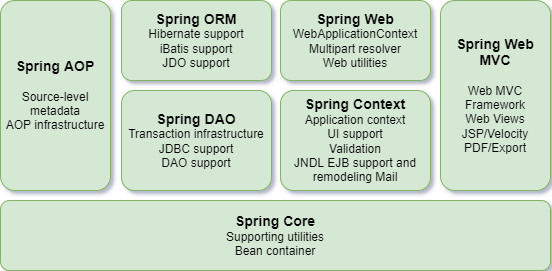
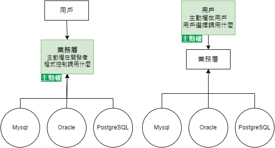
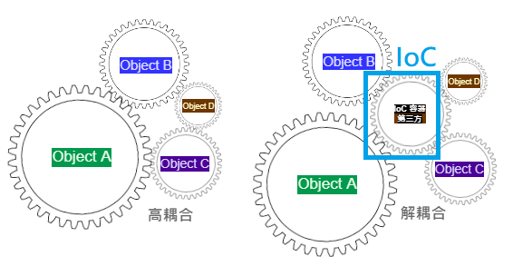
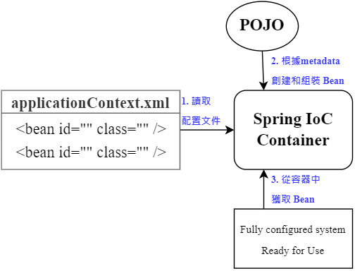

# 3. Spring 5 latest tutorial

## 01. Spring 簡介
+ 2002  interface21 框架
+ 2004  1.0 正式版發布
+ **Rod Johnson** Spring Framework 創始人
+ 理念：使現有的技術更容易使用，整合現有技術框架
    + Servlet API, Web Socket API, 并發實用程序, JSON綁定API, Bean 驗證, JPA, JMS, JTA/JCA 設置
+ SSH: Struct2 + Spring + Hibernate
+ SSM: SpringMVC + Spring + Mybatis 
+ Pros:
    + 開源、免費的框架（容器）
    + 輕量級、非入侵式框架
    + **控制反轉**（IOC）、**切面導向程式設計**/面向切面編程（AOP）
    + 支援事務處理、框架整合
> Spring: a lightweight framework, prominent for Inversion of Control and Aspect Oriented Programming

## 02. Spring 組成及拓展
+ Spring 七大組成


+ Spring: the source for modern Java
    + Spring Boot - build anything
        + 快速開發單個微服務
        + 約定大於配置
    + Spring Cloud - coordinate anything
    + Spring Cloud Data Flow - Connect everything

## 03. IOC 理論推導
1. UserDao 介面 → UserDaoImpl 實現類別 → UserService 業務介面 → UserServiceImpl 業務實現類別
    + Maven pom.xml 導入 spring-core dependency
 ```Java
 public interface UserDao {
    void getUser();
 }
 ```
 ```Java
 public class UserDaoImpl implements UserDao {
    public void getUser() {
        System.out.println("默認獲取用戶的數據");
    }
 }
 ```
 ```Java
 public interface UserService {
    void getUser();
 }
 ```
 ```Java
 public class UserServiceImpl implements UserService {

    //#1 private UserDao userDao = new UserDaoImpl();
    // 如果客戶端要改用 Oracle，因為客戶每次需求，開發者要再重新修改原始碼
    //#2 private UserDao userDao = new UserDaoMysqlImpl();
    
    private UserDao userDao;

    //#3 利用 set 進行動態實現值的注入
    public void setUserDao(UserDao userDao) {
        this.userDao = userDao;
    }

    public void getUser() {
        userDao.getUser();
    }
 }
 ```
 ```Java
 public class MyTest {
     public static void main(String[] args) {

        //用戶實際調用的是業務層，dao層它們不需要接觸
        UserService userService = new UserServiceImpl();

        ((UserServiceImpl) userService).setUserDao(new UserDaoMysqlImpl());
        userService.getUser();
     }
 }
 ```
 ```Java
 public class UserDaoMysqlImpl implements UserDao {
     public void getUser() {
        System.out.println("Mysql獲取用戶數據");
     }
 }
 ```
 + 引入Spring前，用戶需求可能會影響開發原本的代碼，開發需要根據用戶需求修改原始碼，如果程式碼很龐大，修改一次的成本代價十分昂貴
 + 之前，程式碼是主動創建物件，控制權在開發者手上
 + 通過 set 注入，程式不再具有主動性，而是變成了被動的接收物件
 + 程式設計師不用再去管理物件的創建。系統的耦合性大大降低，可以更加專注在業務的實現上。這是 IOC 控制反轉的原型。

 

## 04. IOC 本質
+ 控制反轉 Inversion of Control 是一種設計思想
+ **DI (依賴注入) 是實現 IoC 的一種方法**
+ 沒有 IoC 的程式中，我們使用切面倒向程式設計，物件的創建與物件之間的依賴關係完全硬編碼在程式碼中，物件的創建由程式碼自己控制，控制反轉後將物件的創建轉移給第三方，即獲得依賴物件的方式反轉了

    

+ **IoC 是 Spring 框架的核心內容**，使用多種方式完美的實現了 IoC，可以使用 xml 配置，也可以使用註解，新版本的 Spring 也可以零配置實現 IoC
+ Spring 容器在初始化時先讀取配置文件，根據配置文件或 metadata(元數據) 創建與組織對象存入容器中，程式使用時再從 IoC 容器中取出需要的物件

    

+ 採用 `XML` 方式配置 Bean 的時候，Bean 的**定義訊息**是和**實現**分離的，採用註解的方式可以融和兩者，Bean 的定義訊息直接以註解的形式定義在實現中，從而達到零配置的目的
　
    > **控制反轉是一種通過描述（XML或註釋）並通過第三方去生產或獲取特定對象的方式。在 Spring 中實現控制反轉的是 IoC 容器，實現方法是依賴注入（Dependency Injection, DI）。**

## 05. HelloSpring

```Java
public class Hello {
    private String str;
    
    public String getStr() {
        return str;
    }

    public void setStr(String str) {
        this.str = str;
    }

    @Override
    public String toString() {
        return "Hello{" +
               "str='" + str + '\'' +
               '}';
    }
}
```
1. Spring2 `XML` 
    ```xml
    <!-- beans.xml 
    使用 Spring 來創建物件，在 Spring 這些都稱為 Bean 
    bean = 物件   new Hello();
    -->
    <bean id="hello" class="com.kuang.pojo.Hello">
        <property name="str" value="Spring"/>   <!--類別的屬性"str" | 新建的物件名稱 Spring -->
    </bean>
    ```
    ```java
    public class MyTest {
        public static void main(String[] args) {
            // 獲取 Spring 的上下文物件  beans.xml → 設定檔的檔名
            ApplicationContext context = new ClassPathXmlApplicationContext("beans.xml");

            // 物件現在都在 Spring 中管理了，要使用的話直接去裡面取出來即可
            Hello hello = (Hello) context.getBean("hello");  // bean id=hello, Object 強制轉型為 Hello 
            System.out.println(hello.toString());
        }
        
    }
    ```
2. 

## 06. IOC 創建對象方式

## 07. Spring 配置說明

## 08. DI 依賴注入環境

## 09. RequestMapping 說明

## 10. RestFul 風格講解

## 11. 重定向和轉發

## 12. 接收請求參數以及數據回顯

## 13. 亂碼問題解決

## 14. 什麼 JSON

## 15. Jackson 使用

## 16. Fastjson 使用

## 17. ssm 整合：Mybatis 層

## 18. ssm 整合：Spring 層

## 19. ssm 整合：SpringMVC 層

## 20. AOP 實現方式一

## 21. AOP 實現方式二

## 22. 註解實現 AOP

## 23. 回顧 Mybatis

## 24. 整合 Mybatis 方式一

## 25. 整合 Mybatis 方式二

## 26. 事務回顧

## 27. Spring 聲明式事務

## 28. Conclusion


# 4. Spring MVC latest tutorial 🧩
## 01. 學習方法說明

## 02. 回顧 MVC 架構

## 03. 回顧 Servlet

## 04. 初識 SpringMVC

## 05. SpringMVC 執行原理

## 06. 深入 SpringMVC 學習

## 07. 使用註解開發 SpringMVC

## 08. Controller 配置總結

## 09. RequestMapping 說明

## 10. RestFul 風格講解

## 11. 重定向和轉發

## 12. 接收請求參數以及數據回顯

## 13. 亂碼問題解決

## 14. 什麼 JSON

## 15. Jackson 使用

## 16. Fastjson 使用

## 17. ssm 整合：Mybatis 層

## 18. ssm 整合：Spring 層

## 19. ssm 整合：SpringMVC 層

## 20. ssm 整合：查詢書籍功能

## 21. ssm 整合：添加書籍功能

## 22. ssm 整合：修改刪除功能

## 23. ssm 整合：新增搜索功能

## 24. Ajax 1<sup>st</sup> 體驗

## 25. Ajax 異步加載數據

## 26. Ajax 驗證用戶名體驗

## 27. 攔截器是什麼

## 28. 登錄判斷驗證

## 29. 文件上傳和下載回顧

## 30. Conclusion


<br/>

# 5. Spring Boot 🧩

## 

<br/>