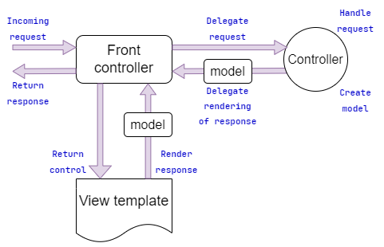
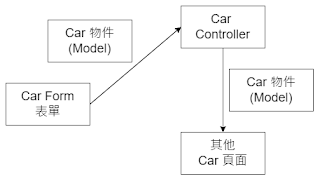
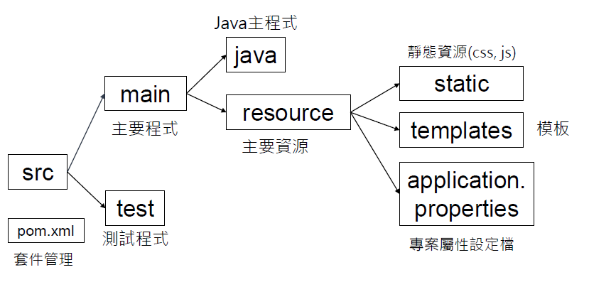
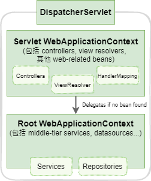

# Spring MVC notes
## 1. spring MVC 架構

+ MVC 代表模型 (Model)，視圖 (View) 跟控制器 (Controller)，是一種軟體設計模式。它將要解決的問題分為 MVC 三部分，彼此獨立，優點為：
    1. 可交由團隊開發，加快開發速度
    2. 可將這三部分交給不同專長的人設計，人盡其才
    3. 抽換任一部分時其它部分不受影響，程式保有最佳的彈性

### 1-1 Spring MVC
+ **M - 模型**
    + 又稱 Domain Object，負責儲存資料的物件

+ **V - 視圖**
    + 交由客戶端裝置來顯示的頁面
    + Controller 取得 Model 產生的資料後，會產交給 View，由它嵌入
    + 可能由 HTML、CSS、jQuery、JavaScript 等技術組成的 UI，組成一個完整頁面，原則上不直接與模型互動，但也有例外 

+ **C - 控制器**
    + 客戶端的請求會先送到控制器，然後由控制器進行與資料庫無關的檢查，如欄位是否空白、檢查碼是否正確等

    + 若有錯誤，交由視圖送回錯誤訊息。如果沒有錯誤，呼叫服務層 (進行企業邏輯的運算，包括與資料庫有關的檢查，如庫存量是否足夠)

    + 然後請 Service 進行數值計算及呼叫 DAO 進行資料庫的存取，並將模型送回的結果轉交給視圖嵌入要送回給客戶端的頁面中

### 1-2 DispatcherServlet 分派器

+ Spring MVC 框架是圍繞在 DispatcherServlet 分派器設計的，分派器設計的，它是請求送到伺服器後第一個接觸的元件。分派器處理所有請求和回應。分派器處理請求的流程如下圖所示：

    

### 1-3 什麼是Spring Web MVC框架
+ Spring Web MVC 是一種基於 Web MVC 設計模式的一種輕量級網路應用系統框架，是目前 Java 語言中最主流的 MVC 框架。此框架提供許多類别與介面，將處理『HTTP 請求』的程式碼依功能來拆解為許多小元件。框架提供基礎功能，程式設計師只需要專注在企業邏輯的編寫，大幅簡化網路應用系統的開發

+ Spring Web MVC 的特質
    1. 能設計出簡潔的後端程式
    2. 可以與其他 Spring 模組（IoC 容器、AOP）無縫地整合在一起
    3. 經由一組功能強大的註釋，讓 POJO 不需實作任何界面就可成為處理請求的控制器 (Controller)
    4. 支持 REST 風格的 URL 請求
    5. 靈活的國際化使用者介面
    6. 提供強大的資料驗證、格式化與數據綁定等功能
    7. 提供一套強大的 JSP 標籤庫，簡化 JSP 網頁開發

+ Spring Web MVC 業界常簡稱為 Spring MVC

## 2. SpringMVC環境建置
### 2-1 Maven Web MVC 的基礎環境建置
###### 需要軟體有 Eclipse(Java EE)、Maven、Tomcat9

#### 2-1-1 在 workspace 內設置 Tomcat
1. 確認目前在 JavaEE 視景 視窗右上角確認，並底下會有 Servers 標籤的視圖
2. Window → Preference → Server → Runtime Environment
3. Add → Apache Tomcat 9.0 → next
4. Browse... 選擇您 tomcat 的位置 → 打勾 Create a new local Server → Finish
     → Apply and Close
5. 找到底下 Server 視圖，右鍵點選剛剛的 tomcat9 open
6. Server Locations 選第二個 Use Tomcat installation
7. Deply path 改成 : webapp
8. Timeouts → Start (in seconds) 改為 1800
9. 記得存檔 (Ctrl + S)
10. 選擇下面視圖內的 Tomcat 右鍵 → Start
11. 去瀏覽器查看 http://localhost:8080 是否有成功啟動

<br/>

#### 2-1-2 跟 Eclipse 說明本地 Maven 位置與其他設定
1. 到 Eclipse 環境內， Window → Perferences → Maven → Installations → Add → Installation home → Directory → 選擇 Maven 的安裝路徑 → 勾選 apache maven x.x.x 的選項 → Apply

2. User Settings → User Settings → Browse → 
    選擇檔案 `C:\DataSource-apache-maven3.x.x\conf\settings.xml` → 會看到下方 Local Repository 指向 `DataSource maven_repository repository`

3. 修改 JRE 版本 點選專案按右鍵 → Build Configure Build Path  → Libraries 標籤，選擇欲更換版本的 JRE System Library → 編輯 → 選擇適合的 JRE 版本 (jdk-11)

4. 點選專案按右鍵 → Project Facet → 選擇 java 11 → Apply

5. 點選專案按右鍵 → Build Configue Build Path → Order and Export 標籤 勾選 Maven Dependency → java 11 JRE → Apply

6. 點選專案按右鍵 Properties → Project Facet → Dynamic Web Module → 選擇 Runtime 標籤並勾選 → Tomcat Server x.x → Apply

7. pom.xml 內加入 dependency lib (從 Maven Repository 官網查看) 設定後存檔，並按下 Alt + f5 按鍵，Update Maven Project 勾選 Force Update of Snapshots/Releases 按下 OK 按鈕更新 Maven Library

<br/>

#### 2-1-3 設定開發環境編碼

1. 以下都在 Window → Preferences 裡面設定

2. Preferences → General → Workspace → 底下 Text file encoding 改為 UTF 8 → Apply

3. Preferences → Web 底下的 CSS Files → encoding 上滑找到 UTF 8 → Apply

4. Preferences → Web 底下的 HTML Files，JSP Files 同上

5. Preferences → JSON → JSON Files → encoding → UTF 8

6. Preferences → General → Content Types → Text → JSP 底下的三個 → Defalut encoding 改為 UTF 8 (這裡打字)

<br/>

#### 2-1-4 正式新建 Maven 的 Web 專案
1. 左邊 Project Explorer 空白處點選右鍵 → New → Project → Maven → Maven Project → Next

2. 打勾 Create a simple projects → Next

3. Group ID: com.sevletjsp → Artifact (你要的專案名稱): jspExercise → Version(不變) → Packaging: war → Finish

4. 建立專案後發現左邊視圖有剛剛我們建的 jspExercise 專案，目前有錯誤是正常的，這時請找到專案的 `pom.xml` 檔案右鍵 → Open with → Maven POM Editor

5. 請在中央視圖底下點選 Overview 標籤 → Properties → Create → Name:maven.compiler.source → Value: 1.8(or 11) → OK → 再一個 Create → Name: maven.compiler.target → Value: 1.8(or 11) → OK 存檔 (Ctrl + S)

6. 這時可以看看底下標籤 pom.xml 多了 
    ```xml
    <properties>
      <maven.compiler.source>11</maven.compiler.source>
      <maven.compiler.target>11</maven.compiler.target>
    </properties>
    ```

7. 上面是我們剛才輸入進去的，當然直接從這邊手寫這段也可以

8. 再加入以下標籤
    ```xml
    <build>
        <plugins>
            <plugin>
               <groupId>org.apache.maven.plugins</groupId>
               <artifactId>maven-war-plugin</artifactId>
               <version>3.3.2</version>
            </plugin>
        </plugins>
    </build>
    ```
9. 更新剛剛我們做的改動讓整個環境知道 : 需要點選專案右鍵 → Maven → Update Project
10. 打勾 Force Update of Snapshops/ Releases
11. 右鍵選專案 → Properties → Project Facets → Dynamic Web Module右邊三角型選4.0 → Java 1.8 → Apply and Close
12. 右鍵選專案 → Java EE Tools → Generate Deployment Descriptor Stub
13. 看專案內 → src →  main → webapp → WEB INF → `web.xml` → 點兩下打開 → 確認下方標籤在 Source
14. 看文件內拉到最右邊看版本會是 version ="2.5" 這不是我們要的，經過facet設定後應該要是4.0
15. 因此，刪除整個 WEB INF，再一次右鍵選專案 → Java EE Tools → Generate Deployment Descriptor Stub
16. 看專案內 → src → main → webapp → WEB INF → `web.xml` → 點兩下打開，應該就是 version= "4.0" 了
17. 設定完成

### 2-2 Spring MVC 需要的設定
#### 2-2-1 WEB-INF/web.xml 內的設定(實作)
1. 在 web.xml 內的 \<web-app> 標籤範圍內設定分派器
```xml
 <servlet>
   <servlet-name>dispatcher</servlet-name>
   <servlet-class>org.springframework.web.servlet.DispatcherServlet</servlet-class>
   <init-param>
      <param-name>contextConfigLocation</param-name>
      <param-value>/WEB-INF/spring-mvc-demo-servlet.xml</param-value>
   </init-param>
   <load-on-startup>1</load-on-startup>
 </servlet>
```

2. 設定 url mappings
```xml
<servlet-mapping>
    <servlet-name>dispatcher</servlet-name>
    <url-pattern>/<url-pattern>
</servlet-mapping>
```
<br/>

#### 2-2-2 WEB INF/spring-mvc demo servlet.xml 內的設定(實作)
1. Component Scan 的功能
      ```xml
      <context:component-scan base-package="要掃描的起始位置" />
      ```

2. Spring MVC 的格式化、驗證等功能
    ```xml
    <mvc:annotation-driven />
    ```

3. 視圖解析器的功能 (View Resolver)
    ```xml
      <bean
          class="org.springframework.web.servlet.view.InternalResourceViewResolver">
          <property name="prefix" value="/WEB-INF/view/" />
          <property name="suffix" value=".jsp" />
      </bean>
    ```
+ 只要給 view name 就會找到檔案：`/WEB-INF/view/someview.jsp`

<br/>

### 2-3 SpringMVC 需要的 java 套件
+ Spring MVC 至少需要以下套件的支援：
    + spring webmvc
    + javax.servlet api
    + javax.servlet.jsp api
    + jstl


## 3. Spring Controller and view
### 3-1 Controller 控制器說明
+ Controller 是MVC中的C，常被翻譯為控制器，主要是處理某個 url 的請求
+ 在 Spring MVC 中，在 Class 上方加入 `@Controller` 的註釋就表示本類別是一個控制器
+ 某 url 的請求會在有 `@Controller` 的 Class 內的方法中對應到的 url 字串，呼叫該方法內的程式， 該方法可以回傳 view name 的字串(轉到某頁面)，或是回傳 Java 物件 (會轉成 Restful 的 JSON 字串)

### 3-2 Controller 控制器的實作 
+ **@Controller** 
    + 註釋是 `@Component` 的一種，為 Class 級別的註釋，表示本類別為控制器
+ **@RequestMapping** 
    + 可以註釋在 class 或方法上方，後可補充字串為請求路徑
    + 若寫在 class 上則表示本類別內的方法中 url 的前綴

#### 3-2-1 Controller 使用方式
```Java
@Controller
public class FirstController {

    @RequestMapping("/")
    public String goSomewhere() {
        return "test1";
    }
}
```
+ 上圖為一個控制器，其中`goSomewhere()`方法上的 `@RequestMapping` 為請求的路徑，預設為 Get 請求
+ 回傳的字串為某頁面的名稱，上圖會轉到頁面 `/WEB INF/view/test1.jsp` 頁面
+ 因前面有設定頁面的前綴 (/WEB INF/view) 和後綴 (.jsp) 了，所以可以省略，只寫頁面名稱就好
+ Controller 內的方法名稱可自訂，可以辨別意思為主，沒有特別規定


#### 3-2-2 其他請求編寫方式
+ 若是其他請求，則括號內的 url 要寫出 value，才可以加入第二個參數 (Request 參數)

    ```java
    @RequestMapping(value="/showform",method=RequestMethod.GET)
    public String showForm() {
        return "student_form";
    }
    ```
+ RequestMethod 可以為：Get、Post、Put、Delete，分別表示本 url 為 Get 請求或 Post 請求或其他上述 http 請求


#### 3-2-3 http 請求的簡化註解
+ 請求的種類可簡化為 
    + `@GetMapping("請求路徑")`
    + `@PostMapping("請求路徑")`

<br/>

### 3-3 搭配 form 來轉頁
+ form 的 action 字串 url 會根據 Controller 內的字串，執行該 Controller 內的程式
    + jsp 頁面：
        ```xml
        <form action="processForm" method="get">
        <input type="text" name="studentname" placeholder="請輸入姓名" />
        <input type="submit" />
        </form>
        ```
    + 對應的 Controller：
        ```Java
        @RequestMapping("/processForm")
        public String formAction() {
            return "student";
        }
        ```
    + 在 jsp 內使用 param 物件 + form 的 name 屬性可以讀到該 form 的值
        ```jsp
        Student Name: ${param.studentname}
        ```

### 3-4 前端 link 標籤 超連結 連結到 controller 字串的方式
+ 直接編寫在 href 的值內就會連結到該 controller
    ```xml
    <a href="showform">show form page</a>
    ```
+ 如果 first Controller 有寫 `@Controller + @RequestMapping("/student")` 下方的方法就是 🎇**巢狀請求**🎇

## 4. Spring model


+ Spring 的 Model 可以裝任何的物件
+ Model 會在 Controller 內使用
+ 可以裝 String, objects, 從資料庫拿到的物件等
+ 可以放多個物件
+ jsp 可以透過 model 拿到資料


#### 4-1-1 編寫有 Model 的 controller
+ 需寫在 Controller 方法內的括弧號內
+ 放物件則使用 Model 內的 `addAttribute()` 方法，裡面有兩個參數，第一個是物件的名字 (字串)，另一個是物件
    ```Java
    @GetMapping("/processForm2")
    public String demoModel(HttpServletRequest request, Model model){
        String theName = request.getParameter("studentname");
        String result = "Hi" + theName + "!!";
        model.addAttribute("message", result);
        return "student";
    }
    ```

#### 4-2-2 在 jsp 內拿到 model 資料的方式
直接使用 `${attribute 的 key}`

student2_model.jsp 內範例程式：
> 回傳訊息：`${message}`

<br/>

## 5.http 請求參數 request params
### 5-1 用 @RequestParam 綁定請求參數
+ 除了上一節使用原生 Servlet 的 HttpServletRequest 的 getParameter 方式取得請求的參數以外，Spring MVC 也提供 `@RequestParam` 的方式拿到請求參數，寫起來較為精簡方便，
寫在 Controller 方法參數內：

    ```Java
    @GetMapping("/processForm3")
    public String demoModel(@RequestParam("studentname") String theName, Model model){
    // 下方就可以用 theName 直接拿到請求的參數
    return "student";
    }
    ```
+ 使用 `@RequestParam` 重點：
    1. Spring 會讀取請求參數內對應的值：studentname
    2. 並且把該值綁定在theName 變數

<br/>

### 5-2 Controller 層級的 RequestMapping
+ 若RequestMapping 的註釋寫在 Controller 上面，表示本 Controller 以下的方法請求路徑前，都會加上 Controller RequestMapping 註釋的字串：
    + 第一個方法的路徑變為：`member/show`
    + 第二個方法的路徑變為：`member/add`

+ 此種方式指定 RequestMapping 可以幫助 url 路徑的分類，使用上或開發上有些時候較為方便

```Java
@Controller      // 以下方法的路徑前面都會多 member/ 以利分類
@RequestMapping("member")   
public class ControllerLevelMapping{

    @RequestMapping("/show")
    public String showMember(){
        return "somepage";
    }
    @RequestMapping("/add")
    public String addMember() {
        return "somepage2";
    }
}
```

## 6.Spring Form Tags
### 6-1 Spring MVC 的 Form 標籤
+ Spring MVC 的 Form 標籤可以直接綁定表格內的資料
+ 自動把值放入 Java Bean 或 Spring Bean
+ Spring MVC 的 Form 標籤會自動產生一些 html 標籤，節省開發時間

 
### 6-2 🎇常見的Form 標籤 🎇🎇
+ 其它 Form 標籤：

    | Spring form 區塊 | form:form       |
    |------------------|-----------------|
    | 可輸入字串       | form:input       |
    | 可輸入多行字串   | form:textarea    |
    | 多項勾選功能     | form:checkbox    |
    | 單項勾選         | form:radiobutton |
    | 下拉式表單       | form:select      |

### 6-3 Spring MVC form tag 範例
+ 加入 form 標籤須先在 jsp 上放加入依賴
    ```XML
    <%@ taglib prefix="form" uri="http://www.springframework.org/tags/form" %>
    ```
    

+ Controller 內 Model 參數的寫法：
    + Model 為在 Controller 與 View 之間傳遞的物件
    + 把 Car 物件加到 model 內，需使用 model 的 `addAttribute()` 方法
    + model的 `addAttribute()` 可以放兩個參數，第一個為要放物件的自訂名稱，第二個可以是任何 Java 物件
        ```JAVA
        @GetMapping("/showCarForm")
        public String showCarForm(Model model) {
          model.addAttribute("carBean", new Car());
          return "car-form";
        }
        ```

### 6-3 Spring MVC form tag 範例

+ 在JSP 的 Form 表單中如何讀取 Model 的資料:
    ```XML
    <form:form action="carAction" modelAttribute="carBean" method="post">
    brand: <form:input path="brand"/>
    <br/>
        color: <form:input path="color"/>
    <br/>
    ```
    ```Java
    // Carcontroller.java 內的 showCarForm 方法
    @GetMapping("/showCarForm")    
    public String showCarForm (Model model){
        model.addAttribute("carBean", new Car());
        return "car-form";
    }
    ```
+ 使用spring 的 \<form:form> 在 form 內使用 `modelAttribute` 代表 model 帶過來的物件，搭配底下 path 代表物件內的屬性

+ 參考 `@ModelAttribute 2 種用法與解釋`
    + https://b0444135.medium.com/springmvc-modelattribute-2%E7%A8%AE%E7%94%A8%E6%B3%95%E8%88%87%E8%A7%A3%E9%87%8B-modelattribute-used-on-method-and-parameter-db70284c3344


### 6-3 Spring MVC form tag 範例
+ 在 Form 表單中如何拿到 Model 內物件的值

    ```xml
    <form:form action="carAction" modelAttribute="carBean" method="post">
        brand: <form:input path="brand"/>
    <br/>
        color: <form:input path="color"/>
    <br/>
    ```
+ 以上述範例為例，若是取得 modelAttribute 的資料

+ 其中 path 內的屬性等於使用 model 物件內 Car 中的 `getBrand()`，`getColor()`等方法

+ 送出有 modelAttribute 的 Form 表單

+ 以上述範例送出的狀況，若是 送出(submit) 的話等於使用 model 物件內Car中的 `setBrand()`, `setColor()` 等方法

+ 送出有 modelAttribute 的 Controller 處理方式:

+ 在處理 Request 的方法內加入 `@ModelAttribute` 的參數，並加上送物件的屬性名稱
   ```Java
   @PostMapping("/carAction")
   public String formAction(@ModelAttribute("carBean") Car car, Model model) {
       System.out.println("car brand: " + car.getBrand());
       return "car-response";
   }
   ```
+ `@ModelAttribute`：綁定 Form 的表單在物件上
+ 送出後的下一頁 jsp 如何取值：
+ 使用 `${ModelAttribute 物件名稱.屬性名稱}`
    ```xml
    <h2> car: </h2>
    <br/>
    ${carBean.brand} and ${carBean.color}
    ```


#### 6-3-1 範例實作步驟
1. 創建裝資料的物件 Java Bean
2. 創建 Controller
3. 創建 HTML form
4. 把 form 加入 spring form tag

    ```xml
    <%@ taglib prefix="form" uri="http://www.springframework.org/tags/form" %>
    ```
5. 測試回應

### 6-4 Spring Form 下拉選單
+ 下拉選單用法：
    + 用 `<form:select path="OOO" >` 搭配 `<form:option value="xxx" label="xxx"/>`
+ 其中 `path="OOO"` 為某一個 Java 屬性 (根據 ModelAttribute 的物件) `form:option value="xxx"` 則是要給 Java 該屬性的值
+ 需在 Car 物件加入 country 屬性和 Getter, Setter
+ 下拉選單 (版本一) 用法：
    ```XML
    <form:select path="country">    //country 要與 Car.java內的private String屬性名稱一致
        <form:option value="DE" label="Germany"/>
        <form:option value="JP" label="Japan"/>
        <form:option value="KR" label="Korea"/>
        <form:option value="US" label="US"/>
   </form:select>
   ```
+ value 為真實的值，label 為顯示給前端頁面看的值
+ 送出 (Submit) 後，Spring 會執行 setCountry (...)
+ 寫完之後，送出資料做一個 response 測試

+ 下拉選單 (版本二) 用法：
    + 若值是從 Java 物件內取出的寫法
    + 先加入含有資料的建構子

        ```JAVA
        public Car( ) {    // 要先建一個 private LinkedHashMap<Str, Str> countryOptions;
            countryOptions = new LinkedHashMap<>();
                         // key, value/label
            countryOption.put("DE","DE");
            countryOption.put("JP","JP");
            countryOption.put("KR","KR");
            countryOption.put("US","US");
        }
        ```
    + 若值是從 Java 物件內取出，jsp 內拿到值的寫法 jsp 內拿到值的寫法
    + 編寫完成後，測試 response 頁面是否可以拿到值
        ```XML
        <!--表單版本2-->
        <form:select path="country">
          <form:options items="${carBean.countryOptions}"/>
        </form:select>
        ```

### 6-5 Spring Form 的單選選項 | Radio Button
+ Spring Form 單選選項的編寫方式
    + 車種：
        ```xml
        <form:radiobutton path="carType" value="電動車"/>電動車
        <form:radiobutton path="carType" value="汽油車"/>汽油車
        ```
+ 到 Car 物件增加 carType 屬性，getter、setter
+ 表單送出 (Submit) 時，Spring 會執行 `setCarType(...)`

### 6-6 Spring Form 多選項的 checkbox
+ Spring Form 多選項 checkbox 編寫方式

    ```jsp
    內容設備：
    <form:checkbox path="addition" value="天窗" />天窗
    <form:checkbox path="addition" value="尾翼" />尾翼
    <form:checkbox path="addition" value="倒車雷達" />倒車雷達
    ```
    + 到 Car 物件增加 addition 屬性， getter, setter
    + 因可能會有多項，所以要增加陣列的屬性

        ``` java
        private String[] addition;
        ```
    + 表單送出 (Submit) 時，Spring 會執行 setAddition(...)
    + jsp 加入 jstl 的 tag 引入 jstl ，方便顯示 List 的資料   

        ```jsp
        <%@ taglib uri="http://java.sun.com/jsp/jstl/core" prefix="c" %>   // 遍歷、迭代
        ```


## 7. 轉換為Java設定的Spring專案 (no XML)

### 7-1 基本設定
+ 增加以下Annotation：為 SpringMVC 專案最少需要的設定
+ 新增 packagecom.jerrymvc.springdemo.config 然後加 Class WebAppconfig 實作 WebMvcConfigurer

   ```java
    @Configuration
    @EnableWebMvc
    @ComponentScan(basePackages="com.jerrymvc.springdemo")
    public class WebAppConfig implements WebMvcConfigurer {
    }
    ```
    上方設定等於原本XML裡面的
    ```xml
    <context:component-scan base-package="com.jerrymvc.springdemo"/>
    ```
<br/>

#### 7-1-1 設定靜態資源的位置
+ 原本 xml：
    ```xml
    <bean class="org.springframework.web.servlet.view.InternalResourceViewResolver">
        <property name="prefix" value="/WEB-INF/view/"/>
        <property name="suffix" value=".jsp"/>
    </bean>
    ```
+ 轉為 Java 設定：
    ```java
    @Bean
    public ViewResolver viewResolver() {
        InternalResourceViewResolver viewResolver = new InternalResourceViewResolver();
        viewResolver.setPrefix("/WEB-INF/view/");
        viewResolver.setSuffix(".jsp");
        return viewResolver;
    }
    ```
+ 設定靜態資源的位置：
    ```Java
    @Override
    public void addResourceHandlers(ResourceHandlerRegistry registry) {
        registry.addResourceHandler("/css/**")
                .addResourceLocations("/WEB-INF/view/css/");
        registry.addResourceHandler("/image/**")
                .addResourceLocations("/WEB-INF/view/image/");
        registry.addResourceHandler("/js/**")
                .addResourceLocations("/WEB-INF/view/js/");
    }
    ```

#### 7-1-2 設定 DispatcherServlet
+ 只須寫一個 Class 並繼承 AbstractAnnotationConfigDispatcherServletInitializer(AACD) 物件，就會自動跑出 DispatcherServlet 相關的設定：

+ AbstractAnnotationConfigDispatcherServletInitializer 在初初始化過程實際就是原 web.xml 中建立 ContextLoaderListener 與 DispatcherServlet 的過程
    ```Java
    @Override
    protected Class<>[] getRootConfigClasses() {
        return null;
    }

    @Override
    protected Class<?>[] getServletConfigClasses() {
        return new Class[] {WebAppConfig.class};
    }

    @Override
    protected String[] getServletMappings() {
        return new String[] {"/"};
    }

    @Override
    protected Class<?>[] getRootConfigClasses() {
       return null;
   }

   @Override
   protected Class<?>[] getServletConfigClasses() {
       return new Class[] { WebAppConfig.class };
   }

   @Override
   protected String[] getServletMappings() {
       return new String[] {"/"};
   }
   ```

+ 分別是
    1. `getRootConfigClasses`：讀取使用者自訂需掃描的 Bean 設定的 Class
    2. `getServletConfigClasses`：讀取 Servlet 相關的設定
    3. `getServletMappings`：Controller 映射的位置(通常為 /)

+ 以上 Annotations 取代原本的 xml 設定
    ```xml
    <servlet>
        <servlet-name>dispatcher</servlet-name>
        <servlet-class>org.springframework.web.servlet.DispatcherServlet</servlet-class>
        <init-param>
            <param-name>contextConfigLocation</param-name>
            <param-value>/WEB-INF/spring-mvc-demo-servlet.xml</param-value>
        </init-param>
        <load-on-startup>1</load-on-startup>
    </servlet>

    <servlet-mapping>
        <servlet-name>dispatcher</servlet-name>
        <url-pattern>/</url-pattern>
    <servlet-mapping>
    ```
<br/>

### 7-2 刪除在 xml 檔案內設定 Spring 相關的程式
1. 刪除 web.xml 內相關 Spring 的設定
2. 直接刪除 spring mvc demo servlet.xml 檔案
3. 進行測試

<br/>

## 8. 在 SpringMVC 中加入 Hibernate
### 8-1 先載入資料庫和連線池需要的依賴程式

+ 請到Maven 的 `pom.xml` 加入

    ```xml
    <dependency>
    <groupId>com.microsoft.sqlserver</groupId>
    <artifactId>mssql-jdbc</artifactId>
    <version>9.4.1.jre11</version>
    </dependency>

    <dependency>
    <groupId>org.hibernate</groupId>
    <artifactId>hibernate-core</artifactId>
    <version>5.6.7.Final</version>
    </dependency>

    <dependency>
    <groupId>com.zaxxer</groupId>
    <artifactId>HikariCP</artifactId>
    <version>5.0.1</version>
    </dependency>

    <dependency>
    <groupId>org.springframework</groupId>
    <artifactId>spring-orm</artifactId>
    <version>${spring.version}</version>
    </dependency>

    <dependency>
    <groupId>org.springframework</groupId>
    <artifactId>spring-tx</artifactId>
    <version>${spring.version}</version>
    </dependency>
    ```

### 8-2 加入 Hibernate、連線池、資料庫的設定

```Java
public Properties hibernateProperties() {
    Properties properties = new Properties();
    properties.put("hibernate.dialect", org.hibernate.dialect.SQLServer2016Dialect.class);
    properties.put("hibernate.show_sql", Boolean.TRUE);
    properties.put("hibernate.format_sql", Boolean.TRUE);
    properties.put("hibernate.hbm2ddl.auto", "update");
    return properties;
}
```  
```Java
@Configuration
@EnableTransactionManagement
public class RootAppConfig {   //從Hibernate-web-teacher直接拉AppConfig,改名成RootAppConfig
    @Bean                       // ①Sessionfactory改成ToScan(URL)  ②datasource更改DB名稱
    public LocalSessionFactoryBean sessionFactory() {
        LocalSessionFactoryBean sessionFactory = new LocalSessionFactoryBean();
        sessionFactory.setDataSource(datasource());
        sessionFactory.setHibernateProperties(hibernateProperties());
        sessionFactory.setPackagesToScan("com.ywmvc.springdemo.model");
        return sessionFactory;
    }
```
```Java
@Bean
public HibernateTransactionManager transactionManager() {
    HibernateTransactionManager txManager = new HibernateTransactionManager();
    txManager.setSessionFactory(sessionFactory().getObject());
    return txManager;
}

public HikariDataSource datasource() {
    HikariConfig config = new HikariConfig();
    config.setJdbcUrl("jdbc:sqlserver://localhost:1433;databaseName=SpringMvcDB");
    config.setUsername("thermos");
    config.setPassword("12345678");
    config.setDriverClassName("com.microsoft.sqlserver.jdbc.SQLServerDriver");
    config.setAutoCommit(false);
    config.setMaximumPoolSize(5);
    HikariDataSource ds = new HikariDataSource(config);
    return ds;
}
```
+ 記得把該 Java 加到此設定中 

    ```Java
    @Override
    protected Class<?>[] getRootConfigClasses() {
        return new Class[] {RootAppConfig.class};
    }
    ```
<br/>

## 9. SpringMVC的三層式架構

### 9-1 網路應用程式的三層式架構

+ 三層式架構主要使用在應用程式後端場景，不只Java的程式有這種結構，其他程式語言也有。將不同功能的程式拆分開，提高可維護性

+ 每個層次都有不同的職責，而不是將所有的程式碼都寫在同一個分類
三層式架構為以下三層：
    + `表現層`：也就是Controller，應該負責接收前端的http request，並請Service處理，最後將資料做http response。回應的範疇包括狀態碼(status code)、標頭(header)與主體(body)等

    + `業務邏輯層`：又稱作Service，會被Controller呼叫。它負責根據請求來進行資料處理，並回傳結果。也可能被其他 Service 呼叫
    
    + `資料持久層`：擔任與資料庫溝通的媒介，會被 Service 呼叫。就是 DAO(Data Access Object)   

> 對不同層次賦予各自的職責，可以達到分工，而相同的程式碼也能方便地重複利用。當程式專案的規模變大後，便可感受其較高的維護性

<br/>

### 9-2 SpringMVC 對三層式架構的支援：

+ 在 SpringMVC 中可以使用 `@Service` 表示業務邏輯層，`@Repository` 表示資料持久層，`@Controller` 表示表現層：

+ 以下註釋都是 Class 層級的註釋，需標註在 Class 上方
    + **@Service 業務邏輯層**：編寫業務邏輯的程式

    + **@Repository 資料持久層**：編寫DAO程式，在註解了 `@Repository` 的類上，如果資料庫操作中拋出了異常，拋出的是翻譯後的 spring 專屬資料庫 Exception，是可以跨資料庫的一種 Exception

    + **@Controller 資料表現層**：負責接收http request和回傳http response，並決定回傳某頁面或 回傳 JSON 或其他格式

+ TIPS:
    1. 只有一兩個的時候，用 `@RequestParam`
    2. 多個，用 `@ModelAttribute`

+ Bean Spring 控管物件
    1. XML
    2. Component Annotatoin
    3. Configuration

 <br/>


# Spring Boot notes
## SpringBoot 介紹

+ Spring Boot 是由 Pivotal 團隊在 2013 年開始研發、2014年4月發布第一個版本。所以它是一個新型的框架

+ 它基於 Spring 4.0 設計 (以及之後的 5.0)，不僅繼承了 Spring 框架原有的優秀特性，而且還透過**簡化配置**進一步簡化了 Spring 應用的整個搭建和開發過程

+ Spring Boot 透過集成大量的框架使得依賴套件的版本一致，解決了多套件版本間衝突的問題

+ [Link to 官網文件](https://spring.io/projects/spring-boot)

+ Spring Boot 也內建了 Tomcat，讓開發者不用擔心 Web 容器的環境問題

+ 絕大多數的 Spring Boot 應用系統只需編寫非常少量的組態檔就可完組態設定的工作，系統開發人員可更加專注於業務邏輯的編寫

+ Boot 有啟動的意思，為了讓開發者能夠快速開啟一個 Spring 專案，Spring Boot 幫開發者簡化了許多整合套件的設定

+ 可以整合 Spring, Spring Data, Spring MVC, Spring Cloud ... 或其他多人使用的第三方套件等專案

+ 簡而言之，Spring Boot只是一個整合工具，開發者還是要先學會Spring、Spring MVC的原理和內容

+ Spring Boot 目前 (2021/10) 的穩定版本為 2.5.5

+ 詳情可見 Spring 官方網站 https://spring.io


### Spring Boot 的特性

> Spring Boot makes it easy to create stand alone, production grade Spring based Applications that you can "just run".

+ 使用 Spring Boot 可輕鬆地完成獨立的，可用於企業營運級別(production grade) 的Spring應用系統，您可以直接執行它

#### 特性：
+ 基於**約定優於配置 (convention over configuration)** 的精神，提供非常多的預設配置作為應用系統的預設值。若有需要也可以自行設定 (Override) 預設值
+ 依**專案需要**的功能來挑選適當的 Starter 就可使用預設配置
+ 快速自動設定的功能 (Auto Config)


### 快速建立 Spring Boot 專案的方式
#### Spring Boot 可根據以下方法快速建立專案
+ 在官網 (https://start.spring/) 進行設定，拿到 zip 壓縮檔後在本地端解壓縮，用 Eclipse 匯入 Maven 專案
+ 使用 Spring Tool Suite (也是一種 Eclipse) 的功能
+ 或其他 IDE 的功能 (Intellj IDEA 付費版)

### 快速建立 Spring Boot 專案的方式
+ 第一種 - 官方的 Spring Tools
    + 使用官方的 Spirng Tools 開啟新的 Spring Boot 專案(https://spring.io/tools)
    + 下載 Windows 版的 Spring Tools 4 for Eclipse

+ 第二種 - 藉由 Spring 官方網站的工具製作新專案
    + Project > Spring Initializr
    + Add dependencies: Explore 幾個常用的 Spring Boot 整合套件：

### 用官網快速建立 Spring Boot 專案
#### 常用的 Spring Boot 整合套件
1. `Spring Web`
    + 可使用 Restful, MVC, 且內建 Tomcat, 預設連線池 (Connection Pool) 為HikariCP

2. `SpringBoot DevTools`
    + 快速重啟專案的擴充功能，可以 Live Reload (改變程式碼時，馬上重新啟動專案)
   
3. `Spring Data JPA`
    + 與 Spring 整合的 Hibernate，可簡化 Hibernate 的設定

4. `資料庫Driver`


### Spring Boot 專案架構




## Spring Boot 組態檔設定

### 觀察 Spring Boot 的 Maven 設置
+ Spring Starter 專案內的 pom.xml 都參考一個父專案。
    ```xml
    <parent>
        <groupId>org.springframework.boot</groupId>
        <artifactId>spring-boot-starter-parent</artifactId>
        <version>2.x.x.RELEASE</version> <!--只有此標籤需要加入版本-->
        <relativePath/>
    </parent>
    ```
+ **spring-boot-starter-parent**：為所有 Spring Boot Starter 專案的父專案。父專案存在的目的不在編寫程式，其目的之一在定義一組可讓多個專案使用的依賴標籤以及此組標籤之間的版本搭配 

+ `spring-boot-starter-parent` 的父專案：
    ```XML
    <parent>
        <groupId>org.springframework.boot</groupId>
        <artifactId>spring-boot-dependencies</artifactId>
        <version>2.x.x.RELEASE</version> 
    </parent>
    ```

+ spring boot dependencies 專案的 pom.xml 在 `<properties>` 群組中定義近 200 (199) 個依賴 `<dependency>` 的版本，以及數百個依賴標籤。它們經過嚴格的測試，可以同時用於一個專案內。我們的專案繼承這樣的父專案後，只要是父專案定義過的依賴，都不需要另外定義，也無須擔心不同依賴間的版本搭配問題

+ `spring-boot-dependencies` 專案統一管理子專案之依賴的版本與無須定義 就可使用依賴

+ Spring Boot 提供的啟動器 (Starter)，參考 [6.1.5章節 Starters](https://docs.spring.io/spring-boot/docs/current/reference/htmlsingle/#using.build-systems.starters)


+ 定義一組特定功能所需要的相關依賴 (Dependencies)，需要此特定功能的 Spring Boot 專案只需要引入此特定功能對應的 Starter 而不需自行定義，**啟動器為各種 Spring 特定功能提供一站式 (one-stop-shop) 的服務**，大幅提升系統的初始建置效率。啟動器自動幫專案加入一組相關的 jars 檔到專案的類別路徑。 (常命名為 spring-boot-starter-xxx)

+ 對於開發任何大型應用系統而言，依賴管理至關重要。由於使用依賴的數量之多，以及不同依賴之間的版本搭配，以人工來手動管理並不理想。您花在此事的時間越多，意味花在專案開發的時間就越少。啟動器就是來解決這樣的問題。每個啟動器都由一組相關且實用的依賴標籤(`<dependency>`)組成，可在自己的專案中引用它

+ 專案屬性設定
+ Spring Boot 可以直接指定 Java 版本 (當然要有 JRE)

    ```xml
    <modelVersion>4.0.0</modelVersion>
    <parent>
        <groupId>org.springframework.boot</groupId>
        <artifactId>spring-boot-starter-parent</artifactId>
        <version>2.5.6</version>
        <relativePath/> <!--lookup parent from repository-->
    </parent>
    <groupId>com.example</groupId>
    <artifactId>springbootdemo</artifactId>
    <version>0.0.1-SNAPSHOT</version>
    <name>springbootdemo</name>
    <description>Demo project for Spring Boot</description>
    <properties>
        <java.version>11</java.version>
    </properties>
    ```

+ 一些 maven pom 的設定
    ```xml
    <properties>
        <java.version>11</java.version>
    </properties>
    <dependencies>
        <dependency>
            <groupId>org.springframework.boot</groupId>
            <artifactId>spring-boot-starter-web</artifactId>
        </dependency>
        <dependency>
            <groupId>org.springframework.boot</groupId>
            <artifactId>spring-boot-devtools</artifactId>
            <scope>runtime</scope>
            <optional>true</optional>
        </dependency>
        <dependency>
            <groupId>org.springframework.boot</groupId>
            <artifactId>spring-boot-starter-test</artifactId>
            <scope>test</scope>
        </dependency>
    </dependencies>
    ```

+ 啟動器搭配 Spring Boot 的自動配置 (Auto Configuration)，使得系統可以在不需要 (或最少量的) 配置就可執行

+ 假設專案將使用 Spring Web 功能，我們可在專案內的 pom.xml 中使用 spring-boot-starter-web 依賴標籤，專案就會引入一組與 Spring Web 有關且版本完全搭配的 Jar 檔

+ 專案若需要使用 Thymeleaf 來作為產生 HTML 文件的模板引擎，只要在 pom.xml 中使用 spring-boot-starter-thymeleaf 依賴標籤，專案就會引入一組與 thymeleaf 相關且版本完全搭配 Spring 版本的 Jar 檔

## 專案屬性設置
+ 使用 `application.properties` 檔案
+ properties 檔是一個 key-value 配對的資料型態(屬性=值)
   例如設定 Base Url:
   ```properties
   server.servlet.context-path=/my-app
   ```
+ 常用設定請參考官網提供的[參考文件](https://docs.spring.io/spring-boot/docs/current/reference/html/application-properties.html) (Google Spring application properties)


### 本課程專案屬性設置
```properties
# 記得改properties為UTF-8
# port config (預設本來就是 8080，若須修改可以從這邊)
 server.port=8080

# connection information
spring.datasource.driverClassName=com.microsoft.sqlserver.jdbc.SQLServerDriver
spring.datasource.url=jdbc:sqlserver://localhost;databaseName=SpringBootDB
spring.datasource.username=thermos
spring.datasource.password=12345678

## jpa config
spring.jpa.properties.hibernate.dialect=org.hibernate.dialect.SQLServer2012Dialect
spring.jpa.show-sql=true
spring.jpa.properties.hibernate.format_sql=true
spring.jpa.hibernate.ddl-auto=update
  ### 對應 entity 製作資料表
spring.jpa.hibernate.naming.physical-strategy=org.hibernate.boot.model.naming.PhysicalNamingStrategyStandardImpl
  ### 根據 Entity(JavaBean的@column(name="__")文字命名每一列的名稱

# JSP Config
spring.mvc.view.prefix:/WEB-INF/jsp/
spring.mvc.view.suffix:.jsp
```
> 註1: #為註解，後面必須有一個空格<br/> 註2: =前後不須空格

### Spring Boot 的 View (視圖) 常見種類
1. `Thymeleaf`: Spring Boot 官方範例用的模板引擎 (template engine)
2. `Jsp`: 透過 Servlet 編譯後的視圖頁面
3. 不負責 View 端：屬於前後端分離的架構 (Ajax + Restful)，單純用 JSON 溝通前後端資訊。前端通常使用目前JS三大框架中的其中之一
    + Angular, React, Vue   
    + 註：前兩種為MVC架構，第三種為前後端完全分離的架構


## Spring Boot 的 Web 專案啟動
### Spring Boot 如何啟動專案
+ 啟動專案的方式：直接執行最高層的 Java 檔案
+ 須注意專案檔案層級：其他 Java 檔案必須在本 package 底下
+ 須要有 `spring-boot-starter-web` 的套件
    ```XML
    <dependency>
        <groupId>org.springframework.boot</groupId>
        <artifactId>spring-boot-starter-web</artifactId>
    </dependency>
    ```
    ```Java
    @SpringBootApplication
    public class SpringbootdemoApplication {
        public static void main(String[] arg) {
            SpringApplication.run(SpringbootdemoApplication.class, args);
        }
    }
    ```

### Spring Boot 如何啟動專案

+ `@SpringBootApplication` 為一複合註釋，具有下列三個註釋的功能：
    + `@Configuration`
        + 表示本類別為一個Spring Boot下的一個 @Configuration 類別，能以 @Bean 修飾的方法來提供 Bean 的定義
    + `@EnableAutoConfiguration`
        + 啟動自動組態配置，會根據專案的啟動套件、屬性設定檔等來源設定專案。
    + `@ComponentScan`
        + Spring Boot 會自動掃描主類所處之套件下的所有 (廣義) 子套件，因此直接或間接位於此套件之下，使用有註釋修飾的 Bean 是自動被 IoC 容器發現的 (`@Component`, `@Service`, `@Repository`, `@Bean`)

+ 若看到 Tomcat started on port(s): 8080(http) with context path 字樣，表示成功啟動
Spring Boot! 如下圖 --
    ``` 
    Adding welcome page template: index
    LiveReload server is running on port 35729
    Tomcat started on port(s): 8080(http) with context path ''
    Started SpringbootThyApplication in 7.752 seconds (JVM running for 9.047)
    ```

## Spring MVC 實作及常用方法

### Spring MVC 架構
+ Spring Boot 開發 Web 應用程式主要使用 MVC 模式。MVC是Model(模型)、View(視圖)、Controller (控制器) 的縮寫
    + **Model**：**模型**，單純**存取資料的物件或POJO** (Plain Old Java Objects)
    + **View**：**視圖**，主要**用來解析、處理、顯示內容**
    + **Controller**：控制器，用來處理視圖中的回應
        + 它決定如何呼叫 Model
        + 如何呼叫業務層 (Service) 的資料增加、删除、修改和查詢等業務操作
        + 如何將結果傳回視*圖
        + ✨盡量不要在控制器中放入業務邏輯
   > 註：MVC只是一種常用的架構，可能會因為需求不同改用其他模式

+ Spring MVC 主要透過 **DispatcherServlet 物件封裝 Servlet 相關的功能**，例如 **http 請求 (Controller, HandlerMapping)**，**view 的處理(View Resolver)**等功能
+ 再加上**業務邏輯的 Service**、**掌控資料庫的 DAO(Repository)**，一起交由 spring 控管，這種架構的專案就稱為 Spring MVC 架構

    

### Spring MVC 主要流程
1. 使用者由瀏覽器發出請求，由 Tomcat 接收並轉交給 DispatcherServlet 處理
2. DispatcherServlet 比對控制器中設定的對應路徑，進行下一步處理
3. ViewResolver 將 ModelAndView 或 Exception 解析成 View ，且根據 ModelAndView 中的資料渲染頁面

### Spring MVC 三層式架構
1. **表現層 (UI)**：顯示使用者介面 UI，使用者可送出和接收請求
2. **資料存取層 (DAO|Repository)**：與資料庫進行互動的持久層，在 Spring Data JPA 中透過 Hibernate 來實作
3. **業務邏輯層 (Service)**：三層架構中的服務層，負責處理業務邏輯，通常會呼叫 DAO 幫忙做事情

## Spring MVC 常用方法
### Spring MVC 常用註釋 (Annotation)
+ `@Controller`
    + 控制器，編寫在類別上，表示是 SpringMVC 的 Controller
    + 負責處理由 DispatcherServlet 接收並分發過來的請求
+ `@RequestMapping`
    + 寫在 Controller 內的方法，真正處理請求位址對應的註釋 
    + 若編寫在類別上，則該類別所有回應請求的方法都以該位址為父路徑
+ `@PathVariable`
    + 將請求 URL 中的變數對應到功能處理方法的參數上
    + 就是取得 URL 中的變數作為程式的參數
+ `@RestController`
    + 用來標記 RESTful 風格的控制器類別
    + 等於 `@Controller`+`@ResponseBody`✨
    + 會直接回傳字串，常用於回應 JSON 格式的字串
+ Spring Boot
    + `@GetMapping("/")` 相當等於 `@RequestMapping(value="/",method=RequestMethod.GET)` 
    + 上述用法也可以用在以下註釋

        ```Java
        @PostMapping
        @DeleteMapping
        @PutMapping
        ```
### Spring MVC 其它請求設定
+ 正常的瀏覽器的 FORM 表單只能提出 GET 與 POST 請求，並不能提出 PUT 與 DELETE 等方法， spring3.0 新增一個過濾器，可以將 POST 請求轉換為 PUT 與 DELETE 方法
+ `org.springframework.web.filter.HiddenHttpMethodFilter`
    + HiddenHttpMethodFilter 過濾器會監看前端程式送來的請求參數中是否含有名為 `_method` 的欄位，若有，則將請求之HTTP 方法依照此欄位的內含值來修改：
        + 若為 PUT（不分大小寫）則將 HTTP 方法改為 PUT
        + 若為 DELETE（不分大小寫）則將 HTTP 方法改為 DELETE
        + 提出此請求時，**原始的 HTTP 方法必須為 POST**
+ 在 Spring Boot 2.2 版以前不需要做任何設定，因為它會自動配置 HiddenHttpMethodFilter ，但自 Spring Boot 2.2 版（含）開始，它不再自動為應用系統配置此過濾器，我們必須自行配置，方式有兩種 --
    + 方法一：在 application.properties 內加入下列設定
        ```properties
        spring.mvc.hiddenmethod.filter.enabled=true
        ```
    + 方法二：以程式加入此過濾器（非 Boot 專案時使用）
        + Spring Boot 提供一個 `FilterRegistrationBean` ，讓應用系統加入所需的過濾器：
        + 我們只需在任何以 @Configuration 修飾的 Java 類別中加入以下方法即可

            ```Java
            @Bean
            FilterRegistrationBean<Filter> hiddenHttpMethodFilter(){
                FilterRegistrationBean<Filter> filterBean = new FilterRegistrationBean<>();
                filterBean.setFilter(new HiddenHttpMethodFilter());
                return filterBean;
            }
            ``` 
### Spring MVC 中 HTTP 常用功能
+ 處理訊息的類型 Content Type
    + 在 HTTP 協定的 header 中， content type 表示實際請求中的媒體類型
    + PC 端常用的是 *text/html* 格式，手機則是使用 *JSON*
+ 比較特別且常用的格式如下
    + `application/json` : JSON 資料格式
    + `application/pdf` : PDF 資料格式
    + `multipart/form data` : 若在表單 ( 中上傳資料，需使用此格式
 
## Spring Boot 中常用的取得參數方式
### Spring Boot 常用的取得參數方式
1. 
2. 
3. 
4. 
5. 
6. 

## Spring Boot 使用 JSP 時需要的設定
## JSON
## RESTful API
## Ajax 非同步請求搭配 Restful API
## Spring JPA 實作與應用
## 分頁物件 Page 的實作與應用


## JpaRepository 的 Query 方法：
1. 即 HQL，在 SpringJpa 內 Hibernate 交由 Spring 控管，因此使用的是 JPA 的 API 名稱： JPQL(Java Persistence Query Language)
2. JPQL 用法與 HQL (Hibernate Query Language) 相同，是操作 **Entity 內的屬性**而非 Table 中的欄位
3. JpaRepository 在寫 HQL 當需要參數時有比較方便的編寫方式，如下節

### JpaRepository 的 HQL 中參數的寫法
1. 根據參數位置（第幾個問號對應底下方法第幾個參數）
    ```Java
    @Query(value = "from customer where name = ?1")
    Person findCustomerByName (String Name);
    ```

2. 用`:`及 `@Param` 做對應
    ```Java
    @Query("from Customer where name = :name")
    public List<Customer> findByName (@Param(value ="name") String name);
    ```

### JpaRepository 中寫原生SQL 的寫法
+ 若要使用原生SQL 做查詢，須在後面加上`nativeQuery=true`
+ 用原生SQL 查詢 (nativeQuery=true) **就不是對Entity操作了，會變為對Table 操作**，因此操作的屬性就變為 table 裡的屬性
    ```Java
    @Query(value="select * from Customer where name= :name",nativeQuery=true)
    public List<Customer> findByName2(@Param(value = "name") String name);
    ```

### JpaRepository 中@Query 須注意 
+ 用`@Query`查詢時，若是需要**修改資料**或**刪除資料**的情況，須在 @Query 上方加入`@Modifying` 標註：
    ```Java
    @Modifying
    @Query(value = "delete from customer where id=?1",nativeQuery = true)
    void delAccount(int id);
    ```

### JpaRepository 中直接透過方法名稱查詢
+ Spring提供了一套可以透過命名規則進行查詢。這套機制會把方法過濾一些關鍵字，比如`find…By`, `read…By`, `query…By`, `count…By` 和`get…By`
+ [JPQL snippet Keyword Sample 官方參考文件](https://docs.spring.io/spring-data/jpa/docs/current/reference/html/#jpa.query-methods.query-creation)

    + **And** ----
        + findByLastnameAndFirstname ---- where x.lastname = ?1 and
    + **Or** ----
        + findByLastnameOrFirstname ---- where x.lastname = ?1 or x.firstname = ?2
    + **Is,Equals** ----
        + findByFirstnameIs,findByFirstnameEquals ---- where x.firstname = ?1
    + **Between** ----
        + findByStartDateBetween ---- where x.startDate between ?1 and ?2
    + **LessThan** ----
        + findByAgeLessThan ---- where x.age < ?1
    + **LessThanEqual** ----
        + findByAgeLessThanEqual ---- where x.age ⇐ ?1

    + **GreaterThan** ---- 
        + findByAgeGreaterThan ---- where x.age > ?1
    + **GreaterThanEqual** ---- 
        + findByAgeGreaterThanEqual ---- where x.age>= ?1
    + **After** ---- 
        + findByStartDateAfter ---- where x.startDate > ?1
    + **Before** ----  
        + findByStartDateBefore ---- where x.startDate < ?1
    + **IsNull** ----  
        + findByAgeIsNull ---- where x.age is null
    + **IsNotNull,NotNull** ----  
        + findByAge(Is)NotNull ---- where x.age not null
    + **Like** ----  
        + findByFirstnameLike ---- where x.firstname like ?1
    + **NotLike** ----  
        + findByFirstnameNotLike ---- where x.firstname not like ?1
    + **StartingWith** ----  
        + findByFirstnameStartingWith ---- where x.firstname like ?1 (parameter bound with appended %)
    + **EndingWith** ----  
        + findByFirstnameEndingWith ---- where x.firstname like ?1 (parameter bound with prepended %)
    + **Containing** ----  
        + findByFirstnameContaining ---- where x.firstname like ?1 (parameter bound wrapped in %)
    + **OrderBy** ----  
        + findByAgeOrderByLastnameDesc ---- where x.age = ?1 order by x.lastname desc
    + **Not** ---- 
        + findByLastnameNot ---- where x.lastname <> ?1
    + **In** ---- 
        + findByAgeIn (Collection ages) ---- where x.age in ?1

    + **NotIn** ---- 
        + findByAgeNotIn (Collection age) ---- where x.age not in ?1
    + **TRUE** ---- 
        + findByActiveTrue() ---- where x.active = true
    + **FALSE** ---- 
        + findByActiveFalse() ---- where x.active = false
    + **IgnoreCase** ---- 
        + findByFirstnameIgnoreCase ---- where UPPER( x.firstame ) = UPPER(?1)

