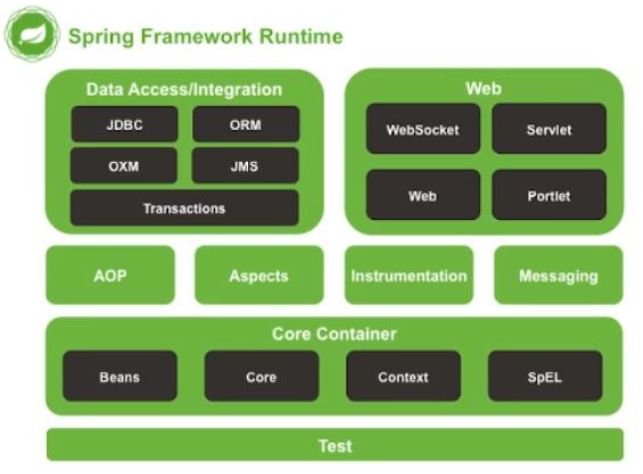

# Spring notes
https://docs.spring.io/spring-framework/docs/current/reference/html/core.html#beans-introduction
## 1. Spring 框架介紹
### 1-1 Spring 框架的起源 
Spring Framework 是由 Rod Johnson 於 2012 年所提出

起源於作者 Rod Johnson 所寫的 `Expert One on One J2EE Design and Development (精通 J2EE 設計開發)` 一書，作者對於 J2EE 技術標準進行省思後提出此框架，鑑於現有 J2EE 技術過於複雜且龐大的重量級官方框架，提出一個輕量級、不需特殊容器支援且不相依於特殊規範的 Spring Framework

### 1-2 Spring 框架的的特性 (IoC, DI, AoP)
#### Inversion of Control(簡稱 IoC)：
+ 通常翻譯為控制反轉
+ 目的在**降低應用程式的元件與元件之間的相依關係**，進而降低耦合度
+ 讓每個元件的可重用性提高讓應用程式更具延展性，其中最常見的方式叫做**依賴注入(DI DependencyInjection)**

#### Aspect Oriented Programming(簡稱 AOP)：
+ 在不更改原始程式碼的情況下插入特定功能的程式碼
    + 例如：在 1 個沒有 Log 機制的應用程式中加入 Log 功能，而且不更動到原始程式，甚至是不重新編譯 AOP 
+ 通常需要 DI (DependencyInjection) 的輔助來實作

### 1-3 Spring 框架的優點與它在網路應用系統中的扮演的角色
+ 目前運用最廣泛的 Lightweight Framework，
   不需透過Java EE Application Server 就可以執行的 Framework
+ 以Inversion of Control、Aspect Oriented programming為主要設計理念，可與Structs、Structs2、Hibernate、JSP、Mybatis等架構整合運作   
+ Spring 負責將所有的元件進行佈署，管理、維護並執行，因此也被稱為輕量級容器
+ https://spring.io
+ POJO => The Spring Container
  + Configuration Metadata ==> The Spring Container
  + The Spring Container ==> Fully configured system (ready for use)


## 2. Spring 框架有哪些模組
### 2-1 核心容器(Core Container)：包括 Core,Beans,Context,SpEL(Expression Language)



+ Core 與 Beans 模組：
  + 提供 Spring Framework 的基礎功能
  + 包含 IoC(Inversion of Control) 與DI (Depending Injection) 的功能
  + 主要元件為 BeanFactory
  + 本身**實作Factory Design Pattern**，負責管理物件的生成、釋放以及物件與物件的依賴注入(DI) 關係
+ Context 模組：
  + 提供讀取Spring Framework設定檔的功能
+ SpEL(Spring Expression Language)模組：
  + 提供**統一表達式語言(unified EL)**的擴充套件模組
  + 可以用來查詢、管理執行中的物件
  + 也可以存取陣列內容屬性值、呼叫物件的方法、邏輯運算與集合等


### 2-2 資料存取與整合(Data Access/Integration)：由JDBC,ORM,OXM,JMS,Transaction 模組構成
+ JDBC 模組：
  + 提供JDBC相關功能，讓繁瑣的JDBC程式變得更容易管理，也提供宣告式交易管理機制
+ ORM 模組：
  + 提供整合 OR Mapping Framework 的功能，可以整合JDO、JPA與Hibernate等，
   Spring 的 Transaction (交易) 管理功能支援上述 OR Mapping Framework 與 JDBC

### 2-3 網路應用程式(Web)與其它功能：Web, SpringMVC, Web-Socket, AOP, Aspects, Messaging, Instrumentation 等
+ AOP 模組：
  + 提供 Spring Framework 的 AOP 功能
+ Web 模組：
  + 提供整合 Web 應用程式的功能以及整合各種 Web framework (例如Struts，SpringMVC)，也能在執行Framework方法前後插入攔截器
+ Web MVC 模組：
  + Spring 提供的 Web 應用程式MVC Framework，讓開發者於 Web 應用程式內使用 IoC 等機制，並且可以隨時抽換 View 與 Controller 元件
+ Messaging 模組：
  + 提供整合 messaging api 和訊息協議提供支援，用來處理訊息資料使用，也提供註釋 (Annotation) 的功能對應方法


## 3. 何謂程式之間的耦合性
#### 3-1 耦合度(Coupling)：
+ 代表 2 個軟體元件之間的相互依賴程度，在物件導向程式設計領域內，軟體元件之間的耦合度越低越好
+ Inversion of Control (IoC)：控制反轉
+ IoC 概念：轉移程式元件與程式元件間的依賴關係
  + 良好的 IoC 要達到以下目的：
    1. 高層程式模組不應該依賴低層程式模組 (減少耦合度)
    2. 應用程式不應該依賴 Container，而是 Container 服務應用程式
 
+ Container 常翻譯為容器
  + 定義：讓軟體元件存在所需要的**基礎設施**或**記憶體空間**，像是：
    + Java 程式需要 JVM 容器才執行
    + Tomcat 內的 Servlet 容器是專門執行 Servlet 的
    + Spring 的 Bean 也需要 Spring 容器才可以存在

#### 3-2 控制反轉對傳統 Java 程式在產生物件的做法所帶來的衝擊
+ 傳統 Java 程式中，其相依性固定撰寫在程式中，依程式碼的設計一步步的執行
+ 其執行流程透過程式碼可一目瞭然，例如早期的 jsp 程式會將html的標籤、轉頁的網址、資料庫的程式全部寫在 jsp 頁面。
+ 因為全部的程式都寫在一起，當邏輯相當複雜時容易產生維護困難的問題，就**形成了高度耦合的程式**
+ 而當使用控制反轉 lnversion of Control (IoC) 時，會設計 Service 與 DAO 層作為獨立的元件，交**由 Spring 負責產生物件實體，組裝元件**，不須由程式設計師編寫程式處理，因此將這種方式成為控制反轉或反向控制


#### 3-3 用實例來解說
##### 傳統 Java 程式產生物件的做法 v.s. Spring 框架以控制反轉來產生物件的做法

+ 使用Spring loC 技術的目的：
  1. 降低物件與物件之間的稱合度 (coupling)
  2. 當物件之間的**相依關係發生變化**時，可以透過**修改組態設定檔**的方式達到修改的目的，而**不需要修改程式碼**


## 4. 控制反轉 (Inversion of Control)
#### 4-1 依賴注入的做法與依賴注入的優勢
+ Dependency Injection (DI - 常翻譯為依賴注入)
  + 應用程式的元件與元件之間的結合通常需要編寫建立、初始化物件的程式碼，這些程式讓元件與元件之間產生了耦合開係，也就是說每次使用都需透過實體化物件的方式才能夠執行（一個物件需要另一物件才能夠作用），產生高耦合的問題
  
+ DI(依賴注入)
  + 被依賴的物件會透過外部注入到依賴的物件中使用，不需要直接以 new 建立物件的方式執行，而是以 **Spring 容器注入的方式**來達成
  + DI(依賴注入) 隔離**依賴物件原有的運作邏輯**與**被依賴物件的生成邏輯**，可有效降低元件與元件之間耦合的關係，提高系統維護的能力
    + 註：元件常來表示含有某部分功能的程式碼

#### 4-2 Spring 框架如何使用依賴注入來簡化程式的設計
+ DI 是實現 IoC 的手法之一，DI 可以將元件與元件結合的相關程式抽離到組態檔，通過組態檔的設定，自動將 Dependency 物件注入 Target 物件
  + Dependency 物件：被其他物件使用的物件
  + Target 物件：使用其他物件的物件
+ 常見的 Dependency Injection 設定方式有兩種：
  1. Setter Dependency Injection (Setter注入)
  2. Constructor Dependency Injection (建構子注入)

#### 4-3 依賴注入與控制反轉的關係
+ 依賴注入最著名的框架就是 Spring Core 的控制反轉 Inversion of Control(loc)

+ 可透過 Spring 框架來實現依賴注入，負責提供程式中物件產生、初始化、配置與裝配等工作
+ 藉由在 Spring IoC 中修改組態檔的方式替換程式中物件間的依賴對象，而不用需要修改程式本身


## 實作 Spring 框架下的 Java 程式
#### 5-2 定義Spring 框架所需要的組態檔，經由組態檔Spring 框架才知道它要管理的Bean元件
+ 產生Spring 組態檔：空白的Spring 組態檔
  1. 點選Java 專案右鍵＞ New > Other > Spring > Spring Bean Configuration File> Next
  2. 放置位置：Java專案名稱/src，檔案名稱：`applicationContext.xml`
  3. 選擇需要的Spring Namespace 宣告：
      + 沒有Namespace 就無法宣告對應的
   Spring功能
      + 空白的 Spring 組態檔

      ```XML
      <?xml version="1.0" encoding="UTF-8"?>
      <beans xmlns="http://www.springframework.org/schema/beans"
             xmlns:xsi="http://www.w3.org/2001/XMLSchema-instance"
             xsi:schemaLocation="http://www.springframework.org/schema/beans
      http://www.springframework.org/schema/beans/spring-beans.xsd
                    http://www.springframework.org/schema/context
      http://www.springframework.org/schema/context/spring-context.xsd">
      </beans>
      ```

#### 5-3 編寫程式啟動 Spring IoC 容器的程式碼，使用 Spring 提供的 API 取得程式需要的物件
+ 使用 Spring IoC 控制反轉
+ 在 Spring 組態檔內定義 EnglishTeacher
```XML
   <bean id="teacher1" class="tw.ywdemo.EnglishTeacher"/>
```
+ 使用Spring loC 控制反轉 
  + 執行測試 
  + 讀取組態檔
    ```Java
    ApplicationContext context = new ClassPathXmlApplicationContext("applicationContext.xml");

    Teacher teacher = (Teacher)context.getBean("teacher1");
    teacher.teach("授課");

    ((ConfigurableApplicationContext)context).close();
    ```

## 6. 提供 Bean 的組態訊息 (Spring Bean)

#### 6-1 何謂 Bean、為何 Bean 是 Spring 框架的核心概念，所有 Spring 技術都為圍繞的 Bean 打轉?
+ **Bean Container**：放置 Spring 所管理的物件

+ Spring架構下透過 IoC 管理的各個元件稱為Bean元件，雖然沒有硬性規定，但是程式設計師通常將元件編寫成 JavaBean 格式

+ Bean元件設定在組態檔內，在組態檔中宣告的 Bean 元件自動享受到Spring 的所有好處 (AOP、DI 等）

+ 將各個 Bean 元件集中管理的技術稱為 Bean Container ，主要負責各個元件的設定、管理元件彼此的關係以及元件的生命週期

+ Bean Container 的功能主要由 `org.springframework.beans` 套件，以及 `org.springframework.context` 套件負責實作

#### 6-2 組裝 Bean 與解決 Bean 之間的依賴關係
+ Application Context 介面
  + 定義在 `org.springframework.context` 套件
  + 屬於 Core Container 的 Context 模組，是個比 BeanFactory 更好的 Bean Container，除了讀取 Bean 定義檔、維護 Bean 與 Bean 的依賴關係等功能之外 也支援 i18n 國際化語系、發佈事件等功能

+ **Spring 的創始者建議開發者使用 ApplicationContext**

+ ApplicationContext 是 BeanFactory 的 Sub Interface，程式設計上使用它的 3 個子類別：
  1. ClassPathXmlApplicationContext : 由 Class Path 取得組態檔
  2. FileSystemXmlApplicationContext : 由指定的路徑取得組態檔
  3. XmlWebApplicationContext ：由相對路徑取得組態檔 適用於 Web 應用程式）

https://docs.spring.io/spring-framework/docs/current/reference/html/core.html#beans-introduction
 

+ ApplicationContext 介面建立方式
  ```Java
  ApplicationContext context = new ClassPathXmlApplicationContext(組態設定檔名稱);
  BeanType bean = (BeanType) context.getBean("BeanType之id值");
  ((ConfigurableApplicationContext) context).close;
  ```

#### 6-3 Spring 框架提供三種說明 Bean 組裝資訊的做法
+ Spring 組態的設定方式：
  1. XML 組態檔案：
    使用 XML 組態檔集中設定 Bean 元件組態，不需要修改 Bean 元件的原始程式碼

  2. **Annotation 組態：**
    使用 Annotation 在各個 Bean 元件設定組態，因 Annotation 提供大量資訊可以簡化組態設定的程式量，為 `Spring 2.0` 定義的組態設定方式

  3. **Java程式組態：**
    使用Java程式設定Bean元件組態，為`Spring 3.0`定義的組態設定方式，
    最新的組態設定方式越來越受到重視

> 註：較新的應用程式會以第二種及第三種設定方式為主，但維護舊系統還是會用到第一種

<br/>

## 7. 使用組態檔 (Bean Configuration File) 說明 Bean 的組裝資訊
#### 7-1 介紹組態檔概觀與使用 Eclipse 插件的功能來產生組態檔
+ Spring 組態設定檔： Spring Bean Configuration File
+ 檔案為 XML 格式、名稱可以自訂
+ Spring4.X 之後使用 org.springframework.context.support 套件的 `ClassPathXmlApplicationContext` 類別讀取 Spring 組態設定檔
+ `ClassPathXmlApplicationContext` 的建構子可以接收多種參數，所以一個 Spring 應用程式可以擁有多個組態設定檔
+ 可用以下方法讀取多個組態檔 (用逗號隔開檔案名稱):
  ```Java
  ApplicationContext context = new ClassPathXmlApplicationContext("services.xml", "daos.xml");
  ```

+ Spring 組態設定檔： `Spring Bean Configuration File`
+ XML 組態設定檔放置位置通常為 classpath root (也就是與Java class放在相同位置而沒有套件）
+ 假設 Spring 組態設定檔 `beans.config.xml`放在 classpath root，需寫
  ```Java
    ApplicationContext context = new ClassPathXmlApplicationContext("applicationContext.xml");
  ````

#### 7-2 組態檔內常見的標籤與其內的屬性
+ 組態檔的設定重點：
  + 每個Bean 元件都要有獨立的id **不可重複**
  + 一個class 可以使用不同id 設定為多個不同的Bean 元件 (相同類別不同物件)，並給予不同的建構子參數值
  + 每個Bean元件可以擁有多個name (又叫做alias），設定時可使用逗號或分號隔開
    + 範例：
      ```xml
      <bean id="string0" name="string1,string2" class="java.lang.String">
      <constructor-arg value="Test Information"> </constructor-arg>
      </bean>
     ```
+ \<bean> 標籤：用來設定說明bean 物件
  + 屬性：
    + `name/id`：用來識別bean的名稱
    + `class`：設定bean所對應的類別(Fully QualifiedName)
    + `scope`：設定bean的有效範圍
  + \<constructor-arg> 標籤與相關屬性：
    + `ref`: 設定建構子傳入所參考的 bean id
    + `value`: 設定建構子的傳入值

    ```xml
    <bean id="string0" name="string1,string2" class="java.lang.String">
    <constructor-arg value="Test Information"> </constructor-arg>
    </bean>
    ```
 <br/>

#### 7-3 範例介紹與實例演練
```xml
<bean id="loginDao" class="tw.yw.demo.model.LoginDao"></bean>
<bean id="loginService" class="tw.yw.demo.model.LoginService">
  <constructor-arg ref="loginDao"></constructor-arg>
</bean>

<bean id="loginService2" class="tw.yw.demo.model.LoginService">
  <property name="logindao" ref="loginDao"></property>
</bean>
```
```Java
ClassPathXmlApplicationContext context=new ClassPathXmlApplicationContext("applicationContext.xml");

LoginService service = (LoginService) context.getBean("loginSevice");
boolean result = service.checkLogin("thermos","12345678");
System.out.println("result1:" + result2);

LoginService service2=(LoginService) context.getBean("loginSerivce2");
boolean result2 = service2.checkLogin("thermos","12345678");
System.out.println("result2:" + result2);

context.close();
```

## 8. 透過 Setter/Constructor 注入各種不同型態的資料
+ 主要的Dependency Injection (DI) 設定方式：
  + Setter Dependency Injection
  + Constructor Dependency Injection

+ 使用 Dependency Injection 可以注入的參數型別
  1. Null 值
  2. 不受 Spring 管理的 Bean 元件
  3. 受 Spring 管理的 Bean 元件
  4. 簡單的值： Java 基礎資料型別、字串
  5. Java Collection
  6. 外部定義的 Property
  7. 其他 Spring 設定檔定義的 Bean 元件

+ **Constructor Dl vs. Setter Dl ?**
  + Constructor DI 與 Setter DI 可混用
  + 具備**有參數的建構子**就可使用 Constructor DI
  + 有**空的建構子**就可使用 Setter Dl
  + Constructor Dl
      + 在注入`必要的` Dependency 時使用，可以確保必要的屬性為非 null 的值
  + Setter Dl
      + 在注入`非必要的` Dependency 時使用，使用 Setter DI 注入的屬性時必須檢查 null值
  + Spring 官方建議**用 Constructor DI 為主**， Setter DI 為輔助
 
#### 8-1 透過Setter注入各種不同型態的資料
+ Setter Dependency Injection:
  + 透過 **Setter 方法的參數**傳入需要使用到的各個物件
  + 使用 Setter Dependency lnjection 時，設定值與對應的 Setter 方法名稱之間具備 Java 命名慣例的關係
  + 使用 Setter Dependency lnjection 的 Bean 元件必須擁有**不帶參數的建構子**
```Java
public class DemoBean{
    private int price;
    public DemoBean(){   //若有其它建構子，請記得一定要有空的建構子
    }                    //才可使用 Setter DI
    public DemoBean(int price){
    this.price = price;
}
```
```XML
<!-- SETTER 注入 -->
<bean id="bean id" class="demobean">
    <property name="p_name" value="a value"></property>
</bean>
```

#### 8-2 透過 Constructor 注入各種不同型態的資料
+ **Constructor Dependency Injection**
  + 透過 **Constructor 參數**傳入需要使用到的各個物件
  + 使用 Constructor Dependency lnjection 時，Spring會依據設定檔所提供
    的參數型別及數量來搜尋最適當的建構子
    ```Java
    public class DemoBean{
      private String style;
      private int price;

    public DemoBean(String style, int price){
      this.style=style;
      this.price=price;
      }
    }
    ```
    ```XML
    <bean id="beanid" class="DemoBean">
      <constructor-arg value="blue"></constructor-arg>
      <constructor-arg value="100"></constructor-arg>
    </bean>
    ```
+ **index**: 代表建構子參數的位置，從 0 開始計算
  ```XML
  <bean id="beanid" class="model.DemoService">
    <constructor-arg index="0" value="good"></constructor-arg>
    <constructor-arg index="1" value="100"></constructor-arg>
  </bean>
  ```

+ **type**: 代表建構子參數的資料型別   (bean 裡 屬性的 data type)
  ```XML
  <bean id="beanid" class="model.DemoService">
      <constructor-arg type="java.lang.String" value="good"></constructor-arg>
      <constructor-arg type="int" value="100"></constructor-arg>
  </bean>
  ```

+ **name**: 代表建構子參數的名稱      (bean 裡面的 java 屬性名稱)
  ```XML
  <bean id="beanid" class="model.DemoService">
      <constructor-arg name="style" value="blue"></constructor-arg>
      <constructor-arg name="price" value="100"></constructor-arg>
  </bean>
  ```
<hr/>

```XML
  <!--不受 Spring 管理的 Bean 元件參數-->
  <bean id="beanid" class="model.DemoBean">
    <constructor-arg>
      <bean class="model.FooBean">
    </constructor-arg>
  </bean>

  <!--接受 Spring 管理的 Bean 元件參數-->
  <bean id="foo1" class="DemoFoo"></bean>
  <bean id="beanid" class="model.DemoBean">
    <constructor-arg ref="foo1" />
  </bean>
```

<hr/>

```java
public class DemoBean{
  private FooBar foobar;
  public DemoBean(FooBar foobar){
    this.foobar=foobar;
  }
}
```
```XML
<!--使用null籤注入null值-->
<bean id="demobean" class="DemoBean"></bean>
<bean id="beanid" class="model.DemoBean">
  <constructor-arg><null /></constructor-arg>
</bean>
```
<hr/>

```Java
  public class DemoBean {
  public DemoBean(List<String> list) {
  ...
  }
```
```XML
  <!--注入 list-->
  <bean id="demobean" class="DemoBean">
    <constructor-arg>
      <list>
        <value>data1</value>
        <value>data2</value>
      </list>
    </constructor-arg>
  </bean>
```
<hr/>

```Java
public class DemoBean {
  public DemoBean(Date date){
    ...
  }
}
```
```XML
    <bean id="date1" class="java.util.Date" />
    <!-- 注入Date -->
    <bean id="demobean" class="DemoBean">
      <constructor-arg ref="date1" />
    </bean>
```
<hr/>

#### 8-3 P 名稱空間的做法
+ P名稱空間：
  + 為了簡化 XML 檔案的配置，採用屬性而非子元素標籤的配置資訊來處理資料
  + spring 從 2.5 版本開始支援P名稱空間，可以透過\<Bean>元素屬性的方式配置Bean的屬性

+ 修改 Spring 組態設定檔，加入 P 命名空間的宣告
  + `Namespaces` > `Configure Namespaces` > `P` - http://www.springframework.org/schema/p 

    ```xml
    <!-- 一般配置 -->
    <bean id="demobean" class="DemoBean">
    <property name="user" value="some value" />
    </bean>

    <!-- P 命名配置 -->
    <!-- 直接把 bean 的子標籤 property 寫成了 bean 自己的屬性標籤 -->
    <bean id="demobean" class="DemoBean" p:user="some value"></bean>
    ```

<br/>

## 9. Spring 產生物件的方式
#### 9-1  \<bean> 標籤搭配 id, class ，對應 Java 語言的 new 運算子來產生物件
+ 前面課程就是使用此方式
  + Java 程式
    ```Java
    Teacher teacher1 = new EnglishTeacher();
    ```

  + XML 檔案
    ```xml
    <bean id="teacher" class="tw.yw.demo.EnglishTeacher"></bean>
    ```

+ 上述的Java 程式對應到 XML 檔案，不由Java程式產生物件，而是由Spring IoC容器產生，並準備注入主程式的任何位置


#### 9-2 \<bean>標籤搭配 class, factory-method 屬性，對應 Java 語言執行類別的靜態方法來產生物件
```Java
public class BookBeanStaticFactory{

  private static HashMap<Integer, Book> bookmap = new HashMap<Integer, Book>();

  static {
    bookmap.put(1, new Book(1,"learn java"));
    bookmap.put(2, new Book(2,"learn math"));
  }

public static Book getBook(Integer key){
  return bookmap.get(key);
  }
}
```
+ XML 給靜態方法參數的範例 - 在 `applicationContext.xml` 內
```XML
<bean id="javaBook" class="tw.jerry.demo.model.BookBeanStaticFactory" factory-method="getBook">
    <constructor-arg value="1"/>
</bean>

<bean id="mathBook" class="tw.jerry.demo.model.BookBeanStaticFactory" factory-method="getBook">
    <constructor-arg value="2"/>
</bean>
```

#### 9-3 \<bean> 標籤搭配 factory-bean, factory-method 屬性，對應 Java 語言執行物件的非靜態方法來產生物件

+ 準備一個裡面有**非靜態方法**的物件：
```Java
public class BookBeanFactory {

  public BookBeanFactory(){
  }

  private HashMap<Integer, Book> bookmap = new HashMap<Integer, Book>();
  // bookmap getter, setter...

  public Book getBook(Integer key){
    return bookmap.get(key);
  }
```

+ 透過 `Spring IoC` 容器注入物件 (applicationContext.xml)
```XML
<bean id ="bookBeanFactory" class="tw.yw.demo.model.BookBeanFactory">
  <property name="bookmap">
    <map>
      <entry key="3">
        <bean class="tw.jerry.demo.model.Book">
          <property name="id" value="3" />
          <property name="bookName" value="掌握市場週期"></property>
        </bean>
      </entry>
      <entry key="4">
        <bean class="tw.jerry.demo.model.Book">
          <property name="id" value="4" />
          <property name="bookName" value="TCP IP 說明書"></property>
        </bean>
      </entry>
    </map>
  </property>
</bean>
```

## 10. 使用註釋 (Annotation) 說明 Bean 的組裝資訊
### Annotation： 使用註釋方式管理 Bean
+ Spring 從 2.0 版開始支援 Annotation
+ 由於 Bean 元件的 scope 等資訊通常在編寫程式時就已經確定，定義 Bean 元件時搭配使用 annotation 設定，可以免除另外在 XML 檔設定的繁瑣
+ 如果 XML 組態與 annotation 組態同時存在時， **XML 組態會覆蓋 annotation 組態的設定** (因為 annotation 組態先執行)

<br/>

#### 10-1 啟用註釋功能與掃描系統內的Bean 元件
在 Spring 設定檔加入讀取 annotation 組態的標籤
```xml
<?xml version = "1.0" encoding = "UTF-8"?>
<beans...>
   <!--說明應用程式會使用到annotation 組態-->
   <context:annotation-config />

   <!-- 使用annotation 組態的類別放在model 套件内-->
   <context:component-scan base-package="model" />
</beans>
```
> 註：若有多個套件組，則base-package 內使用逗點隔開

<br/>

#### 10-2 Spring 提供的常用註釋：
+ 設定 Annotation 組態的 Spring Annotation 型別：
  + `@Component`：受Spring IoC控管的Bean元件
    + `@Repository`：1種 `@Component`，代表MVC中 model 的 DAO
    + `@Service`：1種 `@Component`，代表MVC中 model 的 Service
    + `@Controller`：1種 `@Component`，代表 MVC 的 Controller
  + `@Scope`：代表\<bean> 標籤的 scope 屬性
  + `@Required`：用在 Setter 方法，代表必須設定的 property
  + `@Autowired`：用在屬性、Setter、建構子，代表對應的 property 會由 Spring 選擇最佳 Bean 元件設定
  + `@Resource`：用在屬性、Setter 方法，代表要透過 Spring 設定同名的、用 name 屬性指定的或是相同型別的 Bean 元件

#### 10-2-1 類別層級的註釋：
+ 使用這些註釋的類別將會接受 Spring 的控管，在功能上等同於 xml 組態檔內的<>標籤。共有下列四種：
  + `@Component`
    + 所有受Spring控管的Java類別都必須加上此註釋。當Spring對指定的套件進行元件掃描 (component-scan) 時，遇到加了這四個註釋的類別就會納入控管。其餘三個註釋都算是本註釋的一種(以下三種)
      + `@Repository`
        + 存取資料庫的DAO類別必須加上此註釋。類別內的方法拋出的SQLException會被轉換為 DataAccessException
      + `@Service`
        + 用於 Business Service 類别中
        + 又稱為 Facade 類別，其內的方法會呼叫多個存取資料庫的方法來完成企業邏輯的運算
        + 這些企業邏輯的運算通常不能分割，視為一個交易
        + 通常 @Service 類別內的一個方法定義一個交易
      + `@Controller`
        + 用於Spring MVC 的控制器 (Controller)
 
> 註：這四個註釋都可以加上一個字串參數作為 Bean 的 id，省略不寫時 id 為第一個字母改為小寫字母的類別名稱

## 11. 使用 @Autowired 依賴注入
#### 11-1 @Autowired使用時機與使用的位置
###### Spring框架對@Autowired注入資料的規則
+ `@Autowired`：根據變數的類型，去 Spring 容器中尋找符合類型的 Bean
  + 通常加在 class 變數上
  + 一般情況下，`@Autowired` 標註的參數必須設定在 Spring 管理的 Bean內
  + 若允許找不到 Bean 可設定為 null，例如 
    ```Java
    @Autowired(required=false)
    ```
  + Code example:
    ```Java
      @Component
      public class CompanySoGo {

         @Autowired    // 程式碼範例
         private CreditCard creditCard;
         
         public CompanySogo(){
         }
 
         public void usecard(){
             creditCard.useCard("來南紡刷卡送小黑瓶");
         }
      }
    ```

#### 11-2 與 @Autowired 搭配使用的 @Qualifier 註釋的使用時機
+ 透過使用`@Autowired` 搭配 `@Qualifier`：
  當有多個同樣型別的 Bean 設定時，必須指定要注入的 Bean 的名稱

```Java
@Component
public class CompanySoGo{

    @Autowired
    @Qualifier("creditCardHappy")
    private CreditCard creditCard;

    //建構子...

    public void usecard(){
        creditCard.useCard("來SoGo刷卡送雨傘");
    }
```
<br/>

## 12. 系統常數檔案化
#### 12-1 利用.properties檔來儲存系統常數
+ 當一些系統的設定想要集中管理時，可以存放在 properties 為附檔名的檔案內，它的資料寫法為 `key=value`，如下範例：
  + (src/light.properties)  
    
```properties
id=1
red=20
green=10
yellow=3  
### properties檔案內的等號前後不需要空格
```

#### 12-2 在組態檔內使用標籤來說明properties的位置
+ (applicationContext.xml)
```XML
<bean id="props" class="org.springframework.beans.factory.config.PropertiesFactoryBean">
  <property name="location">
    <value>classpath:light.properties</value>
  </property>
</bean>
```

#### 12-3 設定Bean讀取該檔案的值
+ 使用 `#{props.xxx}` 把檔案的值設定到Bean
  ```Java
  @Component("light")
  @PropertySource("classpath:light.properties")
  public class LightBean{

  @Value("#{props.id}")  // xml設定用此行寫法 (CTRL+SHIFT+C xml註解快捷鍵)
  @Value("${id}")        // @PropertySource 則用這種用法，注意是錢字號
  private Integer id; 
  ...}
  ```
  + 使用一種方法就好 二擇一
    1. xml 內設定 PropertiesFactoryBean 則使用 `@Value("#{props.id}")`
    2. 由 @PropertySource("classpath:light.properties") 設定讀取的檔案位置，
    則使用 `@Value("${id}")`

<br/>

## 13. @Configuration + @Bean 創建 Bean 的方法
#### 13-1 Bean 創建的方法
+ 前面學過兩種 Bean 創建的方法分別為 
  + xml 創建
  + `@Component`
+ 第三種為 `@Configuration + @Bean` 的做法

<br/>

#### 13-2 @Configuration + @Bean 的做法
+ `@Configuration` 只能加在 Class 上方，說明這個 Class 是給 Spring 做設定的
+ 被註解 @Configuration 的 Class 的名字不重要，可以自訂
+ @Bean 須寫在方法上，只能加在有 `@Configuration` 的 Class 內的方法，用來在 Spring 容器中創建 Bean
+ @Bean也可以自訂名稱，例：@Bean("xxx")

  > Spring應用程式一啟動，會先檢查 Class 上方有無 `@Component`，`@Configuration` 等註解，Spring 會透過這些註解來創建 Bean

+ 若使用 `@Configuration + @Bean` 的寫法創建出來的 Bean，預設名稱為該方法的名字
+ 若需要自訂名稱命名，可以在 `@Bean` 後方補充字串
  ```java
  @Configuration
  public class SpringAppConfig {

    @Bean("myPhone")
    public Phone myPhone() {
      return new Phone(1001,"Pixel 6", "Google");
    }
  }
  ```
#### 13-3 使用 @PostContruct 註解設定 Bean 初始化的值
+ `@PostContruct` 在javax.annotation 套件內
+ 若想要在Bean 產生時賦予他特定的值，且不想由建構子產生初始值，這時就可以使用 `@PostContruct` 加在方法上
+ 因 Java 9 之後 javax.annotation 套件從原生的 Java API 移除了，因此需要在 pom 檔加入以下標籤：
  ```xml
  <dependency>
    <groupId>javax.annotation</groupId>
    <artifactId>javax.annotation-api</artifactId>
    <version>1.3.2</version>
  </dependency>
  ```
+ Example:
    ```java
    @PostConstruct
    public void initial(){
      vacation = 3;
    }
    ```
    需注意 `@PostConstruct` 的方法必須是 public，回傳型別為 void，方法名稱則可以自訂

<br/>

#### 13-4 在Bean內實作 InitializingBean 初始化 Bean 的值
+ Bean 實作 InitializingBean 介面，再加上 `afterPropertiesSet()`方法，也可以初始化Bean的值
+ Example:
  ```Java
  @Component
  public class Employee implements InitializingBean {
  ...
    @Override
    public void afterPropertiesSet() throws Exception{
      vacation = 3;
    }
  ...
  } 
  ```
  > `@PostContruct`與 `InitializingBean` 只能選一種來使用，一般來說 `@PostConstruct`較常用


## 14. Spring AOP 切面導向程式設計
#### 14-1 AOP 的說明與實作
+ AOP 全名 `Aspect-Oriented Programming`，常翻譯為**切面導向程式**設計，目的是將許多方法的共同行為抽離出來，只在一個地方編寫程式碼，就可以影響特定切面的其他程式
+ AOP 常實作在**驗證、交易、Log** 資料等
+ 實作前請先：
  1. 在 pom 檔案載入**spring aop** 的套件 (如下 dependency 程式碼)
  2. 在 `applicationContext.xml` 內加入`<aop:aspectj-autoproxy/>` 標籤，表示啟用 AOP  
  ```xml
  <!-- pom 檔有改的話, maven 就要 force update 一次-->
  <dependency>
  <groupId>org.springframework</groupId>
  <artifactId>spring-aop<>
  <version>${spring.version}</version>
  </dependency>

  <dependency>
  <groupId>org.aspectj</groupId>
  <artifactId>aspectjweaver</artifactId>
  <version>1.9.8</version>
  </dependency>

  <dependency>
  <groupId>org.aspectj</groupId>
  <artifactId>aspectjrt</artifactId>
  <version>1.9.8</version>
  </dependency>
  ```

#### 14-2 Spring AOP 常用註解
+ 常用註解：
  + `@Aspect`  寫在 Class 上方，需與 `@Component` 一起使用，表示本 Class 為一個切面
  + `@Before`  寫在切面 Class 內的方法上方，表示本方法會在切入點的方法執行**以前**執行
  + `@After`   寫在切面 Class 內的方法上方，表示本方法會在切入點的方法執行**之後**執行
  + `@Around`  寫在切面 Class 內的方法上方，用法為 `@Before + @After`

+ 切入點寫法說明：
  + `execution(* tw.jerry.demo.model.EnglishTeacher.*(..))` <br/>
     上方切入點為 EnglishTeacher 內的所有方法

  + `execution(* tw.jerry.demo.model.EnglishTeacher.teach())` <br/>
     上方切入點為 EnglishTeacher 內的 teach() 方法

  + `execution(* tw.jerry.demo.model.*(..))` <br/>
     上方切入點為 tw.jerry.demo.model 套件內全部的 class 的全部方法

  + `execution(* tw.jerry.demo.model..*(..))` <br/>
     上方切入點為 tw.jerry.demo.model 套件加上子套件內全部的 class 的全部方法


## 15. Spring Hibernate Web 整合
#### 15-1 Web 環境的 Spring 需要的 Library
+ **資料庫相關**：sql server Driver (或其他連線池，例如 HikariCP)
+ **Spring**：spring jdbc, spring orm, spring tx, spring web, spring-core, spring-bean, spring-context
+ **Hibernate**：hibernate core
+ **Web**：javax.servlet api, jstl

#### 15-2 關鍵的類別與介面
+ org.springframework.web.context.`WebApplicationContext` 介面
+ org.springframework.web.context.`ContextLoaderListener` 類別
+ org.springframework.web.context.support.`WebApplicationContextUtils`類別

## 16. Web 讀取 Spring
#### 16-1 Web 系統內讀取Spring 組態檔的方式
+ ContextLoaderListener 會讀取名稱為`contextConfigLocation` 的系統參數
+ 因此需要在 contextConfigLocation 的參數內設定 Spring 組態檔的位置
+ 若有多個組態檔可以用空格或逗點隔開
```XML
<context-param>
  <param-name>contextConfigLocation</param-name>
  <param-value>/WEB-INF/applicationContext.xml</param-value>
</context-param>
```

#### 16-2 WebApplicationContext 介面
+ WebApplicationContext 介面繼承自 BeanFactory, ApplicationContext 等介面，因此它具備 Spring IoC 擁有的方法，此外他還定義一個方法：`getServletContext()`
+ `getServletContext()` 方法回傳 ServletContext 物件，經由此物件可以用其提供的相關網路應用程式功能
+ 當 ContextLoaderListener 於網路應用程式啟動時，建置WebApplicationContext 物件後，它會將此物件存放在 ServletContext 物件內，成為它的屬性物件

<br/>

#### 17-1 在Web 應用程式向IoC 容器取Bean 的方式
+ Spring 提供了 WebApplicationContextUtils 類別中方便的靜態方法來得到 WebApplicationContext 物件

+ 此方法為 `getWebApplicationContext(getServletContext())`，可以取得 WebApplicationContext 物件

+ 再由他的 getBean 方法就可以得到程式所需要的 Bean

  ```Java
  WebApplicationContext context = WebApplicationContextUtils.getWebApplicationContext(getServletContext());
  ```
  <br/>

## 18. Spring對Hibernate的整合
+ Spring 整合 Hibernate 主要的重點為
  1. 準備 DataSource 與連線池
  2. 由 Spring 容器產生 Hibernate 的 SessionFactory 物件
  3. 讓 Hibernate 使用 Spring 提供的交易管理機制 `@EnableTransactionManagement` 或 `<tx:annotation driven/>`
  4. 使用 Spring 框架提供的 OpenSessionInViewFilter 解決延遲載入的問題
  5. 在 DAO 類別上方標註 `@Repository`
  6. 在 Service 類別上方標註 `@Service` ，視情況可加 `@Transactional` 讓本 Service 類別內使用同一交易

## 19 整合SessionFactory 物件
+ Spring 將 Hibernate 的 SessionFactory 納入管理，可以注入的方式加到程式內，DAO 類別不需要編寫開啟與關閉 SessionFactory 的程式
+ 在Spring 容器內定義 LocalSessionFactoryBean 來取得 SessionFactory 物件
+ 由 packagesToScan 屬性定義掃描哪個套件底下的Entity 類別

  ```Java
  @Bean
  public LocalSessionFactoryBean sessionFactory(){
    LocalSessionFactoryBean sessionFactory = new LocalSessionFactoryBean();
    sessionFactory.setDataSource(datasource());
    sessionFactory.setHibernateProperties(hibernateProperties());
    sessionFactory.setPackagesToScan("tw.hibernatedemo");
    return sessionFactory;
  }
  ```

#### 19-1 加上 Hibernate 需要的 OpenSessionInViewFilter
+ OpenSessionInViewFilter 為處理 Hibernate 在 Web 環境中因Lazy Loading 的問題，當頁面 response 時資料還沒讀取存到 Java 物件，而導致 jsp 頁面讀不到 Hibernate 對應的資料物件
+ Spring 有內建的 OpenSessionInViewFilter，程式設計師不需要自己寫這個 Filter
+ 請在`web.xml` 檔案內做以下設定
  ```xml
  <filter>
    <filter-name>OpenSessionViewFilter</filter-name>
    <filter-class>
    org.springframework.orm.hibernate5.support.OpenSessionInViewFilter
    </filter-class>
  </filter>
  <filter-mapping>
    <filter-name>OpenSessionViewFilter</filter-name>
    <url-pattern>/*</url-pattern>
  </filter-mapping>
  ```

#### 19-2 使用LocalSessionFactoryBean 注意事項
+ 需要注入 DataSource
+ 在 Spring 容器內定義 HibernateTransactionManager 來控管交易 (@Transactional)
  ```java
  public HikariDataSource datasource(){
    HikariConfig config = new HikariConfig();
    config.setJdbcUrl("jdbc:sqlserver://localhost:1433;databaseName=hibernateDB");
    config.setUsername("sa");
    config.setPassword("12345");
    config.setDriverClassName("com.microsoft.sqlserver.jdbc.SQLServerDriver");
    config.setMaximumPoolSize(5);
    config.setAutoCommit(false);
    HikariDataSource ds = new HikariDataSource(config);
    return ds;
  }
  ```
  ```java
  @Bean
  public HibernateTransactionManager transactionManager(){
    HibernateTransactionManager txManager = new HibernateTransactionManager();
    txManager.setSessionFactory(sessionFactory().getObject());
    return txManager;
  }
  ```
<br/>

> Spring MVC / Spring Boot 上課筆記另外開新檔案

# Spring Boot
###### Notes taken from amigo's code yt-channel
_Client_ ↦ API 層(GPPD) ↦ Service 層(商業邏輯) ↦ Data Access 層 ↦ _Server_ <br>
Amigoscode : https://youtu.be/9SGDpanrc8U <br>

#### API Layer - 即 StudentController
#### Service Layer - 即 StudentService
```Java
@RestController
@RequestMapping(path="")
public class StudentController{
    
    private final StudentService stuService;
    
    @GetMapping
    public List<Student> getStudents(){
        return studentService.getStudents();
        }
}

@Service //semantically better than using @Component
public class StudentService{
    
    private final StudentRepository studentRepository;
    
    @Autowired
    public StudentService(StudentRepository studentRepository){
        this.studentRepository = studentRepository;
    }
    
    public List<Student> getStudents(){
        return studentRepository.finaAll();
    }
}
```
EDB PostgreSQL Database port:5432 <br>
加入 JPA 需要的連線訊息 <br>
+ spring.database.url=jdbc:postgresql://localhost:5432/amigospringboot
+ spring.database.username=
+ spring.database.password=
+ spring.jpa.hibernate.ddl-auto=create-drop
+ spring.jpa.show-sql=true
+ spring.jpa.properties.hibernate.dialect=org.hibernate.dialect.PostgreSQLDialectXXXX
+ spring.jpa.properties.hibernate.format_sql=true
 
```Java
import javax.persistence.*;
import java.time.LocalDate;

@Entity //for Hibernate
@Table //for database
public class Student {
    @Id
    @SequenceGenerator(
        name = "student_sequence",
        sequenceName = "student_sequence",
        allocationSize = 1
    )
    @GeneratedValue(
            strategy = GenerationType.SEQUENCE,
            generator = "student_sequence"
    )
    private Long id;
    private String name;
    private String email;
    private LocalDate dob;
    @Transient  // Transient:讓系統自行計算年齡
    private Integer age;

    // 把 age 從以下建構子刪除
    // no arg constructor // constructor with everything
    // constructor without everything but not 'id' 
    // getter/setter(or Lombok)
}
```
#### StudentRepository - an interface extended from JPA

```Java
@Repository
public interface StudentRepository 
        extends JpaRepository<Student, Long>{
}
```
#### StudentConfig - 自動輸入資料到資料庫
```Java
@Configuration
public class StudentConfig {
    
    @Bean
    CommandLineRunner commandLineRunner(StudentRepository repository) {
        return args -> {
            Student mariam = new Student(
                    "Mariam","mariam@i3.com", 
                    LocalDate.of(2000,JANUARY, 5)
            );
            Student alex = new Student(
                    "Alex","alex@i3.com",
                    LocalDate.of(2004,APRIL, 5)
            );
            repository.saveAll(
                    List.of(mariam, alex)
            );
        };
    }
}
```
#### @Transient - 不儲存在資料庫內, 透過dob計算
```
@Transient 
private Integer age; 
// 在 student.java 內 age 的 getter 方法內加入此行 
public Integer getAge() { 
    return Period.between(this.dob, LocalDate.now()).getYears(); 
                //介於現在與 date of birth 之間的差距，以年份計算
}
```
#### 如果client傳來的資料中, e-mail已經被使用, 要拋出例外
+ 在 Service 加入 addNewStudent 方法
```
public void addNewStudent(Student student) {
    System.out.println(student);
}
```
+ 在 Controller 加入 registerNewStudent 方法 
```
@PostMapping
public void registerNewStudent(@RequestBody Student student) {
    studentService.addNewStudent(student);
}
```
+ 在 StudentRepository 加上 customized method "findStudentByEmail"
```Java
@Repository
public interface StudentRepository extends JpaRepository<Student, Long> {
    
    @Query("SELECT s FROM Student s WHERE S.email = ?1")
    Optional<Student> findStudentByEmail(String email);
}
```
+ 在 StudentService 加上 addNewStudent 方法以及**重複e-mail的例外**
```Java
class StudentService{
    public void addNewStudent(Student student) {
        Optional<Student> studentOptional = studentRepository
                .findStudentByEmail(student.getEmail());
        if (studentOptional.isPresent()) {
            throw new IllegalStateException("email taken");
        }
        studentRepository.save(student);
    }
}
```
#### Testing post request
+ Post方法加入錯誤訊息，在 application.properties 加上以下設定
`server.error.include-message=always`

#### Delete Method
+ 在 StudentService 加上 deleteStudent 方法
```Java
class StudentService{
    ...
    public void deleteStudent(Long studentId) {
        boolean exists = studentRepository.existsById(studentId);
        if (!exists){
            throw new IllegalStateException(
                    "student with id" + studentId + "does not exist.");
        }
        studentRepository.deleteById(studentId);
    }
}
```
+ 在 StudentController 加上 delete mapping
```Java
class StudentController {
    ...
    @DeleteMapping(path = "{studentId}")
    public void deleteStudent(@PathVariable("studentId")Long studentId){
        studentService.deleteStudent(studentId);
    }
}
```
#### Put Method - 更新/修改
+ 使用到 **@Transactional** Annotation，請參考 JPA tutorial
+ 在 StudentService 加上 updateStudent 方法
```Java
class StudentService{
    ...
    @Transactional
    public void updateStudent(Long studentId, 
                              String name, 
                              String email) {
        Student student = studentRepository.findById(studentId)
                .orElseThrow(() -> new IllegalStateException(
                "student with id" + studentId + "does not exist."));
        // 若 ID 不存在，拋出例外
        
        if(name != null && 
                name.length() > 0 &&
                !Objects.equals(student.getName(), name)) {
            student.setName(name);
        } // 如果輸入的名字非 null 值、至少有一個字、且不等於現有的名字
        
        if (email != null && 
                email.length() > 0 && 
                !Objects.equals(student.getEmail().email)){
            Optional<Student> studentOptional = studentRepository
                    .findStudentByEmail(email);
            if (studentOptional.isPresent()) {
                throw new IllegalStateException("email taken");
            }
            student.setEmail(email);
        } // 同樣條件應用於學生 e-mail
        
    }
}
```
+ 在 StudentController 加上 updateStudent 方法
  + @PathVariable -
  + @RequestParam - 這裡的參數不是一定要提供(required=false)
```Java
class StudentController{
    ...
    @PutMapping(path ="{studentId}")
    public void updateStudent(@PathVariable("studentId") Long studentId,
                              @RequestParam(required = false) String name,
                              @RequestParam(required = false) String email) {
        studentService.updateStudent(studentId, name, email);
    }
}
```
#### Packaging and running application
打包 API, 打開 jar, 執行 multiple instances
1. 刪除 target folder 作法：
   1. 打開 Maven tab (右邊sidebar)，demo > lifecycle > **clean**
   
2. Target folder
   + classes
   + generated-sources
      + annotations
   + generated-test-sources
   + test-classes
   
3. 產生新的 target folder
   1. 打開 Maven tab (右邊sidebar)，demo > lifecycle > **install**
   2. 新的 target folder 裡面會出現以下檔案
      + `demo-0.0.1-SNAPSHOT.jar`
      + demo-0.0.1-SNAPSHOT.jar.original
   3. 打開 Intellij 下方 sideBar 的 terminal
      + demo `cd target`
      + target `java -jar demo-0.0.1-SNAPSHOT.jar`  // -jar + 此JAR的名稱  
        (接者 terminal 就會出現啟動 spring boot 時，console跳的內容)
   4. 如果要開第二個 instance 需要 specify port 號
      + 在 terminal 執行 ctrl + C to shut down application
      + target java -jar demo-0.0.1-SNAPSHOT.jar **--server.port=8081**

      

<br/>

# What is Spring Data JPA
###### Amigo Nelson only shared 1/4 of the course on the channel ...

+ Hibernate:   
### Connect to a real DB and not in memory DB
+ Application.properties
  + spring.datasource.url=jdbc:postgresql://localhost:5432/jpademo
  + spring.datasource.username=  (macOs 可不填, windows+資料庫有帳號密碼的話要填)
  + spring.datasource.password=
  + spring.jpa.hibernate.ddl-auto=create-drop  (drop everything before the application shuts down)
  + spring.jpa.show-sql=true
  + spring.jpa.properties.hibernate.dialect=org.hibernate.dialect.PostgreSQLDialect
  + spring.jpa.properties.hibernate.format_sql=true
  
### How to map classes to tables

```SQL
SELECT * FROM student
JOIN student_id_card sic on student.id = sic.student_id
JOIN book b ON student.id = b.student_id
```
##### Examples of an Entity
```Java
javax.persistence.Entity  //avoid anything from org.hibernate.annotations

@Entity(name = "Student") //it's best to specify the name yourself
@Table(
        name = "student",
        uniqueContraints = {
                @UniqueConstraint(name = "student_email_unique", columnName = "email")
        }
)
public class Student{
    @Id
    @SequenceGenerator(
            name = "student_sequence",
            sequenceName = "student_sequence",
            allocationSize = 1  // increment 1
    )
    @GeneratedValue(
            strategy = GenerationType.SEQUENCE,
            generator = "student_sequence"
    )
    @Column(
            name = "id",
            updatable = false
    )
    private Long id;
    
    @Column(
            name = "first_name",
            nullable = false,
            columnDefinition = "TEXT"
    )
    private String firstName;

    @Column(
          name = "last_name",
          nullable = false,
          columnDefinition = "TEXT"
    )
    private String lastName;

    @Column(
          name = "email",
          nullable = false,
          columnDefinition = "TEXT",
  //        unique = true  // 輸入的值不可重複
    )
    private String email;
    
    @Column(
            name = "age",
            nullable = false
    )
    private String age;
    
    // +getter/setter // +toString 
    // +Constructor(w/all items selected) **REMOVE Identifier**
    // +no-arg constructor
}
```
##### StudentRepository - Data Access Layer
+ JpaRepository extends PagingAndSortingRepository extends CrudRepository
```Java
import org.springframework.data.jpa.repository;
interface StudentRepository extends JpaRepository<Student, Long>{
}
```
```Java
@SpringBootApplication
public class Application {
    public static void main(String[] args){
        SpringApplication.run(Application.class, args);
    }
    @Bean   // 啟動 Spring Boot 時，Hibernate 會執行 insert into SQL 
    CommandLineRunner commandLineRunner(StudentRepository studentRepository) {
        return args -> {
            Student maria = new Student(
                    "Maria",
                    "Jones",
                    "maria.jones@i3.com", 
                    21
            );
            studentRepository.save(maria);
        };
    }
}
```
### Hibernate Entity Life Cycle
### Queries
### Paging and Sorting
### One-to-One Relationships
### One-to-Many Relationships
### Many-to-Many relationships
### Transactions