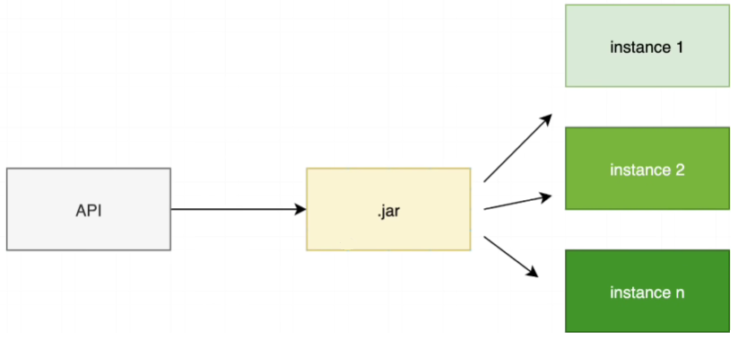

# Spring Boot
###### Kotlin, Java
_Client_ ↦ API 層(GPPD) ↦ Service 層(商業邏輯) ↦ Data Access 層 ↦ _Server_ <br>
Amigoscode : https://youtu.be/9SGDpanrc8U <br>

#### API Layer - 即 StudentController
#### Service Layer - 即 StudentService
```Java
@RestController
@RequestMapping(path="")
public class StudentController{
    
    private final StudentService stuService;
    
    @GetMapping
    public List<Student> getStudents(){
        return studentService.getStudents();
        }
}

@Service //semantically better than using @Component
public class StudentService{
    
    private final StudentRepository studentRepository;
    
    @Autowired
    public StudentService(StudentRepository studentRepository){
        this.studentRepository = studentRepository;
    }
    
    public List<Student> getStudents(){
        return studentRepository.finaAll();
    }
}
```
EDB PostgreSQL Database port:5432 <br>
加入 JPA 需要的連線訊息 <br>
+ spring.database.url=jdbc:postgresql://localhost:5432/amigospringboot
+ spring.database.username=
+ spring.database.password=
+ spring.jpa.hibernate.ddl-auto=create-drop
+ spring.jpa.show-sql=true
+ spring.jpa.properties.hibernate.dialect=org.hibernate.dialect.PostgreSQLDialectXXXX
+ spring.jpa.properties.hibernate.format_sql=true
 
```Java
import javax.persistence.*;
import java.time.LocalDate;

@Entity //for Hibernate
@Table //for database
public class Student {
    @Id
    @SequenceGenerator(
        name = "student_sequence",
        sequenceName = "student_sequence",
        allocationSize = 1
    )
    @GeneratedValue(
            strategy = GenerationType.SEQUENCE,
            generator = "student_sequence"
    )
    private Long id;
    private String name;
    private String email;
    private LocalDate dob;
    @Transient  // Transient:讓系統自行計算年齡
    private Integer age;

    // 把 age 從以下建構子刪除
    // no arg constructor // constructor with everything
    // constructor without everything but not 'id' 
    // getter/setter(or Lombok)
}
```
#### StudentRepository - an interface extended from JPA

```Java
@Repository
public interface StudentRepository 
        extends JpaRepository<Student, Long>{
}
```
#### StudentConfig - 自動輸入資料到資料庫
```Java
@Configuration
public class StudentConfig {
    
    @Bean
    CommandLineRunner commandLineRunner(StudentRepository repository) {
        return args -> {
            Student mariam = new Student(
                    "Mariam","mariam@i3.com", 
                    LocalDate.of(2000,JANUARY, 5)
            );
            Student alex = new Student(
                    "Alex","alex@i3.com",
                    LocalDate.of(2004,APRIL, 5)
            );
            repository.saveAll(
                    List.of(mariam, alex)
            );
        };
    }
}
```
#### @Transient - 不儲存在資料庫內, 透過dob計算
```
@Transient 
private Integer age; 
// 在 student.java 內 age 的 getter 方法內加入此行 
public Integer getAge() { 
    return Period.between(this.dob, LocalDate.now()).getYears(); 
                //介於現在與 date of birth 之間的差距，以年份計算
}
```
#### 如果client傳來的資料中, e-mail已經被使用, 要拋出例外
+ 在 Service 加入 addNewStudent 方法
```
public void addNewStudent(Student student) {
    System.out.println(student);
}
```
+ 在 Controller 加入 registerNewStudent 方法 
```
@PostMapping
public void registerNewStudent(@RequestBody Student student) {
    studentService.addNewStudent(student);
}
```
+ 在 StudentRepository 加上 customized method "findStudentByEmail"
```Java
@Repository
public interface StudentRepository extends JpaRepository<Student, Long> {
    
    @Query("SELECT s FROM Student s WHERE S.email = ?1")
    Optional<Student> findStudentByEmail(String email);
}
```
+ 在 StudentService 加上 addNewStudent 方法以及**重複e-mail的例外**
```Java
class StudentService{
    public void addNewStudent(Student student) {
        Optional<Student> studentOptional = studentRepository
                .findStudentByEmail(student.getEmail());
        if (studentOptional.isPresent()) {
            throw new IllegalStateException("email taken");
        }
        studentRepository.save(student);
    }
}
```
#### Testing post request
+ Post方法加入錯誤訊息，在 application.properties 加上以下設定
`server.error.include-message=always`

#### Delete Method
+ 在 StudentService 加上 deleteStudent 方法
```Java
class StudentService{
    ...
    public void deleteStudent(Long studentId) {
        boolean exists = studentRepository.existsById(studentId);
        if (!exists){
            throw new IllegalStateException(
                    "student with id" + studentId + "does not exist.");
        }
        studentRepository.deleteById(studentId);
    }
}
```
+ 在 StudentController 加上 delete mapping
```Java
class StudentController {
    ...
    @DeleteMapping(path = "{studentId}")
    public void deleteStudent(@PathVariable("studentId")Long studentId){
        studentService.deleteStudent(studentId);
    }
}
```
#### Put Method - 更新/修改
+ 使用到 **@Transactional** Annotation，請參考 JPA tutorial
+ 在 StudentService 加上 updateStudent 方法
```Java
class StudentService{
    ...
    @Transactional
    public void updateStudent(Long studentId, 
                              String name, 
                              String email) {
        Student student = studentRepository.findById(studentId)
                .orElseThrow(() -> new IllegalStateException(
                "student with id" + studentId + "does not exist."));
        // 若 ID 不存在，拋出例外
        
        if(name != null && 
                name.length() > 0 &&
                !Objects.equals(student.getName(), name)) {
            student.setName(name);
        } // 如果輸入的名字非 null 值、至少有一個字、且不等於現有的名字
        
        if (email != null && 
                email.length() > 0 && 
                !Objects.equals(student.getEmail().email)){
            Optional<Student> studentOptional = studentRepository
                    .findStudentByEmail(email);
            if (studentOptional.isPresent()) {
                throw new IllegalStateException("email taken");
            }
            student.setEmail(email);
        } // 同樣條件應用於學生 e-mail
        
    }
}
```
+ 在 StudentController 加上 updateStudent 方法
  + @PathVariable -
  + @RequestParam - 這裡的參數不是一定要提供(required=false)
```Java
class StudentController{
    ...
    @PutMapping(path ="{studentId}")
    public void updateStudent(@PathVariable("studentId") Long studentId,
                              @RequestParam(required = false) String name,
                              @RequestParam(required = false) String email) {
        studentService.updateStudent(studentId, name, email);
    }
}
```
#### Packaging and running application
打包 API, 打開 jar, 執行 multiple instances
1. 刪除 target folder 作法：
   1. 打開 Maven tab (右邊sidebar)，demo > lifecycle > **clean**
   
2. Target folder
   + classes
   + generated-sources
      + annotations
   + generated-test-sources
   + test-classes
   
3. 產生新的 target folder
   1. 打開 Maven tab (右邊sidebar)，demo > lifecycle > **install**
   2. 新的 target folder 裡面會出現以下檔案
      + `demo-0.0.1-SNAPSHOT.jar`
      + demo-0.0.1-SNAPSHOT.jar.original
   3. 打開 Intellij 下方 sideBar 的 terminal
      + demo `cd target`
      + target `java -jar demo-0.0.1-SNAPSHOT.jar`  // -jar + 此JAR的名稱  
        (接者 terminal 就會出現啟動 spring boot 時，console跳的內容)
   4. 如果要開第二個 instance 需要 specify port 號
      + 在 terminal 執行 ctrl + C to shut down application
      + target java -jar demo-0.0.1-SNAPSHOT.jar **--server.port=8081**

      