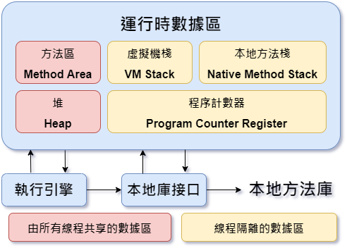

# Java 技術面試問答題:
`Spring Boot EEIT140 Video Day 3 面試準備`
+ 物件導向是什麼 & 定義：封裝、繼承、多型、泛型、抽象類別 vs 介面類別
```
類別：
　　　類別比較算是一個範本，裡面定義好該有的屬性和方法，其中方法又大概可以分為一般的方法、
      類別方法和建構子。物件則是實體的東西，由定義好的類別來建立一個物件。

定義：
　　物件導向的三大特型：封裝、繼承、多型
　　
封裝：
　　將物件內部的資料隱藏起來，只能透過物件本身所提供的介面(interface)取得物件內部屬性或者
    方法。
繼承：
　　一個類別會有「子類別」。子類別比原本的類別(稱為父類別)要更加具體化，
    也就是說子類別繼承了父類別。
多型：
　　多個相同名稱的方法，傳入不同的參數，會執行不同的敘述。包含多載(Overloading)和複寫(Overriding)。
	多載(Overloading) :
		在相同類別中，定義名稱相同，但是參數個數不同，或是參數型態不同的函式，
                這樣就可以利用參數個數或者參數型態，呼叫到對應的方法。
	複寫(Overriding)：
		覆寫掉父類別中的函式
泛型：
    指在定義方法、介面或類的時候，不預先指定具體的型別，而使用的時候再指定一個型別的一個特性。
    EX:
	ArrayList<型別>
```
+ Collection 有哪些
```
用來存儲單列數據的集合接口，常用子接口有List和Set　Queue

Set：
	LinkedHashSet
	　保證裡面元素存放的順序與新增時相同。最適合拿來存放由資料庫中存取的資料集。
 	
	HashSet
	　讀取特快，但不保證存放元素的順序。
	
	TreeSet
	　依物件大小來決定集合裡面的順序。所以存放於TreeSet中元素必需是(實作) Comparable
          的物件。有時候當從自料庫中存取的資料必需自行排序時，就會用到。

List：
	ArrayList、LinkedList、Stack


Queue 可以允許先入先出(FIFO / First-In-First-Out)。
LinkedList、ArrayBlockingQueue、PriorityQueue
```
+ 紙筆考試：Main 方法
    + (public static void main(String[] args { })

<br/>

## SQL 問答題:
+ Left join vs right join 差異
    + Left join
        +   左表中的所有記錄和右表中聯結欄位相等的記錄
    + right join
        +  包括右表中的所有記錄和左表中聯結欄位相等的記錄
    
+ Id 自動產生的方式 (GenerationType.Identity 與 Sequence 差別)
    + GenerationType.Identity
        + 主键由数据库自动生成（主要是自动增长型）
    + Sequence：不需要依賴任何資料表。
        + 單一個「SEQUENCE(順序物件)」就可以提供關鍵值給予一群的資料表。
+ 紙筆考試： 3 Tables join

何謂 ACID？

+ 原子性 Atomicity：
    + 同一筆交易不是成功就是失敗(不會扣錢只扣一半, 另一邊沒加到)
+ 一致性 Consistency：
    + 外來鍵增加的資料如果不是另一張表主鍵有的資料，不會讓你加
+ 隔離性 Isolation：
    + 不會兩筆交易同時進去table拿東西
+ 持久性 Durability：
    + commit 完成之後，資料就會存在硬碟上面

+ `Index System:`
    + 索引是指允許更快地從表中檢索記錄的效能調整方法。索引為每個值建立一個條目，因此檢索資料會更快。

+ `Trigger 觸發程序:`
    + TBD

<br/>

## JavaScript 面試問答題
+ var, const, let 差別
    + `var`：只能用來宣告變數，使用“函式範圍（function scope）”，函數的宣告都會被定為全域變數。

    + `let`：宣告變數，使用“區塊範圍（block scope）”，let 會把宣告的變數直接附著在他所在的區塊中，常見的是一對{}。

    + `const`：宣告常數，使用“區塊範圍（block scope）”，const宣告的值固定不變，之後任何想改變其值會造成錯誤。

+ js 拿到日期有哪些方法 (非常多)
    + `new Date();`
    + `new Date(value);`
    + `new Date(dateString);`
    + `new Date(year, month[, day[, hour[, minutes[, seconds[, milliseconds]]]]]);`
    + `Date.now()`
        + 回傳十五秒的數字 - 1970/01/01 00:00:00 (UTC) 到今天的數字。

    + `Date.parse()` (zh-CN)
	    + 解析字串的，回傳由 1970/01/01 00:00:00 (UTC) 到該時間的顯示字所表示的時間。

    + `Date.UTC()`
	    + 需要傳入建構子相同參數數目（（即2），1970-01-01-01 00：00：00 utc到的數（輸入參數，當地時間）

+ this 是什麼?
    + 在每個 function 的 scope 內自動定義的關鍵字，它永遠指向一個物件，指向的物件具體是哪個，就一定要提到一個相關的詞 — 執行環境(execution context)。
+ this v.s. obj
+ Arrow function vs 一般的 function 
    + 只需使用胖箭頭 => 簡化了程式碼形式，預設return表示式結果

+ ES5 vs ES6 差異
    + 解構賦值 (Destructuring Assignment)
    + 展開運算子 (Spread Operator) 
    + 其餘參數 (Rest parameters)
    + https://ithelp.ithome.com.tw/articles/10206587

<br/>

## CSS 面試問答題
+ 垂直置中 (至少準備三種)
    + Line-height　單行文字垂直置中
    + Padding
    + display
+ 水平置中 (至少準備三種)
    + text-align: center
    + margin: 0 auto;
    + justify-content: center

+ Flex-box 排版  vs Grid網格排版方式
    + Flex-box 排版
        + `flex-wrap`
            + nowrap(預設值)會將所有的 flex items 壓縮在同一行
            + 設值為 wrap，則不會壓縮 items，如果 items 過多就換行
        + `align-content`
        + `justify-content`
        + `flex-grow`　使所有欄與最高欄的對齊
    + Grid 網格排版方式
        + `row`: 預設值， grid 內的元素會以橫向(左到右)排列
        + `column`
        + `grid` 內的元素會以縱向(上到下)排列
        + `dense` (row dense/column dense)
        + `grid` 內的小元素優先排列，可能會造成排序上的優先問題，不建議使用
<br/>

## Servlet 面試問題
+ request ---(中間的過程，會跑過哪些東西。 Filter, listener等等先後順序)--->  response 
+ JSP 會不會使用 EL、JSTL?
+ EL:
    + EL：${ }
        + 包含了<% %>與<%= %>　但不能寫多行的程式
+ JSTL:
    + 是一個JSP標籤集合，它封裝了JSP應用的通用核心功能。
    + 核心標籤
        ```JSP
        <%@ taglib prefix = "c" uri = "http://java.sun.com/jsp/jstl/core" %>
	    <c:if …> </c:if>
	    <!--test：是測試表達式-->
	    <!--var：用来保存 test 表達式的结果-->
	    <!--scope：var 變量的訪問-->
        ```
    + 格式化標籤
        ```JSP
        <%@ taglib prefix = "fmt" uri = "http://java.sun.com/jsp/jstl/fmt" %>
        ```
<br/>

## Hibernate 面試問題
+ 用來解決什麼問題？
+ hibernate 的 Mapping 是什麼？
+ 一對一、一對多、多對多

<br/>

## Spring 面試問題
+ 控制反轉 Inversion of Control：一個設計思想，把對於某個物件的控制權移轉給第三方容器
    + A物件程式內部需要使用B物件 A,B物件中有依賴的成份。控制反轉是把原本A對B控制權移交給第三方容器。
+ 依賴注入：控制反轉的實現。把被依賴物件注入被動接收物件中。
+ 製作 Bean 的三種方式 (ans.: `xml`, `@Component`, `@Configuration + @Bean`)

<br/>

## Spring MVC面試問題
+ 物件 DispatcherServlet 是什麼
+ 控制的機制 Handler Mapping 
+ 何謂 Controller？ 由什麼物件控制？
    + 控制器：收發 request/response 
    + 自路由的 request 會先被送到 Controller，再由 Controller 通知 Model 調度資料，並且把資料傳遞給 View
+ 什麼是 Model and View？ 由什麼物件控制？
    + `Model`
        + 負責和資料庫溝通。放資料、與資料庫連動的物件 邏輯層」，更明確一點說，是和「商業邏輯」有關的功能
    + `CRUD`
        + 需要先有 Model 層幫忙去資料庫裡取出必要的資料，把資料放進應用程式裡的某個程式物件，然後才能用 JavaScript 去操作該物件
    + `View`
        + 以動態顯示資料的情況(由 Model 取出的資料內容)，負責管理畫面的呈現

<br/>

## Spring Boot 面試問題
+ 何謂「約定大於配置」
    + Convention over configuration:
        + 減少軟體開發人員需做決定的數量。開發人員僅需規定應用中不符約定的部分。
+ 簡化了什麼東西？
+ (解決很多環境問題。例：本來要寫 @Configuration，現在只要寫在 application.properties，內建 tomcat)

<br/>

## Restful
+ 是一種風格，回傳的是 JSON，前後端分離的狀況下，兩端溝通的橋樑
<br/>
<br/>
<br/>

# 經典 Java 200 題
`tuLing_ZhouYu`
1. JDK  |  JRE  |  JVM 
    + 概述
        + JDK Java 標準開發包，提供了 **Java 編譯器**、**Java 運行環境**、常用 **Java 類庫**
        + JRE Java 運行環境，用於運行 Java 的字節碼文件。JRE 包括了 JVM 以及 JVM 工作需要的類庫
        + JVM Java 虛擬機，是 JRE 的一部分，是 Java 實現跨平台最核心的部分，負責**運行字節碼**文件

    + 如果要開發 Java 專案就需要 JDK，因為要編譯 Java 源文件
    + 如果只是要運行 Java 字節碼文件(xxx.class)，那只需要 JRE
    + ( __JDK__ ( __JRE__ (__JVM__)))
    + JVM 在運行字節碼時，必須把字節碼解釋為機器指令。不同操作系統上的 JVM 不一樣，因為不同操作系統上的機器指令不同
    + Apache Groovy, Scala, Kotlin 這幾種語言編譯之後是 Java 字節碼，編譯之後也能在 JVM 上運行

2. hashCode() 與 equals() 差異
    + 判斷兩個 User的 hashcode 是否相同，相同的話才會調用 equals 方法來進行比較
    + 需重寫 hashCode() 方法，要跟 equals 方法的邏輯保持一致
    ```Java
    public class Main {
        public static void main(String[] args){
            
            HashMap<User, String> hashMap = new HashMap<>();
            hashMap.put(new User("yicelwen"), "123");

            System.out.println(hashMap.get(new User("yicelwen")));
            // 如果沒有重寫 hashCode 方法，get 方法拿不到回傳值 // null
        }
    }
    ```
    ```Java
    public class User {
        private String name;

        public user(String name){
            this.name = name;
        }

        public String getName() {
            return name;
        }

        /** 得到屬性並進行比較
        **/
        @Override  
        public boolean equals(Object obj) {
            User user = (User) obj;
            return user.getName().equals(this.name);
        }

        /** 邏輯要與 equals 保持一致。關注的屬性都是 name。
        **/
        @Override
        public int hashCode() {
            return name.hashCode();
        }
    }
    ```

3. String、StringBuffer、StringBuilder 區別
    + String 常量、不可變
        + Strings are constant.
    + StringBuffer 線程安全
        + 類似於 String 但是可以修改
    + StringBuilder 線程不安全
        + 線程不安全 = 沒有同步的
        + 在單線程環境下，StringBuilder效率比較高

4. 泛型中 extends 和 super 
    + <? extends T> 表示包括 T 在內的任何 T 的子類
    + <? super T> 表示包括 T 在內的任何 T 的父類
    ```Java
    public static void main(String[] args) {
        YiwenList<BigDecimal> ywList = new YiwenList();

        ywList.add(new BigDecimal(1));
        ywList.add(new Integer(1));
        // 編譯會檢查增加的內容是否屬於泛型規範的類型
    }
    ```
    ```Java
    public class YiwenList<E extends Number> {
        public void add(E e){
            // ...
        }
    }
    ```

5. == 和 equals 方法區別
    + == : 如果是`基本資料型別`，比較的是值、如果是`參考資料型別`，比較的是記憶體位置/引用地址
    + equals : 要看各類別重寫 equals 方法之後的比較邏輯
        + String 類: 雖然是參考資料型別，但是此類別重寫了 equals 方法，方法內部比較的是字符串中的各個字符是否**全部相等**。
        ```Java
        // String class 底下重寫的 equals 方法
        public class String {
            public boolean equals(Object anObject) {
                if (this == anObject) {
                    return true;
                }
                if(anObject instanceof String) {
                    String anotherString = (String)anObject;
                    int n = value.length;
                    if (n == anotherString.value.length) {
                        char v1[] = value;
                        char v2[] = anotherString.value;
                        int i = 0;
                        while (n-- !=0) {
                            if (v1[i] != v2[i])
                                return false;
                            i++;
                        }
                        return true;
                    }
            }
            return false;
        }
        ```
6.  重載 和 重寫 的區別
    + 重載 Overloading：發生在**同一個類別**中，方法名稱必須相同，參數類型不同。個數不同、順序不同也是重載、方法返回值和訪問修飾子可以不同，發生在編譯時。
    + 重寫 Override：發生在**父子類**中
        + 參數列表必須相同
        + 返回值範圍小於等於父類別
        + 拋出的異常範圍小於等於父類別
        + 訪問修飾符範圍大於等於父類別 (i.e. protected / private)。<br/>
          如果父類別的訪問修飾符是 private，子類別就無法重寫此方法           
        
7. List 和 Set 的區別
    + List：有序，按對象進入的順序保存對象，可重複。允許多個 Null 元素對象。
        + 可以使用 iterator 迭代器取出所有元素，再逐一遍歷
        + 還可以使用 get(int index) 獲取指定下標的元素
    + Set：無序，不可重複，最多允許有一個 Null 元素對象
        + 可以用 iterator 取得並遍歷所有元素，沒有下標訪問

8. ArrayList 和 LinkedList 區別
    + 底層數據：ArrayList 數組  |  LinkedList 鏈表
    + 適用場景：ArrayList - 適合隨機查找 | LinkedList 適合刪除添加
    + LinkedList 除了實現 List，還實現了對列 Queue 介面 (有addFirst()、addLast()、getFirst()、getLast() 等方法)

9. ConcurrentHashMap 的擴容機制
    + JDK 1.7
        + 基於`Segment 分段`實現，每一個 Segment 下面的 HashMap 再擴容
        + 首先，生成新的數組，然後轉移元素到新的數組中
        + HashMap 轉移到新的 HashMap(雙倍擴容) 完成後，該 Segment 再重新指向新的 HashMap
    + JDK 1.8
        + Key-value 組成的 Entry，不再基於 Segment 實現
        + **1.8 支援多線程擴容**，即舊的 Entry 內容轉到雙倍擴容的新 Entry (新的數組) 時，其中幾個元素由某線程負責，另外幾個由其他線程負責轉移元素

10. JDK 1.7 到 JDK 1.8 之間 HashMap 發生了什麼底層變化
    + 1.7 數組 + 鏈表實現 `鏈表在插入值的時候，要先判斷`
        + 使用頭插法
        + Hash 哈希算法比較複雜，存在各種右移與與異或運算，為了提高散列性
    + 1.8 數組 + 鏈表 + **紅黑樹** `目的：提高 HashMap 插入和查詢的整體效率`
        + 使用`尾插法`
        + 因為插入 key-value 時需要判斷鏈表元素個數，所以需要遍歷鏈表，以統計鏈表元素個素
        + 增加紅黑數，可以簡化了 Hash 哈希算法，節省 CPU 資源

11. HashMap 的 put 方法
    + 大致流程原理
        1. 根據 put 進來的 key 通過哈希算法與運算
        2. 判斷數組下標當前位置是否為空，如果是，就將Key-Value封裝成 Entry 對象並放入該位置
            + JDK 1.7 是封裝成 `Entry` 對象、JDK 1.8 是封裝成 `Node` 對象
        3. 如果數組下標位置不為空值，則分版本討論：
            + 1.7:
                + 判斷是否要擴容，不用擴容的話會生成 Entry 對象，並透過頭插法插入當前列表位置
            + 1.8:
                + 判斷當前 Node 是紅黑樹的 node 還是鏈表的 node：
                    + **紅黑樹**：把KV封裝成Node節點，放入紅黑樹<br/>
                         同時判斷當前紅黑樹裡是否已經存在此key，若存在，就更新value
                    + **鏈表**：把KV封裝成Node，透過`尾插法`放進去<br/>
                         遍歷鏈表目的 (1)查看有無相同 key (2)計算有幾個元素 <br/>
                         插入鏈表後，若全部元素如果大於等於 8 個，就會把鏈表轉成紅黑樹
                         最後判斷是否需要擴容
                         
12. 深拷貝 vs 淺拷貝
    + 基本資料型別、實例對象 (user class, orderService) 的引用
        + 淺拷貝：只會拷貝基本數據類型的值以及實例對象的引用地址，不會複製引用地址所指向的對象
            + 即淺拷貝出來的對象，內部類別屬性指向的是同一個對象
        + 深拷貝：既會拷貝基本數據類型的值，也會針對實例對象的引用地址所指向的對象進行複製
            + 深拷貝出來的對象，內部的屬性指向的兩個不同的對象

13. HashMap 的擴容機制
    + 1.7 版
        + 針對數組擴容，鏈表不需要擴容
        + 步驟
            1. 首先，生成新數組 (通常是雙倍 eg. 8 vs 16)
            2. 遍歷老數組中的每個位置上的鏈表上的每個元素
            3. 取每個元素的 key，並基於新數組長度，算出每個元素在新數組中的下標
            4. 將元素添加到新數組中去，完成元素轉移
            5. 所有元素轉移完了之後，將新數組賦值給 HashMap 對象的 table 屬性
    + 1.8 版
        + 步驟
            1. 首先，生成新數組  
            2. 遍歷老數組中的每個位置上的鏈表或者紅黑樹
            3. 如果是鏈表，則直接將鏈表中的每個元素重新計算下標，並添加到新數組中
            4. 如果是紅黑樹，則先遍歷紅黑樹，先計算出紅黑樹中每個元素對應在新數組中的下標位置
                1. 統計每個下標位置的元素個數
                2. 如果該位置下的元素個數超過了 8，則生成一個新的紅黑樹，並將根節點的添加到新數組的對應位置
                3. 如果該位置下的元素沒有超過 8，則生成一個鏈表，並將鏈表的頭節點添加到新數組的對應位置
            5. 所有元素轉移完之後，將新數組賦值給 Hash 對象的 table 屬性


14. CopyOnWriteArrayList 的底層原理是怎樣的
    + 需要有一個線程安全的 ArrayList
        1. 首先 CopyOnWriteArrayList 內部也是用過數組來實現的，在向 CopyOnWriteArrayList 添加元素時，會複製一個新的數組，`寫`操作在新數組上進行，`讀`操作在原數組上進行
        2. `寫`操作會加鎖，防止出現開發寫入丟失數據的問題
        3. `寫`操作結束之後會把原數組指向新數組
        4. CopyOnWriteArrayList 允許在`寫操作`來讀取數據，大大提高了讀的性能，因此適合**讀多寫少**的應用場景，但是 CopyOnWriteArrayList 會比較佔內存，同時可能讀到的數據不是實時最新的數據，所以不適合實時性要求很高的場景
        ```Java
        /**
        * Appends the specified element to the end of the list.
        * Params e: element to be appended to this list
        * Returns: true (as specified by Collection.add)
        **/
        public class CopyOnWriteArrayList {
            public boolean add(E e) {
                final ReentrantLock lock = this.lock;
                lock.lock(); // 兩個線程同時進來 add，只有一個可以加到鎖
                try {
                    Object[] elements = getArray();
                    int len = elements.length;
                    Object[] newElements = Array.copyOf(elements, len + 1);
                    newElements[len] = e;
                    setArray(newElements);
                    return true;
                } finally {
                    lock.unlock();
                }
            }
        }
        ```

15. 什麼是字節碼？採用字節碼的好處是什麼？
    + 編譯器 (javac) 將 Java 源文件(\*.java) 文件編譯成為**字節碼文件 (*.class)**，可以做到一次編譯到處運行，windows 上編譯好的 class 文件，可以直接在 linux 上運行，通過這種方式做到跨平台，不過 Java 的跨平台有一個前提條件，就是不同操作系統上裝的 JDK 或者 JRE 並不同，雖然字節碼通用，但需要把字節碼解釋成各個操作系統的機器碼是需要不同的解釋器，所以針對各個操作系統需要有各自的 JDK 或 JRE。

    + 採用字節碼的好處，一方面實現了跨平台，另一方面也提高了代碼執行的性能，編譯器在編譯源代碼時可以做一些編譯期的優化，例如：鎖消除、標量替換、方法內聯等。

16. Java 中的異常體系是怎麼樣的
    + Java 中所有異常都來自頂級父類別 Throwable
    + Throwable 下有兩個子類別 Exception 和 Error

    + Error 表示非常嚴重的錯誤，比如 java.lang.StackOverFlowError 和 java.lang.OutOfMemoryError，通常這些錯誤出現時，僅僅靠程序自己是解決不了的，可能是虛擬機，磁盤，操作系統層面出現的問題了，所以通常也不建議在代碼中去補獲這些 Error，因為捕獲的意義不大，因為程序可能已經根本運行不了了。
    + Exception 表示異常，表示程序出現 Exception 時，是可以靠程序自己來解決的，比如 NullPointerException、IllegalAccessException等，我們可以捕獲這些異常來做特殊處理。
    + Exception 的子類通常又可以分為 RuntimeException 和非 RuntimeException 兩類別
    + RuntimeException 表示**運行期異常**，表示這個異常是在代碼運行過程中拋出的，這些異常是`非檢查異常`，程序中可以選擇捕獲處理，也可以不處理，這些異常*一般是由程序邏輯錯誤引起的，程序應該從邏輯角度盡可能避免這類異常的發生*，比如 NullPointerException、IndexOutOfBoundsException 等。
    + 非 RuntimeException 表示**非運行期異常**，也就是我們常說的`檢查異常`，是必須進行處理的異常，如果不處理，程序就不能檢查異常通過，例如 IOException、SQLException 等，以及用戶自定義的 Exception 異常。

17. 什麼時候應該拋出異常，什麼時候捕獲異常
    + 異常相當於一種題式，若我們拋出異常，相當於告訴上層方法「我拋出了一個異常，我處理不了這個異常，交給你來處理」，而對於上層方法來說，它也需要決定自己能不能處理這個異常，是否也需要交給它的上層。
    + 所以我們在寫一個方法時，需要考慮的是，本方法能否合理的處理該異常，如果處理不了就繼續向上拋出異常，包括本方法中，在調用另外一個方法時，發現出現了異常，如果這個異常應該由自己來處理，那就捕獲該異常並進行處理。

18. Java 中有哪些類別加載器
    + JDK 自帶三個類別加載器：
        1. `BootStrapClassLoader`：是`ExtClassLoader`的父類別加載器，默認負責加載`%JAVA_HOME%lib`下的 jar 包和 class 文件
        2. `ExtClassLoader`：是`AppClassLoader`的父類別加載器，負責加載`%JAVA_HOME%/lib/ext`文件夾下的 jar 包和 class 類
        3. `AppClassLoader`：是自定義類加載器的父類別，負責加載 classpath 下的類別文件

19. 說說類別加載器的雙親委派模型
    + JVM 中存在三個默認的類別加載器：
        1. BootstrapClassLoader
        2. ExtClassLoader
        3. AppClassLoader
    + `AppClassLoader`的父加載器是 ExtClassLoader，ExtClassLoader 的父加載器是 BootstrapClassLoader
    + JVM 在加載一個類時，會調用 AppClassLoader 的 loadClass 方法來加載這個類，不過在這個方法中，會先使用 ExtClassLoader 的 loadClass 方法來加載類別
        + 同樣 ExtClassLoader 的 loadClass 方法中會先使用 BootstrapClassLoader 來加載類別
        + 如果 BootstrapClassLoader 加載到了就直接成功
        + 如果 BootstrapClassLoader 沒有加載到，那麼 ExtClassLoader 就會自己嘗試加載該類
        + 若沒有加載到，那麼就會由 AppClassLoader 加載這個類
    + 因此，`雙親委派` 指的是 JVM 在加載類時，會委派給 Ext 和 Bootstrap 進行加載，如果沒加載到才由自己進行加載

20. JVM 中哪些是線程共享區
    + 堆區和方法區是所有線程共享的。棧 (Stack)、本地方法棧、程序計數器是每個線程獨有的
       

21. 你們的項目如何排查 JVM 問題
    + 對於還在正常運行的系統
        1. 可以使用 jmap 來查看 JVM 中各個區域的使用狀況
        2. 可以通過 jstack 來查看線程的運行情況，比如哪些線程阻塞，是否出現了死鎖
        3. 可以通過 jstat 命令來查看垃圾回收的情況，特別是 fullgc，如果發現 fullgc 比較頻繁，那麼就得進行調優了
        4. 通過各個命令的結果，或者 jvisualvm 等工具來進行分析
        5. 首先，初步猜測頻繁發送 fullgc 的原因，如果頻繁發生 fullgc 但是又一直沒有出現內存溢出，那麼表示 fullgc 實際上是回收了很多對象了，所以這些對象最好能再 younggc 過程中就直接回收掉，避免這些對象進入到老年代，對於這種情況，就要考慮這些存活時間不長的對象是不是比較大，導致年輕代放不下，直接進入到了老年代，嘗試加大年輕代的大小，如果改完之後，fullgc 減少，則證明修改有效
        6. 同時，還可以找到占用 CPU 最多的線程，定位到具體的方法，優化這個方法的執行，看是否能避免某些對象的創建，從而節省內存

    + 對於已經發生了 OOM 系統：
        1. 一般生產系統中都會設置當系統發生了 OOM 時，生成當時的 dump 文件 
            + (-XX: + HeapDumpOnOutOfMemoryError  -XX: HeapDumpPath=/usr/local/base)
        2. 我們可以利用 sisualvm 等工具來分析 dump 文件
        3. 根據 dump 文件找到異常的實例對象，和異常的線程 (占用 CPU 高)，訂位到具體的代碼
        4. 然後再進行詳細的分析和調試
    + 總之，調優不是一蹴而就的，需要分析、推理、實踐、總結、再分析，最終定位到具體的問題

22. 一個對象從加載到 JVM，再到被 GC 清除，都經歷了什麼過程
    1. 首先把字節碼文件內容加載到方法區
    2. 然後再根據類別信息在堆區創建對象
    3. 對象首先會分配在堆區中年輕代的 `Eden 區`，經過一次 `Minor GC` 後，對象如果存活，就會進入 `Survivor 區`。在後續的每次 Minor GC 中，如果對象一直存活，就會在 Survivor 區來回拷貝，每移動一次，年齡加 1
    4. 當年齡超過 15 後，對象依然存活，對象就會進入老年代
    5. 如果經過 Full GC，被標記為垃圾對象，那麼就會被 GC 線程清理掉

23. 怎麼確定一個對象到底是不是垃圾
    1. **引用計數算法**：這種方式是給堆內存當中的每個對象紀錄一個引用個數，引用個數為０ 的就認為是垃圾。這是早期JDK中使用的方式。引用計數無法解決循環引用的問題。
    2. **可達性算法**：這種方法是在內存中，從根對象向下一直找引用，找到的對象就不是垃圾，沒找到的對象就是垃圾。

24. JVM 有哪些垃圾回收算法
    1. 標記清除算法
        1. **標記階段**：把垃圾內存標記出來
        2. **清除階段**：直接將垃圾內存回收
        3. 這種算法是比較簡單的，但是有個很嚴重的問題，就是會產生大量的內存碎片
    2. 複製算法：
        + 為了解決標記清除算法的內存碎片問題，產生了複製算法，複製算法將內存分為大小相等的兩半，每次只使用其中一半。垃圾回收時，將當前這一塊的存活對象全部拷貝到另一半，然後當前這一半內存就可以直接清除。這種算法沒有內存碎片，但是他的問題就在於浪費空間。而且，他的效率跟存活對象的個數有關。
    3. 標記壓縮算法：
        + 為了解決複製算法的缺陷，就提出了標記壓縮算法，這種算法在標記階段跟清除算法是一樣的，但是在完成標記之後，不是直接清理垃圾內存，而是將存活對象往一端移動，然後將邊界以外的所有內存直接清除。

25. 什麼是 STW
    + STW (`Stop-The-World`)，是在垃圾回收算法執行過程當中，需要**將 JVM 內存凍結**的一種狀態。在 STW 狀態下，Java 的所有線程都是停止執行的，-GC 線程除外，native 方法可以執行，但是不能與 JVM 交互。GC 各種算法優化的重點，就是減少 STW，同時這也是 JVM 調優的重點。

26. 常用的 JVM 啟動參數有哪些
    + JVM 參數大致可以分為三類：
        1. 標註指令：-開頭，這些是所有的 HotSpot 都支持的參數，可以用 java -help 打印出來
        2. 非標準指令：-x 開頭，這些指令通常是跟特定的 HotSpot 版本對應的，可以用 java -X 打印出來
        3. 不穩定參數： -xx 開頭，這一類參數是跟特定 HotSpot 版本對應的，並且變化非常大

        <br/>

        ```properties
        # JVM 啟動參數不換行

        # 設置堆內存
        -Xmx4g -Xms4g

        # 指定 GC 算法
        -XX:+UseG1GC  -XX:MaxGCPauseMillis=50  // 選用G1垃圾回收器，並設定參數配置最大垃圾回收棧時間控制在 50 毫秒

        # 指定 GC 并行線程數
        -XX:ParallelGCThreads=4

        # 打印GC日誌
        -XX:+PrintGCDetails -XX:+PrintGCDateStamps
        // + 開啟

        # 指定GC日誌文件
        -Xloggc:gc.log

        # 指定Meta區的最大值
        -XX:MaxMetaspaceSize=2g

        # 設置單個線程棧的大小
        -Xss1m

        # 指定堆內存溢出時自動進行 Dump
        -XX:+HeapDumpOnOutOfMemoryError // 當發生 OutOfMemoryError 時，執行 HeapDump
        -XX:HeapDumpPath=/usr/local/    // 指定 HeapDump 的路徑
        ```

27. 說說對線程安全的理解
    + 線程安全指的是，我們寫的某段代碼，在多個線程同時執行這段代碼時，不會產生混亂，依然能夠得到正常的結果。比如 `i++`，i 初始化值為 0，那麼兩個線程來同時執行這行代碼，如果代碼是線程安全的，那麼最終的結果應該就是一個線程的結果為 1，一個線程的結果為 2，如果出現了
    + 所以線程安全，主要指的是一段代碼在多個線程同時執行的情況下，能否得到正確的結果

28. 對守護線程的理解

29. ThreadLocal 的底層原理

30. 並發、並行、串行之間的區別

31. Java 死鎖如何避免

32. 線程池的底層工作原理

33. 線程池為什麼是先添加列隊而不是先創建最大線程

34. ReentrantLock 中的公平鎖和非公平鎖的底層實現

35. ReentrantLock 中 tryLock() 和 lock() 方法的區別

36. CountDownLatch 和 Semaphore 的區別和底層原理

37. Synchronized 的偏向鎖、輕量級鎖、重量級鎖

38. Synchronized 和 ReentrantLock 的區別

39. 對於 AQS 的理解，AQS 如何實現可重入鎖？

40. 對於 IOC 的理解

41. 單例 Bean 和單例模式

42. Spring 事務傳播機制

43. Spring 事務什麼時候會失效

44. Spring 中的 Bean 創建的生命週期有哪些步驟

45. Spring 中 Bean 是線程安全的嗎

46. ApplicationContext 和 BeanFactory 有什麼區別

47. Spring 中的事務是如何實現的

48. Spring 中什麼時候 `@Transactional` 會失效

49. Spring 容器啟動流程是蝦咪款

50. Spring 用到了那些設計模式

51. Spring Boot 中常用註解以及其底層實現

52. Spring Boot 是如何啟動 Tomcat 的

53. Mybatis 的優缺點

54. Mybatis 中 #{} 和 ${} 的區別是什麼

55. 索引的基本原理

56. 索引的設計原則

57. 事務的基本特性和隔離級別

58. 什麼是 MVCC

59. 簡述 MyISAM 和 InnoDB 的區別

60. `Explain 語句`結果中各個字段分表表示什麼

61. 索引覆蓋是什麼

62. 最左前綴原則是什麼

63. InnoDB 是如何實現事務的

64. B 樹和 B+ 樹的區別，為什麼 MySQL 使用 B+ 樹

65. MySQL 鎖有哪些，如何理解


66. 什麼是 RDB 和 AOF

67. Redis 的過期鍵的刪除策略

68. 簡述 redis 事務實現

69. redis 主從複製的核心原理

70. Redis 有哪些數據結構？分別有哪些典型的應用場景？

71. Redis 分布式鎖底層是如何實現的？

72. Redis 集群策略

73. 緩存穿透、緩存擊穿、緩存雪崩分別是什麼

74. Redis 和 MySQL 如何保證數據一致

75. Redis 的持久化機制

76. Redis 單線程為什麼這麼快

77. 簡述 redis 事務實現

78. CAP 理論、BASE 理論

79. 什麼是 RPC

80. 數據一致性模型有哪些

81. 分布式 ID 是什麼？有哪些解決方案

82. 分布式鎖的使用場景是什麼？有哪些實現方案？

83. 什麼是 ZAB 協議

84. 為什麼 Zookeeper 可以用來作為註冊中心

85. Zookeeper 中的領導者選舉的流程是怎樣的？

86. Zookeeper 集群中，節點之間數據是如何同步的

87. Dubbo 支持哪些負載均衡策略

88. Dubbo 是如何完成服務導出的

89. Dubbo 是如何完成服務引入的

90. Dubbo 的架構設計是怎樣的

91. 負載均衡算法有哪些

92. 分布式架構下，Session 共享有什麼方案

93. 如何實現接口冪等性

94. 簡述 zk 的命名服務、配置管理、集群管理

95. 講下 Zookeeper watch 機制

96. zk 和 eureka 的區別

97. 存儲拆分後如何解決唯一主鍵

98. 雪花算法原理

99. Spring Cloud 有哪些常用組件，作用是什麼

100. 如何避免緩存穿透、緩存擊穿、緩存雪崩

101. 分布式系統中常用的緩存方案有哪些

102. 緩存過期都有哪些策略

103. 常見的緩存淘汰算法

104. 布隆過濾器原理與優缺點

105. 分布式緩存尋址算法

106. Spring Cloud 和 Dubbo 有哪些區別

107. 什麼是服務雪崩？什麼是服務限流？

108. 什麼是服務熔斷？什麼是服務降級？區別是什麼？

109. SOA、分布式、微服務之間有什麼關係和區別

110. 怎麼拆分微服務

111. 有沒有了解過 DDD 領域驅動設計

112. 什麼是中台

113. 項目中怎麼保證微服務敏捷開發

114. 如何進行消息隊列選型

115. RocketMQ 的事物消息是如何實現的

116. 為什麼 Zookeeper 可以用來作為註冊中心

117. RocketMQ 的底層實現原理

118. 消息隊列如何保證消息可靠傳輸

119. 消息隊列有哪些作用

120. 死信隊列是什麼？延時隊列是什麼？

121. MQ 如何保證消息的高效讀寫

122. epoll 和 poll 的區別

123. TCP 的三次握手和四次揮手

124. 瀏覽器發出一個請求到收到響應經歷了哪一些步驟

125. 跨域請求式什麼？有什麼問題？怎麼解決？

126. 什麼是零拷貝
