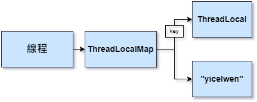
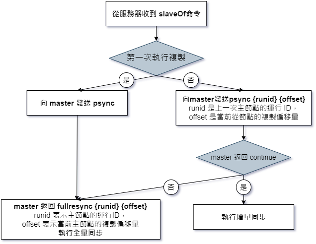

# Java 技術面試問答題:
`Spring Boot EEIT140 Video Day 3 面試準備`
+ 物件導向是什麼 & 定義：封裝、繼承、多型、泛型、抽象類別 vs 介面類別
    + 類別：
        + 類別比較算是一個範本，裡面定義好該有的屬性和方法，其中方法又大概可以分為一般的方法、類別方法和建構子。物件則是實體的東西，由定義好的類別來建立一個物件。
    + 定義：物件導向的三大特型：封裝、繼承、多型
        + **封裝**：
            + 將物件內部的資料隱藏起來，只能透過物件本身所提供的介面(interface)取得物件內部屬性或者方法。
        + **繼承**：
            + 一個類別會有「子類別」。子類別比原本的類別(稱為父類別)要更加具體化，也就是說子類別繼承了父類別
        + **多型**：
            + 多個相同名稱的方法，傳入不同的參數，會執行不同的敘述。包含多載(Overloading)和複寫(Overriding)
                + **多載(Overloading)** :
                    + 在相同類別中，定義名稱相同，但是參數個數不同，或是參數型態不同的函式，這樣就可以利用參數個數或者參數型態，呼叫到對應的方法
                + **複寫(Overriding)**：覆寫掉父類別中的函式
    + **泛型**：指在定義方法、介面或類的時候，不預先指定具體的型別，而使用的時候再指定一個型別的一個特性。
    EX: ArrayList<型別>


+ Collection 有哪些
    + 關於 Collection 的筆記 https://github.com/yicelwen/Notizbuch_i3/blob/master/Java%20Collection_aka_data_structure.md
    <br/>
```
Collection 
Set：
	LinkedHashSet
	　保證裡面元素存放的順序與新增時相同。最適合拿來存放由資料庫中存取的資料集。
 	
	HashSet
	　讀取特快，但不保證存放元素的順序。
	
	TreeSet
	　依物件大小來決定集合裡面的順序。所以存放於TreeSet中元素必需是(實作) Comparable
          的物件。有時候當從自料庫中存取的資料必需自行排序時，就會用到。

List：
	ArrayList、LinkedList、Stack


Queue 可以允許先入先出(FIFO / First-In-First-Out)。
LinkedList、ArrayBlockingQueue、PriorityQueue
```
+ 紙筆考試：Main 方法
    + (public static void main(String[] args { })

<br/>

## SQL 問答題:
+ Left join vs right join 差異
    + Left join
        +   左表中的所有記錄和右表中聯結欄位相等的記錄
    + right join
        +  包括右表中的所有記錄和左表中聯結欄位相等的記錄
    
+ Id 自動產生的方式 (GenerationType.Identity 與 Sequence 差別)
    + GenerationType.Identity
        + 主键由数据库自动生成（主要是自动增长型）
    + Sequence：不需要依賴任何資料表。
        + 單一個「SEQUENCE(順序物件)」就可以提供關鍵值給予一群的資料表。
+ 紙筆考試： 3 Tables join

何謂 ACID？

+ 原子性 Atomicity：
    + 同一筆交易不是成功就是失敗(不會扣錢只扣一半, 另一邊沒加到)
+ 一致性 Consistency：
    + 外來鍵增加的資料如果不是另一張表主鍵有的資料，不會讓你加
+ 隔離性 Isolation：
    + 不會兩筆交易同時進去table拿東西
+ 持久性 Durability：
    + commit 完成之後，資料就會存在硬碟上面

+ `Index System:`
    + 索引是指允許更快地從表中檢索記錄的效能調整方法。索引為每個值建立一個條目，因此檢索資料會更快。

+ `Trigger 觸發程序:`
    + TBD

<br/>

## JavaScript 面試問答題
+ var, const, let 差別
    + `var`：只能用來宣告變數，使用“函式範圍（function scope）”，函數的宣告都會被定為全域變數。

    + `let`：宣告變數，使用“區塊範圍（block scope）”，let 會把宣告的變數直接附著在他所在的區塊中，常見的是一對{}。

    + `const`：宣告常數，使用“區塊範圍（block scope）”，const宣告的值固定不變，之後任何想改變其值會造成錯誤。

+ js 拿到日期有哪些方法 (非常多)
    + `new Date();`
    + `new Date(value);`
    + `new Date(dateString);`
    + `new Date(year, month[, day[, hour[, minutes[, seconds[, milliseconds]]]]]);`
    + `Date.now()`
        + 回傳十五秒的數字 - 1970/01/01 00:00:00 (UTC) 到今天的數字。

    + `Date.parse()` (zh-CN)
	    + 解析字串的，回傳由 1970/01/01 00:00:00 (UTC) 到該時間的顯示字所表示的時間。

    + `Date.UTC()`
	    + 需要傳入建構子相同參數數目（（即2），1970-01-01-01 00：00：00 utc到的數（輸入參數，當地時間）

+ this 是什麼?
    + 在每個 function 的 scope 內自動定義的關鍵字，它永遠指向一個物件，指向的物件具體是哪個，就一定要提到一個相關的詞 — 執行環境(execution context)。
+ this v.s. obj
+ Arrow function vs 一般的 function 
    + 只需使用胖箭頭 => 簡化了程式碼形式，預設return表示式結果

+ ES5 vs ES6 差異
    + 解構賦值 (Destructuring Assignment)
    + 展開運算子 (Spread Operator) 
    + 其餘參數 (Rest parameters)
    + https://ithelp.ithome.com.tw/articles/10206587

<br/>

## CSS 面試問答題
+ 垂直置中 (至少準備三種)
    + Line-height　單行文字垂直置中
    + Padding
    + display
+ 水平置中 (至少準備三種)
    + text-align: center
    + margin: 0 auto;
    + justify-content: center

+ Flex-box 排版  vs Grid網格排版方式
    + Flex-box 排版
        + `flex-wrap`
            + nowrap(預設值)會將所有的 flex items 壓縮在同一行
            + 設值為 wrap，則不會壓縮 items，如果 items 過多就換行
        + `align-content`
        + `justify-content`
        + `flex-grow`　使所有欄與最高欄的對齊
    + Grid 網格排版方式
        + `row`: 預設值， grid 內的元素會以橫向(左到右)排列
        + `column`
        + `grid` 內的元素會以縱向(上到下)排列
        + `dense` (row dense/column dense)
        + `grid` 內的小元素優先排列，可能會造成排序上的優先問題，不建議使用
<br/>

## Servlet 面試問題
+ request ---(中間的過程，會跑過哪些東西。 Filter, listener等等先後順序)--->  response 
+ JSP 會不會使用 EL、JSTL?
+ EL:
    + EL：${ }
        + 包含了<% %>與<%= %>　但不能寫多行的程式
+ JSTL:
    + 是一個JSP標籤集合，它封裝了JSP應用的通用核心功能。
    + 核心標籤
        ```JSP
        <%@ taglib prefix = "c" uri = "http://java.sun.com/jsp/jstl/core" %>
	    <c:if …> </c:if>
	    <!--test：是測試表達式-->
	    <!--var：用来保存 test 表達式的结果-->
	    <!--scope：var 變量的訪問-->
        ```
    + 格式化標籤
        ```JSP
        <%@ taglib prefix = "fmt" uri = "http://java.sun.com/jsp/jstl/fmt" %>
        ```
<br/>

## Hibernate 面試問題
+ 用來解決什麼問題？
+ hibernate 的 Mapping 是什麼？
+ 一對一、一對多、多對多

<br/>

## Spring 面試問題
+ 控制反轉 Inversion of Control：一個設計思想，把對於某個物件的控制權移轉給第三方容器
    + A物件程式內部需要使用B物件 A,B物件中有依賴的成份。控制反轉是把原本A對B控制權移交給第三方容器。
+ 依賴注入：控制反轉的實現。把被依賴物件注入被動接收物件中。
+ 製作 Bean 的三種方式 (ans.: `xml`, `@Component`, `@Configuration + @Bean`)

<br/>

## Spring MVC 面試問題
+ 物件 DispatcherServlet 是什麼
+ 控制的機制 Handler Mapping 
+ 何謂 Controller？ 由什麼物件控制？
    + 控制器：收發 request/response 
    + 自路由的 request 會先被送到 Controller，再由 Controller 通知 Model 調度資料，並且把資料傳遞給 View
+ 什麼是 Model and View？ 由什麼物件控制？
    + `Model`
        + 負責和資料庫溝通。放資料、與資料庫連動的物件 邏輯層」，更明確一點說，是和「商業邏輯」有關的功能
    + `CRUD`
        + 需要先有 Model 層幫忙去資料庫裡取出必要的資料，把資料放進應用程式裡的某個程式物件，然後才能用 JavaScript 去操作該物件
    + `View`
        + 以動態顯示資料的情況(由 Model 取出的資料內容)，負責管理畫面的呈現

<br/>

## Spring Boot 面試問題
+ 何謂「約定大於配置」
    + Convention over configuration:
        + 減少軟體開發人員需做決定的數量。開發人員僅需規定應用中不符約定的部分。
+ 簡化了什麼東西？
+ (解決很多環境問題。例：本來要寫 @Configuration，現在只要寫在 application.properties，內建 tomcat)
+ Spring Boot、Spring MVC 和 Spring 有什麼區別
    1. Spring Framework： 
        + Spring 最重要的特徵是依賴注入。所有 SpringModules 不是依賴注入就是 IOC 控制反轉。
         當我們恰當的使用 DI 或者是 IOC 的時候，我們可以開發鬆耦合應用。鬆耦合應用的單元測試可以很容易的進行。
    2. Spring MVC：
        + Spring MVC 提供了一種分離式的方法來開發 Web 應用。透過運用像 DispatcherServelet，MoudlAndView 和 ViewResolver 等一些簡單的概念，開發 Web 應用將會變的非常簡單。
    3. SpringBoot：
        + Spring 和 SpringMVC 的問題在於需要配置大量的引數。Spring Boot 透過一個自動配置和啟動的項來目解決這個問題。為了更快的構建產品就緒應用程式，Spring Boot 提供了一些非功能性特徵。
+ 什麼是 Spring Boot Starter：
    + 目前提供的Spring Boot Starter 包有：
        + spring-boot-starter-web：快速構建基於Spring MVC的Web 項目，使用Tomcat 做默認嵌入式容器
        + spring-boot-starter-data-redis：操作Redis
        + spring-boot-starter-data-mongodb：操作Mongodb
        + spring-boot-starter-activemq：操作Activemq

+ Spring Boot中的監視器 (Actuator) 是什麼？
    + `Spring boot actuator` 是 spring 啟動框架中的重要功能之一。Spring boot 監視器可幫助您訪問生產環境中正在執行的應用程式的當前狀態。有幾個指標必須在生產環境中進行檢查和監控。即使一些外部應用程式可能正在使用這些服務來向相關人員觸發警報訊息。監視器模組公開了一組可直接作為HTTP URL 訪問的 REST 端點來檢查狀態。 
    ```xml
    <dependency> 
        <groupId>org.springframework.boot</groupId> 
        <artifactId>spring-boot-starter-actuator</artifactId> 
    </dependency>
    ```
+ springboot自動配置的原理：
    + 在 spring 程式 main 方法中 新增 `@SpringBootApplication`或者 `@EnableAutoConfiguration`，會自動去 maven 中讀取每個 starter 中的 spring.factories 檔案，該檔案裡配置了所有需要被建立 spring 容器中的 bean
+ springboot讀取配置檔案的方式：
    + springboot預設讀取配置檔案為`application.properties`或者是`application.yml`

<br/>

## Restful
+ 是一種風格，回傳的是 JSON，前後端分離的狀況下，兩端溝通的橋樑
<br/>
<br/>
<br/>

# 經典 Java 200 題
`tuLing_ZhouYu`
1. JDK  |  JRE  |  JVM 
    + 概述
        + JDK Java 標準開發包，提供了 **Java 編譯器**、**Java 運行環境**、常用 **Java 類庫**
        + JRE Java 運行環境，用於運行 Java 的字節碼文件。JRE 包括了 JVM 以及 JVM 工作需要的類庫
        + JVM Java 虛擬機，是 JRE 的一部分，是 Java 實現跨平台最核心的部分，負責**運行字節碼**文件

    + 如果要開發 Java 專案就需要 JDK，因為要編譯 Java 源文件
    + 如果只是要運行 Java 字節碼文件(xxx.class)，那只需要 JRE
    + ( __JDK__ ( __JRE__ (__JVM__)))
    + JVM 在運行字節碼時，必須把字節碼解釋為機器指令。不同操作系統上的 JVM 不一樣，因為不同操作系統上的機器指令不同
    + Apache Groovy, Scala, Kotlin 這幾種語言編譯之後是 Java 字節碼，編譯之後也能在 JVM 上運行

2. hashCode() 與 equals() 差異
    + 判斷兩個 User的 hashcode 是否相同，相同的話才會調用 equals 方法來進行比較
    + 需重寫 hashCode() 方法，要跟 equals 方法的邏輯保持一致
    ```Java
    public class Main {
        public static void main(String[] args){
            
            HashMap<User, String> hashMap = new HashMap<>();
            hashMap.put(new User("yicelwen"), "123");

            System.out.println(hashMap.get(new User("yicelwen")));
            // 如果沒有重寫 hashCode 方法，get 方法拿不到回傳值 // null
        }
    }
    ```
    ```Java
    public class User {
        private String name;

        public user(String name){
            this.name = name;
        }

        public String getName() {
            return name;
        }

        /** 得到屬性並進行比較
        **/
        @Override  
        public boolean equals(Object obj) {
            User user = (User) obj;
            return user.getName().equals(this.name);
        }

        /** 邏輯要與 equals 保持一致。關注的屬性都是 name。
        **/
        @Override
        public int hashCode() {
            return name.hashCode();
        }
    }
    ```

3. String、StringBuffer、StringBuilder 區別
    + String 常量、不可變
        + Strings are constant.
    + StringBuffer 線程安全
        + 類似於 String 但是可以修改
    + StringBuilder 線程不安全
        + 線程不安全 = 沒有同步的
        + 在單線程環境下，StringBuilder效率比較高

4. 泛型中 extends 和 super 
    + <? extends T> 表示包括 T 在內的任何 T 的子類
    + <? super T> 表示包括 T 在內的任何 T 的父類
    ```Java
    public static void main(String[] args) {
        YiwenList<BigDecimal> ywList = new YiwenList();

        ywList.add(new BigDecimal(1));
        ywList.add(new Integer(1));
        // 編譯會檢查增加的內容是否屬於泛型規範的類型
    }
    ```
    ```Java
    public class YiwenList<E extends Number> {
        public void add(E e){
            // ...
        }
    }
    ```

5. == 和 equals 方法區別
    + == : 如果是`基本資料型別`，比較的是值、如果是`參考資料型別`，比較的是記憶體位置/引用地址
    + equals : 要看各類別重寫 equals 方法之後的比較邏輯
        + String 類: 雖然是參考資料型別，但是此類別重寫了 equals 方法，方法內部比較的是字符串中的各個字符是否**全部相等**。
        ```Java
        // String class 底下重寫的 equals 方法
        public class String {
            public boolean equals(Object anObject) {
                if (this == anObject) {
                    return true;
                }
                if(anObject instanceof String) {
                    String anotherString = (String)anObject;
                    int n = value.length;
                    if (n == anotherString.value.length) {
                        char v1[] = value;
                        char v2[] = anotherString.value;
                        int i = 0;
                        while (n-- !=0) {
                            if (v1[i] != v2[i])
                                return false;
                            i++;
                        }
                        return true;
                    }
            }
            return false;
        }
        ```
6.  重載 和 重寫 的區別
    + 重載 Overloading：發生在**同一個類別**中，方法名稱必須相同，參數類型不同。個數不同、順序不同也是重載、方法返回值和訪問修飾子可以不同，發生在編譯時。
    + 重寫 Override：發生在**父子類**中
        + 參數列表必須相同
        + 返回值範圍小於等於父類別
        + 拋出的異常範圍小於等於父類別
        + 訪問修飾符範圍大於等於父類別 (i.e. protected / private)。<br/>
          如果父類別的訪問修飾符是 private，子類別就無法重寫此方法           
        
7. List 和 Set 的區別
    + List：有序，按對象進入的順序保存對象，可重複。允許多個 Null 元素對象。
        + 可以使用 iterator 迭代器取出所有元素，再逐一遍歷
        + 還可以使用 get(int index) 獲取指定下標的元素
    + Set：無序，不可重複，最多允許有一個 Null 元素對象
        + 可以用 iterator 取得並遍歷所有元素，沒有下標訪問

8. ArrayList 和 LinkedList 區別
    + 底層數據：ArrayList 數組  |  LinkedList 鏈表
    + 適用場景：ArrayList - 適合隨機查找 | LinkedList 適合刪除添加
    + LinkedList 除了實現 List，還實現了對列 Queue 介面 (有addFirst()、addLast()、getFirst()、getLast() 等方法)

9. ConcurrentHashMap 的擴容機制
    + JDK 1.7
        + 基於`Segment 分段`實現，每一個 Segment 下面的 HashMap 再擴容
        + 首先，生成新的數組，然後轉移元素到新的數組中
        + HashMap 轉移到新的 HashMap(雙倍擴容) 完成後，該 Segment 再重新指向新的 HashMap
    + JDK 1.8
        + Key-value 組成的 Entry，不再基於 Segment 實現
        + **1.8 支援多線程擴容**，即舊的 Entry 內容轉到雙倍擴容的新 Entry (新的數組) 時，其中幾個元素由某線程負責，另外幾個由其他線程負責轉移元素

10. JDK 1.7 到 JDK 1.8 之間 HashMap 發生了什麼底層變化
    + 1.7 數組 + 鏈表實現 `鏈表在插入值的時候，要先判斷`
        + 使用頭插法
        + Hash 哈希算法比較複雜，存在各種右移與與異或運算，為了提高散列性
    + 1.8 數組 + 鏈表 + **紅黑樹** `目的：提高 HashMap 插入和查詢的整體效率`
        + 使用`尾插法`
        + 因為插入 key-value 時需要判斷鏈表元素個數，所以需要遍歷鏈表，以統計鏈表元素個素
        + 增加紅黑數，可以簡化了 Hash 哈希算法，節省 CPU 資源

11. HashMap 的 put 方法
    + 大致流程原理
        1. 根據 put 進來的 key 通過哈希算法與運算
        2. 判斷數組下標當前位置是否為空，如果是，就將Key-Value封裝成 Entry 對象並放入該位置
            + JDK 1.7 是封裝成 `Entry` 對象、JDK 1.8 是封裝成 `Node` 對象
        3. 如果數組下標位置不為空值，則分版本討論：
            + 1.7:
                + 判斷是否要擴容，不用擴容的話會生成 Entry 對象，並透過頭插法插入當前列表位置
            + 1.8:
                + 判斷當前 Node 是紅黑樹的 node 還是鏈表的 node：
                    + **紅黑樹**：把KV封裝成Node節點，放入紅黑樹<br/>
                         同時判斷當前紅黑樹裡是否已經存在此key，若存在，就更新value
                    + **鏈表**：把KV封裝成Node，透過`尾插法`放進去<br/>
                         遍歷鏈表目的 (1)查看有無相同 key (2)計算有幾個元素 <br/>
                         插入鏈表後，若全部元素如果大於等於 8 個，就會把鏈表轉成紅黑樹
                         最後判斷是否需要擴容
                         
12. 深拷貝 vs 淺拷貝
    + 基本資料型別、實例對象 (user class, orderService) 的引用
        + 淺拷貝：只會拷貝基本數據類型的值以及實例對象的引用地址，不會複製引用地址所指向的對象
            + 即淺拷貝出來的對象，內部類別屬性指向的是同一個對象
        + 深拷貝：既會拷貝基本數據類型的值，也會針對實例對象的引用地址所指向的對象進行複製
            + 深拷貝出來的對象，內部的屬性指向的兩個不同的對象

13. HashMap 的擴容機制
    + 1.7 版
        + 針對數組擴容，鏈表不需要擴容
        + 步驟
            1. 首先，生成新數組 (通常是雙倍 eg. 8 vs 16)
            2. 遍歷老數組中的每個位置上的鏈表上的每個元素
            3. 取每個元素的 key，並基於新數組長度，算出每個元素在新數組中的下標
            4. 將元素添加到新數組中去，完成元素轉移
            5. 所有元素轉移完了之後，將新數組賦值給 HashMap 對象的 table 屬性
    + 1.8 版
        + 步驟
            1. 首先，生成新數組  
            2. 遍歷老數組中的每個位置上的鏈表或者紅黑樹
            3. 如果是鏈表，則直接將鏈表中的每個元素重新計算下標，並添加到新數組中
            4. 如果是紅黑樹，則先遍歷紅黑樹，先計算出紅黑樹中每個元素對應在新數組中的下標位置
                1. 統計每個下標位置的元素個數
                2. 如果該位置下的元素個數超過了 8，則生成一個新的紅黑樹，並將根節點的添加到新數組的對應位置
                3. 如果該位置下的元素沒有超過 8，則生成一個鏈表，並將鏈表的頭節點添加到新數組的對應位置
            5. 所有元素轉移完之後，將新數組賦值給 Hash 對象的 table 屬性


14. CopyOnWriteArrayList 的底層原理是怎樣的
    + 需要有一個線程安全的 ArrayList
        1. 首先 CopyOnWriteArrayList 內部也是用過數組來實現的，在向 CopyOnWriteArrayList 添加元素時，會複製一個新的數組，`寫`操作在新數組上進行，`讀`操作在原數組上進行
        2. `寫`操作會加鎖，防止出現開發寫入丟失數據的問題
        3. `寫`操作結束之後會把原數組指向新數組
        4. CopyOnWriteArrayList 允許在`寫操作`來讀取數據，大大提高了讀的性能，因此適合**讀多寫少**的應用場景，但是 CopyOnWriteArrayList 會比較佔內存，同時可能讀到的數據不是實時最新的數據，所以不適合實時性要求很高的場景
        ```Java
        /**
        * Appends the specified element to the end of the list.
        * Params e: element to be appended to this list
        * Returns: true (as specified by Collection.add)
        **/
        public class CopyOnWriteArrayList {
            public boolean add(E e) {
                final ReentrantLock lock = this.lock;
                lock.lock(); // 兩個線程同時進來 add，只有一個可以加到鎖
                try {
                    Object[] elements = getArray();
                    int len = elements.length;
                    Object[] newElements = Array.copyOf(elements, len + 1);
                    newElements[len] = e;
                    setArray(newElements);
                    return true;
                } finally {
                    lock.unlock();
                }
            }
        }
        ```

15. 什麼是字節碼？採用字節碼的好處是什麼？
    + 編譯器 (javac) 將 Java 源文件(\*.java) 文件編譯成為**字節碼文件 (*.class)**，可以做到一次編譯到處運行，windows 上編譯好的 class 文件，可以直接在 linux 上運行，通過這種方式做到跨平台，不過 Java 的跨平台有一個前提條件，就是不同操作系統上裝的 JDK 或者 JRE 並不同，雖然字節碼通用，但需要把字節碼解釋成各個操作系統的機器碼是需要不同的解釋器，所以針對各個操作系統需要有各自的 JDK 或 JRE。

    + 採用字節碼的好處，一方面實現了跨平台，另一方面也提高了代碼執行的性能，編譯器在編譯源代碼時可以做一些編譯期的優化，例如：鎖消除、標量替換、方法內聯等。

16. Java 中的異常體系是怎麼樣的
    + Java 中所有異常都來自頂級父類別 Throwable
    + Throwable 下有兩個子類別 Exception 和 Error

    + Error 表示非常嚴重的錯誤，比如 java.lang.StackOverFlowError 和 java.lang.OutOfMemoryError，通常這些錯誤出現時，僅僅靠程序自己是解決不了的，可能是虛擬機，磁盤，操作系統層面出現的問題了，所以通常也不建議在代碼中去補獲這些 Error，因為捕獲的意義不大，因為程序可能已經根本運行不了了。
    + Exception 表示異常，表示程序出現 Exception 時，是可以靠程序自己來解決的，比如 NullPointerException、IllegalAccessException等，我們可以捕獲這些異常來做特殊處理。
    + Exception 的子類通常又可以分為 RuntimeException 和非 RuntimeException 兩類別
    + RuntimeException 表示**運行期異常**，表示這個異常是在代碼運行過程中拋出的，這些異常是`非檢查異常`，程序中可以選擇捕獲處理，也可以不處理，這些異常*一般是由程序邏輯錯誤引起的，程序應該從邏輯角度盡可能避免這類異常的發生*，比如 NullPointerException、IndexOutOfBoundsException 等。
    + 非 RuntimeException 表示**非運行期異常**，也就是我們常說的`檢查異常`，是必須進行處理的異常，如果不處理，程序就不能檢查異常通過，例如 IOException、SQLException 等，以及用戶自定義的 Exception 異常。

17. 什麼時候應該拋出異常，什麼時候捕獲異常
    + 異常相當於一種題式，若我們拋出異常，相當於告訴上層方法「我拋出了一個異常，我處理不了這個異常，交給你來處理」，而對於上層方法來說，它也需要決定自己能不能處理這個異常，是否也需要交給它的上層。
    + 所以我們在寫一個方法時，需要考慮的是，本方法能否合理的處理該異常，如果處理不了就繼續向上拋出異常，包括本方法中，在調用另外一個方法時，發現出現了異常，如果這個異常應該由自己來處理，那就捕獲該異常並進行處理。

18. Java 中有哪些類別加載器
    + JDK 自帶三個類別加載器：
        1. `BootStrapClassLoader`：是`ExtClassLoader`的父類別加載器，默認負責加載`%JAVA_HOME%lib`下的 jar 包和 class 文件
        2. `ExtClassLoader`：是`AppClassLoader`的父類別加載器，負責加載`%JAVA_HOME%/lib/ext`文件夾下的 jar 包和 class 類
        3. `AppClassLoader`：是自定義類加載器的父類別，負責加載 classpath 下的類別文件

19. 說說類別加載器的雙親委派模型
    + JVM 中存在三個默認的類別加載器：
        1. BootstrapClassLoader
        2. ExtClassLoader
        3. AppClassLoader
    + `AppClassLoader`的父加載器是 ExtClassLoader，ExtClassLoader 的父加載器是 BootstrapClassLoader
    + JVM 在加載一個類時，會調用 AppClassLoader 的 loadClass 方法來加載這個類，不過在這個方法中，會先使用 ExtClassLoader 的 loadClass 方法來加載類別
        + 同樣 ExtClassLoader 的 loadClass 方法中會先使用 BootstrapClassLoader 來加載類別
        + 如果 BootstrapClassLoader 加載到了就直接成功
        + 如果 BootstrapClassLoader 沒有加載到，那麼 ExtClassLoader 就會自己嘗試加載該類
        + 若沒有加載到，那麼就會由 AppClassLoader 加載這個類
    + 因此，`雙親委派` 指的是 JVM 在加載類時，會委派給 Ext 和 Bootstrap 進行加載，如果沒加載到才由自己進行加載

20. JVM 中哪些是線程共享區
    + 堆區和方法區是所有線程共享的。棧 (Stack)、本地方法棧、程序計數器是每個線程獨有的
       

21. 你們的項目如何排查 JVM 問題
    + 對於還在正常運行的系統
        1. 可以使用 jmap 來查看 JVM 中各個區域的使用狀況
        2. 可以通過 jstack 來查看線程的運行情況，比如哪些線程阻塞，是否出現了死鎖
        3. 可以通過 jstat 命令來查看垃圾回收的情況，特別是 fullgc，如果發現 fullgc 比較頻繁，那麼就得進行調優了
        4. 通過各個命令的結果，或者 jvisualvm 等工具來進行分析
        5. 首先，初步猜測頻繁發送 fullgc 的原因，如果頻繁發生 fullgc 但是又一直沒有出現內存溢出，那麼表示 fullgc 實際上是回收了很多對象了，所以這些對象最好能再 younggc 過程中就直接回收掉，避免這些對象進入到老年代，對於這種情況，就要考慮這些存活時間不長的對象是不是比較大，導致年輕代放不下，直接進入到了老年代，嘗試加大年輕代的大小，如果改完之後，fullgc 減少，則證明修改有效
        6. 同時，還可以找到占用 CPU 最多的線程，定位到具體的方法，優化這個方法的執行，看是否能避免某些對象的創建，從而節省內存

    + 對於已經發生了 OOM 系統：
        1. 一般生產系統中都會設置當系統發生了 OOM 時，生成當時的 dump 文件 
            + (-XX: + HeapDumpOnOutOfMemoryError  -XX: HeapDumpPath=/usr/local/base)
        2. 我們可以利用 sisualvm 等工具來分析 dump 文件
        3. 根據 dump 文件找到異常的實例對象，和異常的線程 (占用 CPU 高)，訂位到具體的代碼
        4. 然後再進行詳細的分析和調試
    + 總之，調優不是一蹴而就的，需要分析、推理、實踐、總結、再分析，最終定位到具體的問題

22. 一個對象從加載到 JVM，再到被 GC 清除，都經歷了什麼過程
    1. 首先把字節碼文件內容加載到方法區
    2. 然後再根據類別信息在堆區創建對象
    3. 對象首先會分配在堆區中年輕代的 `Eden 區`，經過一次 `Minor GC` 後，對象如果存活，就會進入 `Survivor 區`。在後續的每次 Minor GC 中，如果對象一直存活，就會在 Survivor 區來回拷貝，每移動一次，年齡加 1
    4. 當年齡超過 15 後，對象依然存活，對象就會進入老年代
    5. 如果經過 Full GC，被標記為垃圾對象，那麼就會被 GC 線程清理掉

23. 怎麼確定一個對象到底是不是垃圾
    1. **引用計數算法**：這種方式是給堆內存當中的每個對象紀錄一個引用個數，引用個數為０ 的就認為是垃圾。這是早期JDK中使用的方式。引用計數無法解決循環引用的問題。
    2. **可達性算法**：這種方法是在內存中，從根對象向下一直找引用，找到的對象就不是垃圾，沒找到的對象就是垃圾。

24. JVM 有哪些垃圾回收算法
    1. 標記清除算法
        1. **標記階段**：把垃圾內存標記出來
        2. **清除階段**：直接將垃圾內存回收
        3. 這種算法是比較簡單的，但是有個很嚴重的問題，就是會產生大量的內存碎片
    2. 複製算法：
        + 為了解決標記清除算法的內存碎片問題，產生了複製算法，複製算法將內存分為大小相等的兩半，每次只使用其中一半。垃圾回收時，將當前這一塊的存活對象全部拷貝到另一半，然後當前這一半內存就可以直接清除。這種算法沒有內存碎片，但是他的問題就在於浪費空間。而且，他的效率跟存活對象的個數有關。
    3. 標記壓縮算法：
        + 為了解決複製算法的缺陷，就提出了標記壓縮算法，這種算法在標記階段跟清除算法是一樣的，但是在完成標記之後，不是直接清理垃圾內存，而是將存活對象往一端移動，然後將邊界以外的所有內存直接清除。

25. 什麼是 STW
    + STW (`Stop-The-World`)，是在垃圾回收算法執行過程當中，需要**將 JVM 內存凍結**的一種狀態。在 STW 狀態下，Java 的所有線程都是停止執行的，-GC 線程除外，native 方法可以執行，但是不能與 JVM 交互。GC 各種算法優化的重點，就是減少 STW，同時這也是 JVM 調優的重點。

26. 常用的 JVM 啟動參數有哪些
    + JVM 參數大致可以分為三類：
        1. 標註指令：-開頭，這些是所有的 HotSpot 都支持的參數，可以用 java -help 打印出來
        2. 非標準指令：-x 開頭，這些指令通常是跟特定的 HotSpot 版本對應的，可以用 java -X 打印出來
        3. 不穩定參數： -xx 開頭，這一類參數是跟特定 HotSpot 版本對應的，並且變化非常大

        <br/>

        ```properties
        # JVM 啟動參數不換行

        # 設置堆內存
        -Xmx4g -Xms4g

        # 指定 GC 算法
        -XX:+UseG1GC  -XX:MaxGCPauseMillis=50  // 選用G1垃圾回收器，並設定參數配置最大垃圾回收棧時間控制在 50 毫秒

        # 指定 GC 并行線程數
        -XX:ParallelGCThreads=4

        # 打印GC日誌
        -XX:+PrintGCDetails -XX:+PrintGCDateStamps
        // + 開啟

        # 指定GC日誌文件
        -Xloggc:gc.log

        # 指定Meta區的最大值
        -XX:MaxMetaspaceSize=2g

        # 設置單個線程棧的大小
        -Xss1m

        # 指定堆內存溢出時自動進行 Dump
        -XX:+HeapDumpOnOutOfMemoryError // 當發生 OutOfMemoryError 時，執行 HeapDump
        -XX:HeapDumpPath=/usr/local/    // 指定 HeapDump 的路徑
        ```

27. 說說對線程安全的理解
    + 線程安全指的是，我們寫的某段代碼，在**多個線程同時執行這段代碼時，不會產生混亂**，依然能夠得到正常的結果。比如 `i++`，i 初始化值為 0，那麼兩個線程來同時執行這行代碼，`如果代碼是線程安全的，那麼最終的結果應該就是一個線程的結果為 1，一個線程的結果為 2`，如果出現了兩個線程的結果都為 1，則表示這段代碼是線程不安全的。
    + 所以線程安全，主要指的是一段代碼在多個線程同時執行的情況下，能否得到正確的結果。

28. 對守護線程的理解
    + 線程分為用戶線程和守護線程，用戶線程就是普通線程，守護線程就是 JVM 的後台線程，比如垃圾回收線程就是一個守護線程，守護線程會在其他普通線程都停止運行之後自動關閉。我們可以通過設置 thread.setDaemon(true) 來把一個線程設置為守護線程。
    + 垃圾回收線程就是默認的一個守護線程。

29. ThreadLocal 的底層原理
    1. ThreadLocal 是 Java 中所提供的線程本地存儲機制，可以利用該機制將數據**緩存在某個線程內部**，該線程可以在任意時刻，任意方法中獲取緩存的數據
    2. ThreadLocal 底層是通過 ThreadLocalMap 來實現的，每個 Thread 對象 (注意不是 ThreadLocal 對象) 中都存在一個 ThreadLocalMap，Map 的 key 為 ThreadLocal 對象，Map 的 value 為需要緩存的值
    3. 如果在線程池中使用 ThreadLocal 會造成內存泄露，因為當 ThreadLocal 對象使用完之後，應該要把設置的 key、value，也就是 Entry 對象進行回收，但是線程池中的線程不會回收，而線程對象是通過強引用指向 ThreadLocalMap，ThreadLocalMap 也是通過強引用指向 Entry 對象‧線程不被回收，Entry 對象也就不會被回收，從而出現內存洩漏，解決辦法是，在使用了 ThreadLocal 對象之後，手動調用 ThreadLocal 的 remove 方法，手動清除 Entry 對象
    4. ThreadLocal 經典的應用場景就是連接管理 (一個線程持有一個連接，該連接對象可以在不同的方法之間進行傳遞，線程之間不共享一個連接)

    
    ```Java
    public class User {

        private ThreadLocal<String> name;  // 定義 thread local 的成員變量

        public void setName() {
            net.set("yicelwen");  // 將數據緩存到 map 裡面的 value
        }
        public void getName() {
            String s = this.name.get();
            name.remove();
            // 使用threadLocals 存入且獲取用完之後，記得要主動調用 remove 方法，以免內存洩漏
        }
    }
    ```
    查看 底層的 set 方法
    ```Java
    public class ThreadLocal {
        ...
        /**
        * Sets the current thread's copy of this thread-local variable to the specified value. 
        * Most subclasses will have no need to override this method, relying solely on the 
        * initialValue method to set the values of thread-locals.
        * Params: value - the value to be stored in the current thread's copy of this thread-local.
        */
        public void set(T value) {
            Thread t = Thread.currentThread(); // 拿出當前正在執行的 thread 對象
            ThreadLocalMap map = getMap(t); // 調用 thread 類裡面的 getMap() 方法
            if (ma != null)
                map.set(this, value);
            else
                createMap(t, value);
        }
        /* ThreadLocal values pertaining to this thread. This map is maintained
        * by the ThreadLocal class. */
        ThreadLocal.ThreadLocalMap threadLocals = null;
    }
    ```
    查看 getMap 方法
    ```Java
    public class Thread {
        ...
    /**
    * Get the map associated with a ThreadLocal. Overridden in inheritableThreadLocal
    * Params: t - the current thread
    * Returns: the map
    **/
        ThreadLocalMap getMap(Thread t) {
            return t.threadLocals;
        }
    }
    ```

30. 並發、並行、串行之間的區別
    1. 串行（ㄒㄧㄥˊ）：一個任務執行完，才能執行下一個任務
    2. 並行（Parallelism）：兩個任務同時執行  
        + 一邊聽歌一邊跑步
    3. 並發（Concurrency）：兩個任務整體看上去是同時進行，在底層，兩個任務被拆成了很多份，然後一個一個執行，站在更高的角度看來兩個任務是同時在進行的
        + spotify 跟 line 可以同時在電腦中執行，但是底層任務還是在排隊一個一個執行的，CPU 也會有一定的調度

31. Java 死鎖如何避免
    + 造成死鎖的幾個原因/條件：
        1. 一個資源每次只能被一個線程使用
        2. 一個線程在阻塞等待某個資源時，不釋放已佔有資源
        3. 一個線程已經獲得的資源，在未使用完之前，不能被強行剝奪
        4. **若干線程形成頭尾相接的循環等待資源關係**
    + 這是造成死鎖必須要達到的四個條件，如果要避免死鎖，只需要不滿足其中一個條件即可。而其中前三個條件是作為鎖要符合的條件，所以要避免死鎖，就需要打破第四個條件，不出現循環等待鎖的關係。
    + 在開發過程中：
        1. 要注意**加鎖順序**，保證每個線程按同樣的順序進行加鎖
        2. 要注意**加鎖時限**，可以針對鎖設置一個超時時間
        3. 要注意死鎖檢查，這是一種**預防機制**，確保在第一時間發現死鎖並進行解決


32. 線程池的底層工作原理
    + 線程池內部是通過`隊列 + 線程`實現的，當我們利用線程池執行任務時，工作流程如下：
        1. 如果此時線程池中的線程數量**小於** `corePoolSize (核心線程數)`，即使線程池內的線程都處於空閒狀態，也要創建新的線程來處理被添加的任務。
        2. 如果此時線程池中心的線程數量**等於** corePoolSize，但是緩衝對列 workQueue 未滿，那麼任務會被放入緩衝隊列，而不會新開線程。
        3. 如果此時線程池中的線程數量**大於等於** corePoolSize，緩衝對列 workQueue 也已經滿了，並且線程池中的數量小於 maximumPoolSize (最大線程數)，那麼就開新的線程來處理被添加的任務。
        4. 如果此時線程池中的線程數量**大於** corePoolSize，緩衝對列 workQueue 已滿，並且線程池中的數量等於 maximumPoolSize，那麼通過 handler 所指定的策略來處理此任務。(例如拒絕策略)
        5. 當線程池中的線程數量大於 corePoolSize 時，如果單線程空閒時間超過 keepAliveTime，線程將被終止，這樣，線程池也可以動態的調整線程池中的線程數。

33. 線程池為什麼是先添加隊列而不是先創建最大線程
    + 線程池中的核心線程都在忙時，如果繼續往線程池中添加任務，那麼任務會先放入隊列，隊列滿了之後，才會新開線程。這就相當於，一個公司本來有十個程序員，本來這十個程序員能正常的處理各種需求，但是隨著公司的發展，需求越來越多，一開始這些需求只會增加在待開發列表中，然後這時個程序員加班加點的從待開發列表中獲取需求並進行處理，但是某一天待開發列表滿了，公司發現擁有的十個程序員是真的處理不過來了，所以就開始新招員工了。

34. ReentrantLock 中的公平鎖和非公平鎖的底層實現
    + 首先不管是公平鎖和非公平鎖，它們的底層實現會使用`AQS`來進行排隊，它們的區別如下：線程在使用 lock() 方法捕獲時，
        + 如果是公平鎖，會先檢查AQS隊列中是否存在線程在排隊，如果有線程在排隊，則當前線程也會進行排隊，
        + 如果是非公平鎖，則不會去檢查是否有線程在排隊，而是直接加道鎖。
    + 不管是公平鎖還是非公平鎖，一旦沒有競爭到鎖，都會進行排隊，當鎖釋放時，都是喚醒排在最前面的線程，所以非公平鎖只是體現在了線程加鎖階段，並沒有體現在線程喚醒階段。
    + 

35. ReentrantLock 中 tryLock() 和 lock() 方法的區別
    1. `tryLock()`表示嘗試加鎖 (非阻塞加鎖)，可能加到也可能加不到，該方法不會阻塞先程，如果加到鎖則返回 true，沒加到則返回 false
    2. `lock()`表示阻塞加鎖，線程會阻塞直到加到鎖，方法也沒有返回值

36. CountDownLatch 和 Semaphore 的區別和底層原理
    + `CountDownLatch` 表示**計數器**，可以給 CountDownLatch 設置一個數字，一個線程調用 CountDownLatch 的 await() 將會阻塞，其它線程可以調用 CountDownLatch 的 countDown() 方法來對 CountDownLatch 中的數字減一，當數字被減成 0 後，所有 await 的線程都將被喚醒。
    + 對應的底層原理就是，調用 await() 方法的線程會利用 AQS 排隊，一旦數字被減為 0，則會將 AQS 中排隊的線程依次喚醒。
    + `Semaphore` 表示**信號量**，可以設置許可的個數，表示同時允許最多多少個線程使用該信號量，通過 acquire() 來獲取許可，如果沒有許可可以使用，則線程阻塞，並通過 AQS 來排隊，可以通過 release() 方法來釋放許可，當某個線程釋放了某個許可後，會從 AQS 中正在排隊的第一個線程開始依次喚醒，直到沒有空閒許可。

    ```Java
    public class CountDownLatchDemo {
        
        static CountDownLatch countDownLatch = new CountDownLatch(3);

        public static void main(String[] args) throws InterruptedException {
            
            // 第一個線程
            countDownLatch.await();

            // 第二個線程
            countDownLatch.countDown();

            // 第三個線程
            countDownLatch.countDown();

            // 第四個線程
            countDownLatch.countDown();
        }
    }
    ```
    ```Java
    public class SemaphoreDemo {
        
        static Semaphore semaphore = new Semaphore(3);

        public static void main(String[] args) throws InterruptedException {
            
            // 第一個線程
            semaphore.acquire();  // 申請許可

            // 第二個線程
            semaphore.acquire();

            // 第三個線程
            semaphore.acquire();

            // 第四個線程
            semaphore.acquire();  // 第四個已經申請不到，一直到線程一釋放

            // 第一個線程
            semaphore.release();
        }
    }
    ```

37. Synchronized 的偏向鎖、輕量級鎖、重量級鎖
    1. **偏向鎖**：在鎖對象的對象頭中紀錄一下當前獲取到該鎖的線程ID，該線程下次如果又來獲取該鎖就可以直接獲取到了
    2. **輕量級鎖**：由偏向鎖升級而來，當一個線程獲取到鎖後，此時這把鎖是偏向鎖，此時如果有第二個線程來競爭鎖，偏向鎖就會升級為輕量級鎖，之所以叫輕量級鎖，是為了和重量級鎖區分開來，輕量級鎖底層是通過自旋來實現的，並不會阻塞線程
    3. 如果自旋次數過多仍然沒有獲取到鎖，則會升級為重量級鎖，重量級鎖會導致線程阻塞
    4. **自旋鎖**：自旋鎖就是線程在獲取鎖的過程中，不會去阻塞線程，也就無所謂喚醒線程，阻塞和喚醒這兩個步驟都是需要操作系統去進行的，比較消耗時間，自旋鎖是線程通過 CAS 獲取預期的一個標記，如果沒有獲取到，則繼續循環獲取，如果獲取到了則表示獲取到了鎖，這個過程線程一直在運行中，相對而言沒有使用太多的操作系統資源，比較輕量。 

38. Synchronized 和 ReentrantLock 的區別
    + 這兩個是 Java 最常用的加鎖方式

| Synchronized       | ReentrantLock |
|--------------------|---------------|
|是一個**關鍵字**     | 是一個**類別**    |
|會**自動**的加鎖與釋放鎖|需要程序員**手動**加鎖與釋放鎖|
|底層是**JVM 層面**的鎖|是**API 層面**的鎖|
|是**非公平鎖**|可以選擇公平鎖或非公平鎖|
|鎖的是對象，鎖信息保存在對象頭中|通過代碼中 int 類型的 state 標識來標示鎖的狀態|
|底層有一個鎖升級的過程|   N/A|


39. 對於 AQS 的理解，AQS 如何實現可重入鎖？
    1. AQS 是一個 Java 線程同步的框架，是 JDK 中很多鎖工具的核心實現框架
    2. 在 AQS 中，維護了一個信號量 state 和一個線程組成的雙向鏈表隊列。其中，這個線程隊列，就是用來給線程排隊的，而 state 就像是一個紅綠燈，用來控制線程排隊或者放行的，在不同的場景下有不同的意義。
    3. 在`可重入鎖`這個場景下，state 就用來表示加鎖的次數。0 標示無鎖，每加一次鎖，state 就加1，釋放鎖 state 就減 1。

40. 對於 Spring IOC 的理解
    + Spring 有兩大特性 IoC 和 AOP，要如何理解 IoC 呢？
    + IoC 表示控制反轉
        1. 什麼是控制？控制了什麼？
        2. 什麼是反轉？反轉之前是誰控制的？反轉之後是誰控制的？如何控制的？
        3. 為什麼要反轉？反轉之前有什麼問題？反轉之後有什麼好處？

#### (1) 什麼是控制？控制了什麼？
+ 開發者用 Spring 的時候需要做什麼
    + 建立一些類別，例如：UserService、OrderService
    + 用一些像是 `@Autowired` 的註解
    + 但是，我們也知道當程序運行時，用的是具體的 UserService 對象、OrderService 對象，那這些對象什麼時候創建的？誰創建的？對象裡的屬性是什麼時候賦與的值？誰賦予的？這些都是幕後黑手 Spring 完成的，程序員只需要定義類。
    + **控制**：
        1. 控制對象的創建
        2. 控制對象內屬性的賦值

    + 如果不用 Spring，就得自己做這兩件事。反之，我們用 Spring 就不用再做這兩件事情了，只需要定義類別，以及定義那些屬性需要 Spring 來賦值 (比如某個屬性上加 @Autowired)，而這其實就是第二個問題的答案——**反轉**，表示一種**對象控制權**的轉移。

    <br/>

#### (2) 什麼是反轉? 反轉之前是誰控制的? 反轉之後是誰控制的? 如何控制的?
#### (3) 為什麼要反轉? 反轉之前有什麼問題? 反轉之後有什麼好處?
+ 如果我們自己來負責創建對象，自己給對象中的屬性賦值，會出現什麼情況？
    + 現在有三個類：
        1. A 類， A 類裡面有一個屬性 C c
        2. B 類， B 類裡面也有一個屬性 C c
        3. C 類
    + 現在程序要運行，這三個類的對象都需要創建出來，並且相應的屬性都需要有值，那麼除了定義這三個類別之外，我們還得寫：

        ```
        A a = new A();
        B b = new B();
        C c = new C();
        a.c = c;
        b.c = c;
        ```
    + 這五行代碼是不用 Spring 的情況下多出來的代碼，而且如果類別再多一些，類別中屬性再多一些，那相應的代碼會更多更複雜，所以我們可以發現，比起交給 Spring 來控制，我們自己控制情況的代碼複雜度是高很多，反言之，交給 Spring 控制的話可以幅減輕開發人員負擔。
    + 結論：
        >IoC 控制反轉，表示如果用 Spring，那麼 Spring 會負責來創建對象，以及給對象內的屬性賦值，也就是如果使用 Spring，那麼對象的控制權會轉交給 Spring。

<br/>

41. 單例 Bean 和單例模式
    + **單例模式**是設計模式的其中一種，表示 JVM 中某個類型的對象只會存在唯一一個
    + 而**單例 Bean** 並不表示 JVM 中只能存在唯一的某個類的 Bean 對象

# 這裡還沒看 Video 只是先 type up

42. Spring 事務傳播機制
    + 多個事務方法相互調用時，事務如何再這些方法間傳播，方法A是一個事務的方法，方法A執行過程中調用了方法B，那麼方法B有無事務以及方法B對事務的要求不同，都會對方法A的事務具體執行造成影響，同時方法A的事物對方法B的事物執行也有影響，這種影響具體是什麼就由兩個方法所定義的事物傳播類型所決定。
        1. REQUIRED(Spring默認的事務傳播類型)：如果當前沒有事務，則自己新建一個事務，如果當前存在事務，則加入這個事務
        2. SUPPORTS：當前存在事務，則加入當前事務，如果當前沒有事務，就以非事務方法執行
        3. MANDATORY：當前存在事務，則加入當前事務，如果當前事務不存在，則拋出異常
        4. REQUIRES_NEW：創建一個新事務，如果存在當前事務，則掛起該事務
        5. NOT_SUPPORTED：以非事務方式執行，如果當前存在事務，則掛起當前事務
        6. NEVER：不使用事務，如果當前事務存在，則拋出異常
        7. NESTED：如果當前事務存在，則在嵌套事務中執行，否則 REQUIRED 的操作一樣(開啟一個事務)

43. Spring 事務什麼時候會失效
    + Spring 事務的原理是 AOP，進行了切面增強，那麼失效的根本原因是這個 AOP 不起作用了！常見情況有如下幾種
        1. 發生自調用，類裡面使用 this 調用本類的方法（this 通常省略），此時這個 this 對象不是代理類，而是 UserService 對象本身。<br/>
        解決方法很簡單，讓那個 this 變成 UserService 的代理類即可。
        2. 方法不是 public 的：`@Transactional` 只能用於 public 的方法上，否則事務不會失效，如果要用在非 public 方法上，可以開啟 AspectJ 代理模式。
        3. 數據庫不支持事務
        4. 沒有被 spring 管理
        5. 異常被吃掉，事務不會回滾(或者拋出的異常沒有被定義，莫認為 RuntimeException)

44. Spring 中的 Bean 創建的生命週期有哪些步驟
    + Spring 中一個 Bean 的創建大概分為以下幾個步驟：
        1. 推斷構造方法
        2. 實例化
        3. 填充屬性，也就是依賴注入
        4. 處理 Aware 回調
        5. 初始化前，處理 `@PostConstruct` 註解
        6. 初始化，處理 InitializingBean 接口 (Interface)
        7. 初始化後，進行 AOP

45. Spring 中 Bean 是線程安全的嗎
    + Spring 本身並沒有針對 `Bean` 做線程安全的處理，所以
        1. 如果 Bean 是無狀態的，那麼 Bean 則是線程安全的
        2. 如果 Bean 是有狀態的，那麼 Bean 則不是線程安全的
    + 另外，Bean 是不是線程安全，跟 Bean 的作用並沒有關係，Bean 的作用域只是表示 Bean 的生命週期範圍，對於任何生命週期的 Bean 都是一個對象，這個對象是不是線程安全的，還是得看這個 Bean 對象本身。

46. ApplicationContext 和 BeanFactory 有什麼區別
    + BeanFactory 是 Spring 中非常核心的組件，表示Bean工廠，可以生成 Bean，維護 Bean，而 ApplicationContext 繼承了 BeanFactory，所以 ApplicationContext 擁有 BeanFactory 所有的特點，也是一個 Bean 工廠
    + 但是 ApplicationContext 除了繼承 BeanFactory 之外，還繼承了諸如 EnvironmentCapable、MessageSource、ApplicationEventPublisher 等接口 (Interface)，從而 ApplicationContext 還有獲取系統環境變量、國際化、事件發布等功能，這是 BeanFactory 所不具備的

47. Spring 中的事務是如何實現的
    1. Spring 事務底層是基於數據庫事務和 AOP 機制的
    2. 首先對於使用了 `@Transactional` 註解的Bean，Spring 會創建一個代理對象作為 Bean
    3. 當調用代理對象的方法時，會先判斷該方法上是否加了 `@Transactional` 註解
    4. 如果加了，那麼則利用事務管理器創建一個數據庫連接
    5. 並且修改數據庫連接的 autocommit 屬性為 false，禁止此連接的自動提交，這是實現 Spring 事務非常重要的一步
    6. 然後執行當前方法，方法中會執行 sql
    7. 執行完當前方法後，如果沒有出現異常就直接提交事務
    8. 如果出現了異常，並且這個異常是需要回滾的就會回滾事務，否則仍然提交事務
    9. Spring 事務的隔離級別對應的就是數據庫的隔離級別 
    10. Spring 事務的傳播機制是 Spring 事務自己實現的，也是 Spring 事務中最複雜的
    11. Spring 事務的傳播機制是基於數據庫連接來做的，一個數據庫連接一個事務，如果傳播機制配置為需要新開一個事務，那麼實際上就是先建立一個數據庫連接，在此新數據庫連接上執行 sql

48. Spring 中什麼時候 `@Transactional`  會失效
    + 因為 Spring 事務是基於代理來實現的，所以某個加了 @Transactional 的方法只有是被代理對象調用時，那麼這個註解才會生效，所以如果是被代理對象來調用這個方法，那麼`@Transactional`是不會生效的。
    + 同時如果某個方法是 private 的，那麼 `@Transactional` 也會失效，因為底層 cglib 是基於父子類來實現的，子類是不能重載父類的 private 方法的，所以無法很好的利用代理，也會導致`@Transactional`失效

49. Spring 容器啟動流程是怎樣的
    1. 在創建 Spring 容器，也就是啟動 Spring 時
    2. 首先會進行掃描，掃描得到所有的 BeanDefinition 對象，並儲存在一個 Map 中
    3. 然後篩選出非懶加載的單例 BeanDefinition 進行創建 Bean，對於多例 Bean 不需要在啟動過程中去進行創建，對於多例 Bean 會在每次獲取 Bean 時利用 BeanDefinition 去創建
    4. 利用 BeanDefinition 創建 Bean 就是 Bean 的創建生命週期，這期間包括了合併 BeanDefinition，推斷構造方法，實例化，屬性填充，初始化前，初始化，初始化後等步驟，其中 AOP 就是發生在初始化後這一個步驟中
    5. 單例 Bean 創建完了之後，Spring 會發布一個容器啟動事件
    6. Sprng 啟動結束
    7. 在源碼中會更加複雜，比如源碼中會提供一些模板方法，讓子類來實現，比如源碼中還涉及到一些 BeanFactoryPostProcessor 和 BeanPostProcessor 的註冊，Spring 的掃描就是通過 BeanFactoryPostProcessor 來實現的，依賴注入就是通過 BeanPostProcessor 來實現的
    8. 在 Spring 啟動過程中還會去處理 `@Import` 等註解

50. Spring 用到了哪些設計模式
    + 工廠模式
        + BeanFactory
        + FactoryBean
        + ProxyFactory
    + 原型模式
        + 原型 Bean
        + PrototypeTargetSource
        + PrototypeAspectInstanceFactory
    + 單例模式
        + 單例 Bean
        + SingletonTargetSource
        + DefaultBeanNameGenerator
        + SimpleAutowireCandidateResolver
        + AnnotationAwareOrderComparator
    + 構建器模式
        + BeanDefinitionBuilder -- BeanDefinition 構造器
        + BeanFactoryAspectAdvisionBuilder -- 解析並構造 @Aspect 註解的Bean 中所定義的 Advisor
        + StringBuilder
    + 適配器模式
        + ApplicationListenerMethodAdapter -- 將 @EventListener 註解的方法適配成 ApplicationListener
        + AdvisorAdaptor -- 把 Advisor 選配成 MethodInterceptor
    + 訪問者模式
        + PropertyAccessor -- 屬性訪問器，用來訪問和設置某個對象的某個屬性
        + MessageSourceAccessor -- 國際化資源訪問器
    + 裝飾器模式
        + BeanWrapper -- 比單純的 Bean 對象功能更加強大
        + HttpRequestWrapper
    + 代理模式
        + 方式生成了代理對象的地方就用到了代理模式
        + AOP
        + @Configuration
        + @Lazy
    + 觀察者模式
        + ApplicationListener -- 事件監聽機制
        + AdvisedSupportListener -- ProxyFactory 可以提交子監聽器，用來監聽 ProxyFactory 創建代理對象完成事件，添加 Advisor 事件等
    + 策略模式
        + InstantiationStrategy -- Spring 需要根據 BeanDefinition 來
        實例化 Bean，但是具體可以選擇不同的策略來進行實例化
        + BeanNameGenerator -- BeanName 生成器
    + 模板方法模式
        + AbstractApplicationContext
            + postProcessBeanFactory() -- 子類別可以繼續處理 BeanFactory
            + onRefresh() -- 子類別可以做一____外的初始化
    + 責任鏈模式
        + DefaultAdvisorChainFactory -- 負責構造一條 AdvisorChain，代理對象執行某個方法時會依次經過 AdvisorChain 中的每個 Advisor
        + QualifierAnnotationAutowireCandidateResolver -- 判斷某個 Bean 能不能用來進行依賴注入

51. Spring Boot 中常用註解以及其底層實現
    1. @SpringBootApplication 註解：這個註解標識了一個 Spring Boot 工程，它實際上是另外三個註解的組合，這三個註解是：
        1. `@SpringBootConfiguration`：這個註解實際就是一個 `@Configuration`，表示啟動 ____ 一個配置類
        2. `@EnableAutoConfiguration`：向 Spring 容器中導入了一個 Selector，用來卸載 ClassPath 下 SpringFactories 中所定義的自動配置類，將這些自動卸載為配置Bean
        3. `@ComponentScan`：標識掃描路徑，因為默認是沒有配置實際掃描路徑，所以 SpringBoot 掃描的路徑是啟動類所在的當前目錄
    2. `@Bean`註解：用來定義 Bean，類似於 XML 中的 <bean> 標籤，Spring 在啟動時，會對加了 `@Bean` 註解的方法進行解釋，將方法的名字做為 beanName，並通過執行方法得到 Bean 對象
    3. @Controller、@Service、@ResponseBody、@Autowired 都可以說

52. Spring Boot 是如何啟動 Tomcat 的
    1. 首先，Spring Boot 在啟動時會先創建一個 Spring 容器
    2. 在創建 Spring 容器過程中，會利用 `@ConditionalOnClass` 技術來判斷當前 classpath 中是否存在 Tomcat 依賴，如果存在則會生成一個啟動 Tomcat 的 Bean
    3. Spring 容器創建完之後，就會獲取啟動 Tomcat 的 Bean，並創建 Tomcat 對象，綁定端口等，然後啟動 Tomcat 

##### 52-2. Spring Boot 中配置文件的加載順序是怎樣的？
+ 優先級從高到低，高優先級的配置賦值低優先級的配置，所有配置會形成互補配置
    1. 命令行參數，所有的配置都可以在命令行上進行指定
    2. 來自 `java:comp/env` 的 JNDI 屬性 
    3. Java 系統屬性 (System.getProperties());
    4. 操作系統環境變量;
    5. jar 包外部的 application-[profile].properties 或 application.yml (帶 spring.profile) 配置文件
    6. jar 包內部的 application-[profile].properties 或 application.yml (帶 spring.profile) 配置文件，再來加載不帶 profile
    7. jar 包外部的 application.properties 或 application.yml (不帶 spring.profile) 配置文件
    8. jar 包內部的 application.properties 或 application.yml (不帶 spring.profile) 配置文件
    9. `@Configuration` 註解類上的`@PropertySource`

53. Mybatis 的優缺點  
    + 優點
        1. 基於 SQL 語句編程，相當靈活，不會對應用程序或數據庫的現有設計造成任何影響，SQL 寫在 XML 中，解除 SQL 與程序代碼的___，便於統一管理；提供 XML 標籤，支持編寫動態 SQL 語句，並可__用。
        2. 與 JDBC 相比，減少了 50% 以上的代碼量，消除了 JDBC 大量冗餘的代碼，不需要手動開關連接
        3. 很好的與各種數據庫相容（因為MyBatis使用 JDBC 來連接數據庫，所以只要 JDBC 支持的數據庫 MyBatis 都支持）。
        4. 能夠與 Spring 很好的__
        5. 提供成對標籤，支持對象與數據庫的 ORM 字__關係映射；提供對象關係映射標籤，支持對象關係組件維護。
    + 缺點
        1. SQL 語句的編寫工作量較大，尤其當字段多、關聯表多時，對開發人源編寫 SQL 語句的功底有一定要求
        2. SQL 語句依賴於數據庫，導致數據庫移植性差，不能隨意更換數據庫

        <br/>

54. Mybatis 中 #{} 和 ${} 的區別是什麼
    + #{} 是預編譯處理、是佔位符，${} 是字符串替換，是拼接符
    + Mybatis 在處理 #{} 時，會將 sql 中的 #{} 替換為 ?號，調用 PreparedStatement 來賦值
    + Mybatis 在處理 ${} 時，會將 sql 中的 ${} 替換為變量的值，調用 Statement 來賦值
    + 使用 #{} 可以有效的防止 SQL 注入，提高系統安全性

55. 索引的基本原理
    + 索引用來快速地尋找那些具有特定值的紀錄，如果沒有索引，一般來說執行查詢時遍歷整張表
    + 索引的原理：就是**把無序的數據變成有序的查詢**
        1. 把創建了索引的列的內容進行排序 (B+樹)
        2. 對排序結果生成倒排表
        3. 在倒排表內容上拚上數據地址鏈
        4. 在查詢的時候，先拿到倒排表內容，再取出數據地址鏈，從而拿到具體數據

56. 索引的設計原則
    + 查詢更快，占用空間更小
        1. 適合索引的列是出現在 where 子句中的列，或者連接子句中指定的列
        2. 基數較小的類，索引效果較差，沒有必要在此列建立索引
        3. 使用短索引，如果對長字符串列進行索引，應該指定一個前綴長度，這樣能夠節省大量索引空間，如果搜索詞超過索引前綴長度，則使用索引排除不匹配的行，然後檢查其餘行是否可能匹配。
        4. 不要過度索引。索引需要額外的磁盤空間，並降低`寫操作`的性能。在修改表內容的時候，索引會進行更新甚至重構，索引列越多，這個時間就會越長。所以只保持需要的索引有利於查詢即可。
        5. 定義有外鍵的數據列一定要建立索引。
        6. 更新頻繁字段不適合創建索引。
        7. 若是不能有效區分數據的列不適合做索引列（如性別、男女未知，最多也就三種，區分度實在太低）
        8. 盡量的擴展索引，不要新建索引。比如表中已經有 a 的索引，現在要加(a,b)的索引，那麼只需要修改原來的索引即可。
        9. 對於那些查詢中很少涉及的列或者重複值比較多的列，不須要建立索引。
        10. 對於定義為 text、image 和 bit 的數據類型的列不要建立索引。

57. 事務的基本特性和隔離級別
    + 事務基本特性 ACID 分別是：
        1. 原子性：
            + 指的是一個事務中的操作要嘛全部成功，要嘛全部失敗
        2. 一致性：
            + 指的是數據庫總是從一個一致性的狀態轉換到另外一個一致性的狀態。比如 **A 轉帳給 B 100 元，假設 A 只有 90 元**，支付之前我們數據庫裡的數據都是符合約束的，但是如果事務執行成功了，我們的數據庫數據就被破壞約束了，**因此事務不能成功**，這裡我們說事務提供了一致性的保證
        3. 隔離性：
            + 指的是一個事務的修改在最終提交前，對其他事務是不可見的
        4. 持久性：
            + 指的是一旦事務提交，所做的修改就會永久保存到數據庫中

    + 隔離性有四個隔離級別，分別是：
        1. **read uncommit 讀未提交**
            + 可能會讀到其他事務未提交的數據，也叫做髒讀
            + 用戶本來應該讀取到 id=1 的用戶 age 應該是 10，結果讀取到了其他事務還沒有提交的事務，結果讀取結果 age = 20，這就是髒讀
        2. **read commit 讀已提交**
            + 兩次讀取結果不一致，叫做不可重複讀
            + 不可重複讀解決了髒讀的問題，它只會讀取已經提交的事務
            + 用戶開啟事務讀取 id=1 用戶，查詢到 age=10，再次讀取發現結果=20，在同一個事務裡同一個查詢讀取到不同的結果叫做不可重複讀
        3. **repeatable read 可重複讀**
            + 這是 mySQL 的默認級別，就是每次讀取結果都一樣，但是有可能產生幻讀
        4. **serializable 串行**
            + 一般是不會使用的，他會給每一行讀取的數據加鎖，會導致大量超時和鎖競爭的問題

58. 什麼是 MVCC
    + MVCC (Multi-Version Concurrency Control，多版本併發控制) 指的就是在使用 READ COMMITTD，REPEATABLE READ 這兩種隔離級別的事務在執行普通的 SELECT 操作時訪問紀錄的版本鏈的過程。可以使不同事務的讀-寫、寫-讀操作開發執行，從而提升系統性能。READ COMMITTED、REPEATABLE READ 這兩個隔離級別的一個很大不同就是：生成 ReadView 的時機不同，READ COMMITTD 在每一次進行普通 SELECT 操作前都會生成一個 ReadView，而 REPEATABLE READ 只在第一次進行普通 SELECT 操作前生成一個 ReadView，之後的查詢操作都重複使用這個 ReadView 就好了。

59. 簡述 MyISAM 和 InnoDB 的區別
    + **MyISAM**
        + 不支持事務，但是每次查詢都是原子的
        + 支持表級鎖，即每次操作是對整個表加鎖
        + 存儲表的總行數
        + 一個 MYISAM 表有三個文件：索引文件、表結構文件、數據文件
        + 采用非叢集索引，索引文件的數據域存儲指向數據文件的指針。輔索引與主索引基本一致，但是輔索引不用保證唯一性
    + **InnoDb**
        + 支持 ACID 的事務，支持事務的四種隔離級別
        + 支持行級鎖及外鍵約束：因此可以支持寫開發
        + 不存儲總行數
        + 一個 InnoDB 引擎存儲在一個文件空間（共享表空間，表大小不受操作系統控制，一個表可能分布在多個文件裡），也有可能為多個（設置為獨立表空，表大小受操作系統文件大小限制，一般2G），受操作系統文件大小的限制
        + 主鍵索引採用聚集索引（索引的數據域存儲數據文件本身），輔索引的數據域存儲主鍵的值；因此從輔索引查找數據，需要先通過輔索引找到主鍵值，再訪問輔索引；最好使用自增主鍵，防止插入數據時，為維持 B+ 樹結構，文件的大調整。

60. `Explain 語句`結果中各個字段分表表示什麼

| 列名        | 描述             |
|-------------|------------------|
|id           |查詢語句中每出現一個 SELECT 關鍵字，MySQL 就會為它分配一個唯一的 id 值，某些子查詢會被優化為 join 查詢，那麼出現的 id 會一樣|
|select_type  |SELECT 關鍵字對應的那個查詢的類型|
|table        |表名|
|partitions   |匹配的分區信息|
|type         |針對單表的查詢方式（全表掃描、索引）|
|possible_keys|可能用到的索引|
|key          |實際上使用的索引|
|key_len      |實際使用到的索引長度|
|ref          |當使用索引列等值查詢時，與索引列進行等值匹配的對象信息|
|rows         |預估的需要讀取的紀錄條數|
|filtered     |某個表經過搜索條件過濾後剩餘紀錄條數的百分比|
|Extra        |一些額外的信息，比如排序等|

61. 索引覆蓋是什麼
    + 索引覆蓋就是一個 SQL 在執行時，可以利用索引來快速查找，並且此 SQL 所要查詢的字段在當前索引對應的字段中都包含了，那麼就表示此 SQL 走完索引後不用回表了，所需要的字段都在當前的葉子節點上存在，可以直接作為結果返回了

62. 最左前綴原則是什麼
    + 當一個 SQL 想要利用索引時，就一定要提供該索引所對應的字段中最左邊的字段，也就是排在最前面的字段，比如針對 a, b, c 三個字段建立了一個聯合索引，那麼在寫一個 SQL 時就一定要提供 a 字段的條件，這樣才能用到聯合索引，這是由於在建立 a, b, c 三個字段的聯合索引時，底層的 B+ 數是按照 a, b, c 三個字段從左往右去比較大小進行排序的，所以如果想要利用 B+ 樹進行快速查找也得符合這個規則

63. InnoDB 是如何實現事務的
    + InnoDB 通過 Buffer Pool、LogBuffer、Redo Log、Undo Log 來實現事務，以一個 update 語句為例：
        1. InnoDB 在收到一個 update 語句後，會先根據條件找到數據所在的頁面，並將該頁面緩存在 Buffer Pool 中
        2. 執行 update 語句，修改 Buffer Pool 中的數據，也就是內存中的數據
        3. 針對 update 語句生成一個 RedoLog 對象，並存入 LogBuffer 中
        4. 針對 update 語句生成 undolog 日誌，用於事務回滾
        5. 如果事務提交，那麼則把 RedoLog 對象進行持久化，後續還有其他機制將 Buffer Pool 中所修改的數據頁持久化到磁盤中
        6. 如果事務回滾，則利用 undolog 日志進行回滾

64. B 樹和 B+ 樹的區別，為什麼 MySQL 使用 B+ 樹
    + B 樹的特點
        1. 節點排序
        2. 一個節點可以存多個元素，多個元素也排好順序了
    + B+ 樹的特點：
        1. 擁有 B樹 的特點
        2. 葉子節點之間有指針 (支持範圍查找)
        4. 非葉子節點上的元素在葉子節點上都冗餘了，也就是葉子節點中存儲了所有的元素，並且排好順序
    + MySQL 索引使用的是 B+ 樹，因為索引是用來加快查詢，而B+樹通過對數據進行排序可以是可以提高查詢速度的，然後通過一個節點中可以存儲多個元素，從而可以使得 B+ 樹的高度不會太高，在 MySQL 中一個 InnoDB 頁籤是一個 B+ 樹節點，一個 InnoDB 頁默認 16KB，所以一般情況下一棵兩層的 B+樹可以存 2000萬行左右的數據，然後通過利用B+ 樹葉子節點存儲了所有數據並且進行了排序，並且葉子節點之間有指針，可以很好的支持全表掃描，範圍查找等 SQL 語句。

65. MySQL 鎖有哪些，如何理解
    + 按鎖粒度分類：
        1. 行鎖：鎖某行數據，鎖粒度最小，並發度高
        2. 表鎖：鎖整張表，鎖粒度最大，並發度低
        3. 間隙鎖：鎖的是一個區間

    + 還可以分為：
        1. 共享鎖：也就是讀鎖，一個事務給某行數據加了讀鎖，其他事務也可以讀，但是不能寫
        2. 排它鎖：也就是寫鎖，一個事務給某行數據加了寫鎖，其他事務不能讀，也不能寫
    
    + 還可以分為：
        1. 樂觀類：並不會真正的去鎖某行紀錄，而是通過一個版本號來實現的
        2. 悲觀類：上面所指的`行鎖`、`表鎖`都是悲觀鎖

    + 在事務的隔離級別實現中，就需要利用鎖來解決幻讀

#### 65.2 Mysql 慢查詢該如何優化？
+ 步驟：
    1. 檢查是否走了索引，如果沒有則優化 SQL 利用索引
    2. 檢查所利用的索引，是否是最優索引
    3. 檢查所查字段是否都是必須的，是否查詢了過多字段，查出了多餘數據
    4. 檢查表中數據是否過多，是否應該進行分庫分表了
    5. 檢查數據庫實例所在機器的性能配置，是否太低，是否可以適當增加資源

66. 什麼是 RDB 和 AOF
+ RDB：redis Database，在指定的時間間隔內將內存中的數據集快照寫入磁盤，實際操作過程是 fork 一個子流程，先將數據集寫入臨時文件，寫入成功後，再替換之前的文件，用二進制壓縮存儲
    + 優點
        1. 整個 Redis 數據庫將只包含一個文件 dump.rdb，方便持久化
        2. 容災性好，方便備份
        3. 性能最大化，fork 子進程來完成寫操作，讓主進程繼續處理命令，所以是 IO 最大化，使用單獨子進程來進行持久化，主進程不會進行任何 IO 操作，保證了 redis 的高性能
        4. 相對於數據集大時，比 AOF 的啟動效率更高
    + 缺點
        1. 數據安全性低，RDB 是間隔一段時間進行持久化，如果持久化之間 redis 發生故障，會發生數據丟失，所以這種方式更適合數據要求不嚴謹的時候
        2. 由於 RDB 是通過 fork 子進程來協助完成數據持久化工作的，因此，如果當數據集較大時，可能會導致整個服務器停止服務幾百毫秒，甚至是一秒鐘

+ AOF：Append Only File，以日誌的形式記錄服務器所處理的每一個寫、刪除操作，查詢操作不會記錄，以文本的方式記錄，可以打開文件看到詳細的操作紀錄
    + 優點：
        1. 數據安全，Redis 中提供了三種同步策略，即每秒同步、每修改同步和不同步。事實上，每秒同步也是異步完成的，其效率也是非常高的，所差的是一旦系統出現延宕現象，那麼這一秒之內修改的數據將會丟失，而每修改同步，我們可以將其視為同步持久化，即每次發生的數據變化都會被立即紀錄到磁盤中。
        2. 通過 append 模式寫文件，即使中途服務器延宕，也不會破壞已經存在的內容，可以通過 redis-check-aof 工具解決數據一致性問題。
        3. AOF 機制的 rewrite 模式‧定期對 AOF 文件進行重寫，以達到壓縮的目的
    + 缺點：
        1. AOF 文件比 RDB 文件大，且恢復速度慢
        2. 數據集大的時候，比 RDB 啟動效率低
        3. 運行效果沒有 RDB 高
    
    + AOF 文件比 RDB 更新頻率高，優先使用 AOF 還原數據，AOF 比 RDB 更安全也更大，RDB 性能比 AOF 好，如果兩個都配了優先加載 AOF

67. Redis 的過期鍵的刪除策略
    + Redis 是 key-value 的數據庫，我們可以設置 Redix 中緩存的 key 的過期時間，Redis 的過期測略就是指當 Redis 中緩存的 key 過期了，Redis 如何處理
        + **惰性過期**：
            + 只有當訪問一個 key 時，才會判斷該 key 是否已經過期，過期則清除，該策略可以最大化地節省 CPU 資源，卻對內存非常不友好，極端情晃可能出現大量的過期 key 沒有再次被訪問，從而不會被清除，占用大量內存。
        + **定期過期**：
            + 每隔一定的時間，會掃描一定數量的數據庫的 expires 字典中一定數量的 key，並清除其中已經過期的 key，該測略是前兩者的一個折衷方案，通過調整定時掃名的
    + (expires 字典會保存所有設置了過期時間的 key 的過期時間數據，其中，key 是指向鍵空間中的某個鏈的指針，value 是該鍵的毫秒精度的 UNIX 時間戳表示的過期時間，鍵空間是指該 Redis 集群中保存的所有鍵。)
    + Redis 中同時使用了惰性過期和定期過期兩種過期策略

68. 簡述 redis 事務實現
    + K-V 類型的類存數據庫，具有 ACID，但是沒有回滾 rollback 機制
    + 是單線程機制，有 watch 指令可以監控 key 值
    1. **事務開始**
        + Multi 命令的執行，標識著一個事務的開始
        + MULTI 命令會將客戶端狀態的 flags 屬性中打開 REDIS_MULTI 標識來完成
    2. **命令入隊**
        + 當一個客戶端切換到事務狀態之後，服務器會根據這個客戶端發送來的命令來執行不同的操作，如果客戶端發送的命令為 Multi、Exec、Watch、Discard 中的一個，立即執行這個命令，否則將命令放入一個事務隊列裡面，然後向客戶端返回 QUEUED 回復：
            + 如果客戶端發送的命令為 Exec、Discard、Watch、Multi 四個命令的其中一個，那麼服務器會立即執行這個命令
            + 如果客戶端發送的是四個命令以外的其他命令，那麼服務器並不會立即執行這個命令 <br/>
            首先檢查此命令的格式是否正確，如果不正確，服務端會在客戶端狀態 (redisClient) 的 flags 屬性關閉 Redis_Multi 標識，並且反為錯誤訊息給客戶端。<br/>
            如果正確，將這個命令放入一個事務隊列裡面，然後向客戶端返回 QUEUED 回復
        + 事務隊列是按照 FIFO 的方式保存入隊的命令

    3. **事務執行**
        + 客戶端發送 EXEC 命令，服務器執行 EXEC 命令邏輯
            + 如果客戶端狀態的 flags 屬性不包含 REDIS_MULTI 標識，或者包含 REDIS_DIRTY_CAS 或者 REDIS_DIRTY_EXEC 標識，那麼就直接取消事務的執行。
            + 否則客戶端處於事務狀態（flags 有 REDIS_MULTI 標識），服務器會遍歷客戶端的事務隊列，然後執行事務對列中的所有命令，最後將返回結果全部返回給客戶端；
        + Redis 不支持事務回滾機制，但它會檢查每一個事務中的命令是否錯誤
        + Redis 事務不支持檢查那些程序員自己邏輯錯誤，例如對 String 類型的數據庫鍵執行對 HashMap 類型的操作
            + `WATCH` 命令是一個樂觀鎖，可以為 Redis 事務提供 check-and-set (CAS) 行為，可以監控一個或多個鍵，一旦其中有一個鍵被修改或刪除，之後的事務就不會執行，監控一直持續到 `EXEC` 命令。
            + `MULTI` 命令用於開啟一個事務，它總是返回OK。`MULTI`執行之後，客戶端可以繼續向服務器發送任意多條命令，這些命令不會立即被執行，而是被放到一個隊列中，當 EXEC 命令被調用時，所有隊列中的命令才會被執行。
            + `EXEC`：執行所有事物塊內的命令。返回事務塊內所有命令的返回值，按命令執行的先後順序排列。當操作被打斷時，返回空值 null。
            + 通過調用 `DISCARD`，客戶端可以清空事務隊列，並放棄執行事務，並且客戶端會從事務狀態中退出。
            + `UNWATCH` 命令可以取消 watch 對所有 key 的監控。

69. redis 主從複製的核心原理
    + 通過執行 slaveof 命令或設置 slaveof 選項，讓一個服務器去複製另一個服務器的數據。主數據可以進行讀寫操作，當寫操作導致數據變化時會自動將數據同步給從數據庫。而從數據庫一般是只讀的，並且接受主數據庫同步過來的數據，一個主數據可以擁有多個從數據庫，而一個從數據控只能擁有一個主數據庫。

    + 全量複製：
        1. 主節點通過 bgsave 命令 fork 子進程進行 RDB 持久化，該過程是非常消耗 CPU、內存（頁表複製）、硬盤IO的
        2. 主節點通過網路將 RDB 文件發送給從節點，對主從節點的帶寬都會帶來很大的消耗
        3. 從節點清空老數據，載入新 RDB 文件的過程是阻塞的，無法響應客戶端的命令；如果從節點執行 `bgrewriteaof`，也會帶來額外的消耗
            + RDB 類似快照
            + AOF 類似 log 

    + 部分複製：
        1. **複製偏移量**：執行複製的雙方，主從節點，分別會維護一個複製偏移量 offset
        2. **複製積壓緩衝區**：主節點內部維護了一個固定長度的、先進先出(FIFO) 隊列作為複製積壓緩衝區，當主從節點 offset 的差距過大，超過緩衝區長度時，將無法執行部分複製，只能執行全量複製。
        3. 服務器運行ID (runid)：每個 Redis 節點，都有其運行 ID，運行 ID 由節點在啟動時自動生成，主節點會將自己的運行 ID 發送給從節點，從節點會將主節點的運行 ID 存起來。從節點 Redis 斷開重連的時候，就是根據運行 ID 來判斷同步的進度：
            + 如果從節點保存的 runid 與主節點現在的 runid 相同，說明主節點之前同步過，主節點會繼續嘗試使用部分複製 (到底能不能複製還要看 offset 和複製積壓緩衝區的情況)
            + 如果從節點保存的 runid 與主節點現在的 runid 不同，說明從節點在斷線前同步的 Redis 節點並不是當前的主節點，只能進行全量複製

    + 過程原理：
         

70. Redis 有哪些數據結構？分別有哪些典型的應用場景？
    + Redis 的數據結構有：
        1. **字符串**：可以用來存最簡單的數據，可以緩存某個簡單的字符串，也可以緩存某個 json 格式的字符串，Redis 分布式鎖的實現就利用了這種數據結構，還包括可以實現技術器、Session 共享、分布式 ID
        2. **哈希表**：可以用來存儲一些 key-value 對，更適合用來存儲對象
        3. **列表**：Redis 的列表透過命令的組合，既可以當作棧，也可以當作隊列來使用，可以用來儲存類似 twitter、instagram 等消息流數據
        4. **集合**：和列表類似，也可以存儲多個元素，但是不能重複，集合可以進行交集、並集、差集操作，從而可以實現類似，我和某人共同關注的人，朋友圈點讚等功能
        5. **有序集合**：集合是無序的，有序集合可以設置順序，可以用來實現排行榜功能

71. Redis **分布式鎖**底層是如何實現的？
    1. 首先利用 `setnx` 來保證：如果 key 不存在才能獲取到鎖，如果 key 不存在，則獲取不到鎖
    2. 然後還要利用 `lua 腳本`保證多個 redis 操作的原子性
    3. 同時還要考慮到鎖會不會過期，所以需要額外的一個**看門狗定時任務**來監聽鎖是否需要續約
    4. 同時還要考慮到 redis 節點掛掉後的情況，所以需要採用紅鎖的方式來同時向`N/2+1`個節點來申請鎖，都申請到了才證明獲取鎖成功，這樣就算其中某個 redis 節點掛掉了，鎖也不能被其他客戶端獲取到

72. Redis 集群策略
    + Redis 提供了三種集群策略：
        1. **主從模式**：
            + 這種模式比較簡單，主庫可以讀寫，並且會和從庫進行數據同步，這種模式下，客戶端直接連主庫或某個從庫，但是主庫或者從庫宕機後，客戶端需要手動修改它所連接的 redis IP，另外，這種模式也比較難進行擴容，整個集群所能存儲的數據受限於某台機器的內存容量，所以不能支持特別大的數據量

        2. **哨兵模式**：
            + 這種模式在主從的基礎上新增了哨兵節點，但主庫節點宕機後，哨兵會發現主庫節點宕機，然後在從庫中選擇一個新的作為主庫，另外哨兵也是集群，可以做成 redis 節點，從而可以保證當某一個哨兵節點宕機後，還有其它哨兵節點可以繼續工作，這種模式可以比較好的保證 redis 集群的高可用性，但是仍然不能很好的解決 redis 的容量上限問題

        3. **Cluster 模式**：
            + Cluster 模式是用的比較多的模式，它支持多主多從，這種模式會按照 key 進行槽位的分配，可以使得不同的 key 分散到不同的主節點上，利用這種模式可以使得整個集群支持更大的數據容量，同時每個主節點可以擁有自己的多個節點，如果該主節點宕機，會從它的從節點中選取一個新的主節點

    + 對於這三種模式，如果 Redis 要存的數據量不大，可以選擇哨兵模式，如果 Redis 要存的數據量大，並且需要持續的擴容，那麼選擇 Cluster 模式

#### 72-2 Mysql 數據庫中，什麼情況下設置了索引但無法使用
    + 沒有符合最左前綴原則
    + 字段進行了__數據類型轉化
    + 走所引沒有全表掃描效率高

73. 緩存穿透、緩存擊穿、緩存雪崩分別是什麼
    + 緩存中存放的大多是熱點數據，目的就是防止請求可以直接從緩存中獲取到數據，而不用訪問 Mysql
        1. 緩存雪崩：
            + 如果緩存中某一時刻大批熱點數據同時過期，那麼就可能導致大量請求直接訪問 Mysql 了，解決辦法就是在過期時間上增加一點隨機值，另外如果搭建一個高可用的 Redis 集群也是防止緩存雪崩的有效手段
        2. 緩存擊穿：
            + 和緩存雪崩類似，緩存雪崩是大批熱點數據失效，而緩存擊穿是指某一個熱點 key 突然失效，也導致了大量請求直接訪問 Mysql 數據庫，這就是緩存擊穿，解決方案就是考慮這個熱點 key 不設過期時間
        3. 緩存穿透：
            + 假如某一時刻訪問 redis 的大量 key 都在 redis 中不存在（比如 Hacker 故意偽造一些亂七八糟的 key），那麼也會給數據造成壓力，這就是緩存穿透，解決方案是使用布隆過濾器，它的作用就是如果它認為一個 key 不存在，那麼這個 key 就肯定不存在，所以可以在緩存之前加一層布隆過濾器來攔截不存在的 key

74. Redis 和 MySQL 如何保證數據一致
    1. 先更新 Mysql，再更新 Redis，如果更新 Redis 失敗，可能仍然不一致
    2. 先刪除 Redis 緩存數據，再更新 Mysql，再次查詢的時候再將數據添加到緩存中，這種方案能解決 1方案的問題，但是在高並發下性能較低，而且仍然會出現數據不一致的問題，比如線程1 刪除了 Redis 緩存數據，正在更新 Mysql，此時另外一個查詢再查詢，那麼就會把 Mysql 中老數據又查到 Redis 中
    3. 延時雙刪，步驟是：先刪除 Redis 緩存數據，再更新 Mysql，延遲幾百毫秒再刪除 Redis 緩存數據，這樣就算在更新 Mysql 時，有其他線程讀了 Mysql，把老數據讀到了 Redis 中，那麼也會被刪除掉，從而把數據保持一致

75. Redis 的持久化機制
    + RDB：`Redis Database`將某一個時刻的內存**快照**(Snapshot)，以二進制的方式寫入磁盤
        + 手動觸發：
            + `save`命令，使 Redis 處於阻塞狀態，直到 RDB 持久化完成，才會響應其它客戶端發來的命令，所以在生產環境一定要慎用
            + `bgsave`命令，主進程 fork 出一個子進程執行持久化，主進程只在 fork 過程中有短暫的阻塞，子進程創建之後，主進程就可以響應客戶端請求了
        + 自動觸發：
            + `save m n`：在 `m` 秒內，如果有 `n` 個鍵發生改變，則自動觸發持久化，通過 `bgsave`執行，如果設置多個，只要滿足其一就會觸發，配置文件有默認配置（可以註釋掉）
            + `flushall`：用於清空 redis 所有的數據庫，flushdb 清空當前 redis 所在庫數據（默認是 0 號數據庫），會清空 RDB 文件，同時也會生成 `dump.rdb`，內容為空
                + flushall 指令會被追加到 AOF，所以不小心刪錯的話有 AOF 後悔藥可以喝
            + **主從同步**：全量同步時會自動觸發 `bgsave` 命令，生成 rdb 發送給從節點
        + **優點**：
            1. 整個 Redis 數據庫將只包含一個文件 `dump.rdb`，方便持久化
            2. 容災幸好，方便備份
            3. 性能最大化，fork 子進程來完成寫操作，讓主進程繼續處理命令，所以是 IO 最大化，使用單獨子進程來進行持久化，主進程不會進行任何 IO 操作，保證了 redis 的高性能
        + **缺點**：
            1. 數據安全性低。RDB 是間隔一段時間進行持久化，不會時時刻刻都進行持久化，如果持久化之間 redis 發生故障，會發生數據丟失。所以這種方式更適合數據要求不嚴謹的時候
            2. 由於 RDB 是通過 fork 子進程來協助完成數據持久化工作的，因此，如果當數據擊較大時，可能會導致整個服務器停止服務幾百毫秒，甚至是一秒鐘，會占用CPU
    + AOF：`Append Only File` 以日誌的形式記錄服務器所處理的每一個寫、刪除操作，查詢操作不會記錄，以文本的方式記錄，可以打開文件看到詳細的操作紀錄，調操作系統命令進程刷盤
        1. 所有的寫命令會追加到 AOF 緩衝中
        2. AOF 緩衝區根據對應的策略向硬盤進行同步操作
        3. 隨著 AOF 文件越來越大，需要定期對 AOF 文件進行重寫，達到壓縮的目的
        4. 當 Redis 重啟時，可以加載 AOF 文件進行數據恢復

        <br>

        + 同步策略
            - 每秒同步：
                + 異步完成，效率非常高，一旦系統出現宕機現象，那麼這一秒鐘之內修改的數據將會丟失 
            - 每修改同步：
                + 同步持久化，每次發生的數據變化都會被立即記錄到磁盤中，最多丟一條 (寫一條就同步一條)
            - 不同步：
                + 由操作系統控制同步策略，可能丟失較多數據 
            - **優點**：
                1. __數據安全__，Redis 中提供了三種同步策略，即每秒同步、每修改同步和不同步。事實上，每秒同步也是異步完成的，其效率也是非常高的，所差的是一旦系統出現延宕現象，那麼這一秒之內修改的數據將會丟失，而每修改同步，我們可以將其視為同步持久化，即每次發生的數據變化都會被立即紀錄到磁盤中
                2. 通過 append 模式寫文件，即使中途服務器延宕，也不會破壞已經存在的內容，可以通過 `redis-check-aof` 工具解決數據一致性問題
                3. AOF 機制的 rewrite 模式，定期對 AOF 文件進行重寫，以達到壓縮的目的
            - **缺點**：
                1. AOF 文件比 RDB 文件大，且恢復速度慢
                2. 數據集大的時候，比 rdb 啟動效率低
                3. 運行效率沒有 RDB 高

            - Tips:
                - AOF 文件比 RDB 更新頻率高，優先使用 AOF 還原數據
                - AOF 比 RDB 更安全也更大
                - RDB 性能比 AOF 好
                - 如果兩個都配了優先加載 AOF

76. Redis 單線程為什麼這麼快

 Redis 處理三個命令時，都是基於類存做操作 <br/>
 線程切換存在上下文的代價 (第一個線程只處理了一毫秒，就跳到第二個線程) <br/>
 + Redis 基於 Reactor 模式開發了**網路事件處理器**、文件事件處理器 file event handler。它是單線程的，所以 Redis 才叫做單線程的模型，它採用IO 多路複用機制來同時監聽多個 Socket，根據 Socket 上的事件類型來選擇對應的事件處理立來處理這個事件。可以實現高性能的網路通信模型，又可以跟內部其他單線程的模塊進行對接，保證了 Redis 內部的線程模型的簡單性。

 + 文件事件處理器的結構包含四個部分：
    1. 多個 Socket
    2. IO 多路復用程序
    3. 文件事件分派器
    4. 事件處理器
        + 命令請求處理器
        + 命令回復處理器
        + 連接應答處理器

 + 多個 Socket 可能並發的產生不同的事件，IO 多路複用程序會監聽多個 Socket，會將 Socket 放入一個隊列中排隊，每次從隊列中有序、同步取出一個 Socket 給事件分派器，事件分派器把 Socket 給對應的事件處理器。

 + 然後一個 Socket 的事件處理完之後，IO 多路復用程序才會將隊列中的下一個 Socket 給事件分派器。文件事件分派器會根據每個 Socket 當前產生的事件，來選擇對應的事件處理器來處理。

 + 事件處理請求流程：
    1. Redis 啟動初始化時，將連接應答處理器跟 `AE_READABLE` 事件關聯

    2. 若一個客戶端發起連接，會產生一個 `AE_READABLE` 可讀事件，然後由連接應答處理器負責和客戶端建立連接，創建客戶端對應的 socket，同時將這個 socket 的 `AE_READABLE` 事件和命令請求處理關聯，使得客戶端可以向主服務器發送命令請求

    3. 當客戶端向 Redis 發請求時（不管讀還是寫請求），客戶端 socket 都會產生一個 `AE_READABLE 事件`，觸發命令請求處理器，處理器讀取客戶端的命令內容，然後傳給相關程序執行

    4. 當 Redis 服務器準備好給客戶端的響應數據後，會將 socket 的 `AE_WRITABLE`（可寫）事件和命令回復處理器關聯，當客戶端準備好讀取響應數據時，會在 socket 產生一個`AE_WRITABLE`事件，由對應命令回復處理器處理，即將準備好的響應數據寫入 socket，供客戶端讀取

    5. 命令回復處理器全部寫完到 socket 後，就會刪除該 socket 的 `AE_WRITABLE` 事件和命令回覆處理器的映射

+ 單線程快的原因： 
    1. 純內存操作
    2. 核心是基於非阻塞的 IO 多路復用機制
    3. 單線程反而避免了多線程的頻繁上下文切換帶來的性能問題


77. 簡述 redis 事務實現

    1. **事務開始**
        + `MULTI`命令的執行，標識著一個事務的開始，`MULTI`命令會將客戶端狀態的 flags 屬性中打開 `REDIS_MULTI` 標識來完成的
    2. **命令入隊**
        + 當一個客戶端切換到事務狀態之後，服務器會根據這個客戶端發送來的命令來執行不同的操作，如果客戶端發送的命令為 `MULTI`、`EXEC`、`WATCH`、`DISCARD`中的一個，立即執行這個命令，否則將命令放入一個事務隊列裡面，然後向客戶端返回 QUEUED 回復
            + 如果客戶端發送的命令為 `EXEC`、`DISCARD`、`WATCH`、`MULTI`四個命令的其中一個，那麼服務器立即執行這個命令
            + 如果客戶端發送的是四個命令以外的其他命令，那麼服務器並不立即執行這個命令
            + 首先檢查此命令的格式是否正確，如果不正確，服務器會在客戶端狀態（redisClient）的 flags 屬性關閉 `REDIS_MULTI` 標識，並且返回錯誤訊息給客戶端
            >> 語法有問題就會關掉 flag
            + 如果正確，將這命令放入一個事務隊列裡面，然後向客戶端返回 QUEUED 回復
        + 事務隊列是按照 FIFO 先進先出的方式保存入隊的命令

    3. **事務執行**
        + 客戶端發送 `EXEC` 命令，服務器執行 `EXEC` 命令邏輯
            + 如果客戶端狀態的 flags 屬性**不包含**`REDIS_MULTI`標識，或者**包含**`REDIS_DIRTY_CAS`或者`REDIS_DIRTY_EXEC`標識，那麼就直接取消事務的執行。
            + 否則客戶端處於事務狀態（flags 有 `REDIS_MULTI`標識），服務器會遍歷客戶端的事務隊列，然後執行事務隊列中的所有命令，最後將返回結果全部返回給客戶端
        + Redis 不支持事務回滾機制，但是它會檢查每一個事務中的命令是否錯誤
        + Redis 事務不支持檢查那些程序員自己的邏輯錯誤，例如對 String 類型的數據庫鍵執行對 HashMap 類型的操作
        + REDIS 常用的五個命令：
            1. **WATCH**
                + 此命令是一個樂觀鎖，可以為 Redis 事務提供 `check-and-set (CAS)` 行為。可以監控一個或多個鍵，一旦其中有一個鍵被修改（或刪除），之後的事務就不會執行，監控一直持續到 EXEC 命令
            2. **MULTI**
                + 此命令用於開啟一個事務，它總是返回 OK。MULTI 執行之後，客戶端可以繼續向服務器發送任意多條命令，這些命令不會立即被執行，而是被放到一個隊列中，當 EXEC 命令被調用時，所有隊列中的命令才會被執行
            3. **EXEC**
                + 執行所有事務塊內的命令，返回事務塊內所有命令的返回值，按命令執行的先後順序排列，當操作被打斷時，返回空值 null
            4. **DISCARD**
                + 通過調用 DISCARD 命令，客戶端可以**清空事務隊列，並放棄執行**事務，並且客戶端會從事務狀態中退出
            5. UNWATCH
                + 此命令可以取消 WATCH 對所有 key 的監控

78. CAP 理論、BASE 理論
+ **CAP 分布式理論**
    + `Consistency 一致性`
        + 即更新操作成功並返回客戶端後，所有節點在同一時間的數據完全一致
        + 對於客戶端來說，一致性指的是並發訪問時更新過的數據如何獲取的問題
        + 從服務端來看，則是更新如何複製分布到整個系統，以保證數據最終一致
    + `Availability 可用性`
        + 即服務一直可用，而且是正常響應時間
        + 系統能夠很好的為客戶服務，不出現用戶操作失敗或者訪問超時等用戶體驗不好的情況
    + `Partition Tolerance 分區容錯性`
        + 即分布式系統在遇到某個節點或網格分區故障的時候，仍然能夠對外提供滿足一致性和可用性的服務
        + 分區容錯性要求能夠使應用雖然是一個分布式系統，而看上去卻好像是在一個可以運轉正常的整體
        + 比如現在的分布式系統中有某一個或者幾個機器宕掉了，其它剩下的機器還能正常運轉滿足系統需求，對於用戶而言並沒有什麼體驗上的影響
    + CP 和 AP：分區容錯是必須保證的，當發生網路分區的時候，如果要繼續服務，那麼強一致性和可用性只能 2 選 1。

+ **BASE** 是 Basically Available (基本可用)、Soft state (軟狀態) 和 Eventually consistent (最終一致性)
    + BASE 理論是對 CAP 中一致性和可用性權衡的結果，其來源於對大規模互聯網系統分布式實踐的總結，是基於 CAP 定理逐步演化而來的。BASE 理論的核心思想是：即使無法做到強一致性，但每個應用都可以根據自身業務特點，採用適當的方式來使系統達到最終一致性
    + 基本可用：
        + 響應時間上的損失：正常情況下，處理用戶請求需要 0.5s 返回結果，但是由於系統出現故障，處理用戶請求的時間變為 3s
        + 系統功能上的損失：正常情況下，用戶可以使用系統的全部功能，但是由於系統訪問量突然突然遽增，系統的部分非核心功能無法使用
    + 軟狀態：數據同步允許一定的延遲
    + 最終一致性：系統中所有的數據副本，在經過一段時間的同步後，最終能夠達到一個一致的狀態，不要求實時

79. 什麼是 RPC
    + RPC 表示遠程過程調用，對於 Java 這種面向對象語言，也可以理解為**遠程方法調用**，RPC 調用和 HTTP 調用是有區別的，RPC 表示的是一種調用遠程方法的方式，可以使用 HTTP 協議，或直接基於 TCP 協議來實現 RPC，在 Java 中，我們可以通過直接使用某個服務接口(Interface) 的代理對象來執行方法，而底層則透過構造 HTTP 請求來調用遠端的方法，所以有一種說法式 RPC 協議式 HTTP 協議之上的一種協議，也是可以理解的。

80. 數據一致性模型有哪些
    + 強一致性：當更新操作完成之後，任何多個後續進程的訪問都會返回最新的更新過的鎖，這種式對用戶最友好的，就是用戶上一次寫什麼，下一次就能保證讀到什麼，根據CAP理論，這種實現需要犧牲可用性
    + 弱一致性：系統在數據寫入成功之後，不承諾立即可以讀到最新寫入的值，也不會具體的承諾多久之後可以讀到，用戶讀到某一操作對系統數據的更新需要一段時間，我們稱這段時間為「不一致性窗口」。
    + 最終一致性：最終一致性是弱一致性的特例，強調的是所有的數據副本，在經過一段時間的同步之後，最終都能夠達到一個一致的狀態。因此，最終一致性的本質是需要系統保證最終數據能夠達到一致，而不需要實時保證系統數據的強一致性。到達最終一致性的時間，就是不一致窗口時間，在沒有故障發生的前提下，不一致窗口的時間主要受通信延遲，系統負載和複製副本的個數影響，最終一致性模型根據其提供的不同保證可以劃分為更多的模型，包括因果一致性和會話一致性等。

81. 分布式 ID 是什麼？有哪些解決方案
    + 在開發中，我們通常會需要一個唯一ID來標識數據，如果是單體架構，我們可以通過數據庫的主鍵，或直接在內存中維護一個自增數字來作為 ID 都是可以的，但對於一個分布式系統，就會有可能出現ID衝突，此時有以下解決方案：
        1. UUID 這種方案複雜度最低，但是會影響存儲空間和性能
        2. 利用單機數據庫的自增主鍵，作為分布式ID的生成器，複雜度適中，ID 長度較 UUID 更短，但式受到單機數據庫性能的限制，並發量大的時候，此方案也不是最優方案
        3. 利用 redis、zookeeper 的特性來生成 id，比如 redis 的自增命令、zookeeper 的順序節點，這種方案和單機數據庫 mysql 相比，性能有所提高，可以適當選用
        4. 雪花算法，一切問題如果能直接用算法解決，那就是最合適的。利用雪花算法也可以生成分布式 ID，底層原理就是通過某台機器在某一毫秒內對某一個數字自增，這種方案也能保證分布式架構中的系統id唯一，但是只能保證趨勢遞增，業界存在 tinyid、leaf 等開源中間件實現了雪花算法。

82. 分布式鎖的使用場景是什麼？有哪些實現方案？
83. 什麼是 ZAB 協議
84. 為什麼 Zookeeper 可以用來作為註冊中心
85. Zookeeper 中的領導者選舉的流程是怎樣的？
86. Zookeeper 集群中，節點之間數據是如何同步的
87. Dubbo 支持哪些負載均衡策略
88. Dubbo 是如何完成服務導出的
89. Dubbo 是如何完成服務引入的
90. Dubbo 的架構設計是怎樣的
91. 負載均衡算法有哪些
92. 分布式架構下，Session 共享有什麼方案
93. 如何實現接口冪等性
94. 簡述 zk 的命名服務、配置管理、集群管理
95. 講下 Zookeeper watch 機制
96. zk 和 eureka 的區別
97. 存儲拆分後如何解決唯一主鍵
98. 雪花算法原理
99. Spring Cloud 有哪些常用組件，作用是什麼
100. 如何避免緩存穿透、緩存擊穿、緩存雪崩
101. 分布式系統中常用的緩存方案有哪些
102. 緩存過期都有哪些策略
103. 常見的緩存淘汰算法
104. 布隆過濾器原理與優缺點
105. 分布式緩存尋址算法
106. Spring Cloud 和 Dubbo 有哪些區別
107. 什麼是服務雪崩？什麼是服務限流？
108. 什麼是服務熔斷？什麼是服務降級？區別是什麼？
109. SOA、分布式、微服務之間有什麼關係和區別
110. 怎麼拆分微服務
111. 有沒有了解過 DDD 領域驅動設計
112. 什麼是中台
113. 項目中怎麼保證微服務敏捷開發
114. 如何進行消息隊列選型
115. RocketMQ 的事物消息是如何實現的
116. 為什麼 Zookeeper 可以用來作為註冊中心
117. RocketMQ 的底層實現原理
118. 消息隊列如何保證消息可靠傳輸
119. 消息隊列有哪些作用
120. 死信隊列是什麼？延時隊列是什麼？
121. MQ 如何保證消息的高效讀寫
122. epoll 和 poll 的區別

123. TCP 的三次握手和四次揮手
    + TCP 協議是七層網路協議中的傳輸層協議，負責數據的可靠傳輸

    + 在建立TCP時，需要通過三次握手來建立，過程是：
        1. 客戶端向服務端發送一個 SYN
        2. 服務端接收到 SYN 後，給客戶端發送一個 SYN_ACK
        3. 客戶端接收到 SYN_ACK 後，再給服務端發送一個 ACK

    + 在斷開TCP連接時，需要通過四次揮手來斷開，過程是：
        1. 客戶端向服務端發送 FIN
        2. 服務端接收 FIN 後，向客戶端發送 ACK，表示我接收到的斷開連接的請求，客戶端你可以不發數據了，不過服務端這邊可能還有數據正在處理
        3. 服務端處理完所有數據後，向客戶端發送 FIN，表示服務端現在可以斷開連結
        4. 客戶端收到服務端的FIN，向服務端發送 ACK，表示客戶端也會斷開連接了

124. 瀏覽器發出一個請求到收到響應經歷了哪一些步驟
     1. 瀏覽器解析用戶輸入的 URL，生成一個 HTTP 格式的請求
     2. 先根據 URL 域名從本地 hosts 文件查找是否有映射 IP，如果沒有就將域名發送給電腦配置的 DNS 進行域名解析，得到 IP 地址
     3. 瀏覽器通過操作系統將請求通過四層網路協議發送出去
     4. 途中可能會經過各種路由器、交換機、最終到達服務器
     5. 服務器收到請求後，根據請求所指定的端口，將請求傳遞給綁定了該端口的應用程序，比如 8080 被 tomcat 占用了
     6. tomcat 接收到請求數據後，按照 http 協議的格式進行解析，解析得到所要訪問的 servlet
     7. 然後 servlet 來處理這個請求，如果是 SpringMVC 中的 DispatcherServlet，那麼則會找到對應的 Controller 中的方法，並執行該方法得到結果
     8. Tomcat 得到響應結果後封裝成 HTTP 響應的格式，並再次通過網路發送給瀏覽器所在的服務器
     9. 瀏覽器所在的服務器拿到結果後再傳遞給瀏覽器，瀏覽器則負責解析並且渲染

125. 跨域請求是什麼？有什麼問題？怎麼解決？

126. 什麼是零拷貝
