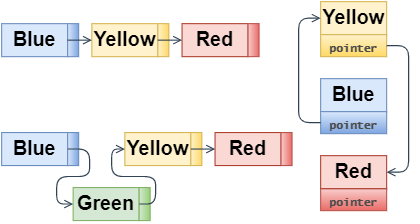
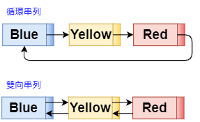

# 1. 資料結構
## 1.1 何謂資料結構
### 決定數據的順序以及位置
### 在資料結構下工夫，就能提高記憶體的使用效率
+ 當數據存在記憶體中，根據目的妥善結構化數據，就能提高使用效率

# 2. 排序
## 1.2 列表 
+ 列表是資料結構的一種，這類結構的數據排成一直線，便於追加或刪除，但存取數據卻很費時
    1. `Blue`、`Yellow`、`Red`三個字串數據，每個數據和一個指標配對，指向下一個數據在記憶體中的位置
    2. 在列表中，數據不需要接續儲存在記憶體中，一般多是分散存在不同領域 (如下縱向右圖)
    
    

    3. 因為數據被分散儲存，所以只能從頭依序跟著指標存取各數據（稱為順序存取 sequential access）
        + 要存取`red`之前得先存取`blue`，再存取`yellow`
        > 假設儲存在列表中的數據有 n 個，存取數據時必須從列表前端開始（也就是線性搜尋），如果想存的數據在很後面，需要花費 O(n) 的執行時間  
        追加數據時只需要改變兩個指標的指向，所以執行時間是與 n 無關的常數時間 O(1)，前提是要已經確定要追加數據的存取位置 刪除數據也只需要耗費常數時間 O(1)
    4. 其他類型:
        + **環狀串列** | **循環串列** circular list：
            + 用於想維持最新的數據為固定數量時
        + **雙向串列** bidirectional list：
            + **Pros**: 列表沒有前後之分，也能從另一端存取
            + **Cons**: 指標數量增加，必須增加數據儲存領域。且追加刪除數據時，要變更方向的指標數也變多了
            
                

## 1.3 陣列 Array
+ 相較於列表，陣列比較方便存取，但追加或刪除數據卻很耗時費力。
    + 數據依序儲存在記憶體的**連續領域**中
    + 因為儲存在連續領域中，所以能用索引來計算記憶體位址，直接存取每個數據（稱為隨機存取 random access）
    + **Pros**: 不用指標從頭開始搜尋，只要指定 a[2] 就能直接存取
    + **Cons**: 要在陣列任意位置追加或刪除數據的話
        1. 確保陣列最後面有追加數據的空間
        2. 要將數據一個一個往後移動
        3. 再將數據移到空出來的空間
            > 存取執行時間: O(1) `fast`  追加/刪除數據值行時間：O(n) `slow`

            ||存取|追加|刪除|
            |-|-|-|-|
            |列表|慢|快|快|
            |陣列|快|慢|慢|

## 1.4 堆疊
+ 推入：追加數據到堆疊中的操作叫「推入」`push`
+ 彈出：從堆疊中取出數據的操作較「彈出」`pop`

## 1.5 佇列
+ 佇列是在兩端分別追加和刪除數據
+ 如其別名「隊列」，在隊伍中，最晚到的排最後面，處理從最先到的人開始進行

## 1.6 雜湊表

## 1.7 堆積

## 1.8 二元搜尋樹 binary search tree
+ 二元搜尋樹是資料結構的一種，將數據存入各個節點
    1. 二元搜尋樹的每個節點最多有兩個子節點
    2. 二元搜尋樹的兩項特性：
        + 所有節點上的數都會大於連結在其左邊的節點上的數
        + 所有節點上的數都會小於連結在其右邊的節點上的數
        > 樹狀最左邊的尾端，即是二元搜尋樹的最小節點  
        二元搜尋樹最大節點 — 位於最上面節點右邊樹狀結構的最尾端
    3. 新增節點
        + 從最上面的節點開始比較，比它小-往左下方 | 比它大-往右下方，尋找應該追加的位置 
    4. 刪除節點
        + 沒有子節點：只要刪掉就好
        + 只有一個子節點：刪掉目標節點，再將子節點移到被刪除的節點的位置
        + 帶有兩個子節點：先刪掉目標節點，再從被刪除節點左邊下的樹狀結構中找出最大節點 | 從被刪除節點右邊下找出最小節點
            + 將其移動到被刪除節點原本的位置
            + 如果被移動的節點也有子節點，就反覆進行同樣步驟
    5. 搜尋節點
        + 邏輯跟追加節點相同，從最上面節點開始比較，`>`往右、`<`往左
+ 二元搜尋樹比較的次數等同於樹狀結構的高度

# 3. 陣列搜尋

# 4. 圖形搜尋

# 5. 安全性演算法

# 6. 分群

# 7. 其它的演算法